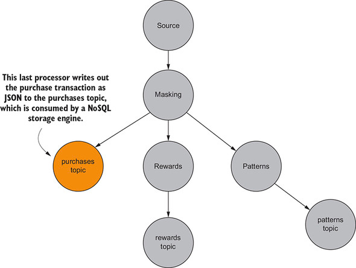

## 1. 빅 데이터로의 전환, 그로 인한 프로그래밍 환경의 변화

- 빅데이터 환경이 발전하면서 데이터를 분석하고 활용해야 하는 필요성이 높아졌다.
- 대량의 데이터를 벌크 처리하는 능력 뿐만 아니라 데이터를 실시간(stream 처리) 처리 할 필요성이 많아졌다.
- 카프카 스트림즈는 이벤트별 레코드 처리를 수행할 수 있게 하는 라이브러리

> 마이크로 배치라는 새로운 전략이 개발됐지만, 배치의 크기를 줄여 결과를 좀 더 빠르게 생산할 수는 있지만, 결국 벌크 처리이기 때문에 이벤트별로 데이터를 처리 한다고는 할 수 없음

### 1-1. 빅데이터의 기원

- 빅데이터의 시대는 세르게이 브린과 래리 페이지가 만든 구글로부터 시작
- 검색을 위한 웹 페이지의 순위를 매기는 새로운 방법은 '페이지 랭크 알고리즘' 개발
  - '페이지 랭크 알고리즘'은 혁신적이었지만, 데이터 작업에 대한 기존의 접근 방식은 너무 오래 걸렸기 때문에 혁신적인 방법이 필요했음
  - '맵-리듀스'라는 새로운 패러다임 개발


- 사이트 A를 가장 많이 참조하고 있기 때문에 가장 중요
- 사이트 B는 참조 수가 많지는 않지만, 중요한 사이트가 사이트B를 가르키기 때문에 약간 중요
- 사이트 C는 사이트 A나 사이트 B보다 덜 중요
  - 사이트 B보다 사이트 C를 가리키는 참조가 더 많지만, 참조의 품질은 낮음
- 맨 아래 사이트 D부터 I까지는 해당 사이트를 가리키는 참조가 없기 때문에 중요도가 가장 낮음

### 1-2. 맵리듀스의 중요 개념

- 구글의 맵리듀스는 새로운 개념은 아니었지만, 독특한 점은 많은 장비에 대규모로 적용
- 맵리듀스의 핵심은 함수형 프로그래밍에 있음

> 맵 함수는 원본값을 변경하지 않고, 입력을 가져와 다른 값으로 매핑

````java
Function<LocalDate, String> addDate = (date) -> "The day of the week is " + data.getDayOfWeek();
````

- LocalDate 객체가 String 메시지로 매핑되는 반면, 원본 LocalDate 는 변경되지 않음

> 리듀스 함수는 여러 매개변수를 받아서 하나 또는 최소한 더 작은 값으로 줄임

````plaintext
0 + 1 = 1 // 첫 번째 숫자에 시드값을 더한다.
1 + 2 = 3 // 첫 번째 단계의 결과를 가져와 목록의 두 번째 숫자를 더한다.
3 + 3 = 6 // 두 번째 단계의 합을 세 번째 숫자에 더한다.
````

````java
List<Integer> numbers = Arrays.asList(1, 2, 3);
int sum = numbers.reduce(0, (i, j) -> i + j);
````

- 숫자 집합에 리듀스를 실행하려면 먼저 초기 시작값을 제공해야 한다.
- 이 경우 0을 사용, 다음 단계는 목록의 첫 번째 숫자에 시드값을 추가하는 것이다.
- 그리고 첫번째 결과를 두 번째 숫자에 더한다.
- 이런식으로 함수는 마지막 값에 도달할 때 까지 이 과정을 반복해 하나의 숫자를 생성한다.
- 위처럼 리듀스 함수는 결과를 축소해서 더 작은 결과를 만드는데, 원본 숫자 목록은 변경하지 않는다.

> 맵 리듀스 개념 중 핵심 개념 일부가 카프카 스트림즈에 포함

- 데이터를 클러스터 전체에 분산하여 처리
- 분산 데이터를 그룹화하기 위한 키/값 쌍과 파티션 사용
- 복제를 사용한 실패 수용

> 대규모 처리를 위해 클러스터에 데이터 배포하기 (5TB를 분할하여 처리량을 향상시키는 방법)


| 머신 수 | 서버당 데이터 처리량 |
| --------- | ---------------------- |
| 10      | 500 GB               |
| 100     | 50 GB                |
| 1000    | 5 GB                 |
| 5000    | 1 GB                 |

- 서버 당 처리량을 줄이고, 머신수를 늘리면 효율적으로 사용 가능 (1GB 이면, 랩탑도 처리가 가능한 수준)
- 이것이 맵 리듀스를 이해하기 위한 첫 번째 핵심 개념
- 부하를 서버 클러스터로 분산하여 많은 데이터를 관리 가능한 양으로 전환 가능

> 키/값 쌍과 파티션을 사용한 분산 데이터 그룹화

- 다수의 머신으로 데이터를 분산하면 처리 문제는 해결되지만, 다시 모으는 문제가 남아있다.
- 분산 데이터를 다시 그룹핑 하기 위해, 데이터를 나눈 키/값 쌍의 키를 사용할 수 있다.
- 키를 사용해 파티션으로 데이터를 나누기 위해 다음 수식 사용

````java
int partition = key.hashCode() % numberOfPartitions;
````


- 파티션의 키를 기준으로 레코드를 그룹화
- 레코드가 각기 다른 서버에서 시작되더라도 결국 해당 키에 매핑되는 적절한 파티션에서 모이게 됨
- 모든 데이터는 키/값 쌍으로 저장 (키:이벤트명 - swimming/sprinting, 값:개별 선수에 대한 결과)

> 복제를 사용한 실패 수용

- 구글 맵리듀스의 주요 구성 요소는 구글 파일 시스템(GFS)
  - 하둡 파일 시스템 (HDFS) 는 GFS 의 오픈소스 구현체
- 두 시스템은 장애를 방지하는 대신, 클러스터 전체에 데이터 블록을 복제하여 장애 수용

### 1-3. 배치 처리로는 충분하지 않다

- 실제로 하둡 사용 시 페이지 랭크 알고리즘을 완벽하게 구현하기 힘듬
- 배치성 프로그램으로, 실시간성 데이터를 가져올 수 없는 문제
- 이러한 문제 해결을 위해 '스트림' 개념 출발

## 2. 스트림 처리 소개

- 스트림 처리
  - 데이터가 시스템에 도착하는 대로 처리
  - 처리할 데이터를 수집하거나 저장할 필요 없이 무한한 데이터 스트림을 유입되는 대로 연속으로 계산해 처리할 수 있는 능력
- 아래는 데이터의 흐름을 나타내며, 줄의 각 원은 특정 시점의 데이터를 표현
  - 각 원은 특정 시점에서 발생하는 정보나 이벤트를 표현
  - 이벤트 수는 제한이 없고, 왼쪽에서 오른쪽으로 계속 흐름


### 2-1. 스트림 처리를 사용해야 할 경우와 사용하지 말아야 할 경우

> 사용하면 좋은 예 : 신속하게 응답하거나 보고해야 하는 경우

- 신용카드 사기
  - 카드 주인은 도난을 인지하지 못할 수 있지만, 구매가 발생할 때 기존 패턴(위치, 일반적인 소비 습과)과 대조하여 검토함으로써 도난 당한 신용카드를 감지하고 카드 주인에게 알람 가능
- 침입 탐지
  - 위반이 발생한 후 어플리케이션 로그 파일을 분석하면, 향후 공격을 방지하거나 보안을 개선하는 데 도움이 될 수 있지만, 비정상적인 동작을 실시간으로 모니터링 하는 기능은 매우 중요
- 마라톤
  - 마라톤 주자들 신발에 칩이 코스를 따라 센서를 통과할 때 마라톤 주자들의 위치를 추적하는 데 사용
  - 센서 데이터를 사용하여 부정 행위 및 마라톤 주자의 잠재적 문제 발견 가능

> 사용하기 좋은 않은 예 : 최신 데이터보단 과거 데이터가 필요한 경우

- 경제 예측
  - 주택 시장의 금리 동향과 같은 정확한 예측을 위해선 장기간 다양한 변수로 정보 수집이 필요
- 학교 교과 과정 변경
  - 학교 행정 담당자는 1~2회의 시험이 치루어진 후에나 교과 과정 변화가 목표를 달성하고 있는지 여부 측정 가능

## 3. 구매 거래 처리

- 소매 판매 예제로 카프카 스트림즈를 사용한 어플리케이션 구현 예제 (ZMart 예제)

````
제인은 치약을 골라서 계산대로 지불하러 간다.
점원은 제인에게 지클럽의 회원인지 묻고,
회원 카드를 스캔하면 제인의 회원 정보가 이제는 구매 거래의 일부가 된다.
총액을 계산할 때 제인은 계산원에게 직불카드를 건낸다.
계산원은 카드를 긁어 결제하고, 제인에게 영수증을 준다.
제인은 마트를 나와 지마트로부터 다음 방문시에 사용할 수 있는 다양한 쿠폰 및 구매 감사 메세지가 담긴 이메일을 수신 받는다.
````

### 3-1. 스트림 처리 옵션 따져보기

- 스트림 처리 계획이 성공하기 위한 4가지 요구사항 정리
  - 프라이버시 : 고객의 신용카드 정보는 절대로 노출되면 안 됨
  - 고객 보상 : 고객의 지출 품목에 따라 포인트를 즉시 제공 필요 (즉 보상을 받자마자 고객에게 신속하게 통보 필요)
  - 판매 데이터 : 지역별 구매 항목을 추적해 특정 지역에 인기 품목을 알아보고, 해당 지역 베스트 셀러 품목에 할인과 특가를 제공
  - 스토리지 : 모든 구매 기록은 이력 및 추가 분석을 위해 외부 스토리지 센터에 저장

### 3-2. 요구사항을 그래프로 분해


- 스트리밍 어플리케이션의 비지니스 요구사항은 '방향성 비순환 그래프'로 표현
- 각 정점은 요구사항을 나타내며, 간선은 그래프를 통한 데이터 흐름을 표현

## 4. 구매 트랜잭션에 대한 관점 변경

### 4-1. 소스 노드

- 그래프의 소스 노드는 어플리케이션이 구매 트랜잭션을 소비하는 곳
- 'Purchase' 노드는 그래프를 통해 흐르는 판매 트랜잭션 정보의 소스
  - 판매 트랜잭션 그래프의 시작


### 4-2. 신용카드 마스킹 노드

- 그래프 소스의 자식 노드는 신용카드 마스킹이 발생하는 부분
- 그래프에서 비즈니스 요구사항을 나타내는 첫 번째 노드
- 소스 노드에서 원시 판매 데이터를 수신하는 유일한 노드이므로, 사실상 이 노드는 연결된 '다른 모든 노드의 소스'
- 해당 노드는 신용카드 정보를 감추는 역할

### 4-3. 패턴 노드

- 고객이 전국 어디에서 어떤 제품을 구매하는지 알아내기 위해 관련 정보를 추출하는 노드
- 데이터의 사본을 만드는 대신, 패턴 노드는 구매 제품, 날짜, 우편번호에 대한 필드를 포함하는 새로운 객체 생성


### 4-4. 보상 노드

- 고객 보상 프로그램을 위한 보상 관련 정보를 추출하는 노드
  - 지마트는 매장에서 이뤄진 구매에 대한 포인트를 고객에게 제공하는 고객 보상 프로그램이 존재
- 구매 금액과 클라이언트 ID를 추출하여 두 필드를 포함하는 새로운 객체 생성


### 4-5. 스토리지 노드

- 추가 분석을 위해 구매 데이터를 NoSQL 데이터 저장소에 저장


## 5. 처리 노드의 그래프인 카프카 스트림즈

- 카프카 스트림즈는 이벤트별로 레코드 처리를 수행할 수 있는 라이브러리
  - 지마트의 목표는 대부분은 가능한 각 노드의 단계를 빨리 처리하는 것
  - 전국에 여러 개의 지마트 지점이 있으므로 분석을 위해 모든 트랜잭션 기록을 데이터의 단일 흐름이나 스트림으로 처리하기를 희망
- 이러한 경우, 카프카 스트림즈를 사용하기 적절

````plaintext
- 카프카 스트림즈에서 처리 노드의 토폴로지를 정의
- 하나 이상의 노드가 소스 카프카 토픽을 가지며, 자식 노드로 간주되는 노드를 추가 가능
- 각 자식 노드는 또 다른 자식 노드를 정의 가능
- 각 처리 노드는 할당된 작업을 수행한 다음 레코드를 각 자식 노드에 전달
- 작업을 수행한 다음 모든 자식 노드로 데이터를 전달하는 이 과정을 모든 자식 노드가 해당 기능을 실행할 때까지 계속 진행
- 이런식으로 그래프를 따라가는 것이 카프카 스트림즈가 작동하는 방식 (토폴로지)
- 데이터는 언제나 부모 -> 자식으로 흐름
````

> 토폴로지는 전체 시스템의 부분을 배열하고 서로 연결하는 방법이다. 카프카 스트림즈에 토폴로지가 있다고 할 때는 하나 이상의 '프로세서'를 실행하여 데이터를 변환한다는 의미로 생각하면 된다.

## 6. 카프카 스트림즈를 구매 거래 흐름에 적용하기

- 카프카 스트림즈 프로그램은 레코드를 소비할 때, '원시 레코드'를 'Purchase 객체'로 변환
- Purchase 객체
  - 지마트 고객 ID (회원 카드에서 스캔)
  - 지출한 총 금액
  - 구입한 마트 우편번호
  - 구매 날짜 및 시간
  - 직불카드 또는 신용카드 번호

### 6-1. 소스 정의하기

- 모든 카프카 스트림즈 프로그램의 첫 번째 단계는 '스트림 소스'를 설정하는 것
- 해당 예제에서는 'transactions' 라는 단일 토픽


### 6-2. 첫 번째 프로세서 : 신용카드번호 마스킹

- 첫 번째 목표는 유입된 구매 레코드에 기록된 신용카드 번호를 가리는 것
- 010-1234-5678 와 같은 신용카드번호를 xxx-xxxx-5678로 마스킹 처리
- KStream.mapValues 메소드는 마스킹 수행
- ValueMapper 에 의해 명시된 마스킹한 값을 가진 새로운 KStream 인스턴스를 반환
- 이 특정 KStream 인스턴스는 앞으로 정의할 다른 모든 프로세서의 상위 프로세서가 됨


### 6-3. 두 번째 프로세서: 구매 패턴

- 첫 번째 프로세서(KStream)에 자식 처리 노드를 추가
- 첫 번째 프로세서는 신용카드 번호가 가려진 Purchase 객체를 생성
- 구매 패턴 프로세서는 부모 노드(신용카드번호 마스킹 프로세서) 로부터 'Purchase' 객체를 받아 새로운 'PurchasePattern' 객체에 매핑
- 구매 패턴 프로세서는 새로운 'PurchasePattern' 객체를 받는 자식 프로세서 노드를 추가하고, 이를 'patterns 라는 토픽에 저장'
  - 'PurchasePattern' 객체는 토픽에 저장할 때 전송 가능한 데이터 형태로 변환


### 6-4. 세 번째 프로세서: 고객 보상

- Purchase 객체를 받아 'RewardAccumulator' 객체 타입으로 매핑
- 고객 보상 프로세서는 자식 처리 노드를 추가해 'RewardAccumulator' 객체를 'rewards 토픽에 저장'
- rewards 토픽에서 레코드를 읽어서 다른 어플리케이션은 지마트 고객을 위한 보상을 결정해 제인이 받은 것과 같은 '이메일 생성이 가능'


### 6-5. 네 번째 프로세서: 구매 레코드 기록하기

- 마스킹 프로세서 노드의 세번째 자식 노드로, 마스킹된 구매 기록 전체를 'purchases 토픽에 저장'
- 해당 토픽은 들어오는 레코드를 읽어 NoSQL 스토리지 어플리케이션에 제공하는데 사용
  - 해당 토픽의 레코드는 추후 분석에 사용



> 위의 그림을 보면, 신용카드 번호를 숨기는 첫 프로세서(Masking)는 3개의 다른 프로세서(Storage, Rewards, Patterns)에 데이터를 제공

### 요약

- 카프카 스트림즈는 복잡한 스트림 처리를 위해 노드를 조합한 그래프
- 배치 처리는 강력하지만, 데이터 작업에 대한 실시간 요구를 만족시키기에는 충분하지 않음
- 데이터 분산, 분산 데이터를 사용하기 위한 키/값 쌍 및 파티셔닝, 데이터 복제를 통한 장애 수용은 분산 어플리케이션에서 매우 중요
