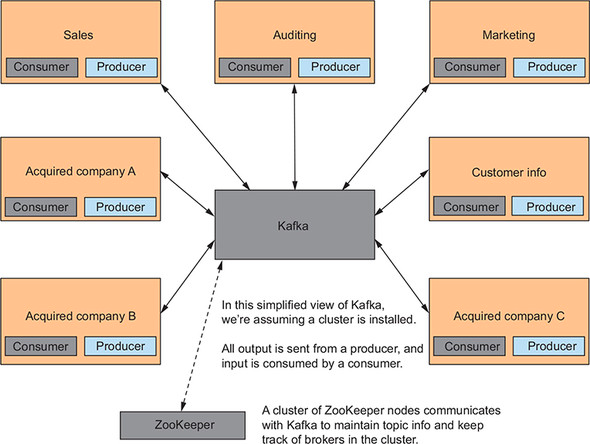

## 1. 데이터 문제

- 지마트 데이터 관리 솔루션에 있을 법한 다양한 요구사항을 고려해보자
  - 중앙 저장소로 데이터를 신속하게 전송할 방법이 필요
  - 서버가 자주 장애가 발생하기 때문에 데이터를 복제할 수 있는 기능도 필요하므로, 피할 수 없는 오류로 인한 가동 중지 시간과 데이터 손실이 발생하지 않아야 함
  - 각기 다른 어플리케이션을 추적하지 않고도 많은 수의 데이터 컨슈머로 확장할 수 있는 잠재력이 필요
    - 조직의 모든 사용자가 데이터를 사용할 수 있도록 해야 하지만, 누가 데이터를 보았는지 또는 보지 않았는지 추적할 필요는 없음

## 2. 카프카를 사용해 데이터 다루기

- 지마트가 6개월 전에 데이터 현황을 파악하는 방법을 찾고 있었고, 처음에는 잘 동작했지만 아래와 같은 이유로 관리하기 힘들어짐

### 2-1 지마트의 오리지널 데이터 플랫폼

- 기존 데이터 플랫폼으로 정보의 각 소스마다 그 정보를 서로 주고받을 수 있을 정도의 아키텍쳐


- 기존 구조에선 크게 문제가 없지만, 여러 요소가 추가되다 보면 연결이 더 복잡해진다
- 각 요소 간 통신은 스파게티처럼 복잡해지게 된다


- 4개의 요소가 더 추가돼었고, 매우 복잡해진 것을 확인 가능

### 2-2 카프카 판매 거래 데이터 허브

- 위의 문제를 해결하는 방법으로는 모든 거래 데이터를 수용하는 '하나의 유입 프로세스'를 만드는 것
- 카프카는 fault-tolerant 를 가진 pub/sub 시스템
- 하나의 카프카 노드를 '브로커'라고 부르며, 여러 개의 카프카 브로커 서버로 '클러스터'를 구성
- 카프카는 '프로듀서'가 작성한 메세지를 '토픽'에 저장
- '컨슈머'는 토픽을 '구독'하며, 구독한 토픽에 메세지가 있는지 확인하기 위해 카프카에 접속


## 3. 카프카 아키텍처

### 3-1 카프카는 메시지 브로커다

- 카프카는 '메세지 브로커' 역할
- 브로커는 상호 간의 데이터 송수신을 위해 각자 반드시 알 필요가 없는 두 부분을 묶는 '중개자'
  - '프로듀서'와 '컨슈머'가 카프카 브로커로 서로 통신을 하며, 서로 직접적으로 통신하지는 않음


- 카프카는 토픽에 메세지를 저장하고, 토픽에서 메세지를 검색한다
- 프로듀서와 컨슈머는 직접적인 연결 없음
- 카프카는 프로듀서나 컨슈머에 관한 어떤 상태도 유지하지 않고, 오로지 '메세지 교환소'의 역할로만 작동
- 토픽의 내부 기술은 카프카 브로커로 들어오는 레코드를 기록한 파일인 '로그'
- 토픽에 들어오는 메세지의 부하를 관리하기 위해 카프카는 '파티션' 사용

### 3-2 카프카는 로그다

- 카프카의 기본 메커니즘은 '로그'
- 카프카의 관점에서 로그는 '추가만 가능한 시간순으로 정렬된 레코드 시퀀스'


- 어플리케이션은 도착한 레코드를 '로그의 끝에 추가'
- 각 레코드와 연관된 타임스탬프가 없더라도 '레코드는 시간에 따라 암묵적으로 정렬'

  - 가장 오래 전에 보낸 레코드는 왼쪽에 있고, 마지막으로 도착한 레코드는 오른쪽 끝에 있음

---

- 로그는 강력한 의미를 가진 단순한 데이터 추상화
- 시간 순서대로 레코드를 갖고 있으면, 충돌을 해결하거나 다른 머신에 업데이트 적용 등이 용이함
- 카프카의 토픽은 토픽 이름으로 분리된 로그
  - 토픽은 라벨이 붙은 로그라고 할 수 있음
- 로그 파일만을 복구하면 되기 때문에, 로그가 카프카 클러스터에 복제된 후에 하나의 브로커가 중지된 경우, 해당 서버를 복구하는 것은 쉬움

### 3-3 카프카에서 로그가 동작하는 방식

- 카프카를 설치할 때 설정 중 하나는 'log.dir' 이며, 카프카가 '로그 데이터를 저장하는 위치를 지정'
- 각 토픽은 지정된 로그 디렉토리 아래의 하위 디렉토리에 매핑
- '파티션이름_파티션번호'의 형식으로 토픽 파티션 수만큼 하위 디렉토리 존재
- 각 디렉토리 안에는 들어오는 메세지가 추가되는 로그파일이 존재
- 로그 파일이 특정 크기에 도달하거나, 메세지 타임스탬프 간에 구성된 시간 차이에 도달하면 '로그 파일을 교체'하고, 카프카는 들어오는 메세지를 새 로그에 추가


- 토픽은 로그와 긴밀하게 연결된 개념
  - 토픽은 로그라고 하거나 로그를 나타낸다고 말할 수 있음
- 토픽 이름은 프로듀서를 통해 카프카에 보내진 메세지가 저장될 로그를 잘 처리할 수 있게 해줌

### 3-4 카프카와 파티션

- 파티션은 카프카 디자인에서 성능에 필수적이고, 같은 키를 가진 데이터가 동일한 컨슈머에게 '순서대로 전송'되도록 보장


- 파티션을 가진 토픽 모습
- 데이터는 단일 토픽으로 들어가지만, 개별 파티션 (0,1,2 중 하나)에 배치
- 이 메세지에는 키가 없기 때문에, '라운드 로빈' 방식으로 파티션이 할당
- 메세지가 들어오면 파티션(프로듀서가 지정)에 기록되고, 시간 순서대로 로그의 끝에 추가
- 직사각형에 표시된 숫자는 메세지에 대한 오프셋

---

- 토픽을 파티션으로 분할하면, 기본적으로 병렬 스트림에서 토픽에 전달되는 데이터가 분할되는데, 이는 카프카가 엄청난 '처리량'을 달성하는 비결
- 카프카는 들어오는 모든 메세지를 로그 끝에 추가하여, 엄격하게 시간 순서를 지정
- 각 메세지에는 할당된 오프셋 번호가 있으며, '파티션 간의 메세지 순서는 보장되지 않지만, 각 파티션 내의 메세지는 보장'

### 3-5 키에 의한 그룹 데이터 분할

- 카프카는 키/값 쌍으로 데이터를 다룸
- 키가 만약 null 인 경우, 카프카 프로듀서는 '라운드 로빈 방식'으로 선택된 파티션에 레코드를 전송


- 키가 null 이 아닌 경우, 다음과 같은 공식으로 레코드를 전송 할 파티션을 선택
- 아래와 같은 방법을 사용하면, 동일한 키를 가진 레코드가 '항상' 동일한 파티션에 순서대로 전송
- 만약 다른 방법이 필요한 경우, '사용자 정의 파티셔너'를 정의하여 사용

````
HashCode.(key) % num of partitions
````

### 3-6 사용자 정의 파티셔너 작성하기

- 특수한 경우에는 사용자 파티셔너가 필요
- 구매 데이터가 카프카에 유입되고 있고, key 에 '고객 ID' 와 '거래 날짜'라는 2가지 값이 포함되어 있다고 가정
- 고객 ID로 값을 그룹지어야 하므로, 고객 ID와 구매 날짜의 해시를 사용하면 정상적으로 작동하지 않음
- 이러한 경우에 사용자 정의 파티셔너를 사용

````java
public class PurchaseKey {

    private String customerId;
    private Date transactionDate;

    public PurchaseKey(String customerId, Date transactionDate) {
        this.customerId = customerId;
        this.transactionDate = transactionDate;
    }

    public String getCustomerId() {
        return customerId;
    }

    public Date getTransactionDate() {
        return transactionDate;
    }
}
````

- 파티셔닝과 관련하여 '같은 고객 ID'는 '같은 파티션'에 넣도록 해야 될 때가 있음
  - 기존 파티셔닝 방식으로 하면 같은 고객 ID를 가진 객체가 다른 파티션으로 전송될 수 있음 (고객ID + 거래 날짜를 key 로 사용하기 때문에 같은 고객이라고 하더라도 구매 날짜에 따라 해시값이 달라짐)
- 파티션을 결정할 때, 고객 ID 만을 사용하도록 커스터마이징 필요

````java
public class PurchaseKeyPartitioner extends DefaultPartitioner {

    @Override
    public int partition(String topic, Object key,
                         byte[] keyBytes, Object value,
                         byte[] valueBytes, Cluster cluster) {

        Object newKey = null;

        if (key != null) { // 키가 널이 아니면 사용자 아이디를 추출
            PurchaseKey purchaseKey = (PurchaseKey) key;
            newKey = purchaseKey.getCustomerId();
            keyBytes = ((String) newKey).getBytes(); // 새로운 값으로 키의 바이트를 설정
        }

        // 슈퍼 클래스에 위임하여 업데이트된 키로 파티션을 반환
        return super.partition(topic, newKey, keyBytes, value, valueBytes, cluster);
    }
}
````

- DefaultPartitioner 를 확장
- 사용자 정의 파티셔너를 만들 때, 키만 사용 가능한 것은 아님
- 값만 사용하거나, 키 + 값으로 사용하는 것도 가능

### 3-7 사용자 정의 파티셔너 지정하기

- 사용자 정의 파티셔너를 사용하기 위해서는 기본 파티셔너 대신 해당 사용자 정의 파티셔너를 사용하도록 등록 필요
- 프로듀서 설정 시, 사용자 정의 파티셔너를 지정
- 프로듀서 인스턴스별로 파티셔너를 설정 가능하기 때문에 프로듀서마다 각기 다른 파티셔너 사용 가능

````
partitioner.class=bbejeck_2.partitioner.PurchaseKeyPartitioner
````

### 3-8 정확한 파티션 수 정하기

- 핵심 고려사항은 주어진 토픽에 들어오는 데이터의 양
- 데이터가 많을수록 처리량을 높이기 위해서는, 더 많은 파티션이 필요
- 단점으로는 파티션 수를 늘리면, 'TCP 연결 수'와 '열린 파일 핸들 수'가 증가
- 또한, 컨슈머가 유입 레코드를 처리하는 데 걸리는 시간도 처리량을 결정
- 컨슈머가 대량의 데이터를 처리하는 경우에는 파티션을 추가하면 도움이 되지만, 근본적으로 처리 속도가 느려지면 성능이 저하

### 3-9 분산 로그

- 토픽이 분할되면, 카프카는 하나의 브로커에 모든 파티션을 할당하지 않음
- 카프카는 클러스터를 구성하는 여러 브로커에 파티션을 분산
- 카프카는 레코드를 로그에 추가하므로 카프카는 이러한 레코드를 파티션별로 여러 브로커에 분산


- 위의 예시에선 하나의 토픽과 null 인 key 사용을 가정했기 때문에, 프로듀서는 파티션을 라운드 로빈 방식으로 할당
- 프로듀서는 첫 번째 메세지를 카프카 브로커 1의 파티션 0에 보내고, 두 번째 메세지는 카프카 브로커 1의 파티션 1에, 세 번째 메세지는 카프카 브로커 2의 파티션 2에 전송
- 프로듀서가 여섯 번째 메세지를 보내면, 카프카 브로커 3의 파티션 5로 가고, 다음 메세지는 다시 카프카 브로커 1의 파티션 0에 전송
- 메세지 발행은 이런 방식으로 진행되며, 카프카 클러스터의 모든 노드에 메세지의 트래픽을 분산
- 서버가 다운되는 경우, 데이터 유실이 걱정 될 수 있지만 카프카는 '데이터 복제' 기능 제공
  - 카프카에서 하나의 브로커에 메시지를 저장하면 클러스터의 하나, 혹은 그 이상의 브로커에 데이터를 복제

### 3-10 주키퍼: 리더, 팔로워, 복제

- 카프카는 '리더'와 '팔로워' 브로커라는 개념이 존재
- 각 토픽 파티션별로 한 브로커가 다른 브로커(팔로워)의 '리더'로 선택
- 리더 브로커의 주요 기능은 팔로워 브로커에 토픽 파티션의 복제를 할당

### 3-11 아파치 주키퍼

- 주키퍼를 사용하여 카프카가 리더 브로커를 확보하고, 토픽 복제를 추적

### 3-12 컨트롤러 선출

- 주키퍼가 카프카 클러스터의 브로커 중 하나를 '컨트롤러'로 선택

### 3-13 복제

- 카프카는 클러스터의 브로커가 실패할 경우, 데이터 가용성 보장을 위해 '브로커 간에 레코드를 복제'
- 각 토픽별로, 혹은 클러스터의 '모든 토픽에 대해 복제 수준 설정 가능'


- 토픽 foo 는 파티션 2개와 복제 수준 (replica) 3을 갖음
- 파티션 간의 점선은 해당 '파티션의 리더'를 가리킨다.
- 프로듀서는 파티션의 리더에 레코드를 작성하고, 팔로워는 리더로부터 해당 레코드를 읽어서 저장
- 위 예제에서 브로커 1은 파티션 0의 리더이고, 브로커 3은 파티션 1의 리더
- 브로커 2는 브로커 1의 파티션 0과 브로커 3의 파티션 1에 대한 팔로워

### 3-14 컨트롤러의 책임

- 컨트롤러 브로커는 토픽의 모든 파티션에 대한 리더/팔로워 관계를 설정
- 카프카 클러스터 노드가 다운되거나 주키퍼 하트 비트에 응답하지 않는 경우, 할당된 모든 파티션이 컨트롤러 브로커에 의해 재할당


- 주키퍼는 카프카 운영의 다음 측면에도 관여
- 클러스터 멤버쉽 : 클러스터에 가입하고 클러스터 멤버십을 유지 관리한다. 브로커를 사용할 수 없게 되면, 주키퍼는 클러스터 멤버십에서 브로커를 제외
- 토픽 설정 : 클러스터의 토픽을 트래킹. 브로커가 토픽의 리더인지, 토픽에 파티션이 몇 개인지, 토픽의 특정 설정 업데이트 적용 유무 확인 등
- 접근 제어 : 특정 토픽에 대하여 누가 읽고 쓸 수 있는지 식별

### 3-15 로그 관리

- 오래된 데이터를 제거할 때 2가지 방식을 지원 (로그 삭제, 압축)

### 3-16 로그 삭제

- 로그를 세그먼트로 나누어 가장 오래된 세그먼트를 삭제
- 새로운 로그가 도착하고, 타임스탬프가 해당 로그의 첫 번째 메세지의 타임스탬프와 log.roll.ms 설정 값을 더한 값보다 크다면, 로그를 분할하고 새로운 세그먼트를 새 활성 로그로 생성
- 이전 활성 세그먼트는 여전히 컨슈머가 메세지를 검색하는데 사용
- 카프카 브로커 로그 롤링 설정
  - log.roll.ms
  - log.roll.hours
- 시간이 지남에 따라 세그먼트 수는 계속 증가하고, 오래된 세그먼트는 수신 데이터를 위한 여유 공간을 확보하기 위해 삭제 필요


- 세그먼트 삭제도 메세지의 타임스탬프를 기반으로 진행
- 우선순위에 따른 3가지 설정
  - log.retention.ms : 로그 파일을 밀리초 단위로 보관하는 기간
  - log.retention.minutes : 로그 파일을 분 단위로 보관하는 기간
  - log.retention.hours : 로그 파일을 시간 단위로 보관하는 기간

### 3-17 로그 압축

- 압축은 세그먼트들을 삭제하는 대신, 로그에서 키별로 오래된 레코드를 삭제
- 아래의 방법으로 진행하면, 주어진 키에 대한 마지막 레코드가 로그에 존재함을 보장
- 토픽에 대한 압축을 사용을 위해서는 토픽을 생성 시, log.cleanup.policy=compact 속성을 설정 필요


## 4. 프로듀서로 메시지 보내기



- 고객이 거래를 완료하면, 정보가 키/값 쌍으로 변환되어 프로듀서를 통해 카프카로 전송
- 키는 고객 ID - 123447777 이고 값은 "{"item":"book", "price":10.99}" 와 같은 JSON 형식

````java
Properties properties = new Properties();
properties.put("bootstrap.servers", "localhost:9092");
properties.put("key.serializer", "org.apache.kafka.common.serialization.StringSerializer");
properties.put("value.serializer", "org.apache.kafka.common.serialization.StringSerializer");
properties.put("acks", "1");
properties.put("retries", "3");
properties.put("compression.type", "snappy");
properties.put("partitioner.class", PurchaseKeyPartitioner.class.getName());

PurchaseKey key = new PurchaseKey("123447777", new Date());

 try (Producer<PurchaseKey, String> producer = new KafkaProducer<>(properties)) {
    ProducerRecord<PurchaseKey, String> record = new ProducerRecord<>("transactions", key, "{\"item\":\"book\",\"price\":10.99}");

    Callback callback = (metadata, exception) -> {
        if (exception != null) {
            System.out.println("Encountered exception " + exception);
        }
    };

    Future<RecordMetadata> sendFuture = producer.send(record, callback);
}
````

### 4-1 프로듀서 속성

- 프로듀서 객체를 생성 시, Properties 객체에 값들을 설정해 넣어준다.

> bootstrap server

- bootstrap.servers 는 쉼표로 구분된 호스트:포트 값의 리스트. 프로듀서는 클러스터의 모든 브로커를 사용하며, 이 리스트는 처음에 클러스터에 연결하는 용도로만 사용

> serialization

- key.serializer 와 value.serializer 는 키와 값을 바이트 배열로 변환하는 방식 설정

> acks

- acks 는 레코드 전송이 완료됐다고 생각하기 전에 프로듀서가 브로커로부터 기다리는 확인 수를 지정
- acks 에 유효한 값은 all, 0, 1 (all 은 모든 팔로워 브로커가 레코드를 커밋할 때까지 대기)
- 1 설정 시, 브로커는 레코드를 로그에 기록하지만 팔로워의 레코드 커밋에 대한 확인 응답을 기다리지 않음
- 0 설정 시, 프로듀서가 어떤 확인 응답도 기다리지 않음을 의미

> retries

- 배치 결과가 실패하는 경우, 재전송 시도 횟수를 지정
- 레코드 순서가 중요한 경우, max.in.flight.per.connection 을 1로 설정하여 실패한 레코드가 재전송 되기 전에 두 번째 배치가 성공적으로 보내지는 시나리오를 방지해야 함

> compression type

- 압축 알고리즘 지정
- 브로커로 보내기 전에 배치를 압축하도록 프로듀서에 지시
- 개별 레코드가 아닌 배치 단위로 압축

> partitioner class

- Partitioner 인터페이스를 구현하는 클래스의 이름을 지정

### 4-2 파티션과 타임스탬프 지정

- 생성자 오버로딩을 통해 타임스탬프 설정 가능

````java
ProducerRecord(String topic, Integer partition, String key, String value)
ProducerRecord(String topic, Integer partition, Long timestamp, String key, String value)
````

### 4-3 파티션 지정

- 특수한 경우, 파티션을 지정하도록 파티셔너 커스텀 가능

````java
AtomicInteger partitionIndex = new AtomicInteger(0);

int currentPartition = Math.abs(partitionIndex.getAndIncrement()) % numberPartitions;
ProducerRecord<String, String> record = new ProducerRecord<>("topic", currentPartition, "key", "value");
````

### 4-4 카프카의 타임스탬프

- 생성자 오버로딩을 통해 타임스탬프 설정 가능
- 타임스탬프를 설정하지 않으면, 프로듀서가 레코드를 카프카 브로커에 보내기 전에 시간 설정

````java
ProducerRecord(String topic, Integer partition, Long timestamp, K key, V value);
````

## 5. 컨슈머로 메시지 읽기

- KafkaConsumer 는 카프카 메세지를 소비하는 데 사용하는 클라이언트


### 5-1 오프셋 관리

- KafkaConsumer 는 주기적으로 카프카에서 소비되는 메세지의 오프셋을 커밋해 일부 '상태를 관리'
- 오프셋은 메세지를 고유하게 식별하고, 로그에서 메세지의 시작 위치를 나타냄
- 오프셋 커밋은 컨슈머에 있어서 2가지 의미 존재
    - 컨슈머가 메세지를 완전히 처리했음을 의미
    - 실패나 재시작 시 해당 컨슈머의 시작 지점도 나타냄
- 새로운 컨슈머 인스턴스가 있거나, 오류 발생 시 마지막으로 커밋한 오프셋을 사용할 수 없는 경우, 컨슈머가 시작하는 위치는 설정에 따라 달라짐
    - auto.offset.reset=earliest
        - 사용 가능한 가장 이른 오프셋부터 시작해 메세지 소비
    - auto.offset.reset=latest
        - 가장 최신 오프셋에서 메세지를 읽어서 기본적으로 컨슈머가 클러스터에 합류한 지점부터 유입된 메세지만 소비
    - auto.offset.reset=none
        - 재설정 전략 미지정


### 5-2 자동 오프셋 커밋

- 자동 오프셋 커밋 방식이 기본이며, enable.auto.commit 프로퍼티로 설정 가능
- 컨슈머 오프셋 커밋 주기를 지정하는 auto.commit.interval.ms

### 5-3 수동 오프셋 커밋

- 수동 커밋된 오프셋에는 동기식 및 비동기식 2가지 유형 존재
- 동기 방식 commitSync()

````java
consumer.commitSync()
consumer.commitSync(Map<TopicPartition, OffsetAndMetadata>)
````

- 비동기 방식 commitAsync()

### 5-4 컨슈머 생성하기

- KafkaConsumer 객체에 Properties 설정

### 5-5 컨슈머와 파티션

- 일반적으로 토픽의 각 파티션마다 하나씩 컨슈머 인스턴스 필요 (1:1)
- 컨슈머 동작 실패 시, 리더 브로커는 파티션을 다른 활성 컨슈머에게 할당
- 리더 브로커는 동일한 group.id를 가진 사용 가능한 모든 컨슈머에게 토픽 파티션을 할당

### 5-6 리밸런싱

- 컨슈머 동작 실패 시, 동작이 실패한 컨슈머에 매핑되어 있던 파티션을 다른 컨슈머로 할당해 주는 것을 리밸런싱

### 5-7 더 세분화된 컨슈머 할당

- KafkaConsumer 에는 특정 토픽과 파티션을 구독할 수 있는 메소드 존재

````java
TopicPartition fooTopicPartition_0 = new TopicPartition("foo", 0);
TopicPartition barTopicPartition_0 = new TopicPartition("bar", 0);

consumer.assign(Arrays.asList(fooTopicPartition_0, barTopicPartition_0));
````

- 수동 설정 시, 트레이드 오프
    - 동일한 그룹 ID를 가진 컨슈머라 하더라도 오류가 발생 시, 토픽 파티션이 재할당 되지 않음
    - 할당을 변경하려면 consumer.assign 재호출 필요

### 5-8 컨슈머 예제

````java
public void startConsuming() {
    executorService = Executors.newFixedThreadPool(numberPartitions);
    Properties properties = getConsumerProps();

    for (int i = 0; i < numberPartitions; i++) {
        Runnable consumerThread = getConsumerThread(properties);
        executorService.submit(consumerThread);
    }
}

private Runnable getConsumerThread(Properties properties) {
    return () -> {

        Consumer<String, String> consumer = null;

        try {
            consumer = new KafkaConsumer<>(properties);
            consumer.subscribe(Collections.singletonList("test-topic"));

            while (!doneConsuming) {
                ConsumerRecords<String, String> records = consumer.poll(5000);
                for (ConsumerRecord<String, String> record : records) {
                    String message = String.format("Consumed: key =%s value = %s with offset = %d partition = %d",
                                        record.key(), record.value(), record.offset(), record.partition());
                    System.out.println(message);
                }
            }
        } catch (Exception e) {
            e.printStackTrace();
        } finally {
            if (consumer != null) {
              consumer.close();
            }
        }
    };
}
````

## 6. 카프카 설치 및 실행

### 6-1 카프카 로컬 설정

### 6-2 카프카 실행하기

### 6-3 첫 번째 메시지 보내기

## 요약

- 카프카는 메세지를 수신해 컨슈머의 요청에 쉽고 빠르게 응답할 수 있는 방식으로 메세지를 저장하는 메세지 브로커 (메세지는 컨슈머로 전송 후에도 사라지지 않음)
- 카프카는 높은 처리량을 얻기 위해 파티션을 사용하고 같은 키를 사용해 메세지를 순서대로 그룹화하는 방법 제공
- 프로듀서는 카프카에 메세지를 보내는 데 사용
- null 키는 라운드 로빈 파티션 할당을 의미
    - 키값이 있는 경우, 파티션 할당을 위해 키의 해시와 파티션 수의 모듈러 값을 사용
- 컨슈머는 카프카에서 온 메세지를 읽는 데 사용
- 컨슈머 그룹의 일원인 컨슈머는, 메세지를 고르게 분산하기 위해 토픽-파티션 할당 받음
