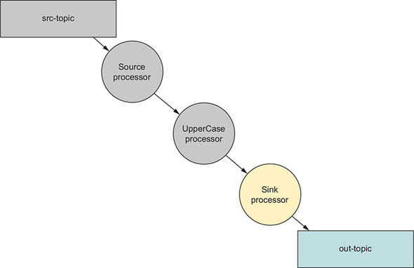

## 1. 스트림 프로세서 API

- 카프카 스트림즈 DSL은 카프카 스트림즈 어플리케이션을 신속하게 만들 수 있게 해주는 고수준 API
- 고수준 API의 핵심은 키/값 쌍 레코드 스트림을 나타내는 'KStream' 객체
- 카프카 스트림즈 DSL의 대부분의 메소드는 KStream 객체 레퍼런스를 반환해 플루언트 인터페이스 스타일의 프로그래밍 가능
- KStream 메소드의 대부분은 단일 메소드 인터페이스로 구성된 타입을 허용해 자바 8 람다 표현식 사용이 가능

## 2. 카프카 스트림즈를 위한 Hello World

- 들어오는 메세지를 가져와 대문자로 변환하여 메세지를 출력하는 프로그램 (Yelling App)


- 토폴로지는 소스 노드, 대문자 변경 프로세서 노드, 싱크 프로세서로 나누어짐
- 아래와 같은 순서로 진행

````plaintext
1. 설정 항목 정의
2. 사용자 정의 또는 기정의된 Serde 인스턴스 생성
3. 프로세서 토폴로지 생성
4. KStream 생성 및 시작
````

### 2-1. Yelling App 의 토폴로지 생성하기

> 1. 소스 노드 생성

- 카프카 스트림즈 어플리케이션을 만드는 첫 번째 단계는 소스 노드를 만드는 것
- 소스 노드는 어플리케이션을 통해 유입되는 레코드를 토픽에서 소비하는 역할


````java
// 스트림 소스 정의
KStream<String, String> simpleFirstStream = builder.stream("src-topic", Consumed.with(stringSerde, stringSerde));
````

- simpleFirstStream 이라는 KStream 인스턴스는 'src-topic' 토픽에 저장된 메시지를 소비하도록 설정

> 2. 프로세서 노드 생성

- 부모 노드의 자식 노드인 다른 KStream 인스턴스 생성


````java
KStream<String, String> upperCasedStream = simpleFirstStream.mapValues(String::toUpperCase);
````

- KStream.mapValues 함수를 통해 입력값을 대문자로 변환한 결과값으로 만드는 새로운 처리 노드 생성
- 중요한 점은 mapValues 에 제공된 ValueMapper 가 원래 값을 수정하면 안 된다는 점
  - upperCasedStream 인스턴스는 simpleFirstStream.mapValues 호출 결과에 대해 대문자로 변환된 복사본으로 받음

> 3. 싱크 프로세서 노드 생성



````java
upperCasedStream.to("out-src", Produced.with(stringSerde, stringSerde));
````

- KStream.to 메소드는 토폴로지에 싱크 처리 노드를 생성
  - 싱크 프로세서는 레코드를 다시 카프카에 전송
  - 해당 싱크 프로세서는 upperCasedStream 프로세서에서 레코드를 가져와서 'out-src' 토픽으로 전송

> 플루언트 인터페이스 스타일 프로그래밍 방식

````java
builder.stream("src-topic", Consumed.with(stringSerde, stringSerde))
    .mapValues(String::toUpperCase)
    .to("out-topic", Produced.with(stringSerde, stringSerde));
````

### 2-2. 카프카 스트림즈 설정

> APPLICATION_ID_CONFIG, BOOTSTRAP_SERVERS_CONFIG 설정

- 2가지 속성 미정의 후 어플리케이션 실행 시, 'ConfigException' 발생
- APPLICATION_ID_CONFIG
  - 카프카 스트림즈 어플리케이션 식별 (전체 클러스터에 대해 고유한 값)
- BOOTSTRAP_SERVERS_CONFIG
  - 카프카 클러스터 호스트 정보 (hostname:port)

````java
props.put(StreamsConfig.APPLICATION_ID_CONFIG, "yelling_app_id");
props.put(StreamsConfig.BOOTSTRAP_SERVERS_CONFIG, "localhost:9092");
````

### 2-3. Serde 생성

> Serde<String> stringSerde = Serdes.String();

- Serdes 클래스를 사용하여 직렬화/역직렬화에 필요한 String 타입 Serde 인스턴스 생성

> Serde 클래스의 기본 구현 타입

- String
- Byte 배열 (Array)
- Long
- Integer
- Double

> 복잡한 유형의 직렬화/역직렬화를 다루는 Serde 구현

````java
public class KafkaStreamsYellingApp {
    public static void main(String[] args) {
        Properties props = new Properties();
        props.put(StreamsConfig.APPLICATION_ID_CONFIG, "yelling_app_id"); // 카프카 스트림즈 프로그램을 설정하기 위한 속성
        props.put(StreamsConfig.BOOTSTRAP_SERVERS_CONFIG, "localhost:9092"); // 카프카 클러스터 호스트 정보

        StreamsConfig streamingConfig = new StreamsConfig(props); // 상단에서 정의한 속성을 통해 StreamsConfig 생성

        Serde<String> stringSerde = Serdes.String(); // 키/값을 직렬화/역직렬화 하는 데 사용하는 Serdes 생성

        StreamBuilder builder = new StreamBuilder(); // 프로세서 토폴로지를 구성하는 데 사용하는 StreamBuilder 인스턴스 생성

        KStream<String, String> simpleFirstStream = builder.stream("src-topic", Consumed.with(stringSerde, stringSerde)); // 1. 그래프의 부모 노드에서 읽을 소스 토픽으로 스트림 생성 (소스 프로세서)

        KStream<String, String> upperCasedStream = simpleFirstStream.mapValues(String::toUpperCase); // 2. 그래프의 첫 번째 자식 노드 (프로세서)

        upperCasedStream.to("out-topic", Produced.with(stringSerde, stringSerde)); // 3. 변환된 결과를 다른 토픽으로 전송 (싱크 프로세서)

        KafkaStreams KafkaStreams = new KafkaStreams(builder.build(), StreamsConfig);

        KafkaStreams.start(); // 카프카 스트림즈 쓰레드 실행
        Thread.sleep(35000);

        LOG.info("Shutting down the Yelling APP now");
        KafkaStreams.close();
    }
}
````

## 3. 사용자 데이터로 작업하기


> 지마트 매장에서 발생하는 거래로부터 유입되는 구매 기록을 처리하는 스트리밍 프로그램의 요구사항

- 1. Masking (마스킹) : 모든 기록은 마스킹 처리 된 신용카드번호를 가져야 한다 (처음 12자리 마스킹)
- 2. Patterns (패턴) : 구매 패턴 결정을 위해 구입한 '품목', '우편번호' 추출하여 토픽에 기록
- 3. Rewards (보상) : 고객의 '회원번호', '지출 금액'을 추출하여 토픽에 기록 (해당 토픽의 컨슈머는 이 데이터를 사용하여 보상 결정)
- 4. Purchases (구매) : 전체 트랜잭션을 토픽에 기록 (분석을 위해 스토리지 엔진에서 사용)

### 3-1. 토폴로지 구성하기

> 소스 노드 만들기


- Source (소스) : 카프카 transactions 토픽에서 메시지를 소비 (소스 노드)
- Masking (마스킹) : 신용카드번호를 마스킹 처리 (1번째 프로세서)

````java
// 소스 노드와 첫 번째 프로세서 생성
KStream<String, Purchase> purchaseKStream = streamsBuilder.stream("transactions", Consumed.with(stringSerde, purchaseSerde))
                                                        .mapValues(p -> Purchase.builder(p).maskCreditCard().build());
````

> 2번째 프로세서 만들기

- 지마트가 지역별 구매 패턴 결정을 위해 사용할 토픽에서 패턴 데이터를 추출하는 2번째 프로세서 생성

````java
// 2번째 프로세서와 패턴 분석을 위해 카프카에 토픽을 전송하는 싱크 노드
KStream<String, PurchasePattern> patternKStream = purchaseKStream.mapValues(purchase -> PurchasePattern.builder(purchase).build());
patternKStream.to("patterns", Produced.with(stringSerde, PurchasePatternSerde));
````


- Pattern (패턴) : 3번째 노드는 PurchasePattern 객체를 생성
- Pattern Sink (패턴 싱크) : 4번째 노드는 프로세싱은 하지 않으며, PurchasePattern 에 토픽 전송

> 3번째 프로세서 만들기

- 고객 보상 프로세서 생성
- 고객이 제품 구매 완료 시, 보상을 결정하기 위해 지마트 본사의 어플리케이션이 소비하는 토픽에 데이터 전송


- Rewards (보상) : 보상 프로세서는 Rewards 객체 생성 및 해당 객체를 싱크 프로세서로 전달

````java
KStream<String, RewardAccumulator> rewardsKStream = purchaseKStream.mapValues(purchase -> RewardAccumulator.builder(purchase).build());
rewardsKStream.to("rewards", Produced.with(stringSerde, RewardAccumulatorSerde));
````

> 마지막 프로세서 만들기

- 구매 기록을 purchases 토픽에 기록하는 프로세서


- Purchases sink (구매 싱크) : 마스킹한 신용카드 정보와 함께 토픽에 구매 데이터 기록

````java
purchaseKStream.to("purchase", Produced.with(stringSerde, purchaseSerde));
````

> 지마트 소비자 구매 KStream 프로그램

````java
public class ZMartKafkaStreamApp {
    public static void main(String[] args) {
        ...
        StreamsConfig StreamsConfig = new StreamsConfig(getProperties());

        JsonSerializer<Purchase> purchaseJsonSerializer = new JsonSerializer<>();
        JsonDeserializer<Purchase> purchaseJsonDeserializer = new JsonDeserializer<>(Purchase.class);
        Serde<Purchase> purchaseSerde = Serdes.serdeFrom(purchaseJsonSerializer, purchaseJsonDeserializer); // Serde 생성 (데이터 포맷 : JSON)

        ...

        Serde<String> stringSerde = Serdes.String();

        StreamBuilder streamsBuilder = new streamsBuilder();

        // 1. 소스 프로세서 및 1번째 프로세서 생성 (Masking)
        KStream<String, Purchase> purchaseKStream = streamsBuilder.stream("transactions", Consumed.with(stringSerde, purchaseSerde))
                                                                .mapValues(p -> Purchase.builder(p).maskCreditCard().build());

        // 2. PurchasePattern 프로세서 생성 (Purchase sink)
        KStream<String, PurchasePattern> patternKStream = purchaseKStream.mapValues(purchase -> PurchasePattern.builder(purchase).build());
        patternKStream.to("patterns", Produced.with(stringSerde, PurchasePatternSerde));

        // 3. RewardAccumulator 프로세서 생성 (Rewards / Rewards sink)
        KStream<String, RewardAccumulator> rewardsKStream = purchaseKStream.mapValues(purchase -> RewardAccumulator.builder(purchase).build());
        rewardsKStream.to("rewards", Produced.with(stringSerde, RewardAccumulatorSerde));

        // 4. 스토리지 싱크 프로세서 생성 (Purchases sink)
        purchaseKStream.to("purchases", Produced.with(stringSerde, purchaseSerde));

        KafkaStreams KafkaStreams = new KafkaStreams(streamsBuilder.build(), StreamsConfig);
        KafkaStreams.start();
    }
}
````
