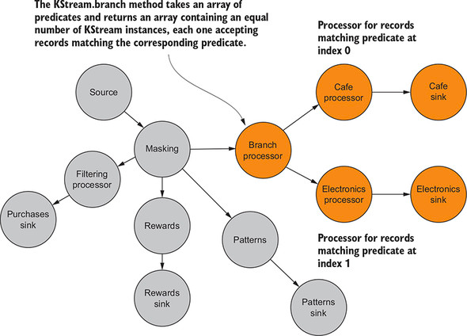
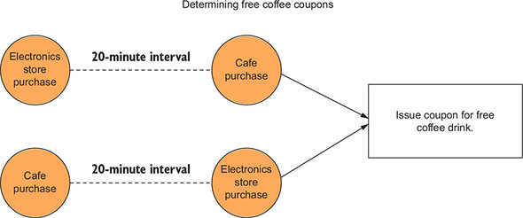
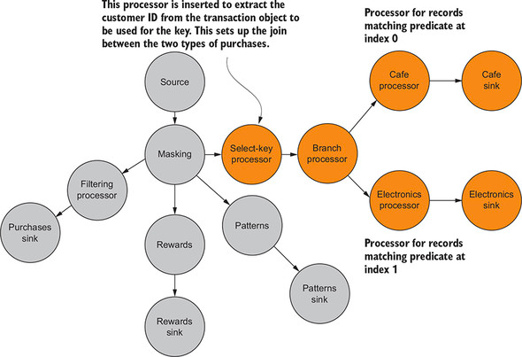
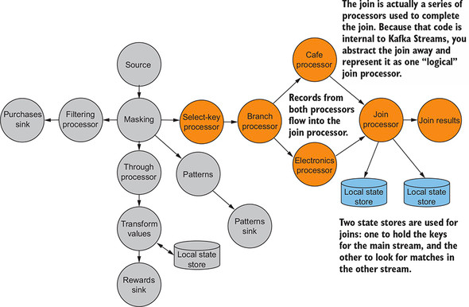
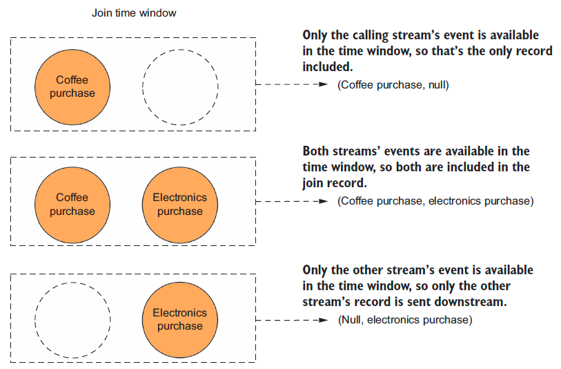
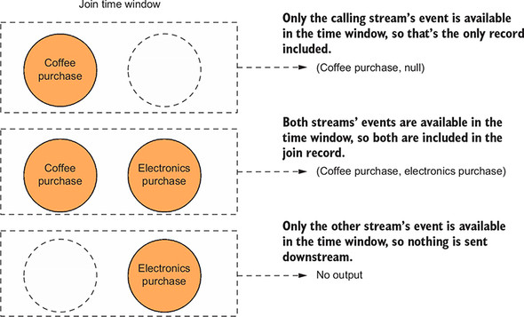
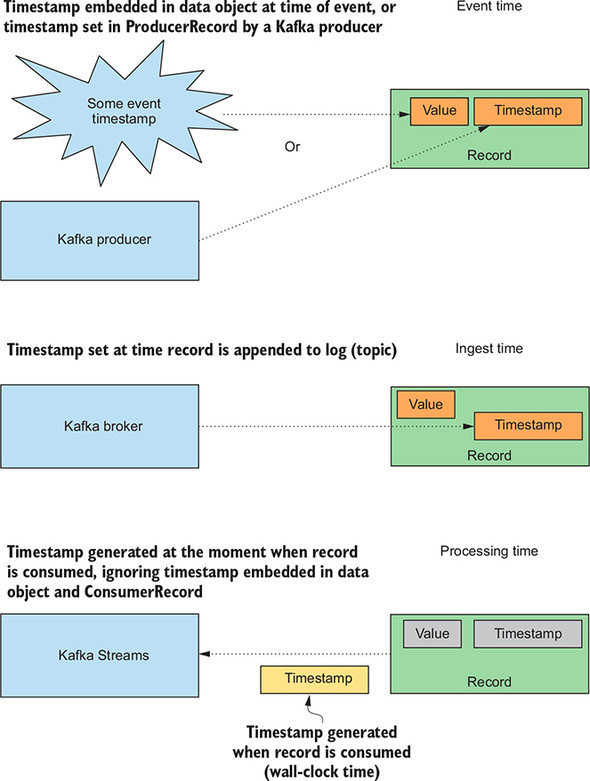

## 1. 이벤트

> 이벤트 처리와 관련하여 이벤트는 때때로 추가 정보나 문맥이 필요하지 않음

- 추가 정보가 필요하지 않은 경우
  - 도난 당한 카드 사용을 감지하는 경우 (해당 결정을 하기 위해 추가 정보가 필요하지는 않음)
- 추가 정보가 필요한 경우
  - 짧은 기간 내 3명의 개인 투자자가 일련의 주식을 구입하는 경우

> 추가 정보가 없는 주식 거래 (특이점 파악 불가)


- XYZ 제약사 주식의 구매에 대한 특이점을 파악할 정보 없음

> 추가 정보가 있는 주식 거래 (주식 매입 시기에 대한 문맥 추가 시 새로운 관점으로 데이터 접근 가능)


- AM 11:00 - FDA 가 XYZ 제약사가 개발한 실험 약제의 승인 발표 (이로인해 주가 30% 상승 확인 가능)
- 투자자들에게 미리 정보가 유출 됐을 가능성 또는 내부 정보를 미리 유출했을 가능성 유추가 가능한 유의미한 데이터로 활용 가능

### 1.1 스트림은 상태가 필요하다

> 보통은 좋은 결정을 내리는 데 어떤 문맥이 필요하며, 스트림 처리에서는 추가된 문맥 '상태 (State)' 라고 부름

- 스트리밍 데이터로 작업할 때 항상 상태가 필요하지는 않음
- 하지만, 데이터 스트림은 전에 도착한 이벤트의 정보를 사용하거나, 관련 이벤트를 다른 스트림의 이벤트와 조인하여, 일종의 저장소에서 보강할 필요가 있음

## 2. 카프카 스트림즈에 상태를 가진 작업 적용하기

> 아래 토폴로지의 처리 노드 중 하나는 판매액을 기준으로 고객에 대한 보상(Reward) 포인트 계산

- 단일 트랜잭션에 대한 총 포인트 수만 계산하고 결과를 전달
- 해당 프로세서에 '상태'를 추가할 경우, 보상 포인트의 누적 수 추적 가능
- 이후 지마트 컨슈밍 어플리케이션에서 합계 확인 후 조건에 따라 보상 처리 가능


### 2.1 transformValues 프로세서

> 상태가 없는 보상 프로세서를 상태가 있는 프로세서로 변환

- 가장 기본적인 상태 유지 (stateful) 함수는 'KStream.transformValues'


- transformValues 프로세서는 로컬 상태에 저장된 정보를 사용하여 들어오는 레코드를 업데이트
- 고객 구매 데이터 -> transformValues 프로세서 -> 로컬 상태 (인메모리 키/값 저장소) -> transformValues 프로세서 -> 다음 프로세서

### 2.2. 고객 보상의 상태 유지

````java
public class RewardAccumulator {
    private String customerId; // 고객ID
    private double purchaseTotal; // 총 구매 금액
    private int currentRewardPoints; // 현재 보상 포인트
    private int daysFromLastPurchase; // 마지막 구매 날짜
    private long totalRewardPoints; // 누적 포인트
    ...
}
````

### 2.3 값 변환기 초기화

> init() 메소드에서 처리 토폴로지를 만들 때, 생성된 상태 저장소 조회

````java
// init() 메소드
private KeyValueStore<String, Integer> stateStore; // 인스턴스 변수

private final String storeName;
private ProcessorContext context;

public void init(ProcessorContext context) {
    this.context = context; // ProcessorContext 로컬 참조 설정
    stateStore = (KeyValueStore) this.context.getStateStore(stateName); // stateName 을 통해 stateStore 인스턴스 참조
}
````

### 2.4 상태를 사용해 Purchase 객체를 RewardAccumulator 에 매핑

> 프로세서 초기화 작업 선행을 통해 상태를 사용하여 Purchase 객체 변환 가능

- 변환 수행 단계
  1. 고객 ID별로 누적된 포인트가 있는지 확인
  2. 현재 거래에 대한 포인트 합산 및 합계 표시
  3. RewardAccumulator의 보상 포인트를 새로운 총 보상 포인트로 설정
  4. 고객 ID별로 새 총점을 로컬 상태 저장소에 저장

````java
// 상태를 사용하여 Purchase -> RewardAccumulator 변환
public RewardAccumulator transform(Purchase value) {
    RewardAccumulator rewardAccumulator = RewardAccumulator.builder(value).build(); // Purchase 객체에서 RewardAccumulator 객체 생성
    Integer accumulatedSoFar = stateStore.get(rewardAccumulator.getCustomerId()); // 고객ID로 로컬 저장소(인메모리)에 저장된 최신 누적 보상 포인트 조회

    if (accumulatedSoFar != null) {
        rewardAccumulator.addRewardPoints(accumulatedSoFar); // 로컬 저장소(인메모리) 누적된 누적 보상 포인트가 있는 경우, 현재 합계에 추가
    }

    stateStore.put(rewardAccumulator.getCustomerId(), rewardAccumulator.getTotalRewardPoints()); // 새로운 누적 보상 포인트를 stateStore 에 저장

    return rewardAccumulator; // 새로운 누적 보상 포인트 반환
}
````


- 보상 프로세서를 업데이트
  - 주어진 고객에 대한 판매별 정보를 수집한다는 것은 해당 고객에 대한 모든 트랜잭션이 동일한 파티션에 있음을 의미
  - 하지만, 기존의 설계는 키가 없었으므로 라운드 로빈 방식으로 파티션에 할당 (동일 고객ID의 데이터가 동일 파티션에 들어가지 않음)
    - 고객ID를 키로 리파티셔닝 필요

> 데이터 리파티셔닝


- 기존 키값이 null 인 상태에서 여러 파티션으로 분산되었던 레코드를 고객ID 별로 같은 파티션에 재배치

> 카프카 스트림즈의 리파티셔닝

- 해당 책에서는 KStream.through() 를 통해 리파티셔닝 개념과 예제를 설명
- 2.6 버전 이후부터 deprecated 되었으며, repartition() 으로 대체
- through
  - https://kafka.apache.org/27/javadoc/org/apache/kafka/streams/kstream/KStream.html#through-java.lang.String-
- repartition
  - https://kafka.apache.org/27/javadoc/org/apache/kafka/streams/kstream/KStream.html#repartition-org.apache.kafka.streams.kstream.Repartitioned-

````java
// KStream.through 메소드 사용
RewardsStreamPartitioner streamPartitioner = new RewardsStreamPartitioner();

KStream<String, Purchase> transByCustomerStream = purchaseKStream.through("customer_transactions", Produced.with(stringSerde, purchaseSerde, streamPartitioner));
````

````java
// RewardsStreamPartitioner
public class RewardsStreamPartitioner implements StreamPartitioner<String, Purchase> {
    @Override
    public Integer partition(String key, Purchase value, int numPartitions) {
        return value.getCustomerId().hashCode() % numPartitions; // 고객ID를 통해 파티션 결정
    }
}
````

### 2.5 보상 프로세서 업데이트

````java
// 상태를 가진 변환을 사용하기 위해 보상 프로세서 변경
KStream<String, RewardAccumulator> statefulRewardAccumulator = transByCustomerStream.transformValues(() -> new PurchaseRewardTransformer(rewardStateStoreName), rewardStateStoreName); // 상태를 가진 변환기 사용

statefulRewardAccumulator.to("rewards", Produced.with(stringSerde, rewardAccumulatorSerde)); // 결과를 토픽에 기록
````

> 새로운 through 프로세서를 통해 구매 정보를 고객 ID에 해당하는 파티션으로 전달되도록 보장하므로 보상 프로세서가 로컬 상태를 사용하여 정확히 업데이트 가능

- 상태가 없는 노드에 상태를 가진 프로세싱 추가 (누적 보상 포인트 제공)


## 3. 조회와 이전에 본 데이터에 상태 저장소 사용하기

### 3.1 데이터 지역성

> 키 조회는 일반적으로 매우 빠르지만, 원격 저장소를 사용하면서 발생하는 대기 시간(Latency)은 처리 규모가 커지면 '병목' 발생


> 네트워크를 통해 원격 데이터베이스를 호출하여 데이터를 조회하는 것 보다 로컬에서 데이터를 가져오기 위한 호출이 효율적

- 점선
  - 원격 데이터베이스에서 데이터를 검색하는 네트워크 호출을 나타냄
- 실선
  - 동일한 서버에 있는 인메모리 데이터 저장소에서 데이터를 조회하는 것을 나타냄

> 중요점

- 스트리밍 어플리케이션을 통해 잠재적으로 수백만 또는 수십억 개의 레코드를 처리할 상황이 발생할 수 있기 때문에 작은 네트워크 지연조차도 큰 영향을 미칠 수 있음
- 데이터 지역성은 또한 저장소가 각 처리 노드에 대해 '지역적'이고, 프로세스나 쓰레드를 공유하지 않음을 의미
  - 프로세스가 실패한 경우, 다른 스트림 처리 프로세스나 쓰레드에 영향을 미치지 않음

### 3.2 실패 복구와 내결함성

> 어플리케이션의 장애는 불가피하며, 실패를 예방하는 대신 실패를 신속하게 복구하는 데 중점을 두는 것이 효과적

- 각 프로세서는 로컬 데이터 저장소가 있으며, 변경 로그 토픽은 상태 저장소를 백업하는 데 사용
- 카프카 스트림즈는 로컬 인메모리 저장소의 데이터를 내부 토픽으로 유지하므로 실패 후 작업 재시작 시, 데이터 재적재 가능


### 3.3 카프카 스트림즈에서 상태 저장소 사용하기

````java
// 상태 저장소 추가
String rewardsStateStoreName = "rewardsPointsStore";
KeyValueBytesStoreSupplier storeSupplier = Stores.inMemoryKeyValueStore(rewardsStateStoreName);

StoreBuilder<KeyValueStore<String, Integer>> StoreBuilder = Stores.keyValueStoreBuilder(storeSupplier, Serdes.String(), Serdes.Integer()); // String 키, Integer 값을 가지는 인메모리 키/값 저장소 생성

builder.addStateStore(StoreBuilder); // 상태 저장소를 토폴로지에 추가
````

### 3.4 추가적인 키/값 저장소 공급자

> 모두 RocksDB 를 사용하여 로컬 스토리지 제공

- Stores.persistentKeyValueStore
- Stores.persistentWindowStore
- Stores.lruMap
- Stores.persistentSessionStore

### 3.5 상태 저장소의 내결함성

- 모든 StateStoreSupplier 타입은 기본적으로 '로깅'이 활성화 되어 있음
- 해당 로깅을 비활성화 하는 경우, 상태 저장소에서 내결함성을 제거하고 크래시 후 복구할 수 있는 기능을 제거하는 격이기 때문에 주의 필요
  - 카프카 스트림즈 서버 장애 시, 서버 복구 후 카프카 스트림즈 어플리케이션 재실행 시 해당 인스턴스의 상태 저장소가 원래 내용으로 복원

### 3.6 변경로그 토픽 설정하기

- 상태 저장소에 대한 변경 로그는 'withLoggingEnabled()' 메소드를 통해 설정 가능

````java
// 변경 로그 속성 설정하기
Map<String, String> changeLogConfigs = new HashMap<>();
changeLogConfigs.put("retention.ms", "172800000");
changeLogConfigs.put("retention.bytes", "10000000000");
changeLogConfigs.put("cleanup.policy", "compact,delete"); // 삭제 정책 (* 압축/삭제 동시 설정)

// StoreBuilder 사용 시
StoreBuilder.withLoggingEnabled(changeLogConfigs);

// Materialized 사용 시
Materialized.as(Stores.inMemoryKeyValueStore("foo").withLoggingEnabled(changeLogConfigs));
````

## 4. 추가적인 통찰을 위해 스트림 조인하기

- 지마트는 무료 커피 쿠폰을 제공하여 전자제품 상점의 트래픽을 높게 유지하고자 함
  - 카페에서 커피 구매 및 전자제품 상점에서 전자제품을 구매한 고객을 확인하여, 2번째 거래 직후 커피 쿠폰 지급 예정 (20분 이내 거래에 대해 한정)
  - 카페/전자제품 상점의 선후행 관계 상관 없음

> 브랜치 프로세서와 전체 토폴로지에서 브랜치 프로세서의 위치



> 서로 20분 이내의 타임스탬프가 있는 구매 기록은 고객 ID로 조인되어 고객에게 보상 (무료 커피 제공)



### 4.1 데이터 설정

> Predicate 를 사용하여 유입되는 레코드를 KStream 인스턴스의 배열로 매치

- 구매 레코드는 현재 key 없이 유입된 상태이므로, 고객ID를 키로 생성하기 위한 프로세서 추가 필요

````java
// 2개의 스트림
Predicate<String, Purchase> coffeePurchase = (key, purchase) -> purchase.getDepartment().equalsIgnoreCase("coffee");
Predicate<String, Purchase> electronicPurchase = (key, purchase) -> purchase.getDepartment().equalsIgnoreCase("electronics");

final int COFFEE_PURCHASE = 0;
final int ELECTRONICS_PURCHASE = 1;

KStream<String, Purchase>[] branchedTransactions = transactionStream.branch(coffeePurchase, electronicPurchase);
````

### 4.2 조인을 수행하기 위해 고객 ID를 포함한 키 생성하기

````java
// 고객 ID 를 통해 새로운 키 생성
KStream<String, Purchase>[] branchesStream = transactionStream.selectKey((k, v) -> v.getCustomerId()).branch(coffeePurchase, electronicPurchase); // selectKey 처리 노드 삽입
````

> key 에 사용할 고객 ID 추출을 위한 프로세서 삽입



### 4.3 조인 구성하기

> 분기된 스트림 2개를 'KStream.join()' 메소드로 조인



> 구매 레코드 조인하기

````java
// ValueJoiner 구현
public class PurchaseJoiner implements ValueJoiner<Purchase, Purchase, CorrelatedPurchase> {

    @Override
    public CorrelatedPurchase apply(Purchase purchase, Purchase otherPurchase) {

        CorrelatedPurchase.Builder builder = CorrelatedPurchase.newBuilder();

        Date purchaseDate = purchase != null ? purchase.getPurchaseDate() : null;
        Double price = purchase != null ? purchase.getPrice() : 0.0;
        String itemPurchased = purchase != null ? purchase.getItemPurchased() : null;

        Date otherPurchaseDate = otherPurchase != null ? otherPurchase.getPurchaseDate() : null;
        Double otherPrice = otherPurchase != null ? otherPurchase.getPrice() : 0.0;
        String otherItemPurchased = otherPurchase != null ? otherPurchase.getItemPurchased() : null;

        List<String> purchasedItems = new ArrayList<>();

        if (itemPurchased != null) {
            purchasedItems.add(itemPurchased);
        }

        if (otherItemPurchased != null) {
            purchasedItems.add(otherItemPurchased);
        }

        String customerId = purchase != null ? purchase.getCustomerId() : null;
        String otherCustomerId = otherPurchase != null ? otherPurchase.getCustomerId() : null;

        builder.withCustomerId(customerId != null ? customerId : otherCustomerId)
                .withFirstPurchaseDate(purchaseDate)
                .withSecondPurchaseDate(otherPurchaseDate)
                .withItemsPurchased(purchasedItems)
                .withTotalAmount(price + otherPrice);

        return builder.build();
    }

}
````

> 조인 구현하기

````java
// join() 메소드 사용하기
KStream<String, Purchase> coffeeStream = branchesStream[COFFEE_PURCHASE];
KStream<String, Purchase> electronicsStream = branchesStream[ELECTRONICS_PURCHASE];

ValueJoiner<Purchase, Purchase, CorrelatedPurchase> purchaseJoiner = new PurchaseJoiner(); // 조인 수행 시 사용 인스턴스

JoinWindows twentyMinuteWindow = JoinWindows.of(60 * 1000 * 20);

KStream<String, CorrelatedPurchase> joinedKStream = coffeeStream.join(electronicsStream, // 조인할 전자제품 구매 스트림
                                                                      purchaseJoiner, // ValueJoiner 인터페이스 구현체
                                                                      twentyMinuteWindow, // 조인에 포함될 두 값 사이의 최대 시간 차이 지정 (20분 이내)
                                                                      Joined.with(stringSerde, // 조인을 수행하기 위한 선택적 매개변수
                                                                                  purchaseSerde,
                                                                                  purchaseSerde));
````

> 코파티셔닝

- 카프카 스트림즈에서 조인 수행 시, '코파티셔닝' 되어 있음을 보장해야 함
    - 파티션 개수 동일, 키 타입 동일 필요
    - 미일치 시, 'TopologyBuilderException' 발생

### 4.4  그 밖의 조인 옵션

- 위 ValueJoiner 인터페이스의 구현체인 ValueJoiner 는 '내부 조인 (Inner Join)' 로 두 레코드가 존재하지 않을 경우, 조인 수행 X

> 외부 조인

- coffeeStream.outerJoin(electronicsStream...)
- 3가지 경우 모두 출력



> 왼쪽 외부 조인

- coffeeStream.leftJoin(electronicsStream...)
- 3번째 경우 미출력



## 5. 카프카 스트림즈의 타임스탬프

> 타임스탬프의 3가지 범주



1. 이벤트 시간

- 이벤트가 발생했을 때 설정한 타임스탬프

2. 인제스트 시간

- 데이터가 처음 데이터 처리 파이프라인에 들어갈 때 설정되는 타임스탬프
- 카프카 브로커에 설정한 타임스탬프

3. 처리 시간

- 데이터나 이벤트 레코드가 처음 처리 파이프라인을 통과하기 시작할 때 설정된 타임스탬프
- 레코드가 소비될 때 생성
