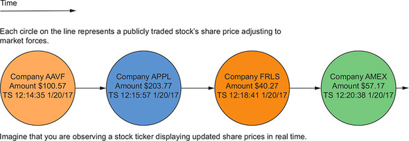
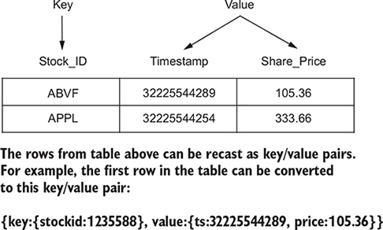
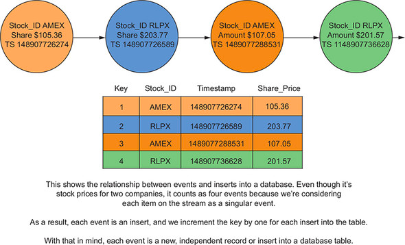

## 1. 스트림과 테이블의 관계

### 1.1 레코드 스트림

> 연속된 주식 시세 스트림에 관한 다이어그램

> 데이터베이스 테이블과의 관계

- 아래의 표에서 ROW 는 키/값으로 재구성 가능

> 개별 이벤트 스트림과 데이터베이스 테이블 입력 비교

- 2개의 회사에 대한 주가이지만, 스트림의 각 항목을 하나의 이벤트로 간주하기 떄문에 4개의 이벤트로 취급

### 1.2 레코드 및 변경로그 업데이트

