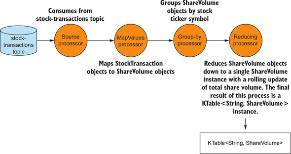

## 1. 스트림과 테이블의 관계

### 1.1 레코드 스트림

> 연속된 주식 시세 스트림에 관한 다이어그램


> 데이터베이스 테이블과의 관계

- 아래의 표에서 ROW 는 키/값으로 재구성 가능


> 개별 이벤트 스트림(KStream)과 데이터베이스 테이블 입력 비교

- 2개의 회사에 대한 주가이지만, 스트림의 각 항목을 하나의 이벤트로 간주하기 떄문에 4개의 이벤트로 취급


### 1.2 레코드 및 변경 로그 업데이트

> Stock_ID 를 PK 로 사용하면, 이후 이벤트는 같은 키로 변경 로그를 업데이트


- 로그와 변경 로그 둘 다 파일의 끝에 추가된 유입 레코드 의미

  - 로그의 경우, 모든 레코드 유지
  - 변경 로그의 경우, 주어진 특정 키에 대한 최신 레코드만 유지
- 키별로 최신 레코드를 유지하는 동안 로그를 삭제하기 위해 '로그 압축' 사용

  - 마지막 값만 고려하기 때문에 오래된 '키/값' 쌍 제거 가능

> 압축 후 로그 - 각 키에 대한 최신 값만 유지하므로 로그의 크기가 작아짐


### 1.3 이벤트 스트림(KStream)과 업데이트 스트림(KTable) 비교

> KStream, KTable 을 사용하여 3개 회사의 현재 주가를 기록하는 단순 주가 알림 어플리케이션 실행 (이벤트 스트림, 업데이트 스트림 비교)

- KStream 의 경우, '9건'의 레코드 출력
- KTable 의 경우, 마지막 업데이트 레코드를 다루기 때문에 '3건'의 레코드 출력


````java
KTable<String, StockTickerData> stockTickerTable = builder.table(STOCK_TICKER_TABLE_TOPIC); // KTable 인스턴스 생성
KStream<String, StockTickerData> stockTickerStream = builder.stream(STOCK_TICKER_STREAM_TOPIC); // KStream 인스턴스 생성

// KTable 콘솔 출력
stockTickerTable.toStream()
                .print(Printed.<String, StockTickerData>toSysOut()
                .withLabel("Stocks-KTable"));

// KStream 콘솔 출력
stockTickerStream.toStream()
                .print(Printed.<String, StockTickerData>toSysOut()
                .withLabel("Stocks-KStream"));
````

## 2. 레코드 업데이트와 KTable 구성

> KTable 생성

````java
builder.table(STOCK_TICKER_TABLE_TOPIC);
````

- StreamBuilder 는 KTable 인스턴스를 만들고 동시에 내부에 스트림 상태를 추적하는 '로컬 상태 저장소'를 만들어 업데이트 스트림을 만듬
  - 해당 로컬 상태 저장소는 내부적인 이름을 갖기 때문에 대화형 쿼리에서 사용 불가
  - Materialized 인스턴스를 통해 대화형 쿼리 가능

### 2.1 캐시 버퍼 크기 설정하기

> cache.max.bytes.buffering

- 캐시에는 각 키의 최근 레코드만 유지
- cache.max.bytes.buffering 설정값을 통해 레코드 캐시에 할당할 메모리 설정
- KTable 캐시는 같은 키가 있는 레코드의 업데이트 중복을 제거해서, 토폴로지에 있는 KTable 의 자식 노드에 연속적인 업데이트가 흐르는 것을 방지


### 2.2 커밋 주기 설정하기

> commit.interval.ms

- 프로세서 상태 저장 주기 설정
- 프로세서 상태 저장(커밋) 시, 캐시를 강제로 비우고 중복 제거된 마지막 업데이트 레코드를 다운 스트림으로 전송

> 레코드를 다운 스트림에 보내는 2가지 방법

- 커밋 (기본값 : 30초)
- 캐시 최대 크기 도달 (기본값 : 10MB)

> 캐시 동작 과정


## 3. 집계와 윈도 작업

### 3.1 업계별 거래량 집계

- 스트림 데이터를 다룰 경우, '집계'와 '그룹화'는 필수 도구

> 예 : 선택한 산업 목록 전체에 걸쳐 회사의 거래량 추적 (산업별 거래량에 따라 상위 5개 회사 타겟)

> StockTransaction 객체를 ShareVolume 객체로 맵/리듀스 작업 후 롤링 합계로 데이터 줄임



````java
// 주식 거래 맵리듀스 코드
KTable<String, ShareVolume> shareVolume = builder.stream(STOCK_TRANSACTIONS_TOPIC, Consumed.with(stringSerde, stockTransactionSerde)
                                                .withOffsetResetPolicy(EARLIEST)) // 특정 토픽 소비 소스 프로세서 (오프셋 초기화 전략)
                                                .mapValues(st -> ShareVolume.newBuilder(st).build()) // StockTransaction -> ShareVolume 객체로 매핑
                                                .groupBy((k, v) -> v.getSymbol(), Serialized.with(stringSerde, shareVolumeSerde)) // 주식 종목 코드에 따른 ShareVolume 객체 그룹화
                                                .reduce(ShareVolume::reduce); // 거래량 롤링 집계를 위한 ShareVolume 객체 리듀스

````

````java
// ShareVolume.sum 메소드
public static ShareVolume sum(ShareVolume csv1, shareVolume csv2) {
    Builder builder = newBuilder(csv1);
    builder.shares = csv1.shares + csv2.shares; // 두 shareVolume 객체 합산
    return builder.build();
}
````

> 산업별로 그룹화 후 상위 5개만 집계하여 큐에 있는 상위 5개의 문자열로 매핑한 뒤 토픽 전송


````java
// KTable groupBy 와 집계
Comparator<ShareVolume> comparator = (sv1, sv2) -> sv2.getShares() - sv1.getShares();

FixedSizePriorityQueue<ShareVolume> fixedQueue = new FixedSizePriorityQueue<>(comparator, 5); // 우선순위 큐를 사용하여 상위 5개 설정

shareVolume.groupBy((k, v) -> KeyValue.pair(v.getIndustry(), v), Serialized.with(stringSerde, shareVolumeSerde)) // 산업별 그룹화를 위한 serde
           .aggregate(() -> fixedQueue,
                     (k, v, agg) -> agg.add(v), // 새로운 레코드 추가
                     (k, v, agg) -> agg.remove(v), // 같은 키의 다른 레코드가 있는 경우, 기존 레코드 제거
                     Materialized.with(stringSerde, FixedSizePriorityQueueSerde))
           .mapValues(valueMapper)
           .toStream().peek((k, v) -> LOG.info("Stock volume by industry {} {}", k, v))
           .to("stock-volume-by-company", Produce.with(stringSerde, stringSerde));
````

### 3.2 윈도우 연산

- 주어진 시간 범위에 대해 작업 수행

> 고객별 주식 거래량 집계

1. 주식 거래 토픽을 읽어서 스트림 생성
2. 고객 ID와 주식 종목 코드별 유입 레코드 그룹화
3. KGroupedStream.windowedBy 메소드 사용을 통해 특정 유형의 윈도 집계 수행 (TimeWindowedKStream 또는 SessionWindowedKStream)
4. 집계 연산을 위한 계산 수행
5. 특정 토픽으로 전송


> 윈도우 유형

1. 세션 윈도우
2. 텀블링 윈도우
3. 슬라이딩 또는 호핑 윈도우

- 텀블링, 호핑 윈도우의 경우, 시간 제한 존재
- 세션 윈도우의 경우, 사용자 활동과 관련
- 모든 윈도우는 레코드의 '타임스탬프' 기반

> 주식 거래 추적을 위한 세션 윈도 사용

````java
Serde<String> stringSerde = Serdes.String();
Serde<StockTransaction> transactionSerde = StreamSerdes.StockTransactionSerde();
Serde<TransactionSummary> transactionKeySerde = StreamSerdes.TransactionSummarySerde();

long twentySeconds = 1000 * 20;
long fifteenMinutes = 1000 * 60 * 15;

KTable<Windowed<TransactionSummary>, Long> customerTransactionCounts = builder.stream(STOCK_TRANSACTIONS_TOPIC, Consumed.with(stringSerde, transactionSerde)
                                                                              .withOffsetResetPolicy(LATEST))
                                                                              .groupBy((noKey, transaction) -> TransactionSummary.from(transaction), Serialized.with(transactionKeySerde, transactionSerde))
                                                                              .windowedBy(SessionWindows.with(twentySeconds).until(fifteenMinutes))
                                                                              .count();
customerTransactionCounts.toStream()
                         .print(Printed.<Windowed<TransactionSummary>, Long> toSysOut()
                         .withLabel("Customer Transactions Counts"));
````

> 20초 비활성 간격으로 테이블 세션 처리


| 도착 순서 | 키               | 타임스탬프 |
| ----------- | ------------------ | ------------ |
| 1         | 123-345-654,FFBE | 00:00:00   |
| 2         | 123-345-654,FFBE | 00:00:15   |
| 3         | 123-345-654,FFBE | 00:00:50   |
| 4         | 123-345-654,FFBE | 00:00:05   |

1. 레코드 1 은 첫번째 레코드로 시작과 끝 시간은 00:00:00
2. 레코드 2 도착 시, 23:59:55 ~ 00:00:35 세션 조회 (이때, 레코드 1 조회 되고, 레코드1과 레코드 2 병합)
   - 00:00:15 - 20s <= t <= 00:00:15 + 20s
3. 레코드 3 도착 시, 00:00:30 ~ 00:01:10 세션 조회 결과 없음
4. 레코드 4 도착 시, 23:59:45 ~ 00:00:25 세션 조회 (이때, 레코드 1, 2의 결과가 조회 되고, 레코드 4와 통합되어 총 3개의 세션이 모두 한 세션으로 병합)

> 텀블링 윈도우


- 텀블링 윈도우는 지정한 기간 내의 이벤트 추적
  - 특정 회사의 전체 주식 거래를 20초마다 추적해야 하고, 그 시간 동안 모든 이벤트를 수집해야 하는 경우, 20초 경과 시 윈도우는 다음 20초 감시 주기로 '텀블링'

````java
KTable<Windowed<TransactionSummary>, Long> customerTransactionCounts = builder.stream(STOCK_TRANSACTIONS_TOPIC, Consumed.with(stringSerde, transactionSerde)
                                                                              .withOffsetResetPolicy(LATEST))
                                                                              .groupBy((noKey, transaction) -> TransactionSummary.from(transaction), Serialized.with(transactionKeySerde, transactionSerde))
                                                                              .windowedBy(TimeWindows.of(twentySeconds)).count(); // 20초 텀블링 윈도우 지정
````

> 슬라이딩 또는 호핑 윈도우


- 슬라이딩 윈도우는 최근 이벤트를 처리할 새 윈도우를 시작하기 전에 그 윈도우 전체 시간을 기다리지 않음
  - 위 그림에서는 20초마다 거래 건수를 카운트하지만, 5초마다 카운트 업데이트

````java
KTable<Windowed<TransactionSummary>, Long> customerTransactionCounts = builder.stream(STOCK_TRANSACTIONS_TOPIC, Consumed.with(stringSerde, transactionSerde)
                                                                              .withOffsetResetPolicy(LATEST))
                                                                              .groupBy((noKey, transaction) -> TransactionSummary.from(transaction), Serialized.with(transactionKeySerde, transactionSerde))
                                                                              .windowedBy(TimeWindows.of(twentySeconds)
                                                                              .advanceBy(fiveSeconds).until(fifteenMinutes)).count(); // 5초마다 이동하는 20초 간격의 슬라이딩 윈도우
````
