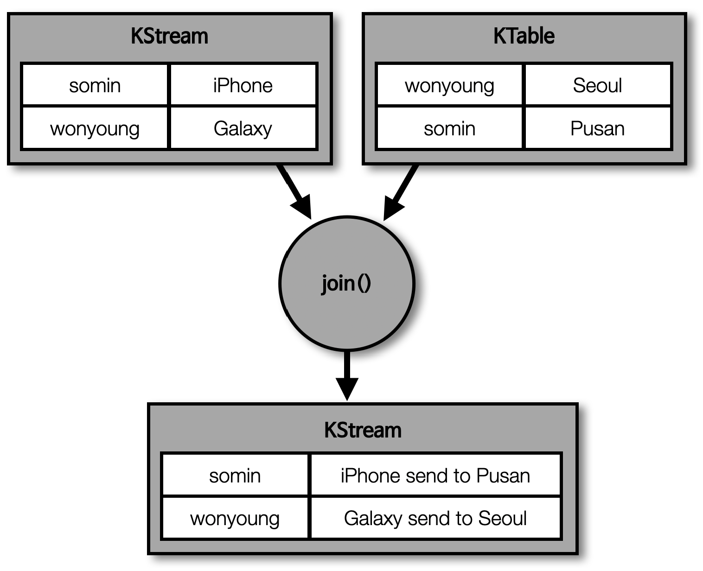

## 스트림즈DSL - KTable 과 KStream 을 join()


> KTable 과 KStream 은 메시지 키를 기준으로 조인할 수 있음

- 대부분의 데이터베이스는 정적으로 저장된 데이터를 조인하여 사용했지만, 카프카에서는 실시간으로 들어오는 데이터들을 조인할 수 있음
- \* 사용자의 이벤트 데이터를 데이터베이스에 저장하지 않고도 조인하여 스트리밍 처리를 할 수 있는 것이 가장 큰 장점
  - 이를 통해 '이벤트 기반 스트리밍 데이터 파이프라인' 구성 가능
  - 예시
    - KStream : 주문 데이터 (스트리밍 데이터)
    - KTable : 주소 데이터 (최신 주소 데이터)
    - 주문 데이터에 대해 최신 설정한 주소로 KStream 과 KTable 을 조인하여 프로세싱 가능



> 이름을 메시지 키, 주소를 메시지 값으로 가지는 KTable 과 이름을 메시지 키, 주문한 물품을 메시지 값으로 가지는 KStream 이 존재한다고 가정

- 사용자가 상품 주문 시 이미 토픽에 저장된 '이름:주소' 로 구성된 KTable 과 조인하여 상품과 주소가 조합된 데이터를 새로 생성 가능


> 만약 사용자의 주소가 변경되는 경우는 어떻게 될까 ?

- KTable 은 동일한 메시지 키가 들어올 경우, 가장 마지막의 레코드를 유효 데이터로 보기 때문에 가장 최근에 바뀐 주소로 조인 수행

## 스트림 데이터 join 을 위한 토픽 생성

> 스트림 데이터 join 을 위해 코파티셔닝 선행 필요

````shell
## 코파티셔닝을 위한 파티션 개수 일치, 기본 파티셔너 사용

# address 토픽 생성 (KTable - 별도 토픽 설정은 없으며, 스트림즈에서 KTable 으로 사용하면 됨)
$ bin/kafka-topics.sh --create --bootstrap-server localhost:9092 \
--partitions 3 \
--topic address
Created topic address.

# order 토픽 생성 (KStream - 별도 토픽 설정은 없으며, 스트림즈에서 KStream 으로 사용하면 됨)
$ bin/kafka-topics.sh --create --bootstrap-server localhost:9092 \
--partitions 3 \
--topic order
Created topic order.

# order_join 토픽 생성 (address, order 데이터 조인 결과를 저장용 토픽)
$ bin/kafka-topics.sh --create --bootstrap-server localhost:9092 \
--partitions 3 \
--topic order_join
Created topic order_join.
````

## KTable, KStream 조인 설정 코드

````java
// KTable, KStream 조인 설정 코드
public class KStreamJoinKTable {

    private static String APPLICATION_NAME = "order-join-application";
    private static String BOOTSTRAP_SERVERS = "my-kafka:9092";
    private static String ADDRESS_TABLE = "address";
    private static String ORDER_STREAM = "order";
    private static String ORDER_JOIN_STREAM = "order_join";

    public static void main(String[] args) {
        // 설정
        Properties props = new Properties();
        props.put(StreamsConfig.APPLICATION_ID_CONFIG, APPLICATION_NAME);
        props.put(StreamsConfig.BOOTSTRAP_SERVERS_CONFIG, BOOTSTRAP_SERVERS);
        props.put(StreamsConfig.DEFAULT_KEY_SERDE_CLASS_CONFIG, Serdes.String().getClass());
        props.put(StreamsConfig.DEFAULT_VALUE_SERDE_CLASS_CONFIG, Serdes.String().getClass());

        // KTable, KStream 설정
        StreamsBuilder builder = new StreamsBuilder();
        KTable<String, String> addressTable = builder.table(ADDRESS_TABLE);
        KStream<String, String> orderStream = builder.stream(ORDER_STREAM);

        // KTable, KStream 조인 및 결과 데이터를 특정 토픽으로 전송
        // addressTable 와 orderStream 의 키가 같을 경우에만 조인 수행 (* 메시지 키를 직접 지정하는 방식 X)
        orderStream.join(addressTable, (order, address) -> order + " send to " + address).to(ORDER_JOIN_STREAM); // order, address : 메시지 값

        KafkaStreams streams;
        streams = new KafkaStreams(builder.build(), props);
        streams.start();
    }
}
````

## address, order 토픽 데이터 추가

````shell
## address, order 토픽 데이터 추가
## 메시지 키를 추가하기 위한 설정 (property - parse.key)

$ bin/kafka-console-producer.sh --bootstrap-server localhost:9092 \
--topic address \
--property "parse.key=true" \
--property "key.separator=:"

>tom:Seoul
>brown:Busan


$ bin/kafka-console-producer.sh --bootstrap-server localhost:9092 \
--topic order \
--property "parse.key=true" \
--property "key.separator=:"

>brown:iPhone
>tom:Galaxy
````

## order 토픽, address 토픽의 join() 결과

````shell
## order 토픽, address 토픽의 join() 결과

$ bin/kafka-console-consumer.sh --bootstrap-server localhost:9092 \
--topic order_join \
--property print.key=true \
--property key.separator=":" \
--from-beginning

tom:iPhone send to Busan
brown:Galaxy send to Seoul
````

## 신규 address, order 데이터 추가

````shell
## 신규 address, order 데이터 추가
## address 토픽은 KTable 로 사용중이기 때문에 최신 데이터만 유효

$ bin/kafka-console-producer.sh --bootstrap-server localhost:9092 \
--topic address \
--property "parse.key=true" \
--property "key.separator=:"

>tom:Jeju

$ bin/kafka-console-producer.sh --bootstrap-server localhost:9092 \
--topic order \
--property "parse.key=true" \
--property "key.separator=:"

>tom:Tesla
````

## 신규 데이터 join() 결과


````shell
$ bin/kafka-console-consumer.sh --bootstrap-server localhost:9092 \
--topic order_join --from-beginning

Tesla send to Jeju
````

## Apple M1 Macbook 에서 KStream, KTable - Join 시 아래 이슈로 인한 카프카 스트림즈 버전 변경

> Apple M1 - Error opening store caused by RocksDBException: Column family not found when joining KStream to KTable

- stack overflow : https://stackoverflow.com/questions/73787223/apple-m1-error-opening-store-caused-by-rocksdbexception-column-family-not-fou
- 변경 전 : implementation 'org.apache.kafka:kafka-streams:2.8.0'
- 변경 후 : implementation 'org.apache.kafka:kafka-streams:3.2.3'

````java
org.apache.kafka.streams.errors.ProcessorStateException: Error opening store joined-topics at location /var/folders/lx/dz_x9j5d7lz4mfymgzkcn7wr0000gn/T/kafka-streams/streams-pipe/2_0/rocksdb/joined-topics
        at org.apache.kafka.streams.state.internals.RocksDBTimestampedStore.openRocksDB(RocksDBTimestampedStore.java:87) ~[kafka-streams-2.8.0.jar:na]
        at org.apache.kafka.streams.state.internals.RocksDBStore.openDB(RocksDBStore.java:186) ~[kafka-streams-2.8.0.jar:na]
        at org.apache.kafka.streams.state.internals.RocksDBStore.init(RocksDBStore.java:254) ~[kafka-streams-2.8.0.jar:na]
        at org.apache.kafka.streams.state.internals.WrappedStateStore.init(WrappedStateStore.java:55) ~[kafka-streams-2.8.0.jar:na]
        at org.apache.kafka.streams.state.internals.ChangeLoggingKeyValueBytesStore.init(ChangeLoggingKeyValueBytesStore.java:55) ~[kafka-streams-2.8.0.jar:na]
        at org.apache.kafka.streams.state.internals.WrappedStateStore.init(WrappedStateStore.java:55) ~[kafka-streams-2.8.0.jar:na]
        at org.apache.kafka.streams.state.internals.CachingKeyValueStore.init(CachingKeyValueStore.java:75) ~[kafka-streams-2.8.0.jar:na]
        at org.apache.kafka.streams.state.internals.WrappedStateStore.init(WrappedStateStore.java:55) ~[kafka-streams-2.8.0.jar:na]
        at org.apache.kafka.streams.state.internals.MeteredKeyValueStore.lambda$init$1(MeteredKeyValueStore.java:122) ~[kafka-streams-2.8.0.jar:na]
        at org.apache.kafka.streams.processor.internals.metrics.StreamsMetricsImpl.maybeMeasureLatency(StreamsMetricsImpl.java:884) ~[kafka-streams-2.8.0.jar:na]
        at org.apache.kafka.streams.state.internals.MeteredKeyValueStore.init(MeteredKeyValueStore.java:122) ~[kafka-streams-2.8.0.jar:na]
        at org.apache.kafka.streams.processor.internals.ProcessorStateManager.registerStateStores(ProcessorStateManager.java:201) ~[kafka-streams-2.8.0.jar:na]
        at org.apache.kafka.streams.processor.internals.StateManagerUtil.registerStateStores(StateManagerUtil.java:103) ~[kafka-streams-2.8.0.jar:na]
        at org.apache.kafka.streams.processor.internals.StreamTask.initializeIfNeeded(StreamTask.java:216) ~[kafka-streams-2.8.0.jar:na]
        at org.apache.kafka.streams.processor.internals.TaskManager.tryToCompleteRestoration(TaskManager.java:433) ~[kafka-streams-2.8.0.jar:na]
        at org.apache.kafka.streams.processor.internals.StreamThread.initializeAndRestorePhase(StreamThread.java:849) ~[kafka-streams-2.8.0.jar:na]
        at org.apache.kafka.streams.processor.internals.StreamThread.runOnce(StreamThread.java:731) ~[kafka-streams-2.8.0.jar:na]
        at org.apache.kafka.streams.processor.internals.StreamThread.runLoop(StreamThread.java:583) ~[kafka-streams-2.8.0.jar:na]
        at org.apache.kafka.streams.processor.internals.StreamThread.run(StreamThread.java:556) ~[kafka-streams-2.8.0.jar:na]
Caused by: org.rocksdb.RocksDBException: Column family not found: keyValueWithTimestamp
        at org.rocksdb.RocksDB.open(Native Method) ~[rocksdbjni-6.29.4.1.jar:na]
        at org.rocksdb.RocksDB.open(RocksDB.java:306) ~[rocksdbjni-6.29.4.1.jar:na]
        at org.apache.kafka.streams.state.internals.RocksDBTimestampedStore.openRocksDB(RocksDBTimestampedStore.java:75) ~[kafka-streams-2.8.0.jar:na]
        ... 18 common frames omitted
````

> kafka-streams 버전 변경 후 KStream, KTable - Join 카프카 스트림즈 실행 결과

- order 토픽 발행


- address 토픽 발행


- order_join 토픽 확인 (KStream - order, KTable - address)


