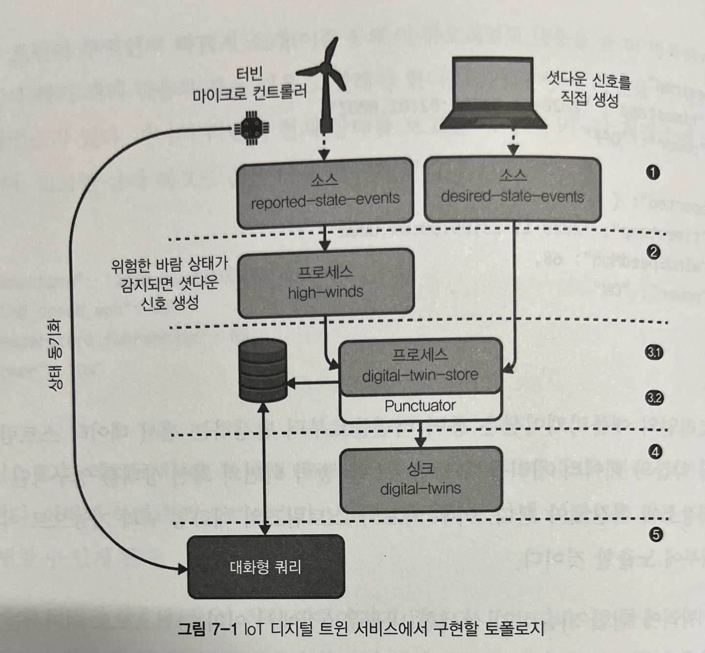

## Processor API

- Processor API 는 카프카 스트림즈의 하위 수준 API 로서 `상위 수준 DSL 보다 적은 추상화`를 갖고 있으며 `명령형 프로그래밍 방식` 사용
- 코드는 조금 더 길어질 수 있지만, 토폴로지에서의 데이터 흐름, 스트림 프로세서들의 관계, 상태의 생성과 유지 보수, 특정 연산의 수행 시간과 같은 특징들을 세밀하게 제어 가능

### 1. Processor API 는 언제 사용해야 할까 ?

> Processor API 사용 목적

1. 레코드의 메타데이터 (토픽, 파티션, 오프셋 정보, 레코드 헤더 등) 접근
2. 주기적인 함수 스케줄링
3. 레코드를 하위 스트림 프로세서로 넘길 때, 사용 가능한 세세한 제어
4. 상태 저장소에 대한 보다 세분화된 접근
5. DSL 을 사용할 때, 마주칠 수 있는 제약들을 뛰어넘을 수 있는 기능

> Processor API 단점

1. 장황한 코드로 인한 유지 보수 비용 증가로 가독성 저하
2. 다른 프로젝트 관리자가 진입하기 어려운 높은 장벽
3. DSL 특징 또는 추상화에 대한 우발적 재창조, 이상한 문제 구조화, 성능 함정과 같은 문제 발생 가능성
   - 이상한 문제 구조화 : 표현력이 떨어지고, 연산자들이 적어지게 되면 문제 구조화의 표준화가 멀어지며, 사람들과의 소통을 어렵게 만든다.
   - 성능 함정 : 지나친 커밋과 상태 저장소 접근은 성능에 영향을 미칠 수 있다.

> 튜토리얼 소개 : IoT 디지털 트윈 서비스

- 해상 풍력 발전 단지에서 사용할 `디지털 트윈 서비스` 구축을 위해 Processor API 사용
- 디지털 트윈 서비스는 카프카 스트림즈를 사용할 수 있는 적절한 예
  - 대용량 센서 데이터 수집 및 처리
  - 상태 저장소를 이용한 물리적 개체의 상태 캡처
  - 대화형 쿼리를 통한 상태 노출

> 예

- 상황

  - 40개의 풍력 터빈을 가지고 있는 풍력발전소가 있다.
  - 하나의 터빈이 현재 상태를 보고할 때마다, `키-값 저장소에 정보를 저장`한다.
  - 디바이스 ID 는 레코드 키를 통해 전달된다.
    - 아래 예제 레코드는 ID : abc123 의 디바이스와 관련이 있다.
  - 특정 풍력 터빈과 상호 동작은 직접 이루어지지 않는다.
    - IoT 디바이스들은 주기적으로 오프라인 상태가 될 수 있으므로, 물리적 디바이스의 `디지털 복사본 (트윈) 과 상호 동작`하면 고가용성 달성 및 오류 저하 가능
- 상태 레코드 값 예제

````json
{
    "timestamp": "2020-11-23T09:02:00.000Z",
    "wind_speed_mph": 40,
    "temperature_fahrenheit": 60,
    "power": "ON"
}
````

- 디지털 트윈 레코드
  - 전원 상태를 ON 에서 OFF 로 설정하고자 한다면, 터빈에 직접 신호를 보내는 대신 디지털 트윈에 희망하는 상태를 설정

````json
{
    "desired": {
        "timestamp": "2020-11-23T09:02:01.000Z",
        "power": "OFF"
    },
    "reported": {
        "timestamp": "2020-11-23T09:00:01.000Z",
        "windSpeedMph": 68,
        "power": "ON"
    }
}
````



1. 각 풍력 터빈은 환경 센서들을 장착하고 있다. 그리고 이 데이터는 터빈 자신의 메타데이터와 함께 주기적으로 `reported-state-events` 에 전송된다.
   - 사용자 또는 프로세스가 터빈의 전원 상태를 변경하고자 할 때마다 `desired-state-events` 토픽에 데이터 전송한다.
2. 환경 센서 데이터는 `reported-state-events` 토픽으로 전송하므로, 각 터빈이 보고한 풍속이 안전 운영 수준을 초과하는지 여부를 판단하는 스트림 프로세서 추가
   - 만약 안전 운영 수준 초과 시, 자동으로 셧다운 신호 생성
     3-1. 첫 번째, 두 이벤트 종류 (reported, desired) 는 디지털 트윈 레코드로 결합
   - 해당 레코드들을 처리한 후 영구적인 키-값 저장소인 `digital-twin-store` 에 저장
     3-2. 두 번째, 7일 이상 업데이트 되지 않은 오래된 디지털 트윈 레코드 코드를 정리하는 punctuator 함수를 주기적으로 스케줄링
3. 각 디지털 트윈 레코드는 분석 목적으로 `digital-twins` 토픽으로 전송
4. 카프카 스트림즈의 대화형 쿼리 기능을 통해 디지털 트윈 레코드 노출
   - 몇 초마다 풍력 터빈의 마이크로 컨트롤러는 카프카 스트림즈가 노출한 희망 상태를 자신의 상태로 동기화 시도

> 각 소스 토픽의 예제 레코드와 데이터 모델

- 토픽 : reported-state-events, desired-state-events

````json
// 'reported-state-events' 예제 레코드
{
    "timestamp": "...",
    "wind_speed_mph": 40,
    "power": "ON"
}
````

````json
// 'reported-state-events' 예제 레코드
{
    "timestamp": "...",
    "power": "ON"
}
````

````java
// 데이터 클래스
public class TurbineState {
    private String timestamp;
    private Double windSpeedMph;

    public enum Power { ON, OFF }

    public enum Type { DESIRED, REPORTED }

    private Power power;
    private Type type;

}
````

> 디지털 트윈 레코드 데이터 모델

````json
{
    "desired": {
        "timestamp": "2020-11-23T09:02:01.000Z",
        "power": "OFF"
    },
    "reported": {
        "timestamp": "2020-11-23T09:00:01.000Z",
        "windSpeedMph": 68,
        "power": "ON"
    }
}
````

````java
// 데이터 클래스
public class DigitalTwin {
    private TurbineState desired;
    private TurbineState reported;
    ...
}
````

> 디지털 트윈과 터빈 상태 레코드를 위한 Serdes

````java
public class JsonSerdes {

    // DigitalTwin Serde 반환 메소드
    public static Serde<DigitalTwin> DigitalTwin() {
        JsonSerializer<DigitalTwin> serializer = new JsonSerializer<>();
        JsonDeserializer<DigitalTwin> deserializer = new JsonDeserializer<>(DigitalTwin.class);

        return Serdes.serdeFrom(serializer, deserializer);
    }

    // TurbineState Serde 반환 메소드
    public static Serde<TurbineState> TurbineState() {
        JsonSerializer<TurbineState> serializer = new JsonSerializer<>();
        JsonDeserializer<TurbineState> deserializer = new JsonDeserializer<>(TurbineState.class);

        return Serdes.serdeFrom(serializer, deserializer);
    }
}
````

### 2. 소스 프로세서 추가

````java
Topology builder = new Topology(); // 1

builder.addSource( // 2
    "Desired State Events", // 3
    Serdes.String().deserializer(), // 4
    JsonSerdes.TurbineState().deserializer(), // 5
    "desired-state-events" // 6
);

builder.addSource(
    "Reported State Events",
    Serdes.String().deserializer(),
    JsonSerdes.TurbineState().deserializer(),
    "reported-state-events"
);
````

1. 토폴로지 생성 및 소스, 싱크, 스트림 프로세서 추가/연결
2. 소스 프로세서 생성

  - `오프셋 재설정 전략`, `토픽 패턴` 등 지원
3. 소스 프로세서 이름

  - 카프카 스트림즈 내부에서 소스 프로세서 이름들을 토폴로지 순서로 정렬한 맵에 저장
  - 각 프로세서는 고유한 이름 필요
  - 자식 프로세서를 연결할 때 사용
4. Key Desializer

  - DSL 은 Serdes (Serializer, Deserializer 를 모두 포함하는 객체) 을 사용하지만, Processor API 에서는 오직 `Deserializer` 만 사용
5. Value Desializer

  - 레코드 값을 TurbineState 객체로 변환하기 위한 커스텀 Serdes 사용
6. 소스 프로세서가 소비하는 토픽명

### 3. 상태가 없는 스트림 프로세서 추가

> 특정 터빈에서 기록한 풍속이 안전 운영 수준 (65mph) 을 초과할 때마다 셧다운 신호를 자동으로 생성할 것을 요구

````java
builder.addProcessor(
  "High Winds Flatmap Processor", // 1
  HighWindsFlatmapProcessor::new, // 2
  "Reported State Events" // 3
);
````

1. 스트림 프로세서 이름
2. Processor 인스턴스를 반환하는 함수 인터페이스인 ProcessSuplier 지정
3. 부모 프로세서 이름

- 스트림 프로세서는 하나 이상의 부모 노드와 연결 가능

### 4. 상태가 없는 프로세서 생성

> Processor API 에서 addProcessor 메소드를 사용할 때마다 스트림의 레코드들을 처리하고 변환하는 `Processor 인터페이스`를 구현해야 한다.

- Processor 인터페이스 메소드
  1. Processor 가 최초 생성될 때 호출
  2. 프로세서가 새 레코드를 받을 때마다 호출되며, 레코드 단위 데이터 변환/처리 로직을 포함
  3. 연산자가 종료될 때마다 카프카 스트림즈가 close 메소드 호출

````java
public interface Processor<K, V> {
  void init(ProcessorContext context); // 1
  void process(K key, V value); // 2
  void close(); // 3
}
````

> 위험 풍속을 감지하는 Processor 구현

````java
public class HighWindsFlatmapProcessor implements Processor<String, TurbineState, String, TurbineState> { // 1

  private ProcessorContext<String, TurbineState> context;

  @Override
  public void init(ProcessorContext<String, TurbineState> context) { // 2
    this.context = context; // 3
  }

  @Override
  public void process(Record<String, TurbineState> record) {
    TurbineState reported = record.value();
    context.forward(record); // 4

    if (reported.getWindSpeedMph() > 65 && reported.getPower() == Power.ON) { // 5
      TurbineState desired = TurbineState.clone(reported); // 6
      desired.setPower(Power.OFF);
      desired.setType(Type.DESIRED);

      Record<String, TurbineState> newRecord = new Record<>(record.key(), desired, record.timestamp()); // 7
      context.forward(newRecord); // 8
    }
  }

  @Override
  public void close() {

  }
}
````

1. 처음 <String, TurbineState, ..., ...> 은 `입력 키와 값 타입` 지정, 이후 <..., ... String, TurbineState> 은 `출력 키와 값 타입` 지정
2. ProcessorContext 인터페이스의 제네릭들은 `출력 키와 값 타입` 지정
3. ProcessorContext 를 인스턴스 속성으로 저장
4. 레코드를 하위 스트림 프로세서로 보내고 싶을 때마다, ProcessorContext 인스턴스의 forward 메소드 호출
5. 터빈이 셧다운 신호를 보낼 조건을 만족하는지 확인 (안전 임계값, 전원)
6. 셧다운 신호 만족 시, 희망 전원 상태를 'OFF' 로 하는 새로운 레코드 생성
7. 상태 저장소에서 저장했던 희망하는 상태를 포함하는 출력 레코드 생성
8. 새로운 레코드를 context.forward 메소드를 호출하여 하위 스트림 프로세서로 전달


### 5. 상태가 있는 프로세서 생성

> 한 풍력 터빈의 레코드들은 각기 다른 시간에 도착하므로, 각 터빈마다 보고한 상태 레코드와 희망하는 상태 레코드를 기억하려면 상태가 있는 처리 필요

````java
// 상태가 있는 프로세서에 필요한 StoreBulder 생성
StoreBulder<KeyValueStore<String, DigitalTwin>> storeBuilder = Stores.keyValueStoreBuilder(
    Stores.persistentKeyValueStore("digital-twin-store"),
    Serde.String(),
    JsonSerdes.DigitalTwin()
);
````

````java
// Processor 인터페이스 구현
builder.addProcessor(
  "Digital Twin Processor", // 1
  DigitalTwinProcessor::new, // 2
  "High Winds Flatmap Processor", "Desired State Events" // 3
);
````

1. 스트림 프로세서 이름
2. Processor 인스턴스를 얻을 때 사용하는 ProcessorSupplier 메소드
3. 부모 프로세서의 이름들

````java
// 토폴로지에 새로운 상태 저장소 추가
builder.addStateStore(
  storeBuilder,
  "Digital Twin Processor" // 해당 저장소를 접근해야 하는 프로세서 이름
);
````

````java
// 상태가 있는 프로세서 구현 (DigitalTwinProcessor)
// 상태 저장소와 상호 동작 필요
public class DigitalTwinProcessor implements Processor<String, TurbineState, String, TurbineState> { // 1

  private ProcessorContext<String, DigitalTwin> context;
  private keyValueStore<String, DigitalTwin> kvStore;

  @Override
  public void init(ProcessorContext<String, DigitalTwin> context) { // 2
    this.context = context; // 3
    this.kvStore = (KeyValueStore) context.getStateStore("digital-twin-store"); // 4
  }

  @Override
  public void process(Record<String, TurbineState> record) {
    String key = record.key(); // 5
    TurbineState value = record.value();
    DigitalTwin digitalTwin = kvStore.get(key); // 6

    if (digitalTwin == null) { // 7
      digitalTwin = new DigitalTwin();
    }

    if (value.getType() == Type.DESIRED) { // 8
      digitalTwin.setDesired(value);
    } else if (value.getType() == Type.REPORTED) {
      digitalTwin.setReported(value);
    }

    kvStore.put(key, digitalTwin); // 9

    Record<String, DigitalTwin> newRecord = new Record<>(record.key(), digitalTwin, record.timestamp()); // 10
    context.forward(newRecord); // 11
  }

  @Override
  public void close() {

  }
}
````

1. 처음 <String, TurbineState, ..., ...> 은 `입력 키와 값 타입` 지정, 이후 <..., ... String, TurbineState> 은 `출력 키와 값 타입` 지정
2. ProcessorContext 인터페이스의 제네릭들은 `출력 키와 값 타입` 지정
3. ProcessorContext 를 인스턴스 속성으로 저장
4. ProcessorContext 의 getStateStore 메소드는 이전에 스트림 프로세서에 추가했던 상태 저장소를 가져올 수 있게 해준다.
  - 레코드를 처리할 때마다 이 상태 저장소와 직접 상호 동작
5. 입력 레코드의 키와 값 추출
6. 현재 레코드 키에 해당하는 값을 찾기 위해 키-값 저장소 사용
  - 만약, 이전에 해당 키를 처리한 적이 있는 경우, 이전에 저장했던 디지털 트윈 레코드 반환
7. 키-값 저장소 조회 시, 결과가 없는 경우, 인스턴스 생성
8. 현재 레코드 타입에 따라 적절한 값을 디지털 트윈 레코드에 설정
9. 키-값 저장소에 put 메소드를 사용하여 상태 저장소에 디지털 트윈 레코드 직접 저장
10. 상태 저장소에 저장했던 디지털 트윈 인스턴스를 포함하는 출력 레코드 생성
11. 출력 레코드를 하위 스트림 프로세서로 전달
