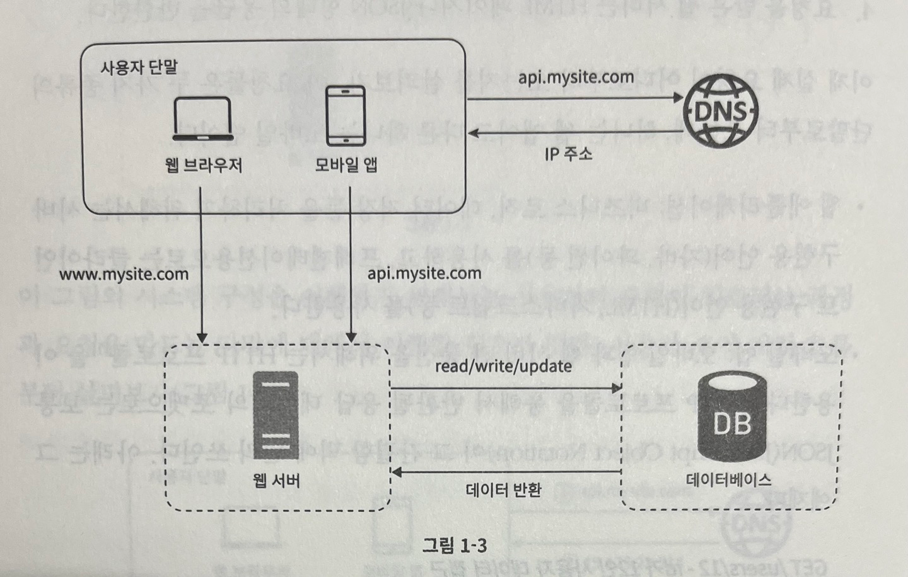
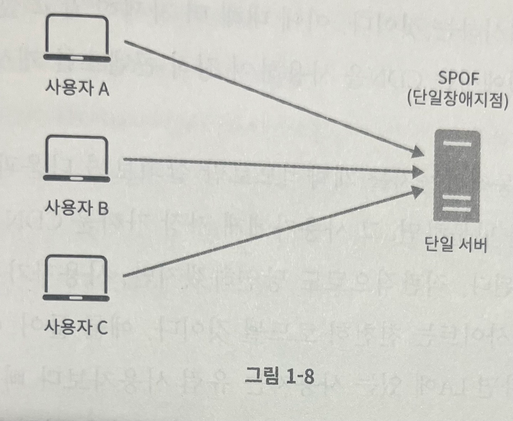

## 사용자 수에 따른 규모 확장성

> 목표 : 한 명의 사용자를 지원하는 시스템에서 시작하여, 최종적으로는 몇백만 사용자를 지원하는 시스템 설계

> 단일 서버

- 모든 컴포넌트가 단 한 대의 서버에서 실행되는 간단한 시스템부터 설계
  - 웹 서버, 데이터베이스, 캐시 등 모두 하나의 서버에서 실행 가정

> 사용자 요청 처리 흐름

1. 사용자는 도메인 이름 (api.mysite.com) 을 이용하여 웹사이트에 접속
   - 접속을 위해서는 도메인 이름을 DNS 에 질의하여 IP 주소로 변환하는 과정 필요
2. DNS 조회 결과로 IP 주소 반환 (15.125.23.214)
3. 해당 IP 주소 (웹 서버)로 HTTP 요청 전달
4. 요청을 받은 웹 서버는 HTML 페이지나 JSON 형태 등의 응답 반환

> 데이터베이스

- 사용자가 증가하면, 서버 하나로는 충분하지 않아서 여러 서버를 두어야 함
- 하나는 웹/모바일 트래픽 처리 용도
- 또다른 하나는 데이터베이스 처리 용도
- 웹/모바일 트래픽 처리 서버와 데이터베이스 서버를 분리하면 각각 독립적으로 확장해 나가는 것이 수월

> 어떤 데이터베이스를 사용할 것인가 ?

- 전통적인 관계형 데이터베이스와 비관계형 데이터베이스 사이에서 선택할 수 있음
- 비관계형 데이터베이스는 NoSQL 이라고도 부르며, `키-값 저장소 (key-value store)`, `그래프 저장소 (graph store)`, `컬럼 저장소 (column store)`, `문서 저장소 (document store)` 4가지로 분류 가능
- 대부분의 개발자에게는 40년 이상 잘 사용된 관계형 데이터베이스가 최선이겠지만, 구축하고자 하는 시스템에 적합하지 않을 수 있기 때문에 관계형 데이터베이스 이외의 저장소도 고려 필요

> 비관계형 데이터베이스가 바람직한 선택일 수 있는 경우

1. 아주 낮은 응답 지연시간 (latency) 이 요구되는 경우
2. 다루는 데이터가 비정형 (unstructured) 이라 관계형 데이터가 아닌 경우
3. 데이터 (JSON, YAML, XML 등) 를 직렬화하거나 역직렬화 할 수 있기만 하면 되는 경우
4. 아주 많은 양의 데이터를 저장할 필요가 있는 경우

> 수직적 규모 확장 vs 수평적 규모 확장

- 수직적 규모 확장 (vertical scaling)
  - 일반적으로 `스케일 업(scale up)` 이라고도 하는 수직적 규모 확장은 `고사양 자원(CPU, RAM 등)` 을 추가하는 행위
- 수평적 규모 확장 (horizontal scaling)
  - 더 많은 서버를 추가하여 성능을 개선하는 행위
- 서버로 유입되는 트래픽의 양이 적을 경우, `수직적 확장`이 좋은 선택이며, 가장 큰 장점은 `단순함` 하지만, 심각한 단점 존재
  1. 한 대의 서버에 CPU 나 메모리를 무한대로 증설할 방법은 없음
  2. 장애에 대한 자동 복구 (failover) 방안이나 다중화 (redundancy) 방안을 제시하지 않음
     - 서버에 장애 발생 시, 웹사이트/앱은 완전히 중단
- 위와 같은 수직적 규모 확장의 단점 때문에 대규모 어플리케이션을 지원하는 데는 `수평적 규모 확장법`이 보다 적절

> 단일 서버 운영 시 문제점

1. 웹 서버 다운 시 웹사이트 접속 불가
2. 많은 사용자가 접속할 경우, 웹 서버가 한계 상황에 도달하게 되면 `응답 속도가 느려`지거나 `서버 접속이 불가능` 할 수 있음

- 이러한 문제점 해결을 위해 `부하 분산기` 또는 `로드밸런서 (load balancer)` 도입이 최선

> 로드밸런서

- 로드밸런서는 `부하 분산 집합 (load balancing set)`에 속한 웹 서버들에게 트래픽 부하를 고르게 분산하는 역할

- 사용자는 로드밸런서의 `공개 IP 주소 (Public IP)`로 접속
  - 웹 서버가 클라이언트의 접속을 직접 처리하지 않음
- 더 나은 보안을 위하여 서버 간 통신에는 `사설 IP 주소 (Private IP)` 로 통신
  - 사설 IP 주소는 `같은 네트워크에 속한 서버 사이의 통신에만 사용 가능한 IP` 로 인터넷을 통해서는 접속 불가
- 로드밸런서 사용 시 자동복구 및 가용성 향상
  1. 서버 1 다운 시, 모든 트래픽은 서버 2로 전송되기 때문에 사이트 전체가 다운되는 상황 방지 가능
  2. 트래픽 증가 시, 로드밸런서를 통하여 웹 사이트에 부하 분산 가능

> 데이터베이스 다중화

- 보통은 서버 사이에 `주(master)-부(slave)` 관계 설정 후 `데이터 원본은 주 서버`에 `사본은 부 서버에 저장`하는 방식 사용
- 주 서버 (master)
  - 쓰기 연산만 지원
- 부 서버 (slave)
  - 읽기 연산만 지원
- 대부분의 어플리케이션은 `읽기 연산의 비중이 쓰기 연산의 비중 보다 높음`
  - 따라서, 일반적으로 부 데이터베이스의 수가 주 데이터베이스의 수보다 많음
- 장점
  1. 더나은 성능
     - 주-부 다중화 모델에서 모든 데이터 변경 연산은 주 데이터베이스 서버로만 전달되며, 읽기 연산은 부 데이터베이스 서버들로 분산
     - 병렬 처리 질의 (query) 수가 늘어나므로 성능 향상
  2. 안정성
     - 자연 재해 등의 이유로 데이터베이스 서버 가운데 일부가 파괴되어도 데이터 보존 가능 (데이터를 지역적으로 떨어진 여러 장소에 다중화)
  3. 가용성
     - 데이터를 여러 지역에 복제해둠으로써, 하나의 데이터베이스 서버에 장애가 발생하더라도 다른 서버에 있는 데이터를 가져와서 계속해서 서비스 가능

> 데이터베이스 서버 가운데 하나가 다운되면 어떻게 될까 ?

1. 주 데이터베이스 서버 1대, 부 데이터베이스 서버가 1대인 경우
   - 읽기 연산은 일시적으로 모두 주 데이터베이스로 전달 / 즉시 새로운 부 데이터베이스 서버가 장애 서버 대체
2. 주 데이터베이스 서버 1대, 부 데이터베이스 서버가 여러 대인 경우
   - 읽기 연산은 나머지 부 데이터베이스 서버들로 분산 / 새로운 부 데이터베이스 서버가 장애 서버 대체
3. 주 데이터베이스 서버 1대, 부 데이터베이스 서버 1대인 상황에서 주 데이터베이스 서버가 다운되는 경우
   - 부 데이터베이스 서버가 새로운 주 데이터베이스 서버로 승격 및 모든 데이터베이스 연산은 일시적으로 새로운 주 데이터베이스 서버에서 수행
   - 이후 새로운 부 데이터베이스 서버 추가 (주 데이터베이스 서버에서 수행하던 읽기 연산을 새로 추가된 부 데이터베이스 서버에서 수행)
     - 운영 환경에서는 부 데이터베이스 서버의 데이터가 최신 상태가 아닐 수 있기 때문에 싱크가 맞지 않는 데이터는 `복구 스크립트 (recovery script)` 수행 필요
     - `다중 마스터 (multi-masters)` 또는 `원형 다중화 (circular replication)` 방식 도입 시 이러한 상황에 극복 가능

- 로드밸런서와 데이터베이스 다중화를 고려한 설계
  1. DNS 로부터 `로드밸런서`의 공개 IP 주소를 받음
  2. 사용자는 해당 IP 주소를 사용하여 로드밸런서에 접속
  3. HTTP 요청은 서버1 또는 서버2 로 전달
  4. 웹 서버는 사용자의 데이터를 부 데이터베이스 서버에서 조회
  5. 웹 서버는 데이터 변경 연산은 주 데이터베이스 서버로 전달 (데이터 추가, 삭제, 갱신)

> 캐시

- 캐시는 값비싼 연산 결과 또는 자주 참조되는 데이터를 메모리 안에 두고, 뒤 이은 요청이 보다 빨리 처리될 수 있도록 하는 저장소

- 캐시 계층

  - 캐시 계층은 데이터가 잠시 보관되는 곳으로 데이터베이스 보다 훨씬 빠름
  - 별도 캐시 계층을 두면, `성능 개선`, `데이터베이스 부하 감소`, `캐시 계층 규모 독립적 확장` 가능
- 캐시 사용 시 유의할 점

  1. 캐시는 어떤 상황에 바람직한가 ?
     - `데이터 갱신은 자주 일어나지 않지만, 참조는 빈번하게 일어나는 경우` 고려
  2. 어떤 데이터를 캐시에 두고 사용해야 하는가 ?
     - 캐시는 데이터를 `휘발성 메모리` 에 저장하기 떄문에, 영속적으로 보관할 데이터를 캐시에 저장하는 것은 바람직하지 않음
     - 중요한 데이터는 `지속적 저장소 (persistent data store)` 에 저장하는 것이 바람직
  3. 캐시에 보관된 데이터는 어떻게 만료 (expire) 되는가 ?
     - 만료된 데이터는 캐시에서 삭제되어야 함 (만료 정책이 없는 경우, 데이터는 캐시에 계속 남아있게 됨)
     - 만료 기한이 짧은 경우, `DB 를 자주 조회`하며, 만료 기한이 길 경우, `원본과 차이가 날 가능성이 높아짐`
  4. 일관성 (consistency) 은 어떻게 유지되는가 ?
     - 일관성은 데이터 저장소의 원본과 캐시 내의 사본이 같은 지에 대한 여부
     - `저장소의 원본을 갱신하는 연산과 캐시를 갱신하는 연산이 단일 트랜잭션으로 처리되지 않는 경우, 일관성이 깨질 수 있음`
  5. 장애 대처를 어떻게 할 것인가 ?
     - 캐시 서버를 1대만 사용하는 경우, 캐시 서버는 `단일 장애 지점 (Single Point of Failure, SPOF)` 이 될 가능성이 있음

       > 단일 장애 지점 : 어떤 특정 지점에서의 장애가 전체 시스템의 동작을 중단시켜버릴 수 있는 경우
       >
       > - 
       >
     - 결과적으로, SPOF 를 피하기 위해서는 `여러 지역에 걸쳐 캐시 서버 분산` 필요
  6. 캐시 메모리는 얼마나 크게 잡을 것인가 ?
     - 캐시 메모리가 너무 작은 경우, 엑세스 패턴에 따라서는 데이터가 너무 자주 캐시에서 밀려나므로 (eviction) 캐시 성능이 떨어짐
       - 이를 방지하기 위한 한가지 방법은 캐시 메모리를 과할당 (overprovision) 하는 것
  7. 데이터 방출 (eviction) 정책은 무엇인가 ?
     - 캐시가 꽉 찬 경우, 추가로 캐시에 데이터를 넣으려면 기존 데이터 방출 필요 (캐시 데이터 방출 정책)
       - 자주 사용되는 정책

         > LRU (Least Recently Used) : 마지막으로 사용된 시점이 가장 오래된 데이터를 내보내는 정책
         > LFU (Least Frequently Used) : 사용 빈도가 가장 낮은 데이터를 내보내는 정책
         > FIFO (First In First Out) : 가장 먼저 캐시에 들어온 데이터를 가장 먼저 내보내는 정책
         >

> 콘텐츠 전송 네트워크 (CDN)

- CDN 은 정적 콘텐츠를 전송하는 데 쓰이는 지리적으로 분산된 서버의 네트워크
- CDN 의 개략적 동작 방법

  - 클라이언트가 웹 사이트 방문 시, `사용자에게서 가장 가까운 CDN 서버가 정적 콘텐츠를 전달`
  - 사용자가 CDN 서버로부터 멀면 멀수록 웹사이트는 천천히 로드

  > CDN 이 사이트 로딩 시간을 어떻게 개선하는지 보여주는 예
  >

  - 

> CDN 동작 방식

- 

  1. 사용자 A 가 이미지 URL 을 이용해 image.png 접근 (URL 의 도메인은 CDN 서비스 사업자 제공 - 클라우드프론트/아카마이 등)
  2. CDN 서버의 캐시에 해당 이미지가 없는 경우, 원본 (origin) 서버에 요청하여 파일 조회 (웹 서버/온라인 저장소 등)
  3. 원본 서버가 파일을 CDN 서버에 반환

  - 응답 HTTP 헤더 : TTL (Time To Live) 포함

  4. CDN 서버는 파일을 캐시하고 사용자 A 에게 반환

  - 이미지는 TTL 에 명시된 시간이 끝날 때까지 캐시

  5. 사용자 B가 같은 이미지에 대한 요청을 CDN 서버에 전송
  6. 만료되지 않은 이미지에 대한 요청은 캐시를 통해 처리

> CDN 사용 시 고려 사항

1. 비용
   - 자주 사용되지 않는 콘텐츠를 캐싱하는 것은 비용 낭비이므로 CDN 에서 제외 필요
2. 적절한 만료 시한 (TTL) 설정
   - TTL 이 너무 길면 콘텐츠의 신선도가 떨어지고, 너무 짧으면 원본 서버에 빈번히 접속하게 되므로 좋지 않음
3. CDN 장애 시 대처 방안
   - CDN 자체가 다운 됐을 경우, 해당 문제를 감지하여 원본 서버로부터 직접 콘텐츠를 가져오도록 클라이언트를 구성하는 것이 필요
4. 콘텐츠 무효화
   - 아직 만료되지 않은 콘텐츠라고 하더라도 아래 방법을 통해 CDN 에서 제거 가능
     1. `CDN 서비스 사업자가 제공하는 API 사용`
     2. 콘텐츠의 다른 버전을 서비스하도록 `오브젝트 버저닝` 이용

- 

> 변화된 부분

1. 정적 콘텐츠를 CDN 을 통해 제공하여 더 나은 성능 보장
2. 캐시 사용을 통해 데이터베이스 부하 감소

> 무상태 (stateless) 웹 계층

- 웹 계층을 수평적으로 확장하는 방법을 고민해 볼 순서로, 이를 위해서는 `상태 정보 (사용자 세션 데이터 등)를 웹 계층에서 제거`해야 함
  - 바람직한 전략은 상태 정보를 데이터베이스에 저장하고 필요할 때 가져오도록 하는 것
  - 이와 같이 구성된 웹 계층을 `무상태 웹 계층`이라고 지칭

> 상태 정보 의존적인 아키텍처

- 상태 정보를 보관하는 서버는 클라이언트 정보, 즉 상태를 유지하여 `요청들 사이에 공유`되도록 함
  - 하지만, 무상태 서버에는 이러한 장치가 없음
- 상태 정보 의존적인 아키텍처
  - 지
  - 사용자 A의 세션 정보나 프로파일 이미지 같은 상태 정보는 서버 1에 저장
  - 사용자 A를 인증하기 위해 HTTP 요청은 반드시 서버 1로 전송 필요
  - 사용자 A를 인증하기 위한 HTTP 요청 요청이 서버 2나 3로 전송될 경우 실패 (사용자 A의 인증 정보는 서버 1에만 저장되어 있기 때문)
    - 문제 : 같은 클라이언트로부터의 요청이 항상 같은 서버로 전송되어야 함
      - 대부분의 로드밸런서에서 이러한 문제를 해결하기 위해 `고정 세션 (sticky session)` 이라는 기능 제공
      - 하지만, 고정 세션은 로드밸런서에 부담

> 무상태 아키텍처

- 
- 위 구조는 사용자로부터의 HTTP 요청을 어떠한 웹 서버로도 전달 가능하며, 상태 정보 필요 시, `공유 저장소 (shared storage)` 로부터 데이터 조회
- 상태 정보는 웹 서버로부터 `물리적으로 분리`
  - 장점 : 단순함, 안정적, 규모 확장 쉬움

> 무상태 웹 계층을 갖춘 기존 설계 변경 아키텍처

- 
- 상태 정보 저장을 위한 공유 저장소 사용 : 예제에서는 NoSQL 사용
- `자동 규모 확장 (auto scaling)` 은 트래픽 양에 따라 웹 서버를 자동으로 추가하거나 삭제하는 기능 의미

  - 상태 정보가 웹 서버들로부터 제거되었으므로, 트래픽 양에 따라 웹 서버를 추가하거나 제거하여 자동으로 규모 확장 가능
- 서비스가 고성장 하여 `글로벌 서비스`로 발전한다면, 전 세계 어디서도 쾌적하게 사용 가능하도록 `여러 데이터 센터`를 지원하는 것이 필수

> 데이터 센터

- 
- 위 아키텍처는 2개의 데이터 센터를 이용하는 사례
- 장애가 없는 상황에서 사용자는 `가장 가까운 데이터 센터로 연결`

  - 일반적으로 이러한 절차를 `지리적 라우팅 (GEO-DNS-Routing 또는 GEO-Routing)` 이라고 지칭
- 지리적 라우팅

  - `사용자의 위치에 따라 도메인 이름을 어떤 IP 주소로 변환할지 결정할 수 있도록 해 주는 DNS 서비스`

> 데이터 센터 장애 발생

- 
- 데이터 센터 중 하나에 심각한 장애 발생 시 모든 트래픽은 장애가 없는 데이터 센터로 전송

  - 예제 : 데이터 센터 2 (US-West) 장애 발생으로 모든 트래픽이 데이터 센터 1 (US-East) 로 전송
- 다중 데이터 센터 아키텍처 설계 시 기술적 난제

  1. `트래픽 우회`
     - 올바른 데이터 센터로 트래픽을 보내는 효과적인 방법 필요 (GeoDNS 는 사용자에게서 가장 가까운 데이터 센터로 트래픽을 보낼 수 있도록 해줌)
  2. `데이터 동기화`
     - 데이터 센터마다 별도의 데이터베이스를 사용하고 있는 상황인 경우, 장애가 자동으로 복구되어 트래픽이 다른 데이터베이스로 우회되더라도 해당 데이터 센터에는 찾으려는 데이터가 없을 수 있음
       - 해결 방법 : 데이터를 여러 데이터 센터에 걸쳐 다중화
  3. `테스트 및 배포`
     - 어플리케이션을 여러 위치에서 테스트해보는 것이 중요

> 메시지 큐

- 
- 메시지 큐는 `메시지의 무손실을 보장`하는 비동기 통신을 지원하는 컴포넌트

  - 메시지 무손실 : 메시지 큐에 보관된 메시지는 소비자가 꺼낼 때까지 안전하게 보관된다는 특성
- 장점

  - 서비스 또는 서버 간 결합이 느슨해짐
    - 생산자는 소비자 프로세스가 다운되어 있어도 메시지 발행 가능
    - 소비자는 생산자 서비스가 가용한 상태가 아니더라도 메시지 수신 가능
- 예

  - 사진 보정 작업
    - 보정 작업이 오래 걸리는 비즈니스라고 가정 시, 웹 서버에서는 요청을 메시지 큐에 전송하고, 실제 사진 보정 프로세싱을 하는 어플리케이션에서는 메시지 큐에서 메시지를 꺼내서 비동기적으로 처리
  - 
    - 큐의 크기가 커지면, 더 많은 작업 프로세스를 추가해야 처리 시간을 줄일 수 있음

> 로그, 메트릭, 자동화

1. 로그
   - 시스템의 오류와 문제들을 보다 쉽게 찾아낼 수 있기 때문에 에러 로그 모니터링은 중요
   - 에러 로그는 서버 단위로 모니터링 할 수도 있지만, `로그를 단일 서비스로 모아주는 도구를 활용`하면 편리하게 검색 및 조회 가능
2. 메트릭
   - 메트릭을 잘 활용하면, `시스템의 현재 상태`를 손쉽게 파악 가능
     2-1. 호스트 단위 메트릭

     - CPU, 메모리, 디스크 I/O 등 메트릭

     2-2. 종합 메트릭 (aggregated)

     - 데이터베이스 계층의 성능, 캐시 계층의 성능 등

     2-3. 핵심 비즈니스 메트릭

     - 일별 능동 사용자 (daily active user), 수익 (revenue), 재방문 (retention) 등
3. 자동화
   - 지속적 통합 (CI) 을 도와주는 도구 (Jenkins, Bamboo, Github Action 등)

> 메시지 큐, 로그, 메트릭, 자동화 등을 반영한 설계

- 

> 데이터베이스의 규모 확장

- 저장할 데이터가 많아지면, 데이터베이스에 대한 부하도 증가
- 데이터베이스 규모를 확장하는 2가지 방법

> 수직적 확장

- 기존 서버에 더 많은 고성능의 자원 (CPU, RAM, 디스크 등)을 증설하는 방법
- 단점

  - 하드웨어 한계로 인한 자원 무한 증설 불가
  - SPOF 로 인한 위험성
  - 고비용

> 수평적 확장

- 
- 데이터베이스의 수평적 확장은 `샤딩 (sharding)` 이라고도 하며, 더 많은 서버를 추가함으로 써 성능 향상
- 샤딩은 대규모 데이터베이스를 `샤드 (shard)` 라고 부르는 작은 단위로 분할하는 기술

  - 모든 샤드는 `같은 스키마를 사용`하지만, 샤드에 보관되는 데이터 사이에는 `중복이 없음`
  - 
    - 사용자 데이터를 어떤 샤드에 넣을지는 해시를 통해 결정
    - 예제에서는 user_id % 4 를 통해 해시 함수를 사용하여 데이터가 보관되는 샤드 결정

> 샤딩 전략 구현 시 중요 고려 사항

- `샤딩 키 (sharding key)`는 `파티션 키 (partition key)` 라고도 부르는데, 데이터가 어떻게 분산될 지 결정하는 하나 이상의 컬럼으로 구성
  - 위 예제에서의 샤딩 키는 `user_id`
  - 샤딩 키를 통하여 올바른 데이터베이스에 질의를 보내어 데이터 조회나 변경을 처리하므로 효율을 높일 수 있음

1. 데이터 재샤딩 (re-sharding)

   - 데이터 재샤딩이 필요한 경우
     1-1. `데이터가 너무 많아져서` 하나의 샤드로는 더 이상 감당하기 어려운 경우
     1-2. 샤드 간 데이터 분포가 균등하지 못하여 `특정 샤드에 할당된 공간 소모가 다른 샤드에 비하여 빨리 진행`되는 경우 (샤드 소진)
     - 해결 : 샤드 키를 계산하는 함수 변경 및 데이터 재배치 필요 (`안정 해시` 기법을 통해 해결 가능)
2. 유명 인사 문제

   - 핫스팟 키 (hotspot key) 문제라고도 부르며, 특정 샤드에 질의가 집중되어 서버에 과부하가 걸리는 문제
   - 특정 유명 인사가 (예 : 저스틴 비버, 레이디 가가 등) 모두 같은 샤드에 저장되는 데이터베이스가 있다고 가정
     - 특정 샤드에 유명 인사들의 데이터가 집중되어 있으므로 read 연산 시 과부하 발생
       - 해결 : 유명 인사의 샤드를 `각각 하나씩 할당`하거나 더 잘게 분리해야 할수도 있음
3. 조인과 비정규화

   - 하나의 데이터베이스를 여러 샤드 서버로 분리하면, `여러 샤드에 걸친 데이터를 조인하기가 힘듬`
     - 해결 : 데이터베이스를 비정규화하여 하나의 테이블에서 질의가 수행될 수 있도록 함

> 샤딩을 적용하여 개선한 아키텍처

- 

> 정리

1. 웹 계층은 무상태 계층으로 전환
2. 모든 계층에 다중화 도입
3. 가능한 많은 데이터 캐시
4. 여러 데이터 센터 지원
5. 정적 콘텐츠는 CDN 을 통해 서비스
6. 데이터 계층은 샤딩을 통해 그 규모를 확장할 것
7. 각 계층은 독립적 서비스로 분할할 것
8. 시스템을 지속적으로 모니터링하고, 자동화 도구들을 활용할 것
