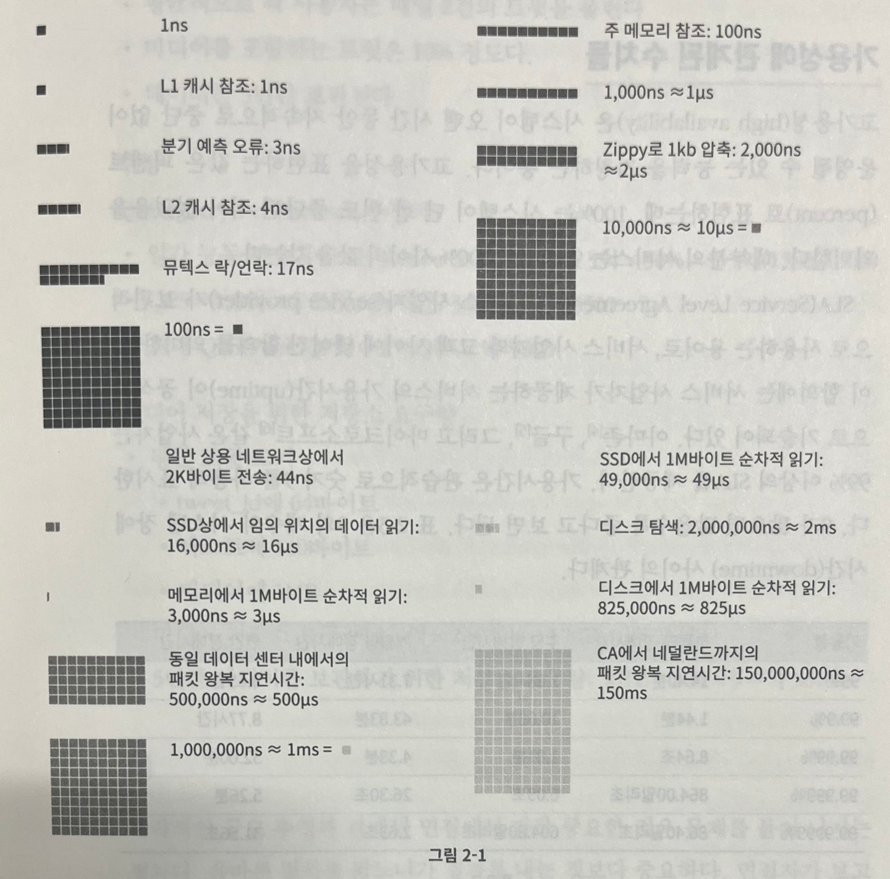

## 개략적인 규모 측정

- 구글의 시니어 펠로 (Senior Fellow) 제프 딘 (Jeff Dean) 에 따르면, `'개략적인 규모 추정' 은 보편적으로 통용되는 성능 수치상에서 사고 실험을 행하여 추정치를 계산하는 행위로서, 어떤 설계가 요구사항에 부합할 것인지 보기 위함`이라고 정의

> 2의 제곱수

- 분산 시스템에서 다루는 데이터 양은 엄청나게 커질 수 있으나 그 계산법은 기본을 크게 벗어나지 않음

  - 제대로 된 계산 결과를 얻기 위해ㅔ서는 데이터 볼륨의 단위를 `2의 제곱수` 로 표현하면 어떻게 되는지 우선 알아야 함
- `최소 단위는 1바이트`이고, `8비트`로 구성

  - ASCII 문자 하나가 차지하는 메모리 크기는 1바이트
- 흔히 쓰이는 데이터 볼륨 단위

  | 2의 x 제곱 | 근사치               | 이름                   | 축약형 |
  | ------------ | ---------------------- | ------------------------ | -------- |
  | 10         | 1천 (thousand)       | 1킬로바이트 (Kilobyte) | 1KB    |
  | 20         | 1백만 (million)      | 1메가바이트 (Megabyte) | 1MB    |
  | 30         | 10억 (billion)       | 1기가바이트 (Gigabyte) | 1GB    |
  | 40         | 1조 (trillion)       | 1테라바이트 (Terabyte) | 1TB    |
  | 50         | 1000조 (quadrillion) | 1페타바이트 (Petabyte) | 1PB    |

> 모든 프로그래머가 알아야 하는 응답지연 값

- 구글의 제프 딘은 2010년에 통상적인 컴퓨터에서 구현된 연산들의 응답지연 값을 공개
- 이들 중 몇몇은 더 빠른 컴퓨터가 등장하며, 더 이상 유효하지 않게 되었지만 아직도 이 수치들은 컴퓨터 연산들의 처리 속도가 어느 정도인지 짐작 가능하게 도와줌

  | 연산명                                                      | 시간                  |
  | ------------------------------------------------------------- | ----------------------- |
  | L1 캐시 참조                                                | 0.5ns                 |
  | 분기 예측 오류 (branch miss predict)                        | 5ns                   |
  | L2 캐시 참조                                                | 7ns                   |
  | 뮤택스 (mutex) 락/언락                                      | 100ns                 |
  | 주 메모리 참조                                              | 100ns                 |
  | Zippy 로 1KB 압축                                           | 10,000ns = 10us       |
  | 1Gbps 네트워크로 2KB 전송                                   | 20,000ns = 20us       |
  | 메모리에서 1MB 순처작으로 read                              | 250,000ns = 250us     |
  | 같은 데이터 센터 내에서의 메시지 왕복 지연시간              | 500,000ns = 500us     |
  | 디스크 탐색 (seek)                                          | 10,000,000ns = 10ms   |
  | 네트워크에서 1MB 순차적으로 read                            | 10,000,000ns = 10ms   |
  | 디스크에서 순차적으로 read                                  | 30,000,000ns = 30ms   |
  | 한 패킷의 CA(캘리포니아)로부터 네덜란드까지의 왕복 지연시간 | 150,000,000ns = 150ms |
- 구글의 한 엔지니어가 시각화하기 위해 개발한 도구를 통해 2020년 기준으로 시각화한 수치

- 위에서 제시된 수치들을 기준으로 분석한 결과 결론
  1. 메모리는 빠르지만, `디스크는 아직도 느리다`
  2. `디스크 탐색(seek)은 가능한 한 피하라`
  3. 단순한 `압축 알고리즘은 빠르다`
  4. `데이터를 인터넷으로 전송하기 전에 가능하면 압축`하라
  5. 데이터 센터는 보통 여러 지역에 분산되어 있고, `센터들 간에 데이터를 주고받는 데는 시간이 걸린다`

> 가용성에 관계된 수치들

- 고가용성 (high availability) 은 `시스템이 오랜 시간 동안 지속적으로 중단 없이 운영될 수 있는 능력`을 지칭하는 용어

  - 고가용성을 표현하는 값은 `퍼센트 (percent)` 로 표현하며, 100%는 시스템이 단 한 번도 중단된 적 없음을 의미
  - 대부분의 서비스는 `99% ~ 100%` 사이의 값을 가짐
- SLA (Service Level Agreement)  는 서비스 사업자 (service provider)가 보편적으로 사용하는 용어로, 서비스 사업자와 고객 사이에 맺어진 합의를 의미

  - `SLA 에는 서비스 사업자가 제공하는 서비스의 가용시간 (uptime) 이 공식적으로 기술`되어 있음
  - 관습적으로 숫자 9를 사용하여 표시하며, 9가 많을수록 좋은 서비스로 봄

  | 가용률 | 하루당 장애시간 | 주당 장애시간 | 개월당 장애시간 | 연간 장애시간 |
  | -------- | ----------------- | --------------- | ----------------- | --------------- |
  | 99%    | 14.40분         | 1.68시간      | 7.31시간        | 3.65일        |
  | 99.9%    | 1.44분         | 10.08분     | 43.83분        | 8.77시간        |
  | 99.99%    | 8.64초         | 1.01분     | 4.38분        | 52.60분        |
  | 99.999%    | 864.00밀리초         | 6.05초     | 26.30초        | 5.26분        |
  | 99.9999%    | 86.40밀리초         | 604.80밀리초     | 2.63초        | 31.56초        |

> 예제 : 트위터 QPS 와 저장소 요구량 측정

- 가정
    - 월간 능동 사용자 (monthly active user) 는 3억 (300 million) 명
    - 50% 의 사용자가 트위터를 매일 사용한다
    - 평균적으로 각 사용자는 매일 2건의 트윗을 올린다
    - 미디어를 포함하는 트윗은 10% 정도이다
    - 데이터는 5년간 보관된다

- 추정
    > QPS (Query Per Second) 추정치

    - 일간 능동 사용자 (Daily Active User, DAU) = 3억 x 50% = 1.5억 (150 million)
    - QPS = 1.5억 x 2 트윗 / 24시간 / 3600초 = 약 3500
    - 최대 QPS (Peek QPS) = 2 x QPS = 약 7000

- 미디어 저장을 위한 저장소 요구량
    - 평균 트윗 크기
        - tweet_id 에 64 바이트
        - 텍스트에 140 바이트
        - 미디어에 1MB
    - 미디어 저장소 요구량
        - 1.5억 x 2 x 10% x 1MB = 30TB/일
    - 5년 간 미디어를 보관하기 위한 저장소 요구량
        - 30TB * 365 * 5 = 약 55PB

> 팁

1. 근사치를 활용한 계산
    - 면접장에서 복잡한 계산을 하는 것을 어려운 일이다
        - 예를 들어, '99987 / 9.1 의 계산 결과는 무엇인가 ?' 그러나 이런 데 시간을 쓰는 것은 낭비
        - 계산 결과의 정확함을 평가하는 것이 목적이 아니므로 적절한 근사치를 활용하여 시간을 절약하자
        - 위 수식은 '100,000 / 10' 으로 간소화 할 수 있다
2. 가정들은 적어두자
    - 나중에 다시 살펴볼 수 있어야 한다
3. 단위 (unit) 을 붙여라
    - 5라고만 적어두면, 5KB 인지 5MB 인지 나중에는 나조차 알아보기 힘들다
    - 단위를 붙이는 습관을 들여두면 모호함을 방지할 수 있다
4. 많이 출제되는 개략적 규모 추정 문제는 `QPS`, `최대 QPS`, `저장소 요구량`, `캐시 요구량`, `서버 수` 등을 추정하는 것

## 개략적인 규모 측정

- 구글의 시니어 펠로 (Senior Fellow) 제프 딘 (Jeff Dean) 에 따르면, `'개략적인 규모 추정' 은 보편적으로 통용되는 성능 수치상에서 사고 실험을 행하여 추정치를 계산하는 행위로서, 어떤 설계가 요구사항에 부합할 것인지 보기 위함`이라고 정의

> 2의 제곱수

- 분산 시스템에서 다루는 데이터 양은 엄청나게 커질 수 있으나 그 계산법은 기본을 크게 벗어나지 않음

  - 제대로 된 계산 결과를 얻기 위해ㅔ서는 데이터 볼륨의 단위를 `2의 제곱수` 로 표현하면 어떻게 되는지 우선 알아야 함
- `최소 단위는 1바이트`이고, `8비트`로 구성

  - ASCII 문자 하나가 차지하는 메모리 크기는 1바이트
- 흔히 쓰이는 데이터 볼륨 단위

  | 2의 x 제곱 | 근사치               | 이름                   | 축약형 |
  | ------------ | ---------------------- | ------------------------ | -------- |
  | 10         | 1천 (thousand)       | 1킬로바이트 (Kilobyte) | 1KB    |
  | 20         | 1백만 (million)      | 1메가바이트 (Megabyte) | 1MB    |
  | 30         | 10억 (billion)       | 1기가바이트 (Gigabyte) | 1GB    |
  | 40         | 1조 (trillion)       | 1테라바이트 (Terabyte) | 1TB    |
  | 50         | 1000조 (quadrillion) | 1페타바이트 (Petabyte) | 1PB    |

> 모든 프로그래머가 알아야 하는 응답지연 값

- 구글의 제프 딘은 2010년에 통상적인 컴퓨터에서 구현된 연산들의 응답지연 값을 공개
- 이들 중 몇몇은 더 빠른 컴퓨터가 등장하며, 더 이상 유효하지 않게 되었지만 아직도 이 수치들은 컴퓨터 연산들의 처리 속도가 어느 정도인지 짐작 가능하게 도와줌

  | 연산명                                                      | 시간                  |
  | ------------------------------------------------------------- | ----------------------- |
  | L1 캐시 참조                                                | 0.5ns                 |
  | 분기 예측 오류 (branch miss predict)                        | 5ns                   |
  | L2 캐시 참조                                                | 7ns                   |
  | 뮤택스 (mutex) 락/언락                                      | 100ns                 |
  | 주 메모리 참조                                              | 100ns                 |
  | Zippy 로 1KB 압축                                           | 10,000ns = 10us       |
  | 1Gbps 네트워크로 2KB 전송                                   | 20,000ns = 20us       |
  | 메모리에서 1MB 순처작으로 read                              | 250,000ns = 250us     |
  | 같은 데이터 센터 내에서의 메시지 왕복 지연시간              | 500,000ns = 500us     |
  | 디스크 탐색 (seek)                                          | 10,000,000ns = 10ms   |
  | 네트워크에서 1MB 순차적으로 read                            | 10,000,000ns = 10ms   |
  | 디스크에서 순차적으로 read                                  | 30,000,000ns = 30ms   |
  | 한 패킷의 CA(캘리포니아)로부터 네덜란드까지의 왕복 지연시간 | 150,000,000ns = 150ms |
- 구글의 한 엔지니어가 시각화하기 위해 개발한 도구를 통해 2020년 기준으로 시각화한 수치

- 위에서 제시된 수치들을 기준으로 분석한 결과 결론
  1. 메모리는 빠르지만, `디스크는 아직도 느리다`
  2. `디스크 탐색(seek)은 가능한 한 피하라`
  3. 단순한 `압축 알고리즘은 빠르다`
  4. `데이터를 인터넷으로 전송하기 전에 가능하면 압축`하라
  5. 데이터 센터는 보통 여러 지역에 분산되어 있고, `센터들 간에 데이터를 주고받는 데는 시간이 걸린다`

> 가용성에 관계된 수치들

- 고가용성 (high availability) 은 `시스템이 오랜 시간 동안 지속적으로 중단 없이 운영될 수 있는 능력`을 지칭하는 용어

  - 고가용성을 표현하는 값은 `퍼센트 (percent)` 로 표현하며, 100%는 시스템이 단 한 번도 중단된 적 없음을 의미
  - 대부분의 서비스는 `99% ~ 100%` 사이의 값을 가짐
- SLA (Service Level Agreement)  는 서비스 사업자 (service provider)가 보편적으로 사용하는 용어로, 서비스 사업자와 고객 사이에 맺어진 합의를 의미

  - `SLA 에는 서비스 사업자가 제공하는 서비스의 가용시간 (uptime) 이 공식적으로 기술`되어 있음
  - 관습적으로 숫자 9를 사용하여 표시하며, 9가 많을수록 좋은 서비스로 봄

  | 가용률 | 하루당 장애시간 | 주당 장애시간 | 개월당 장애시간 | 연간 장애시간 |
  | -------- | ----------------- | --------------- | ----------------- | --------------- |
  | 99%    | 14.40분         | 1.68시간      | 7.31시간        | 3.65일        |
  | 99.9%    | 1.44분         | 10.08분     | 43.83분        | 8.77시간        |
  | 99.99%    | 8.64초         | 1.01분     | 4.38분        | 52.60분        |
  | 99.999%    | 864.00밀리초         | 6.05초     | 26.30초        | 5.26분        |
  | 99.9999%    | 86.40밀리초         | 604.80밀리초     | 2.63초        | 31.56초        |

> 예제 : 트위터 QPS 와 저장소 요구량 측정

- 가정
    - 월간 능동 사용자 (monthly active user) 는 3억 (300 million) 명
    - 50% 의 사용자가 트위터를 매일 사용한다
    - 평균적으로 각 사용자는 매일 2건의 트윗을 올린다
    - 미디어를 포함하는 트윗은 10% 정도이다
    - 데이터는 5년간 보관된다

- 추정
    > QPS (Query Per Second) 추정치

    - 일간 능동 사용자 (Daily Active User, DAU) = 3억 x 50% = 1.5억 (150 million)
    - QPS = 1.5억 x 2 트윗 / 24시간 / 3600초 = 약 3500
    - 최대 QPS (Peek QPS) = 2 x QPS = 약 7000

- 미디어 저장을 위한 저장소 요구량
    - 평균 트윗 크기
        - tweet_id 에 64 바이트
        - 텍스트에 140 바이트
        - 미디어에 1MB
    - 미디어 저장소 요구량
        - 1.5억 x 2 x 10% x 1MB = 30TB/일
    - 5년 간 미디어를 보관하기 위한 저장소 요구량
        - 30TB * 365 * 5 = 약 55PB

> 팁

1. 근사치를 활용한 계산
    - 면접장에서 복잡한 계산을 하는 것을 어려운 일이다
        - 예를 들어, '99987 / 9.1 의 계산 결과는 무엇인가 ?' 그러나 이런 데 시간을 쓰는 것은 낭비
        - 계산 결과의 정확함을 평가하는 것이 목적이 아니므로 적절한 근사치를 활용하여 시간을 절약하자
        - 위 수식은 '100,000 / 10' 으로 간소화 할 수 있다
2. 가정들은 적어두자
    - 나중에 다시 살펴볼 수 있어야 한다
3. 단위 (unit) 을 붙여라
    - 5라고만 적어두면, 5KB 인지 5MB 인지 나중에는 나조차 알아보기 힘들다
    - 단위를 붙이는 습관을 들여두면 모호함을 방지할 수 있다
4. 많이 출제되는 개략적 규모 추정 문제는 `QPS`, `최대 QPS`, `저장소 요구량`, `캐시 요구량`, `서버 수` 등을 추정하는 것

