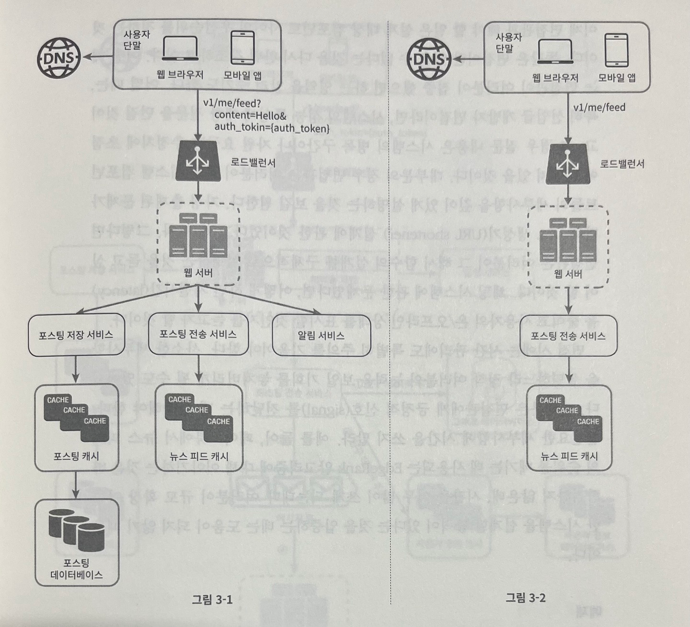
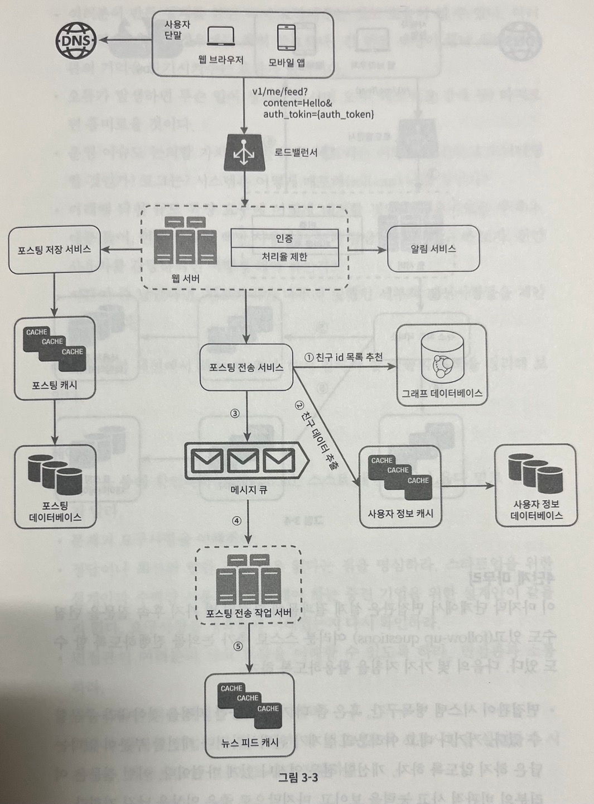
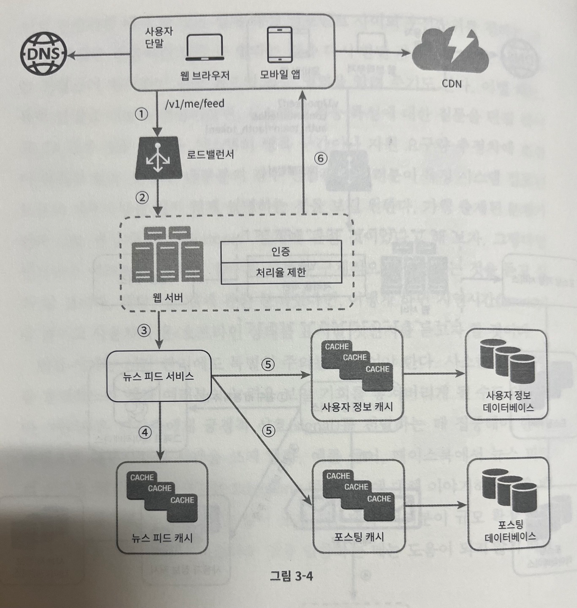

## 시스템 설계 면접 공략법

> 시스템 설계 면접은 2명의 동료가 모호한 문제를 풀기 위해 협력하여 그 해결책을 찾아내는 과정에 대한 시뮬레이션으로 정해진 결말도 정답도 없다

- 시스템 설계 면접은 면접자의 `설계 기술을 시연`하는 자리이며, `설계 과정에서 내린 결정들에 대한 방어 능력`을 보이는 자리이고, `면접관의 피드백을 건설적인 방식으로 처리`할 자질이 있음을 보이는 자리
- 면접관의 관점
  - 시스템 설계 면접이 잘 진행되면, 면접관은 지원자가 협력에 적합한 사람인지, 압박이 심한 상황도 잘 헤쳐 나갈 자질이 있는지, 모호한 문제를 건설적으로 해결할 능력이 있는지 등을 살펴볼 수 있다
  - 훌륭한 면접관은 `부정적 신호`도 놓치지 않음
    - 설계의 순수성에 집착한 나머지 `타협적 결정 (tradeoff)`을 도외시하고, `과도한 엔지니어링 (over-engineering)` 을 하고 마는 엔지니어들이 현업에도 많음
    - 이러한 엔지니어들은 과도한 엔지니어링의 결과로 시스템 전반의 비용이 올라간다는 사실을 간과하며, 그 결과로 실제 상당수 회사들은 값비싼 대가를 치르고 있음
    - 이것들 이외의 부정적 신호로는 `완고함`, `편협함` 등이 있음

> 효과적 면접을 위한 4단계 접근법

> 1단계 : 문제 이해 및 설계 범위 확정

- 시스템 설계 면접을 볼 때는 `생각 없이 바로 답을 내서는 좋은 점수를 받기 어려움`

  - 요구사항을 완전히 이해하지 않고 답을 내놓는 행위는 매우 부정적 신호
- 엔지니어가 가져야 할 가장 중요한 기술 중 하나는 `올바른 질문을 하는 것`, `적절한 가정을 하는 것`, `시스템 구축에 필요한 정보를 모으는 것`

  - 면접관이 질문을 던지면, 질문에 대한 답을 바로 하거나, 면접자 스스로 어떤 가정을 하기를 주문할 것
    - 면접관이 면접자가 가정을 하기를 주문하는 경우, 나중에 필요해질 때가 있으니 `가정을 화이트보드나 종이에 적어두자`
- 어떤 질문을 해야할까 ?

  - 요구사항을 정확히 이해하는 데 필요한 질문을 하자
    - 예 : 구체적으로 어떤 기능들을 만들어야 하는건가 ?
    - 예 : 제품 사용자 수는 얼마나 되나 ?
    - 예 : 회사의 규모는 얼마나 빨리 커질 것이라고 예상하나 ? 3달, 6달, 1년 뒤의 규모는 얼마나 될 것이라고 예상하는가 ?
    - 예 : 회사가 주로 사용하는 기술 스택은 무엇인가 ? 설계를 단순화하기 위해 활용할 수 있는 기존 서비스로는 어떤 것들이 있는가 ?
- 예제 : 뉴스 피드 시스템 설계

  - 지원자 : 모바일 앱과 웹 앱 중에서 어떤 쪽을 지원해야 하나요 ? 아니면 둘 다 지원해야 하나요 ?
  - 면접관 : 둘 다 지원해야 합니다.
  - 지원자 : 가장 중요한 기능은 무엇인가요 ?
  - 면접관 : 새로운 포스트를 작성하고, 다른 친구의 뉴스 피드를 볼 수 있도록 하는 기능입니다.
  - 지원자 : 뉴스 피드는 시간 역순으로 정렬되어야 하나요 ? 아니면 특별한 정렬 기준이 있는건가요 ? 특별한 정렬 기준이 있냐고 묻는 이뉴는, 피드에 올라갈 포스트마다 다른 가중치가 부여되어야 하는지 알고 싶어서인데, 가령 가까운 친구의 포스트가 사용자 그룹에 올라가는 포스트보다 더 중요한지를 물어보는 것입니다.
  - 면접관 : 문제를 단순하게 하기 위해 일단 시간 역순으로 정렬된다고 가정합시다.
  - 지원자 : 한 사용자는 최대 몇 명의 사용자와 친구를 맺을 수 있나요 ?
  - 면접관 : 5000명 입니다.
  - 지원자 : 사이트로 오는 트래픽 규모는 어느 정도입니까 ?
  - 면접관 : 일간 능동 사용자 (DAU) 1000만명 입니다.
  - 지원자 : 포스트에 이미지나 비디오도 게시할 수 있나요 ? 아니면 포스트는 그저 텍스트만 게시할 수 있나요 ?
  - 면접관 : 이미지나 비디오 같은 미디어 파일도 포스트 할 수 있어야 합니다.
- `요구사항을 이해`하고 `모호함`을 없애는 게 이 단계에서 가장 중요

> 2단계 : 개략적인 설계안 제시 및 동의 구하기

- 이 단계에서 초점을 맞춰야 할 부분은 `개략적인 설계안을 제시`하고, `면접관의 동의를 구하는 것`

  - 설계안 에 대한 최초 청사진을 제시하고 의견을 구하라 (면접관이 팀원인 것처럼 대하라)
    - 훌륭한 면접관은 지원자들과 대화하고 설계 과정에 개입하는 것을 즐긴다
  - 화이트보드나 핵심 컴포넌트를 포함하는 다이어그램을 그려라
    - 클라이언트, API, 웹 서버, 데이터베이스, 캐시, CDN, 메시지 큐 등
  - 최초 설계안이 시스템 규모에 관계된 제약사항들을 만족하는지를 개략적으로 계산해보자
- 예제 : 뉴스 피드 시스템 설계

  - 개략적으로 이 설계는 `피드 발행`, `피드 생성` 2가지 플로우로 나눠 생각해볼 수 있다

    - 피드 발행 : 사용자가 포스트를 게시하면, 데이터를 캐시/데이터베이스에 저장하고, 해당 사용자의 친구 뉴스 피드에 뜨게 된다
    - 피드 생성 : 어떤 사용자의 뉴스 피드는 해당 사용자의 친구들의 포스트를 시간 역순으로 정렬하여 만든다
  - 

> 3단계 : 상세 설계

- 상세 설계 단계로 왔다면, 면접자는 면접관과 아래와 같은 목표들은 달성한 상태

  1. 시스템에서 전반적으로 달성해야 할 목표와 기능 범위 확인
  2. 전체 설계의 개략적 청사진 마련
  3. 해당 청사진에 대한 면접관의 의견 청취
  4. 상세 설계에서 집중해야 할 영역 확인
- 이후 면접관과 해야 할 일은, `설계 대상 컴포넌트 사이의 우선순위를 정하는 것`

  - 대부분의 면접관은 특정 컴포넌트들의 세부사항을 깊이있게 설명하는 것을 보길 원한다
    - 예 : 단축 URL 생성기 (URL shortener) 설계인 경우, 해시 함수의 설계를 구체적으로 설명하는 것을 듣기를 원함
    - 예 : 채팅 시스템 설계인 경우, 어떻게 하면 지연시간 (latency) 을 줄이고 사용자의 온/오프라인 상태를 표시할 것인지 듣기를 원함
- 예제 : 뉴스 피드 시스템 설계

  - 뉴스 피드 시스템의 개략적 설계를 마친 상황이며, 면접관도 설계에 만족한다고 가정 시, 이제 2가지 요구사항에 대해 보다 깊이 탐구해야 함

    1. 피드 발행

    - 

    2. 뉴스 피드 가져오기

    - 

> 4단계 : 마무리

- 마지막 단계에서 면접관은 설계 결과물에 관련된 몇 가지 후속 질문을 던질 수도 있고, 면접자 스스로 추가 논의를 진행하도록 할 수도 있음 (다음 몇 가지 지침을 활용하자)
  1. 면접관이 시스템 병목구간, 혹은 좀 더 개선 가능한 지점을 찾아내라 주문 할 수 있음
     - 여기서 본인의 설계가 완벽하다거나 개선할 부분이 없다는 답은 피하자
  2. 면접자가 만든 설계를 다시 한번 요약해주는 것도 도움될 수 있다
     - 여러 해결책을 제시한 경우, 특히 중요
  3. 오류가 발생하면 무슨 일이 생기는지 (서버 오류, 네트워크 장애 등) 따져보면 흥미로울 것이다
  4. 운영 이슈도 논의할 가치가 충분하다
     - 메트릭은 어떻게 수집하여 모니터링 할 것인가 ?
     - 로그는 어떻게 수집할 것인가 ?
     - 시스템은 어떻게 배포해 나갈 것인가 ?
  5. 미래에 닥칠 규모 확장 요구에 어떻게 대처할 것인지도 흥미로운 주제이다
     - 100만명의 사용자를 기준으로 한 현재 설계에서 1000만명의 사용자를 감당하기 위해서는 어떻게 해야 하는가 ?
  6. 시간이 남았다면, 필요하지만 다루지 못했던 세부적 개선사항들을 제안 할 수 있다

> 해야 할 것

- 질문을 통해 확인하라
    - 스스로 내린 가정이 옳다고 믿고 진행하지 마라
- 문제의 요구사항을 이해하라
- 정답이나 최선의 답안 같은 것은 없다는 점을 명심하라
    - 스타트업을 위한 설계안과 수백만 사용자를 지원해야 하는 중견 기업을 위한 설계안이 같을 수 없다
    - 요구사항을 정확히 이해했는지 재확인하자
- 면접관이 여러분의 사고 흐름을 이해할 수 있도록 하라
    - 면접관과 소통하라
- 가능하다면 여러 해결 방법을 제시하라
- 개략적 설계에 면접관이 동의하면, 각 컴포넌트의 세부사항을 설명하기 시작하자
    - 가장 중요한 컴포넌트부터 진행하라
- 면접관의 아이디어를 이끌어 내라
    - 좋은 면접관은 팀원처럼 협력한다
- 포기하지 말라

> 하지 말아야 할 것

- 전형적인 면접 문제들에도 대비하지 않은 상태에서 면접장에 가지 말라
- 요구사항이나 가정들을 분명히 하지 않은 상태에서 설계를 제시하지 말라
- 처음부터 특정 컴포넌트의 세부사항을 너무 깊이 설명하지 말라
    - 개략적 설계를 마친 뒤 세부사항으로 나아가라
- 진행 중에 막혔다면, 힌트를 청하기를 주저하지 말라
- 소통을 주저하지 말라
    - 침묵 속에 설계를 진행하지 말라
- 설계안을 내놓는 순간 면접이 끝난다고 생각하지 말라
    - 면접관이 끝났다고 말하기 전까지는 끝난 것이 아니다
    - 의견을 자주 구하자

> 시간 배분

- 각 단계에서 어느 정도의 시간을 배분하는 것이 좋을까 ? (45분을 가정한 기준으로 한 대략적 추정치)
    - 1단계 : 문제 이해 및 설계 범위 확정 (3분 ~ 10분)
    - 2단계 : 개략적 설계안 제시 및 동의 구하기 (10분 ~ 15분)
    - 3단계 : 상세 설계 (10분 ~ 25분)
    - 4단계 : 마무리 (3분 ~ 5분)

