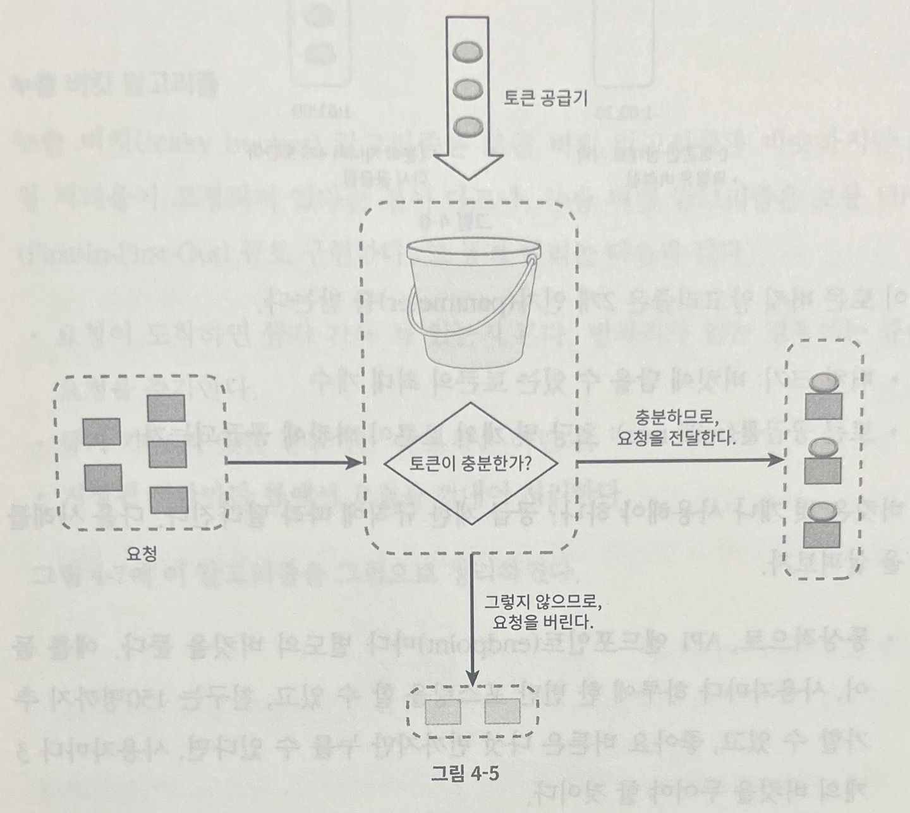
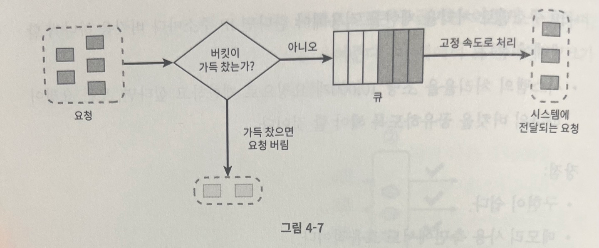

## 처리율 제한 장치의 설계

> 네트워크 시스템에서 `처리율 제한 장치 (rate limiter)` 는 클라이언트 또는 서비스가 보내는 `트래픽의 처리율 (rate) 을 제어`하기 위한 장치이다.

- 예 : HTTP 를 예로 들면, 특정 기간 내에 전송되는 클라이언트의 요청 횟수를 제한

  - API 요청 횟수가 제한 장치에 정의된 `임계치 (threshold)` 를 넘어서면 추가로 도달한 모든 호출은 처리가 `중단 (block)` 된다.
- 사례

  1. 사용자는 초당 2회 이상 새 글을 올릴 수 없다.
  2. 같은 IP 주소로는 하루에 10개 이상의 계정을 생성할 수 없다.
  3. 같은 디바이스로는 주당 5회 이상 리워드 (reward) 를 요청할 수 없다.

> API 에 처리율 제한 장치를 두면 좋은 점

1. DoS (Denial of Service) 공격에 의한 `자원 고갈 방지 (resource starvation)` 가능

   - 처리율 제한 장치는 추가 요청에 대해서는 처리를 중단함으로써 Dos 공격 방지
     1-1. 트위터는 3시간 동안 300개의 트윗만 올릴 수 있도록 제한
     1-2. Google Docs API 는 사용자당 분당 300회의 read 요청만 허용
2. `비용 절감`

   - 추가 요청에 대한 처리 제한 시, 서버를 많이 운영하지 않아도 되고, 우선순위가 높은 API 에 더 많은 자원 할당 가능
   - 3th party API (본인 인증, 신용카드 결제 등) 에 사용료를 지불하는 회사인 경우, API 에 대한 과금이 횟수에 따라 이루어진다면, API 호출 횟수를 제한할 수 있어야 비용 절감 가능
3. `서버 과부하 방지`

   - 봇 (bot) 에서 오는 트래픽이나 사용자의 잘못된 이용 패턴으로 유발된 트래픽을 걸러내는 데 처리율 제한 장치 활용 가능

### 1단계 : 문제 이해 및 설계 범위 확정

- 처리율 제한 장치 구현에는 여러 알고리즘이 사용 가능한데, 각각은 고유한 장단점이 있으므로 면접관과의 소통을 통해 분명히 하자
- 지원자 : 어떤 종류의 처리율 제한 장치를 설계해야 하나요 ? 클라이언트 측 제한 장치인가요, 서버 측 제한 장치인가요 ?
- 면접관 : 서버측 API 를 위한 장치를 설계한다고 가정합시다.
- 지원자 : 어떤 기준을 사용하여 API 호출을 제어해야 할까요 ? IP 주소를 사용해야 하나요 ? 사용자 ID 를 사용해야 하나요 ? 아니면 다른 기준이 있나요 ?
- 면접관 : 다양한 형태의 제어 규칙 (throttling rules) 을 정의할 수 있도록 하는 유연한 시스템이어야 합니다.
- 지원자 : 시스템 규모는 어느 정도여야 할까요 ? 스타트업 정도 회사를 위한 시스템인가요 ? 아니면 사용자가 많은 큰 기업을 위한 제품인가요 ?
- 면접관 : 설계할 시스템은 대규모 요청을 처리할 수 있어야 합니다.
- 지원자 : 시스템이 분산 환경에서 동작해야 하나요 ?
- 면접관 : 네, 그렇습니다.
- 지원자 : 이 처리율 제한 장치는 독립된 서비스입니까 아니면 어플리케이션 코드에 포함될 수도 있습니까 ?
- 면접관 : 그 결정은 본인이 내려주시면 되겠습니다.
- 지원자 : 사용자의 요청이 처리율 제한 장치에 의해 걸러진 경우, 사용자에게 그 사실을 알려야 하나요 ?
- 면접관 : 네, 그렇습니다.

> 요구사항

1. `설정된 처리율을 초과하는 요청은 정확하게 제한`한다.
2. 낮은 응답시간 : 이 처리율 제한 장치는 `HTTP 응답시간에 나쁜 영향을 주어서는 안 된다.`
3. 가능한 한 `적은 메모리`를 사용해야 한다.
4. `분산형 처리율 제한 (distributed rate limiting)`
   - 하나의 처리율 제한 장치를 여러 서버나 프로세스에서 공유할 수 있어야 한다.
5. `예외 처리`
   - 요청이 제한되었을 때는 그 사실을 사용자에게 분명하게 보여주어야 한다.
6. `높은 내결함성 (fault tolerance)`
   - 제한 장치에 장애가 생기더라도 전체 시스템에 영향을 주어서는 안 된다.

### 2단계 : 개략적 설계안 제시 및 동의 구하기

- 일단 너무 복잡한 설계를 피하고, 기본적인 클라이언트-서버 통신 모델을 사용하도록 하자.

> 처리율 제한 장치는 어디에 둘 것인가 ?

1. 클라이언트에 처리율 제한 장치를 두는 경우
   - 일반적으로 클라이언트는 처리율 제한을 안정적으로 걸 수 있는 장소가 되지 못한다.
   - `클라이언트 요청은 쉽게 위변조가 가능`하며, `모든 클라이언트의 구현을 통제하는 것 또한 어렵다.`
2. 서버에 처리율 제한 장치를 두는 경우
   2-1. 서버 측에 두는 방식
   - 
     2-2. 처리율 제한 미들웨어 방식
   - 

> 처리율 제한 미들웨어 방식

- 
- 예제 API 서버의 처리율이 초당 2개의 요청으로 제한된 상황에서 클라이언트가 3번째 요청을 앞의 2개의 요청과 같은 초 범위 내에서 전송하였다고 가정
  - 2번째 요청까지는 API 서버로 전송되며, `3번째 요청은 처리율 제한 미들웨어에 의하여 차단되어 클라이언트에게 HTTP 상태 코드 429 (Too many requests) 반환`
- 마이크로 서비스인 경우, 처리율 제한 장치는 보통 `API 게이트웨이`라 불리는 컴포넌트에 구현
  - API 게이트웨이는 `처리율 제한`, `SSL 종단 (termination)`, `사용자 인증 (authentication)`, `IP 허용 목록 (whitelist) 관리` 등을 지원
- `처리율 제한 기능 설계 시, 중요한 부분 중 하나는 서버에 둘 것인지, 게이트웨이에 둘 것인지 선택`하는 것이며, `정답은 없다.`
  - 현 회사의 기술 스택, 엔지니어링 인력, 우선순위, 목표에 따라 다름

> 일반적으로 적용될 수 있는 몇가지 지침

1. 프로그래밍 언어, 캐시 서비스 등 현재 사용하고 있는 기술 스택을 점검하자.
   - 현재 사용하고 있는 프로그래밍 언어가 서버 측 구현을 지원하기 충분할 정도로 효율이 높은지 확인하라.
2. 비즈니스에 맞는 처리율 제한 알고리즘을 찾아라
   - 서버 측에서 구현하기로 했다면, 자유롭게 알고리즘을 선택할 수 있다.
   - 하지만, 3th party 게이트웨이를 사용하기로 했다면, 선택지는 제한될 수도 있다.
3. 설계가 마이크로서비스에 기반하고 있고, 사용자 인증이나 IP 허용 목록 관리 등을 처리하기 위해 API 게이트웨이를 이미 설계에 포함시켰다면 처리율 제한 기능 또한 게이트웨이에 포함시켜야 할 수도 있다.
4. 처리율 제한 서비스를 직접 만드는 데는 시간이 든다.
   - 충분한 인력이 없다면, 상용 API 게이트웨이를 쓰는 것이 바람직한 방법일 것이다.

> 처리율 제한 알고리즘

1. 토큰 버킷 (token bucket)
2. 누출 버킷 (leaky bucket)
3. 고정 윈도 카운터 (fixed window counter)
4. 이동 윈도 로그 (sliding window log)
5. 이동 윈도 카운터 (sliding window counter)

> 1. 토큰 버킷 알고리즘

- 
- 

1. 토큰 버킷은 지정된 용량을 갖는 컨테이너이며, 해당 버킷에는 사전에 설정된 양만큼의 토큰이 주기적으로 채워진다.
2. 토큰이 꽉 찬 버킷에는 더 이상의 토큰은 추가되지 않음

- 예제는 용량이 4인 버킷이며, 토큰 공급기는 이 버킷에 매초 2개의 토큰을 추가하고, 버킷이 가득 차면 추가로 공급된 토큰은 버려짐 (overflow)

3. 각 요청은 처리될 때마다 하나의 토큰을 사용하며, 요청이 도착하면 버킷에 충분한 토큰이 있는지 검사하게 된다.

- 충분한 토큰이 있는 경우, 버킷에서 토큰 하나를 꺼낸 후 요청을 시스템에 전달
- 충분한 토큰이 없는 경우, 해당 요청은 버려짐 (dropped)

> 토큰 버킷 알고리즘 동작 원리

- 
- 예 : 토큰 버킷 크기 4, 토큰 공급률 (refill rate) 분당 4

  - 버킷 크기 : 버킷에 담을 수 있는 토큰의 최대 개수
  - 토큰 공급률 (refill rate) : 초당 몇 개의 토큰이 버킷에 공급되는가

> 버킷은 몇 개나 사용해야 할까 ?

- 일반적으로 `API 엔드포인트 (endpoint) 마다 별도의 버킷`을 둔다.
  - 예를 들어, 사용자마다 하루에 1번 포스팅 가능하며, 친구는 150명까지 추가 가능하고, 좋아요 버튼은 5번까지만 누를 수 있다면, 사용자마다 3개 (포스팅, 친구, 좋아요) 의 버킷 할당
- `IP 주소별로 처리율 제한을 적용해야 하는 경우`, `IP 주소마다 버킷을 1개씩 할당`
- 시스템의 처리율을 초당 10,000개 요청으로 제한하고 싶다면, `모든 요청이 1개의 버킷을 공유`하도록 할당

> 장점

1. 구현이 쉽다.
2. 메모리 사용 측면에서도 효율적이다.
3. 짧은 시간에 집중되는 트래픽 처리 (burst of traffic) 가 가능하다.
   - 버킷에 남은 토큰이 있기만 한다면 요청은 시스템에 전달됨

> 단점

- 토큰 버킷 알고리즘은 버킷 크기와 토큰 공급률이라는 2개의 인자를 가지고 있는데, 이 값들을 적절하게 튜닝하는 것이 까다롭다.

> 2. 누출 버킷 알고리즘

- 누출 버킷 알고리즘은 토큰 버킷 알고리즘과 비슷하지만, `요청 처리율이 고정`되어 있다는 점이 다름
- 누출 버킷 알고리즘은 보통 FIFO (First-In-First-Out) 큐로 구현

> 누출 버킷 알고리즘 동작 원리

- 

1. 요청 도착 시, 큐가 가득 차 있는지 확인 (빈자리가 있는 경우, 큐에 요청 추가)
2. 큐가 가득 차 있는 경우, 새 요청은 버린다.
3. 지정된 시간마다 큐에서 요청을 꺼내어 처리한다.

- 누출 버킷 알고리즘은 다음의 2개 인자 사용
  - 버킷 크기 : 큐 사이즈와 같은 값으로 큐에는 처리될 항목들이 보관
  - 처리율 (outflow rate) : 지정된 시간당 몇 개의 항목을 처리할지 지정하는 값 (보통 초 단위로 표현)

> 장점

1. 큐의 크기가 제한되어 있어 메모리 사용량 측면에서 효율적
2. 고정된 처리율을 갖고 있기 때문에 안정적 출력 (stable outflow rate) 이 필요한 경우 적합

> 단점

1. 단시간에 많은 트래픽이 몰리는 경우, 큐에는 오래된 요청들이 쌓이게 되고, 그 요청들을 제때 처리 못하면 최신 요청들은 버려지게 된다.
2. 2개의 인자를 갖고 있는데, 이들을 올바르게 튜닝하기 까다롭다.

> 3. 고정 윈도 카운터 알고리즘

- 고정 윈도 카운터 (fixed window counter) 알고리즘

> 고정 윈도 카운터 알고리즘 동작 원리

1. 타임라인을 고정된 간격의 윈도로 나누고, 각 윈도마다 카운터를 붙인다.
2. 요청이 접수될 때마다 카운터의 값을 1씩 증가시킨다.
3. 이 카운터의 값이 사전에 설정된 임계치에 도달하면 새로운 요청은 새 윈도가 열릴 때까지 버려진다.

- 
- 위 예제에서 타임라인의 시간 단위는 1초
- 시스템은 초당 3개까지의 요청만 허용
- 매초마다 열리는 윈도에 3개 이상의 요청이 밀려오면 초과분은 버려짐

> 고정 윈도 카운터 알고리즘 문제점

- 
- 윈도의 경계 부근에 순간적으로 많은 트래픽이 집중될 경우, `윈도에 할당된 양보다 더 많은 요청이 처리` 될 수 있음
  - 위 예제의 시스템은 `분당 최대 5개의 요청만을 허용`하는 시스템이라고 가정 (카운터는 매분마다 초기화)
  - 2:00:00 ~ 2:01:00 사이에 5개의 요청이 들어왔고, 2:01:00 ~ 2:02:00 사이에 또 5개의 요청이 들어옴
  - 윈도 위치를 조금 옮겨 `2:00:30 ~ 2:01:30 까지의 1분 동안`을 살펴보면, `1분 동안 시스템이 처리한 요청은 10개` 로 허용 한도의 2배 처리

> 장점

1. 메모리 효율이 좋다.
2. 이해하기 쉽다.
3. 윈도가 닫히는 시점에 카운터를 초기화하는 방식은 특정한 트래픽 패턴을 처리하기에 적합

> 단점

- 윈도 경계 부근에서 일시적으로 많은 트래픽이 발생하는 경우, 기대했던 시스템의 처리 한도보다 많은 양의 요청을 처리할 수 있다.

> 4. 이동 윈도 로깅 알고리즘

- 고정 윈도 카운터 알고리즘의 문제점을 해결하는 알고리즘

> 이동 윈도 로깅 알고리즘 동작 원리

1. 이동 윈도 로깅 알고리즘은 요청의 타임스탬프를 추적한다.
   - 타임스탬프 데이터는 보통 레디스 (Redis) 의 정렬 집합 (sorted set) 같은 캐시에 보관한다.
2. 새 요청이 들어오면, 만료된 타임스탬프는 제거한다.
   - 만료된 타임스탬프란, 그 값이 현재 윈도의 시작 시점보다 오래된 타임스탬프를 의미
3. 새 요청의 타임스탬프를 로그에 추가한다.
4. 로그의 크기가 허용치보다 같거나 작으면 요청을 시스템에 전달하고, 그렇지 않은 경우 처리를 거부한다.

- 
- 분당 최대 2회의 요청만을 처리하도록 설계 가정

1. 요청이 1:00:01에 도착하였을 때, 로그는 비어 있는 상태 (요청 허용)
2. 새로운 요청이 1:00:30 에 도착한다. (요청 허용)
   - 해당 타임스탬프가 로그에 추가된다.
   - 추가 직후 로그의 크기는 2이며, 허용 한도 2 보다 크지 않은 값이므로 요청 허용
3. 새로운 요청이 1:00:50 에 도착한다. (요청 거부)
   - 해당 타임스탬프가 로그에 추가된다.
   - 추가 직후 로그의 크기는 3 으로, 허용 한도보다 큰 값 (타임스탬프는 로그에 남지만, 요청은 거부)
4. 새로운 요청이 1:01:40 에 도착한다. (요청 허용)
   - [1:00:50, 1:01:40] 범위 안에 있는 요청은 1분 윈도 안에 있는 요청이지만, 1:00:40 이전의 타임스탬프는 모두 만료된 값
   - 따라서 2개의 만료된 타임스탬프 1:00:01 과 1:00:30 을 로그에서 삭제한다.
   - 삭제 직후 로그의 크기는 2이다.
   - 1:01:40 의 신규 요청은 시스템에 전달

> 장점

- 이동 윈도 로깅 알고리즘이 구현하는 처리율 제한 메커니즘이 정교하다.
  - 어느 시점의 윈도를 보더라도, 허용되는 요청의 개수는 시스템의 처리율 한도를 넘지 않음

> 단점

- 이동 윈도 로깅 알고리즘은 다량의 메모리를 사용한다.
  - 거부된 요청의 타임스탬프도 보관하기 때문

> 5. 이동 윈도 카운터 알고리즘

- 이동 윈도 카운터 알고리즘은 고정 윈도 카운터 알고리즘과 이동 윈도 로깅 알고리즘을 결합한 것

> 이동 윈도 카운터 알고리즘 동작 원리

- 
- 처리율 제한 장치의 한도가 분당 7개 요청으로 설정되어 있다고 가정

  - 이전 1분 동안 5개의 요청이, 현재 1분 동안 3개의 요청이 왔다고 가정
- 현재 1분의 30% 시점에 도착한 새 요청 (3개) 의 경우, 현재 윈도에 몇 개의 요청이 온 것으로 보고 처리해야 할까 ?

  - 현재 1분간의 요청 수 + 직전 1분간의 요청 수 x 이동 윈도와 직전 1분이 겹치는 비율
  - 위 공식에 따르면, 현재 윈도에 들어 있는 요청은 3 + 5 x 70% = 6.5개
    - 반올림 또는 내림하여 사용 가능하며, 예제에서는 내림하여 사용 - 6개
- 예제의 경우, 처리율 제한 한도가 분당 7개 요청이므로, 현재 1분의 30% 시점에 도착한 신규 요청은 시스템을 전달 허용

  - 그 직후에는 한도에 도달하였으므로 요청 거부

> 장점

1. 이전 시간대의 평균 처리율에 따라 현재 윈도의 상태를 계산하므로 짧은 시간에 몰리는 트래픽에도 잘 대응한다.
2. 메모리 효율이 좋다.

> 단점

- 직전 시간대에 도착한 요청이 균등하게 분포되어 있다고 가정한 상태에서 추정치를 계산하기 때문에 다소 느슨하다.
  - 하지만, 클라우드플레어가 실시했던 실험에 따르면 40억 개의 요청 가운데, 시스템의 실제 상태와 맞지 않게 허용되거나 버려진 요청은 0.003% 에 불과했음

> 개략적인 아키텍처

- 처리율 제한 알고리즘의 기본 아이디어는 단순하다.

  - 얼마나 많은 요청이 접수되었는지를 추적할 수 있는 카운터를 추적 대상별 (사용자 ID, IP 주소, End-Point, 서비스 등) 로 두고, 카운터의 값이 한도를 넘어서면 한도를 넘어 도착한 요청은 거부하는 것
- `그렇다면, 카운터는 어디에 보관하는 것이 적합할까 ?``

  - 데이터베이스는 디스크 접근이 필요하므로 느리기 때문에 적절하지 않다.
  - 메모리상에서 동작하는 캐시가 적합하며, 일반적으로 처리율 제한 장치를 구현할 때 `INCR` 와 `EXPIRE` 를 지원하는 `레디스 (redis)` 를 많이 사용한다.
    - INCR : 메모리에 저장된 카운터의 값을 1만큼 증가시킨다.
    - EXPIRE : 카운터에 타임아웃 값을 설정한다. (설정된 시간이 지나면 카운터는 자동으로 삭제된다.)
- 

> 동작 원리

1. 클라이언트가 처리율 제한 미들웨어에게 요청을 전송한다.
2. 처리율 제한 미들웨어는 레디스의 지정 버킷에서 카운터를 가져와서 한도에 도달했는지 아닌지를 검사한다.
   - 한도에 도달했다면, 요청은 거부된다.
   - 한도에 도달하지 않았다면, 요청은 API 서버로 전달된다. (미들웨어는 카운터의 값을 증가시킨 후 다시 레디스에 저장)

### 3단계 : 상세 설계

1. 처리율 제한 규칙은 어떻게 만들어지고 어디에 저장되는가 ?
2. 처리가 제한된 요청들은 어떻게 처리되는가 ?

> 처리율 제한 규칙

- 리프트 (Lyft - 미국 승차 공유 서비스 기업) 는 처리율 제한에 오픈 소스 사용하며, 어떤 처리율 제한 규칙이 사용되고 있는지 분석해보자.
- 아래는 시스템이 처리할 수 있는 마케팅 메시지의 최대치를 하루 5개로 제한

````yml
domain: messaging
descriptors:
    - key: message_type
      Value: marketing
      rate_limit:
        unit: day
        requests_per_unit: 5
````

- 아래는 클라이언트가 분당 5회 이상 로그인 할 수 없도록 제한

````yml
domain: auth
descriptors:
    - key: auth_type
      Value: login
      rate_limit:
        unit: minute
        requests_per_unit: 5
````

- 이러한 규칙들은 보통 설정 파일 (configuration file) 형태로 디스크에 저장

> 처리율 한도 초과 트래픽 처리

- 어떤 요청이 한도 제한에 걸리면 API 는 HTTP 429 응답 (too many requests) 을 클라이언트에 응답
  - 경우에 따라서는 한도 제한에 걸린 메시지를 나중에 처리하기 위해 `큐에 보관`할 수도 있음

> 처리율 제한 장치가 사용하는 HTTP 헤더

- 클라이언트는 자기 요청이 처리율 제한에 걸리고 있는지를 어떻게 감지할 수 있는가 ?
- 클라이언트는 자기 요청이 처리율 제한에 걸리기까지 얼마나 많은 요청을 보낼 수 있는지 어떻게 알 수 있는가 ?
  - `HTTP 응답 헤더` 를 통해 해결 가능하다

1. X-Ratelimit-Remaining : 윈도 내에 남은 처리 가능 요청의 수
2. X-Ratelimit-Limit : 매 윈도마다 클라이언트가 전송할 수 있는 요청의 수
3. X-Ratelimit-Retry-After : 한도 제한에 걸리지 않으려면 몇 초 뒤에 요청을 다시 보내야 하는지 알림

- 사용자가 너무 많은 요청을 보낼 경우, HTTP 429 응답 (too many requests) 와 함께 HTTP 헤더에 X-Ratelimit-Retry-After 을 함께 반환하자

> 상세 설계

- 
- 처리율 제한 규칙은 디스크에 보관한다.

  - 작업 프로세스는 수시로 규칙을 디스크에서 읽어 캐시에 저장한다.
- 클라이언트가 서버에 요청을 보내면, 요청은 먼저 처리율 제한 미들웨어에 도달한다.
- 처리율 제한 미들웨어는 제한 규칙을 캐시에서 가져온다.

  - 아울러, 카운터 및 마지막 요청의 타임스탬프를 레디스 캐시에서 가져온다.
  - 가져온 값들에 근거하여 해당 미들웨어는 다음과 같은 결정을 내린다.
    - 해당 요청이 처리율 제한에 걸리지 않은 경우에는 API 서버로 요청 전송
    - 해당 요청이 처리율 제한에 걸렸다면 HTTP 429 응답 (too many requests) 에러를 클라이언트에 보낸다.
      - 해당 요청은 그대로 버릴 수도 있고, 메시지 큐에 보관하여 추후 처리할 수도 있다.

> 분산 환경에서의 처리율 제한 장치의 구현

- 단일 서버를 지원하는 처리율 제한 장치를 구현하는 것은 어렵지 않다.
- 여러 대의 서버와 병렬 쓰레드를 지원하도록 시스템을 확장하는 것은 또 다른 문제

1. 경쟁 조건 (race condition)
2. 동기화 (synchronization)

> 경쟁 조건

- 처리율 제한 장치는 대략 다음과 같이 동작

  1. Redis 에서 카운터의 값을 읽는다 (counter)
  2. count + 1 의 값이 임계치를 넘는지 확인한다.
  3. 임계치를 넘지 않는다면, Redis 에 보관된 counter 값을 1만큼 증가시킨다.
- 

  - Redis 에 현재 저장된 counter 값이 3이고, 2개의 요청을 처리하는 쓰레드가 각각 병렬로 counter 값을 읽었으며, 둘 가운데 어느쪽도 아직 변경된 값을 저장하지는 않은 상태라고 가정
  - 2개의 요청이 서로의 처리 상태는 상관하지 않고, counter 에 1을 더한 값을 Redis 에 기록
  - 2개의 요청이 모두 counter 값이 3인 상태에서 읽었으므로, counter + 1 을 하여 4 를 Redis 에 기록
  - 하지만, 처음 요청의 counter + 1 은 4, 다음 요청의 counter + 1 은 5가 되었어야 한다.
- 경쟁 조건 문제를 해결하는 가장 널리 알려진 해결책은 `락(Lock)` 이다.

  - 하지만, 락은 시스템 성능 저하를 유발
  - 위 설계에서는 락 대신 사용할 수 있는 해결책이 2가지 (`루아 스크립트 (Lua script)`, `레디스 정렬 집합 (sorted set)`)가 있다.

> 동기화 이슈

- 동기화는 분산 환경에서 고려해야 할 또 다른 중요한 요소
- 처리율 제한 장치 서버를 여러 대 두게 되면, 동기화가 필요

- 
    - 왼쪽 그림의 경우, 클라이언트 1은 처리율 제한 장치 1에 요청을 보내고, 클라이언트 2는 처리율 제한 장치 2에 요청을 보낸다.
    - 하지만, 웹 계층은 `무상태 (state-less)` 이므로, 클라이언트 1의 요청을 처리율 제한 장치 2로 보낼 수 있다.
    - 이때, 동기화를 하지 않는다면, 처리율 제한 장치 2는 클라이언트 1에 대한 정보가 없기 때문에 처리율 제한을 올바르게 처리할 수 없다.
        - 이러한 경우, `고정 세션 (sticky session)`을 통해 클라이언트로부터의 요청을 항상 같은 처리율 제한 장치로 보낼 수 있도록 할 수 있다.
        - 하지만, 고정 세션은 규모 확장이 가능한 구조도 아닐뿐더러 유연하지 않은 구조이기 때문에 좋은 방법은 아니다.
    - 더 나은 해결 방법은 레디스와 같은 `중앙 집중형 데이터 저장소` 를 사용하는 것이다.

- 

> 성능 최적화

- 첫째, 여러 데이터 센터를 지원하는 문제는 처리율 제한 장치 구현에 있어 매우 중요하다.
    - 데이터센터에서 멀리 떨어진 사용자를 지원하려다 보면 `지연시간이 증가`할 수밖에 없기 때문이다.
- 대부분의 클라우드 서비스 사업자는 세계 곳곳에 `엣지 서버 (edge server)` 를 운영한다.
    - 클라우드 플레어의 경우, 2020년 5월 기준, 194곳의 위치에 에지 서버를 설치 및 운영하고 있다.
- 사용자의 트래픽을 가장 가까운 에지 서버로 전달하여 지연시간을 줄인다.

- 

- 둘째, 처리율 제한 장치 간에 데이터를 동기화할 때 `최종 일관성 모델 (eventual consistency model)`을 사용하는 것이다.

> 모니터링

- 처리율 제한 장치가 효과적으로 동작하고 있는지 확인하기 위해 데이터를 모을 필요가 있다.
    - 확인 대상
        - 채택한 처리율 제한 알고리즘이 효과적인지 확인
        - 정의한 처리율 제한 규칙이 효과적인지 확인
- 예를 들어, 처리율 제한 규칙이 너무 빡빡한 경우, 많은 유효 요청이 처리되지 못하고 버려진다.
    - 모니터링을 통해 규칙을 다소 완화하여, 조절하자.
- 또한, 깜짝 세일 같은 이벤트로 트래픽이 급증할 때, 처리율 제한 장치가 비효율적으로 동작한다면, 이러한 트래픽 패턴을 잘 처리할 수 있도록 알고리즘 변경을 고려해야 한다.
    - 이러한 상황에서는 `토큰 버킷`이 적합하다.

### 4단계 : 마무리

- 추가 고민 주제

> 1. 경성 (hard) 또는 연성 (soft) 처리율 제한

1. 경성 처리율 제한

- 요청의 개수는 임계치를 절대 넘어설 수 없다.

2. 연성 처리율 제한

- 요청 개수는 잠시 동안은 임계치를 넘어설 수 있다.

> 2. 다양한 계층에서의 처리율 제한

- 이번 장의 예제에서는 OSI 7계층 중, 어플리케이션 계층 (HTTP - 7계층) 에서의 처리율 제한에 대해서만 다루었다.
- 다른 계층에서도 처리율 제한이 가능하다.
    - IP 계층 (IP - 3계층)
    - `Iptables` 를 사용하여 IP 주소에 처리율 제한을 적용하는 것도 가능

> 3. 처리율 제한을 회피하는 방법 - 클라이언트를 어떻게 설계하는 것이 최선인가 ?

- 클라이언트 측 캐시를 사용하여 API 호출 횟수를 줄인다.
- 처리율 제한의 임계치를 이해하고, 짧은 시간 동안 너무 많은 메시지를 보내지 않도록 한다.
- 예외나 에러 처리를 하는 코드를 도입하여 클라이언트가 예외 상황으로부터 우아하게 복구될 수 있도록 한다.
- 재시도 (retry) 로직을 구현할 때는 충분한 백오프 (back-off) 시간을 둔다.
    - Circuit-Breaker
