## 안정 해시 설계

> 수평적 규모 확장성을 달성하기 위해서는 요청 또는 데이터를 서버에 균등하게 나누는 것이 중요하다.

- 안정 해시는 이러한 목표를 해결하기 위해 보편적으로 사용하는 기술이다.

### 1. 해시 키 재배치 (rehash) 문제

- N개의 캐시 서버가 있을 때, 이 캐시 서버들에 부하를 균등하게 나누는 보편적인 방법은 아래의 해시 함수를 사용하는 것이다.

> serverIndex = hash (key) % N (N은 서버 개수)

- 총 4대의 서버를 사용하는 경우, 주어진 각각의 키에 대해 해시 값과 서버 인덱스를 계산하는 예제
    - 특정 키가 보관된 서버를 알아내기 위해, 나머지 (modular) 연산을 `f(key) % 4` 와 같이 적용
    - `hash(key0) % 4 = 1` 인 경우, 클라이언트는 캐시에 보관된 데이터를 가져오기 위해 `서버 1` 에 접속해야 한다.
- 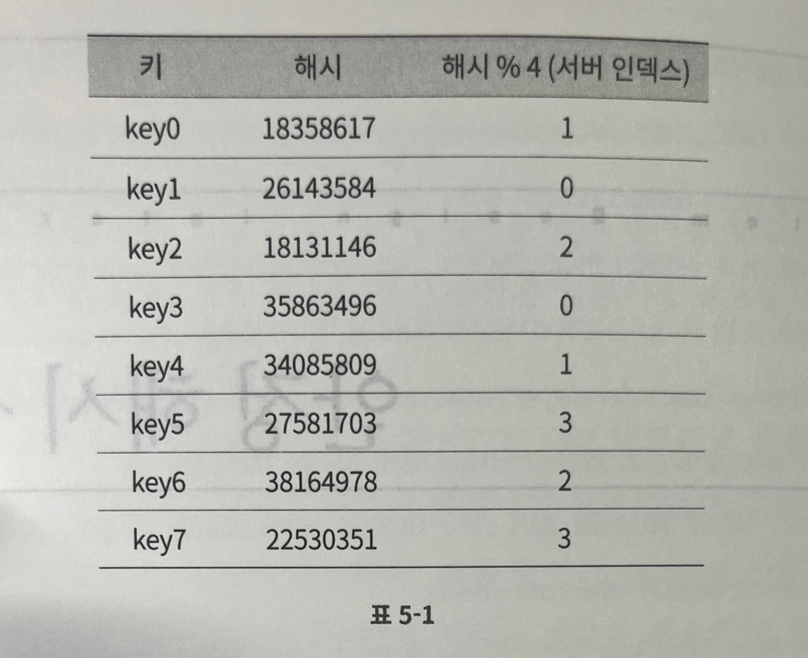

> 키 값이 서버에 어떻게 분산되는지를 나타낸 도표

- 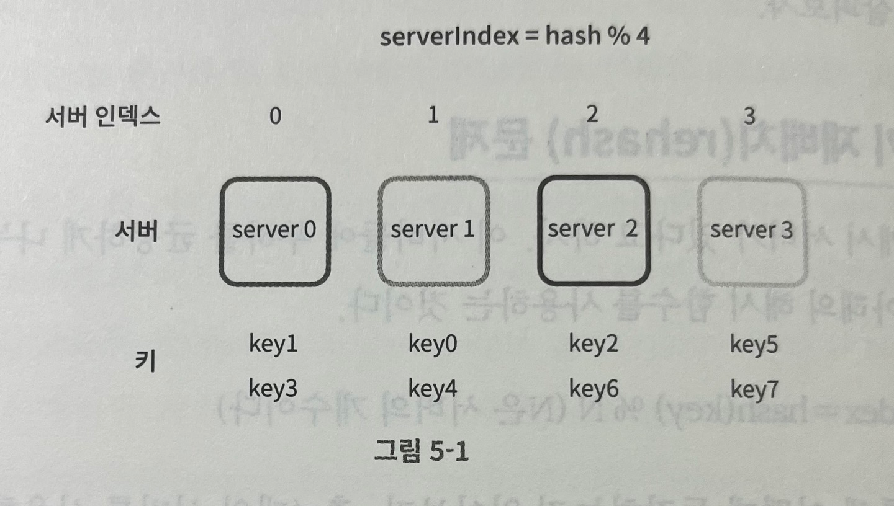

- 해당 방법은 `서버 풀 (server pool - 서버 개수) 의 크기가 고정적`이며, `데이터 분포가 균등`할 때는 잘 동작한다.
- 하지만, 서버가 추가되거나 제거되는 경우, 문제가 발생한다.
    - 예를 들어 1번 서버가 장애로 down 된 경우, 서버 풀의 크기가 4에서 3으로 변경된다.
    - 이에 따라, 키에 대한 해시 값은 변하지 않지만, 서버 수가 1만큼 줄었기 때문에 `나머지(%) 연산을 적용하여 계산한 서버 인덱스 값은 달라진다.`

> 해시 % 3 결과

- 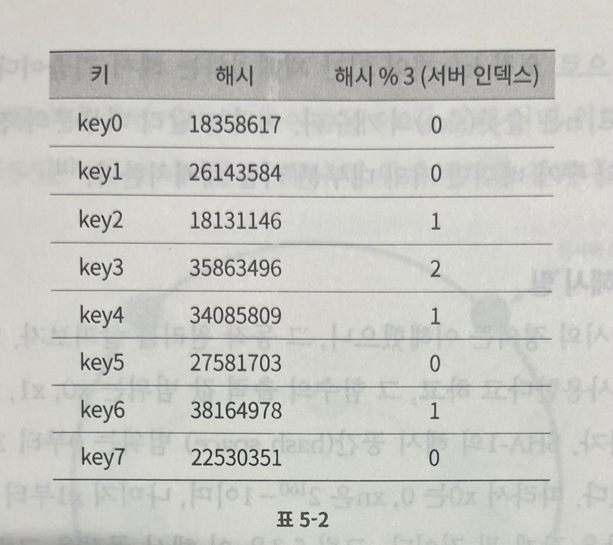

> 서버 풀 감소로 인하여 변화된 키 분포

- 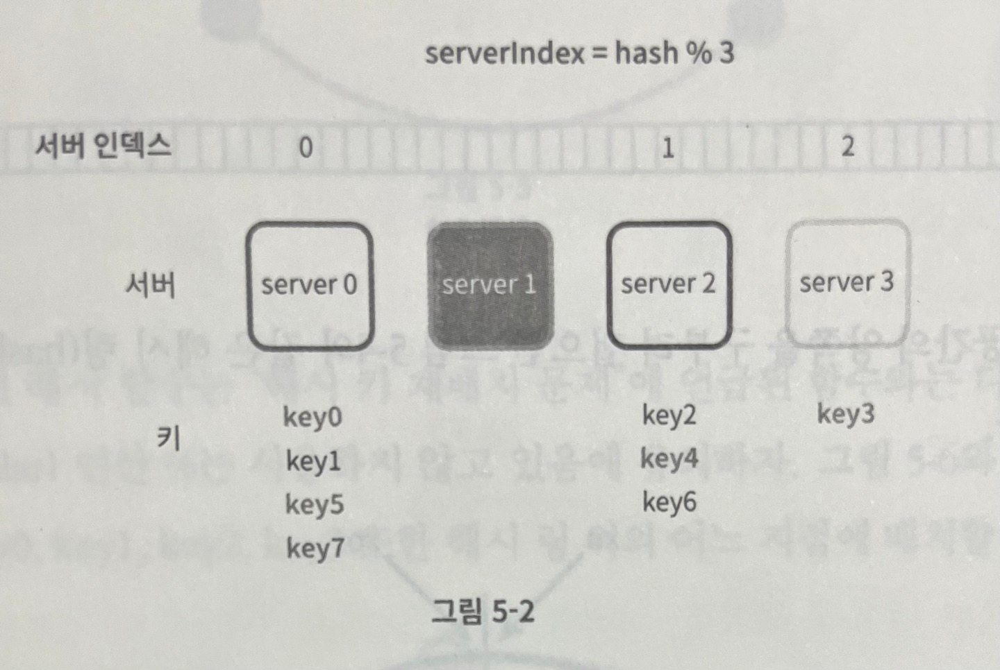

- 1번 서버의 장애로 인한 down 으로 1번 서버에 보관되어 있는 키 뿐만 아닌 대부분의 키가 재분배 되었음을 확인할 수 있다.
    - 즉, 대부분의 캐시 클라이언트가 데이터가 없는 엉뚱한 서버에 접속하여 대규모 `캐시 미스 (cache miss)` 발생
- `안정 해시는 이러한 문제를 효과적으로 해결하는 기술`이다.

### 2. 안정 해시

> 안정 해시 (consistent hash) 는 해시 테이블 크기가 조정될 때, `평균적으로 오직 k/n 개의 키만 재배치하는 해시 기술`

- k : 키의 개수
- n : 슬롯 (slot) 의 개수

> 해시 공간과 해시 링

- 해시 함수 f 로는 SHA-1 을 사용한다고 가정하고, 함수의 출력 값 범위는 x0, x1, x2, ... xn 과 같다고 가정
- SHA-1 의 해시 공간 (hash space) 범위는 0부터 2의 160승 - 1까지라고 알려져 있다.
- 따라서, x0 은 0, xn 은 2의 160승 -1 이다.

- 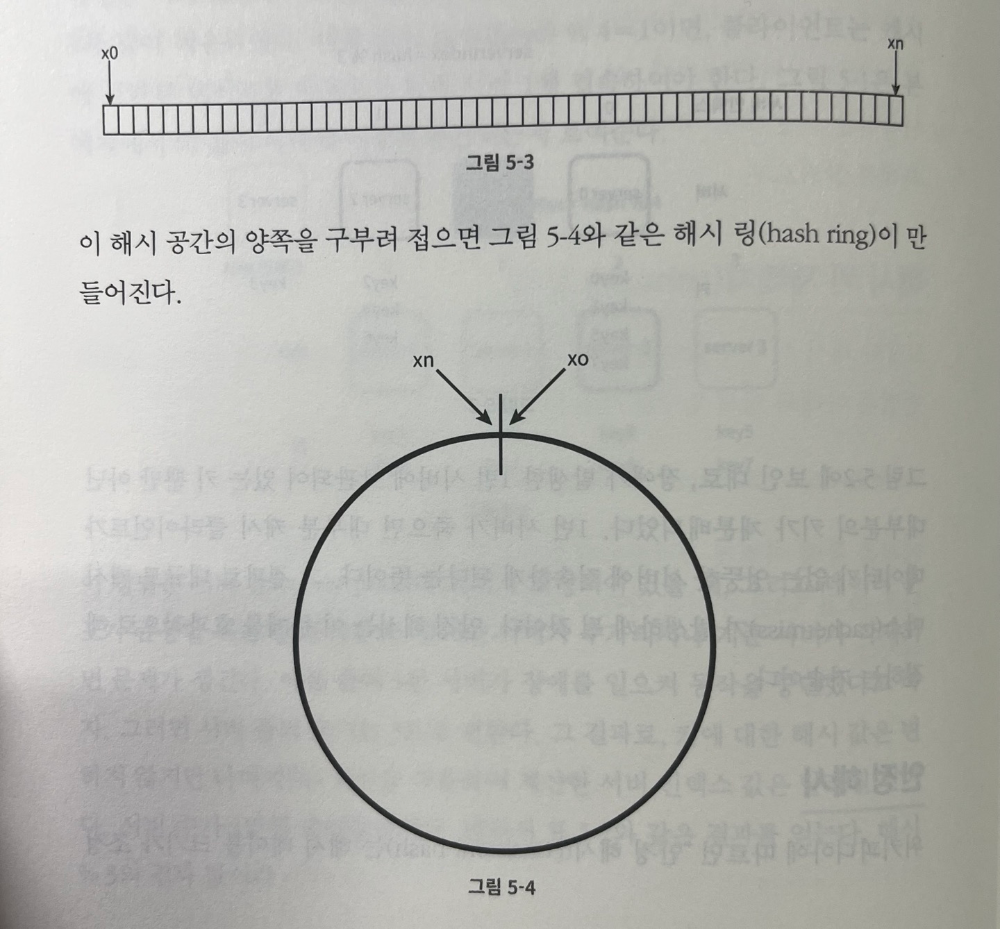

> 해시 서버

- 4개의 서버를 해시 링 위에 배치한 결과
- 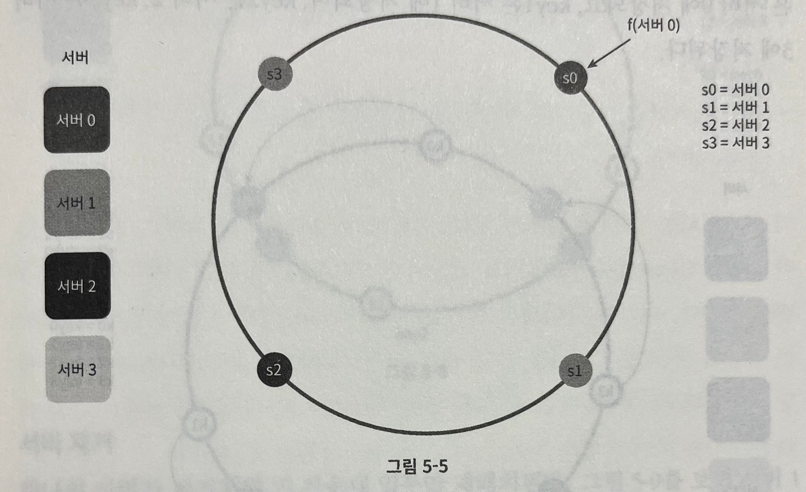

> 해시 키

- 나머지 (modular) 연산 `%` 를 사용하지 않음
- 캐시하려는 키인 `key0`, `key1`, `key2`, `key3` 를 해시 링 위의 특정 지점에 배치 가능

- 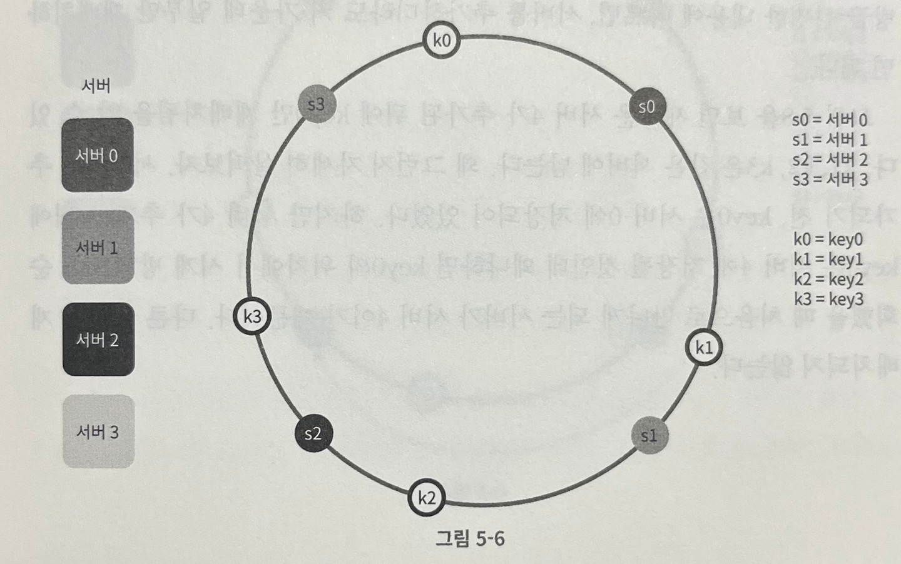

> 서버 조회

- `키가 저장되는 서버는, 해당 키의 위치로부터 시계 방향으로 링을 탐색해 나가면서 만나는 첫 번째 서버`
    - 예 : key0 (k0) 는 서버 0 (s0) 에 저장
    - 예 : key1 (k1) 은 서버 1 (s1) 에 저장

> 서버 추가

- 서버를 추가하더라도 `키 가운데 일부만 재배치`하면 된다.
    - 예 : 서버 4가 추가된 뒤에 key0 만 `s0` 에서 `s4`로 재배치 되며, 나머지 `k1, k2, k3 는 변경되지 않음`
- 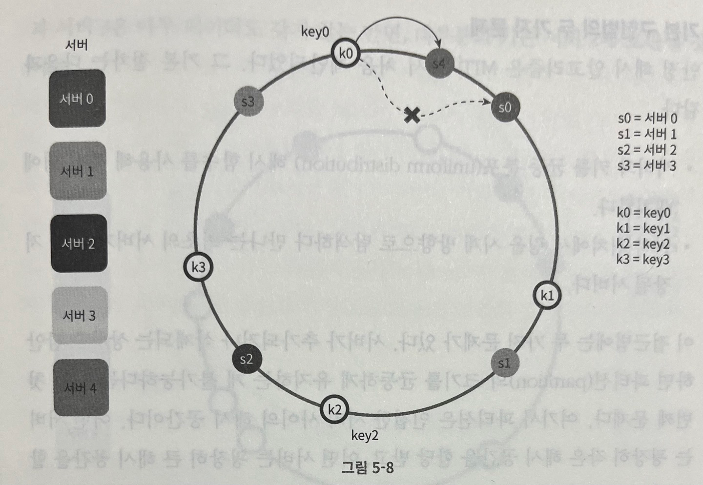

> 서버 제거

- 하나의 서버가 제거되면, `키 가운데 일부만 재배치`된다.
    - 예 : 서버 1 (s1) 삭제 시, key1 만 `서버 2 (s2)` 로 재배치 된다.
- 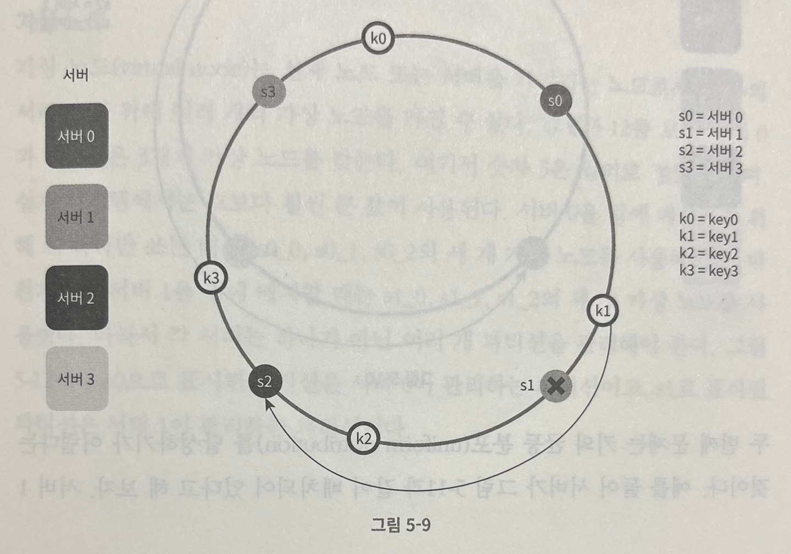

> 기본 구현법의 2가지 문제

1. 서버와 키를 균등 분포 (uniform distribution) 해시 함수를 사용해 해시 링에 배치한다.
    - 문제점
        - 서버가 추가되거나 삭제되는 상황 발생 시, `파티션 (인접한 서버 사이의 해시 공간)의 크기를 균등하게 유지하는 것이 불가능`
            - 특정 서버는 매우 작은 해시 공간을 할당 받고, 특정 서버는 매우 큰 해시 공간을 할당 받는 상황 발생 가능
        - 예 : s1 서버가 삭제되면서 s2 의 파티션이 다른 파티션 대비 약 2배 정도 커지는 상황
            - 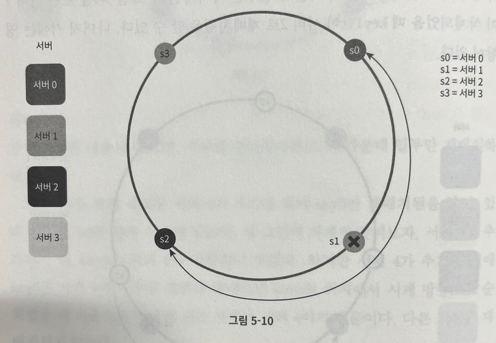

2. 키의 위치에서 링을 시계 방향으로 탐색하다가 만나는 최초의 서버가 키가 저장될 서버이다.
    - 문제점
        - `키의 균등 분포를 달성하기 어렵다`
        - 예 : 서버 1과 서버 3은 아무 데이터도 갖지 않지만, 대부분의 키가 서버 2에 쏠림 현상
            - 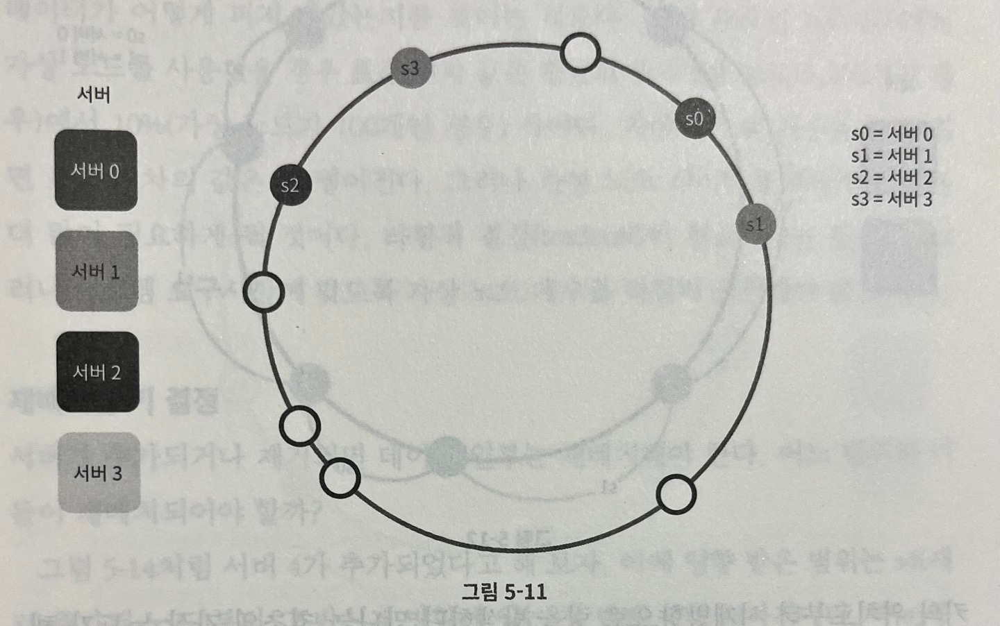

> 가상 노드

- 가상 노드는 `실제 노드 또는 서버를 가리키는 노드`로서, `하나의 서버는 링 위에 여러 개의 가상 노드를 가질 수 있음`
- 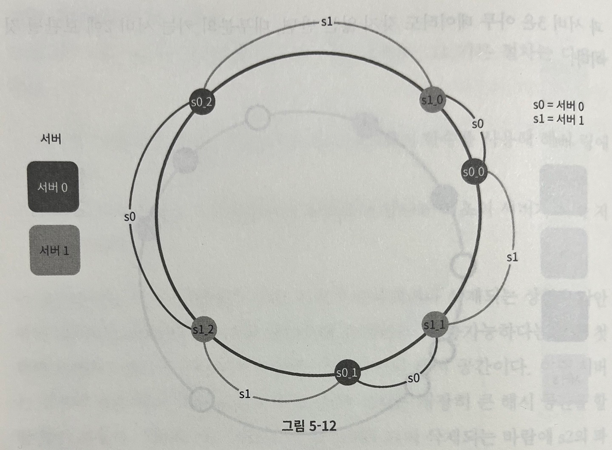
    - 서버 0과 서버 1은 3개의 가상 노드를 가짐
    - 서버 0을 링에 배치하기 위해 s0 하나만 사용하는 대신, `s0_0`, `s0_1`, `s0_2` 3개의 가상 노드를 사용
        - 따라서, 각 서버는 하나가 아닌 여러 개의 파티션을 관리해야 함
    - s0 으로 표시된 파티션은 서버 0이 관리하는 파티션, s1 로 표시된 파티션은 서버 1이 관리하는 파티션
    - 키의 위치로부터 시계 방향으로 링을 탐색하다가 만나는 최초의 가상 노드가 해당 키가 저장될 서버

- 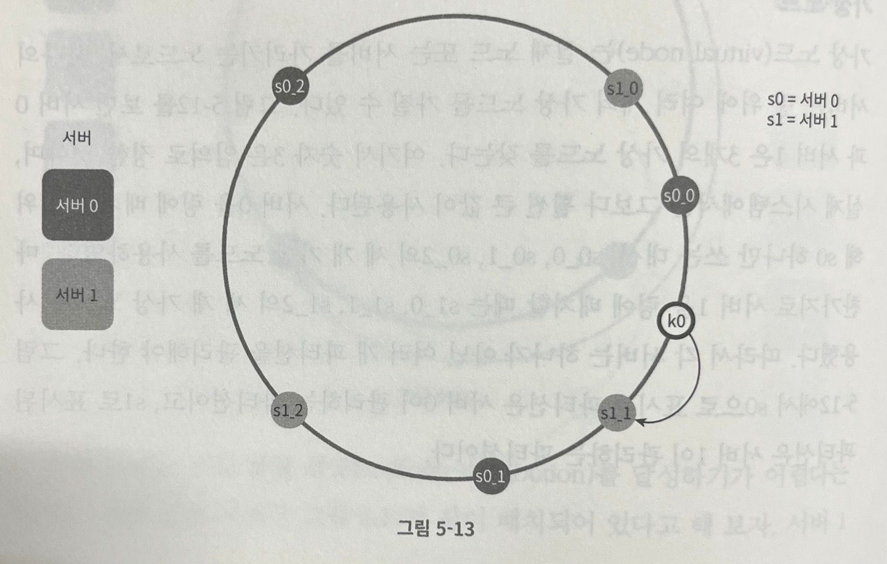
    - k0 가 저장되는 서버는 k0 의 위치로부터 링을 시계 방향으로 탐색하다가 만나는 최초의 가상 노드인 `s1_1` 이 나타내는 서버 즉, `서버 1 (s1 이기 때문)`
    - 가상 노드의 개수를 늘릴수록 `표준 편차`가 작아져서 데이터가 고르게 분포된다.
        - 문제점
            - 가상 노드의 개수를 늘릴수록 `가상 노드 데이터를 저장할 공간이 더 많이 필요`
            - 따라서, 시스템 요구사항에 맞도록 가상 노드 개수를 적절히 조정 필요 (trade-off)

> 재배치할 키 결정

- 서버가 추가된 경우, 재배치 필요 키
    - s4 (새로 추가된 노드) 부터 그 반시계 방향에 있는 첫 번째 서버인 s3 까지이다. (s3 ~ s4)

- 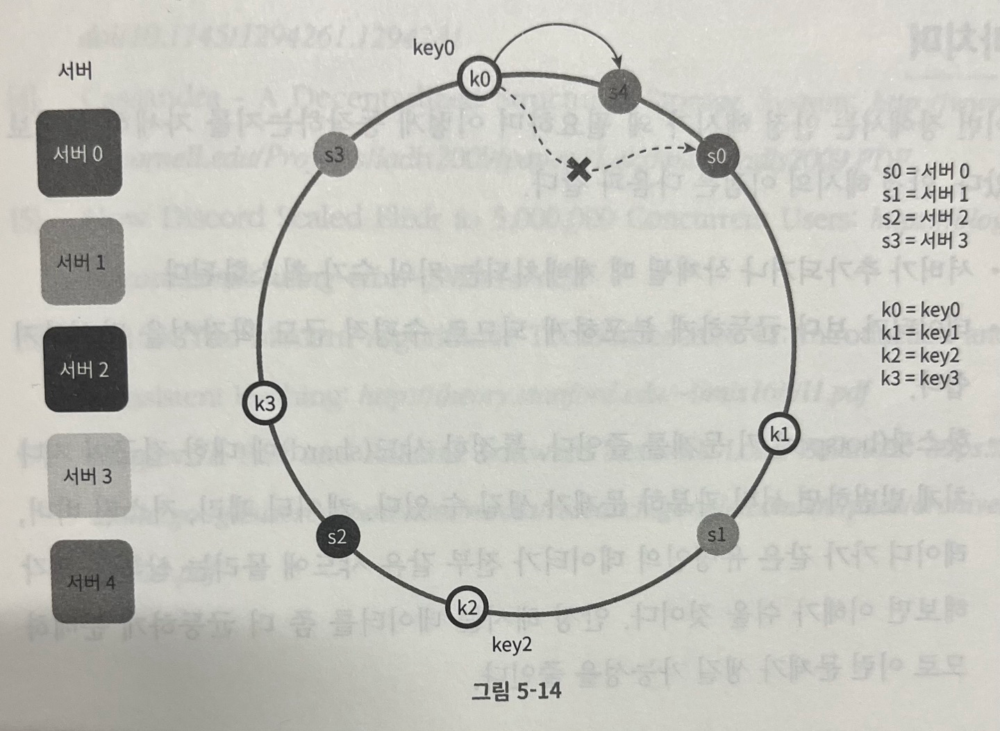

- 서버가 삭제된 경우, 재배치 필요 키
    - s1 서버 삭제 시, s1 (삭제된 노드) 부터 그 반시계 방향에 있는 최초 서버인 s0 사이의 키들이 s2 로 재배치되어야 한다.

- 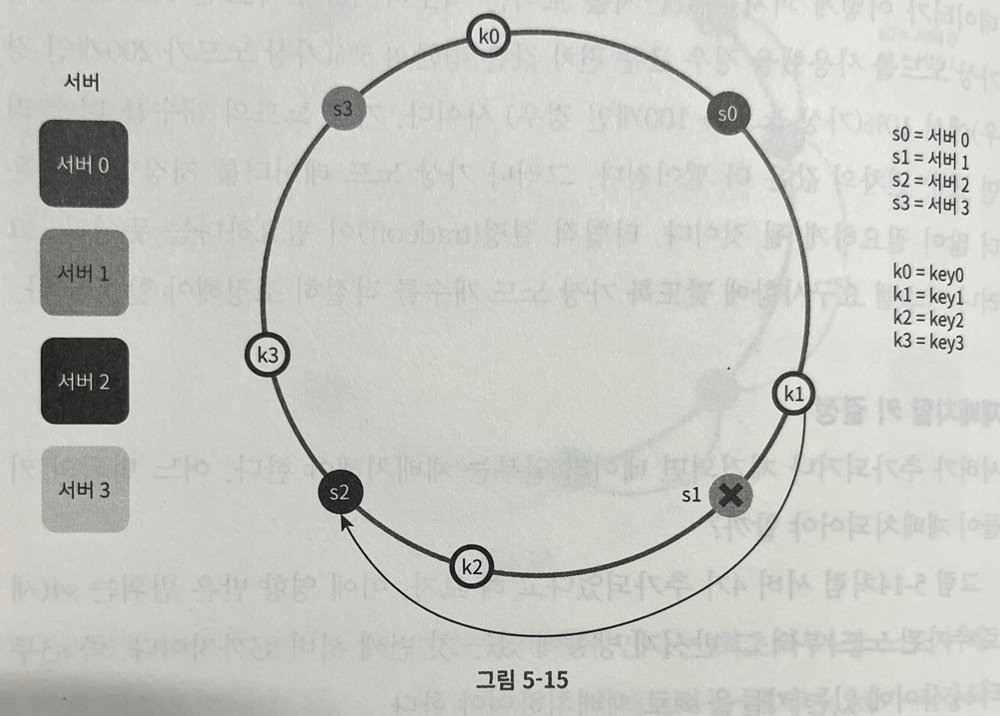

> 정리

- 안정 해시 장점

1. 서버가 추가되거나 삭제될 때, 재배치되는 키의 수가 최소화된다.
2. 데이터가 보다 균등하게 분포되므로 수평적 규모 확장성을 달성하기 쉬워진다.
3. 핫스팟 (hotspot) 키 문제를 줄인다.
    - 특정한 샤드에 대한 접근이 지나치게 빈번해지면 서버 과부하 문제가 발생할 수 있다.
        - 예 : 저스틴 비버, 레이디 가가와 같은 유명인의 데이터가 전부 같은 샤드에 몰리는 상황
    - 안정 해시는 데이터를 보다 균등하게 분배하므로 이런 문제가 발생할 가능성을 줄여준다.
