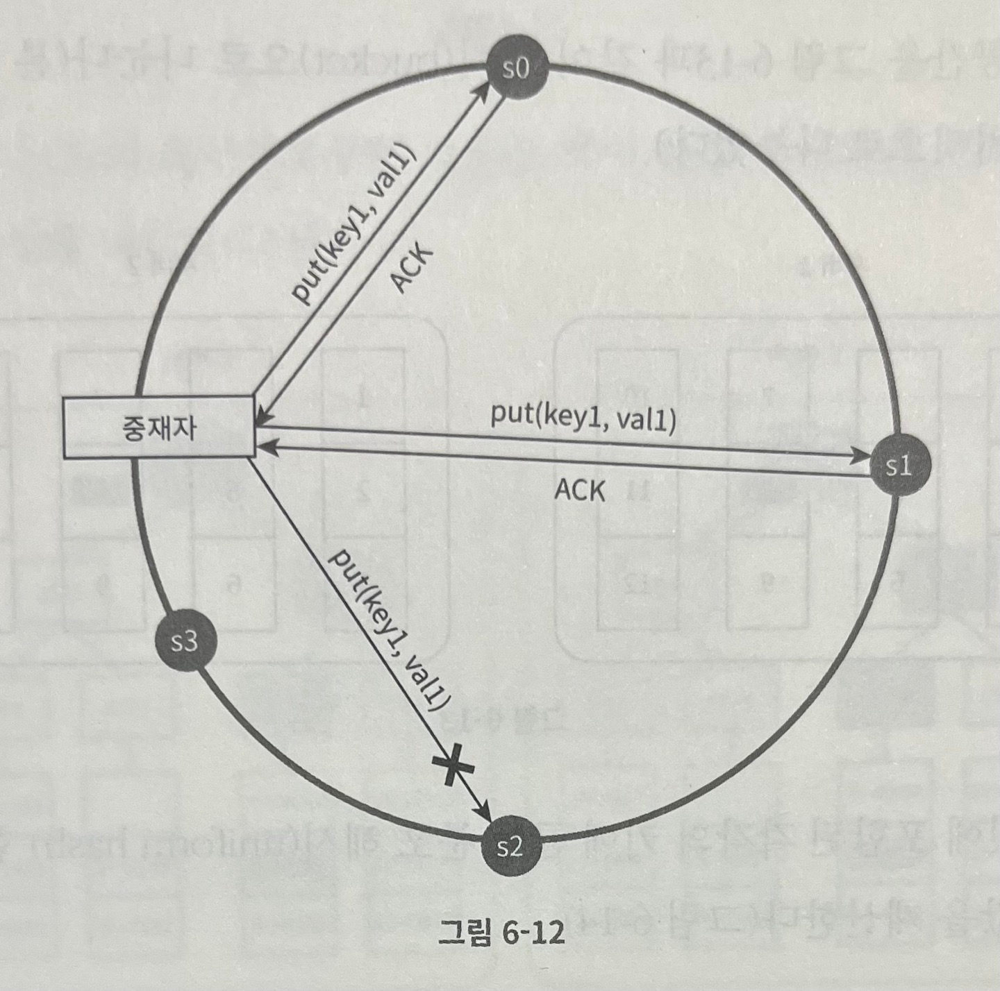

## 키-값 저장소 설계

> `키-값 저장소`는 `키-값 데이터베이스`라고도 불리는 `비관계형 데이터베이스`이다.

- 키-값 저장소에 저장되는 값은 `고유 식별자 (identifier)` 를 키로 가져야 한다.
- 키와 값 사이의 이런 연결 관계를 `키-값` 쌍 (pair) 라고 지칭한다.
- 키-값 쌍에서의 키는 `유일`해야 하며, 해당 `키에 매핑된 값은 키를 통해서만 접근 가능`하다.
  - 키는 `일반 텍스트`일 수도 있으며, `해시 값` 일수도 있다.
  - 성능상의 이유로 `키는 짧을수록 좋다.`
    - 예 : `일반 텍스트 키 - last_logged_in_at`, `해시 키 : 243DDEC4`
- 키-값 쌍에서의 값은 `문자열`, `리스트 (List)`, `객체 (Object)` 일 수도 있다.
- 이번 장에서는 다음 연산을 지원하는 키-값 저장소를 설계해보자.
  1. put(key, value) : 키-값 쌍을 저장소에 저장한다.
  2. get(key) : 인자로 주어진 키에 매핑된 값을 조회한다.

### 1. 문제 이해 및 설계 범위 확정

1. 키-값 쌍의 크기는 `10KB` 이하이다.
2. `큰 데이터`를 저장할 수 있어야 한다.
3. `높은 가용성`을 제공해야 한다.
   - 시스템 장애가 발생하더라도, 빠르게 응답해야 한다.
4. `높은 규모 확장성`을 제공해야 한다.
   - 트래픽 양에 따라 자동적으로 서버 증설/삭제가 이루어져야 한다.
5. `데이터 일관성 수준`은 조정이 가능해야 한다.
6. `응답 지연시간`이 짧아야 한다.

### 2. 단일 서버 키-값 저장소

> 1대의 서버만 사용하는 키-값 저장소인 경우, 키-값 쌍 전부를 메모리에 해시 테이블로 저장하면 쉽게 설계할 수 있다.

- 단점
  - 해시 테이블로 저장하여 접근 속도가 빠르지만, 모든 데이터를 메모리 안에 두는 것이 불가능할 수도 있다.
- 개선 방법
  1. 데이터 압축
  2. 자주 쓰이는 데이터만 메모리에 올려두고 나머지는 디스크에 저장
- 한계
  - 위와 같은 개선을 한다고 하더라도 1대의 서버로 부족한 시점이 오게 된다.
  - 많은 데이터를 저장하기 위해서는 `분산 키-값 저장소 (distributed key-value store)` 를 만들 필요가 있다.

### 3. 분산 키-값 저장소

- 분산 키-값 저장소는 `분산 해시 테이블` 이라고도 불리는데, 이는 키-값 쌍을 여러 서버에 분산시키기 때문이다.
- 분산 시스템 설계 시, `CAP 정리` 의 이해가 필요하다.

> CAP 정리

- CAP 정리는 `데이터 일관성 (consistency)`, `가용성 (availability)`, `파티션 감내 (partition tolerance)` 라는 3가지 요구사항을 동시에 만족하는 분산 시스템을 설계하는 것은 `불가능`하다는 정리

1. 데이터 일관성

- 분산 시스템에 접속하는 모든 클라이언트는 어떤 노드에 접속하던, 언제나 같은 데이터를 보게 되어야 한다.

2. 가용성

- 분산 시스템에 접속하는 클라이언트는 일부 노드에 장애가 발생하더라도 항상 응답 받을 수 있어야 한다.

3. 파티션 감내

- 파티션은 두 노드 사이에 통신 장애가 발생하였음을 의미한다.
- 파티션 감내는 네트워크에 파티션이 생기더라도 시스템은 계속 동작해야 한다는 것을 의미한다.

> CAP 정리는 3가지 요구사항 중 2가지를 충족하기 위해서 나머지 1가지는 반드시 희생되어야 한다는 것을 의미

- 

> CP 시스템

- 데이터 일관성과 파티션 감내를 지원하는 키-값 저장소. 가용성은 지원하지 않는다.

> AP 시스템

- 가용성과 파티션 감내를 지원하는 키-값 저장소. 데이터 일관성은 지원하지 않는다.

> CA 시스템

- 일관성과 가용성을 지원하는 키-값 저장소. 파티션 감내는 지원하지 않는다.
- 하지만, 통상적으로 네트워크 장애는 피할 수 없는 일이므로 `분산 시스템은 반드시 파티션 문제를 감내할 수 있도록 설계`되어야 한다.
- 따라서, CA 시스템은 존재하지 않는다.

> 구체적인 사례

- 분산 시스템에서 데이터는 보통 여러 노드에 복제되어 보관된다.
- 3대의 복제 노드 n1, n2, n3 에 데이터를 복제하여 보관하는 상황 가정

1. 이상적 상태

- 이상적 환경인 경우, 네트워크가 파티션되는 상황은 절대 발생하지 않기 때문에 n1 노드에 기록된 데이터는 n2, n3 노드에 복제된다.
- 데이터 일관성 및 가용성도 만족된다.
- 

2. 실세계의 분산 시스템

- 분산 시스템은 파티션 문제를 피할 수 없으며, `파티션 문제 발생 시, 데이터 일관성 및 가용성 사이에서 하나를 선택`해야 한다.
- 아래 예제는 n3 노드에 장애가 발생하여 n1 및 n2 와 통신할 수 없는 상황 가정

  - 클라이언트가 n1 또는 n2 에 기록한 데이터는 n3 에 저장되지 않음
  - n3 에 저장된 데이터가 아직 n1 및 n2 로 전달되지 않았다면, n1, n2 는 n3 의 오래된 사본을 갖고 있게 된다.
- 
- `데이터 일관성을 선택하는 경우 (CP 시스템)`

  - 3개의 서버 사이에 생길 수 있는 데이터 불일치 문제를 피하기 위해, n1 과 n2 에 쓰기 연산을 중단해야 한다.
  - 하지만, 이러할 경우, 데이터 조회는 가능하나 쓰기 연산이 중단되기 때문에 사실상 가용성이 깨지게 된다.
- `가용성을 선택하는 경우 (AP 시스템)`

  - 오래된 데이터를 반환할 위험이 있더라도 계속해서 읽기 연산을 허용한다.
  - 아울러, n1, n2 노드는 계속해서 쓰기 연산을 허용할 것이며, 파티션 문제가 해결된 후 새 데이터를 n3 에 전송할 것이다.

### 4. 시스템 컴포넌트

- 데이터 파티션
- 데이터 다중화 (replication)
- 일관성 (consistency)
- 일관성 불일치 해소 (inconsistency resolution)
- 장애 처리
- 시스템 아키텍처 다이어그램
- 쓰기 경로 (write path)
- 읽기 경로 (read path)

> 데이터 파티션

- 대규모 어플리케이션의 경우, 전체 데이터를 1대의 서버에 저장하는 것은 불가능하다.
- 가장 단순한 해결책은 `데이터를 작은 파티션들로 분할하여 여러 서버에 저장`하는 것
  - 데이터를 파티션 단위로 나눌 때 고려해야 할 사항
    1. 데이터를 여러 서버에 고르게 분산할 수 있는가 ?
    2. 노드가 추가되거나 삭제될 때, 데이터의 이동을 최소화할 수 있는가 ?
  - `안정 해시 (consistent hash)` 는 이러한 문제를 푸는 데 적합한 기술
- 안정 해시 사용 시 장점
  1. 규모 확장 자동화 (automatic scaling)
     - 시스템 부하에 따라 서버가 자동으로 추가되거나 삭제되도록 만들 수 있다.
  2. 다양성 (heterogeneity)
     - 각 서버의 용량에 맞게 가상 노드의 수를 조정할 수 있다. (고성능 서버의 경우, 더 많은 가상 노드 사용 가능)

> 데이터 다중화

- `높은 가용성과 안정성을 확보하기 위해서`는 데이터를 N개의 서버에 비동기적으로 다중화할 필요가 있다.
- N개의 서버를 선정하는 방법
  - 어떤 키를 해시 링 위에 배치한 다음, 그 지점으로부터 시계 방향으로 링을 순회하면서 만나는 첫번째부터 N개 서버에 데이터 사본 보관
  - 예 : N = 3 인 경우, key0 의 위치에서부터 시계 방향으로 만나는 3개 (s1, s2, s3)
- 가상 노드 사용 시, N개의 노드가 대응될 실제 물리 서버의 개수가 N 보다 작아질 수 있다.
  - 해당 문제 해결을 위해서는 같은 노드 선택 시, 같은 물리 서버를 중복 선택하지 않도록 해야 한다.
  - 같은 데이터 센터에 속한 노드는 정전, 네트워크 이슈, 자연재해 등의 문제를 동시에 같이 겪을 가능성이 있다.
- 

> 데이터 일관성

- 여러 노드에 `다중화된 데이터는 적절히 동기화` 되어야 한다.
- `정족수 합의 (Quorum Consensus) 프로토콜` 사용 시, 읽기/쓰기 연산 모두에 `일관성을 보장`할 수 있다.
- `정족수 합의 (Quorum Consensus) 프로토콜` 관련 정의
  - N = 사본 개수
  - W = 쓰기 연산에 대한 정족수 (쓰기 연산이 성공한 것으로 간주되려면 적어도 W개의 서버로부터 쓰기 연산이 성공했다는 응답을 받아야 한다.)
  - R = 읽기 연산에 대한 정족수 (읽기 연산이 성공한 것으로 간주되려면 적어도 R개의 서버로부터 읽기 연산이 성공했다는 응답을 받아야 한다.)
- N = 3 인 경우 예제
  - 중재자는 클라이언트와 노드 사이에 `프록시 (proxy)` 역할을 한다.
  - W,R,N 의 값을 정하는 것은 `응답 시간 지연`과 `데이터 일관성` 사이의 타협점을 찾는 전형적인 과정
    - W = 1 또는 R = 1 인 구성일 경우, 중재자는 1대의 서버로부터의 응답만 받으면 되기때문에 응답 속도가 빠르다.
    - 하지만, W 나 R 의 값이 1보다 큰 경우, 데이터 일관성의 수준은 향상되지만, 중재자의 응답 속도는 가장 느린 서버로부터의 응답을 기다려야 하므로 느려진다.
  - W + R > N 인 경우, `강한 일관성 (strong consistency)` 가 보장된다.
    - 일관성을 보증할 최신 데이터를 가진 노드가 최소 하나 이상은 존재하기 때문이다.
  - W,R,N 값 구성 (요구되는 일관성 수준에 따라 조정)
    1. R = 1, W = N
       - 빠른 읽기 연산에 최적화된 시스템
    2. W = 1, R = N
       - 빠른 쓰기 연산에 최적화된 시스템
    3. W + R > N
       - 강한 일관성이 보장됨 (보통 N = 3, W = R = 2)
    4. W + R <= N
       - 강한 일관성이 보장되지 않음
- 

> 일관성 모델

- 일관성 모델은 데이터 일관성의 수준을 결정하며, 종류가 다양하다.
- 강한 일관성을 달성하는 일반적인 방법은, `모든 사본에 현재 쓰기 연산의 결과가 반영될 때까지 해당 데이터에 대한 읽기/쓰기를 금지`하는 것이다.
  - 하지만, 이러한 방법은 `새로운 요청의 처리가 중단되기 때문에 고가용성 시스템에는 적합하지 않다.`
  - `다이나모`, `카산드라` 와 같은 저장소는 `최종 일관성 모델`을 적용하고 있다.
    - `쓰기 연산이 병렬적으로 발생하는 경우, 시스템에 저장된 값의 일관성이 깨질 수 있는데`, 이러한 문제는 클라이언트 측에서 `데이터의 버전 정보를 활용`해 일관성이 깨진 데이터를 읽지 않도록 클라이언트가 해결한다.

1. 강한 일관성 (strong consistency)

- 모든 읽기 연산은 가장 최근에 갱신된 결과를 반환한다.
- 따라서, 클라이언트는 절대로 오래된 데이터를 보지 못한다.

2. 약한 일관성 (weak consistency)

- 읽기 연산은 가장 최근에 갱신된 결과를 반환하지 못할 수 있다.

3. 최종 일관성 (eventual consistency)

- 약한 일관성의 한 형태로 갱신 결과가 결국에는 모든 사본에 반영 (즉, 동기화) 되는 모델이다.

> 데이터 일관성이 깨지는 예제

- 
- 어떤 데이터의 사본이 노드 n1 과 n2 에 보관되어 있다고 가정
- 해당 데이터를 조회하려는 서버1, 서버2는 get("name") 연산의 결과로 같은 값을 조회
- 
- 서버1 에 put("name:johnSanFrancisco"), 서버2 에 put("name:johnNewYork") 을 동시에 수행한다.
- 두 값은 충돌하며, 각각을 버전 v1, v2 라고 하자.
- 변경이 이루어진 이후에는 변경이 끝난 옛날 값인 원래 값은 무시할 수 있다.
- 하지만, 마지막 두 버전 v1 과 v2 사이의 충돌은 해소하기 어렵다.

  - 이러한 경우, `백터 시계 (vector clock)` 을 사용하여 해결

> 비일관성 해소 기법 : 데이터 버저닝

- 버저닝은 데이터를 변경할 때마다 해당 데이터의 새로운 버전을 만드는 것을 의미
- 따라서, 각 버전의 데이터는 변경 불가능 (immutable) 하다.

> 비일관성 해소 기법 : 벡터 시계

- 백터 시계는 `[서버, 버전] 의 순서쌍을 데이터에 매핑`한 것으로, 어떤 버전이 선행 버전인지 후행 버전인지, 다른 버전과 충돌이 있는지 판별하는 데 사용된다.
- 예 : 데이터 D 를 서버 Si 에 기록

  - [Si, vi] 가 있다면, vi 를 증가시킨다.
  - [Si, vi] 가 없다면, 새 항목 [Si, 1] 을 생성한다.
- 백터 시계 프로세스

  - 

  1. 클라이언트가 데이터 D1 을 시스템에 기록한다. 이 쓰기 연산을 처리한 서버는 Sx 이다. 따라서 벡터 시계는 D1[Sx, 1] 로 변한다.
  2. 다른 클라이언트가 데이터 D1 을 읽고, D2 로 갱신한 다음 기록한다. D2는 D1에 대한 변경이므로 D1을 덮어쓴다. 이때 쓰기 연산은 같은 서버인 Sx가 처리한다고 가정하자. 벡터 시계는 D2[Sx, 2]로 바뀔 것이다.
  3. `다른 클라이언트가 데이터 D2 를 읽고, D3 로 갱신한 다음 기록한다. 이 쓰기 연산은 Sy가 처리한다고 가정하자. 벡터 시계 상태는 D3[Sx, 2][Sy, 1] 로 바뀐다.`
  4. `또 다른 클라이언트가 데이터 D2 를 읽고 D4 로 갱신한 다음 기록한다. 이때 쓰기 연산은 서버 Sz 가 처리한다고 가정하자. 벡터 시계는 D4[Sx, 2][Sz, 1] 일 것이다.`
  5. 어떤 클라이언트가 D3 와 D4 를 읽으면, 데이터 간 충돌이 있다는 것을 알게 된다. D2 를 Sy 와 Sz 가 각기 다른 값으로 바꾸었기 때문이다.
     - 이 충돌은 클라이언트가 해소한 후에 서버에 기록한다.
     - 이 쓰기 연산을 처리한 서버는 Sx 였다고 가정하자.
     - `벡터 시계는 D5[Sx, 3][Sy, 1][Sz, 1]로 바뀐다.`

  - 백터 시계 사용 시, 어떤 버전 X가 버전 Y의 이전 버전인지 쉽게 판단 가능하다.
  - 버전 Y에 포함된 모든 구성요소의 값이 X에 포함된 모든 구성요소 값보다 같거나 큰지만 확인하면 된다.
  - 예 : 충돌이 없는 경우

    - D[s0, 1][s1, 1] / D[s0, 1][s1, 2]
    - X에 포함된 모든 구성요소 값보다 Y에 포함된 모든 구성요소 값이 같거나 큼
    - X 는 Y 의 이전 버전으로 간주
  - 예 : 충돌이 있는 경우

    - D[s0, 1][s1, 2] / D[s0, 2][s1, 1]
  - 벡터 시계 단점

    1. 충돌 감지 및 해소 로직이 클라이언트에 들어가야 하므로 클라이언트 구현이 복잡해진다.
    2. [서버, 버전] 순서쌍 개수가 빨리 늘어나게 된다.
       - 임계치 (threshold) 설정 및 오래된 순서쌍을 벡터 시계에서 제거 필요
       - 하지만, 순서쌍을 제거할 경우, 버전 간 선후 관계가 정확하게 결정될 수 없기 때문에 충돌 해소 과정의 효율성이 낮아지게 된다.
       - 그러나, 아마존 다이나모 데이터베이스의 사례에서 아직까지 해당 문제를 발견한 적은 없다고 한다.

> 장애 감지

- 분산 시스템에서는 `보통 2대 이상의 서버가 특정 서버의 장애를 보고`해야 해당 서버에 실제로 장애가 발생했다고 간주하게 된다.

1. 멀티캐스팅 채널
   - 
   - 모든 노드 사이에 멀티캐스팅 채널을 구축
   - 장점
     - 구축 방법이 쉽다.
   - 단점
     - 서버가 많은 경우, 비효율적이다.
2. 분산형 장애 감지 솔루션 (예 : 가십 프로토콜)
   - 가십 프로토콜 동작 원리
     1. 각 노드는 `멤버십 목록`을 유지한다. 멤버십 목록은 각 `멤버 ID` 와 `하트비트 카운터` 쌍의 목록이다.
     2. 각 노드는 `주기적으로 자신의 하트비트 카운터를 증가`시킨다.
     3. 각 노드는 `무작위로 선정된 노드들에게 주기적으로 자신의 하트비트 카운터 목록을 보낸다.`
     4. `하트비트 카운터 목록을 받은 노드는 멤버십 목록을 최신 값으로 갱신`한다.
     5. `어떤 멤버의 하트비트 카운터 값이 지정된 시간 동안 갱신되지 않으면, 해당 멤버는 장애 상태인 것으로 간주`한다.
   - 
     1. 노드 s0 은 그림 좌측의 테이블과 같은 멤버십 목록을 가진 상태이다.
     2. 노드 s0 은 노드 s2 (멤버ID = 2) 의 하트비트 카운터가 오랫동안 증가되지 않았다는 것을 발견한다.
     3. 노드 s0 은 노드 s2 를 포함하는 하트비트 카운터 목록을 무작위로 선택된 다른 노드에게 전달한다.
     4. 노드 s2 의 하트비트 카운터가 오랫동안 증가되지 않았음을 발견한 모든 노드는 해당 노드를 장애 노드로 표시한다.

> 일시적 장애 처리

- 가십 프로토콜로 장애를 감지한 시스템은 가용성을 보장하기 위해 필요한 조치를 해야 한다.
- 엄격한 정족수 (strict quorum) 접근법
  - 읽기와 쓰기 연산을 금지한다.
- 느슨한 정족수 (sloppy quorum) 접근법
  - 장애 상태인 서버는 무시하고, 쓰기 연산을 수행할 W개의 건강한 서버와 읽기 연산을 수행할 R개의 건강한 서버를 해시링에서 고른다.
  - 네트워크나 서버 문제로 장애 상태인 서버로 가는 요청은 다른 서버가 잠시 대신 처리한다.
  - 장애 시간 동안 발생한 변경사항은 해당 서버가 복구되었을 때, 일괄 반영하여 데이터 일관성을 보존한다.
    - 이를 위해 임시로 쓰기 연산을 처리한 서버에는 그에 관한 `단서(hint)`를 남겨둔다.
    - 따라서, 이러한 장애 처리 방안을 `단서 후 임시 위탁 기법 (hinted handoff)`이라고 부른다.
  - 
    - 장애 상태인 노드 s2에 대한 읽기 및 쓰기 연산은 일시적으로 노드 s3 가 처리한다.
    - `노드 s2 복구 시, s3 는 갱신된 데이터를 s2 로 인계한다.`

> 영구 장애 처리

- 단서 후 임시 위탁 기법은 일시적 장애 처리를 위한 방법이다.
- 영구적인 노드의 장애 상태 시에는 `반-엔트로피 (anti-entropy)` 프로토콜을 구현하여 사본들을 동기화한다.
  - 반-엔트로피 프로토콜은 사본들을 비교하여 최신 버전으로 갱신하는 과정을 포함한다.
  - 사본 간의 일관성이 망가진 상태를 탐지하고, 전송 데이터의 양을 줄이기 위해서는 `머클 (Merkle) 트리` 를 사용한다.
- `머클 (Merkle) 트리`
  - `해시 트리 (hash tree)` 라고도 불리는 머클 트리는 각 노드에 그 자식 노드들에 보관된 값의 해시, 또는 자식 노드들의 레이블로부터 계산된 해시 값들을 레이블로 붙여두는 트리이다.
  - 머클 트리를 사용하면, 대규모 자료 구조의 내용을 효과적이면서도 보안상 안전한 방법으로 검증할 수 있다.

> 키 공간 (key space) 이 1부터 12까지일 때, 머클 트리를 만드는 예제 (일관성이 깨진 데이터가 위치한 상자는 회색)

- 1단계 : 키 공간을 버킷으로 나눈다 (예제에서는 4개의 버킷)

  - 
- 2단계 : 버킷에 포함된 각각의 키에 `균등 분포 해시 (uniform hash)` 함수를 적용하여 해시 값을 계산한다.

  - 
- 3단계 : 버킷별로 해시값을 계산한 후, 해당 해시 값을 레이블로 갖는 노드를 만든다.

  - 3번째 버킷의 2번째 노드 일관성이 깨져서 좌측과 우측이 다르기 때문에 해시 값이 다름 (좌측 : 8601, 우측 : 7975)
  - 
- 4단계 : 자식 노드의 레이블로부터 새로운 해시 값을 계산하여, 이진 트리를 상향식으로 구성해 나간다.

  - 
- 두 머클 트리의 비교는 `루트 (root) 노드의 해시값을 비교` 하는 것으로 시작한다.
- 루트 노드의 해시값이 일치한다면, 2개의 서버는 같은 데이터를 갖는 것으로 간주한다.
- 루트 노드의 해시값이 일치하지 않는다면, `왼쪽 자식 노드의 해시 값을 비교하고, 그 다음으로 오른쪽 자식 노드의 해시 값을 비교`한다. (좌 -> 우)
- 이렇게 `위에서 아래 방향으로 좌측에서 우측 순서로 비교`해 나가다 보면 다른 데이터를 갖는 버킷을 찾을 수 있고, `다른 데이터를 갖는 버킷들만 동기화`하면 된다.

> 데이터 센터 장애 처리

- 데이터 센터 장애는 `정전`, `네트워크 장애`, `자연재해` 등 다양한 이유로 발생할 수 있다.
- 데이터 센터 장애에 대응할 수 있는 시스템을 만들기 위해서는 `데이터를 여러 데이터 센터에 다중화`하는 것이 중요하다.
  - 하나의 데이터 센터가 완전히 망가져도, 사용자는 다른 데이터 센터에 보관된 데이터를 이용 가능하다.

### 5. 시스템 아키텍처 다이어그램

- 클라이언트는 키-값 저장소가 제공하는 2가지 단순한 API, 즉 `get(key)` 및 `put(key, value)` 와 통신한다.
- `중재자 (coordinator)` 는 클라이언트에게 키-값 저장소에 대한 `프록시 (proxy) 역할`을 하는 노드이다.
- 노드는 `안정 해시 (consistent hash)` 의 `해시 링 (hash ring)` 위에 분포한다.

  - 
- 노드를 자동으로 추가 또는 삭제할 수 있도록, `시스템은 완전히 분산`된다.
- 데이터는 `여러 노드에 다중화`된다.
- 모든 노드가 같은 책임을 지므로, `SPOF (Single Point of Failure) 는 존재하지 않는다.`

> 완전히 분산되 설계를 채택하였으므로 모든 노드는 아래 제시된 기능 전부를 지원

- 

> 쓰기 경로

- 쓰기 요청이 특정 노드에 전달 시 처리 과정
  - 카산드라 (Cassandra) 사례
- 
  1. 쓰기 요청이 커밋 로그 (commit log) 파일에 기록된다.
  2. 데이터가 메모리 캐시에 기록된다.
  3. 메모리 캐시가 가득차거나 사전에 정의된 어떤 임계치에 도달하면, 데이터는 디스크에 있는 SSTable 에 기록된다. (SSTable 는 Sorted-String Table 의 약어로, 키-값의 순서쌍을 정렬된 리스트 형태로 관리하는 테이블)

> 읽기 경로

- 읽기 요청을 받은 노드는 데이터가 메모리 캐시에 있는지 확인하고, 메모리 캐시에 있는 경우 해당 데이터를 클라이언트에게 반환한다.
  - 
- 읽기 요청을 받은 노드가 메모리 캐시에 데이터가 있는지 확인하고, 메모리 캐시에 없는 경우, 디스크에서 데이터를 조회해야 한다.
  - 어느 SSTable 에 찾는 키가 있는지 확인할 효율적인 방법이 필요한데, 이때 `블룸 필터 (Bloom filter)` 가 사용된다.
  - 
    1. 데이터가 메모리에 있는지 확인하고, 없는 경우 2로 간다.
    2. 데이터가 메모리에 없으므로 블룸 필터를 검사한다.
    3. 블룸 필터를 통해 어떤 SSTable 에 키가 보관되어 있는지 확인한다.
    4. SSTable 에서 데이터를 조회한다.
    5. 해당 데이터를 클라이언트에 반환한다.

### 6. 요약

| 목표/문제          | 기술                                |
| -------------------- | ------------------------------------- |
| 대규모 데이터 저장 | 안정 해시를 사용하여 서버 부하 분산 |
| 읽기 연산에 대한 높은 가용성 보장 | 데이터를 여러 데이터 센터에 다중화 |
| 쓰기 연산에 대한 높은 가용성 보장 | 버저닝 및 벡터 시계를 사용한 충돌 해소 |
| 데이터 파티션 | 안정 해시 |
| 점진적 규모 확장성 | 안정 해시 |
| 다양성 (heterogeneity) | 안정 해시 |
| 조절 가능한 데이터 일관성 | 정족수 합의 (quorum consensus) |
| 일시적 장애 처리 | 느슨한 정족수 프로토콜 (sloppy quorum) 과 단서 후 임시 위탁 (hinted handoff) |
| 영구적 장애 처리 | 머클 트리 (Merkel tree) |
| 데이터 센터 장애 대응 | 여러 데이터 센터에 걸친 데이터 다중화 |
