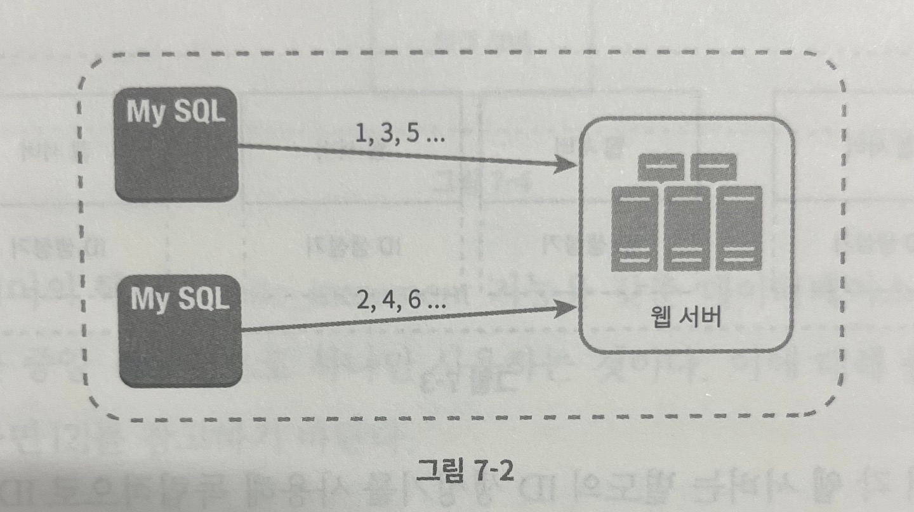
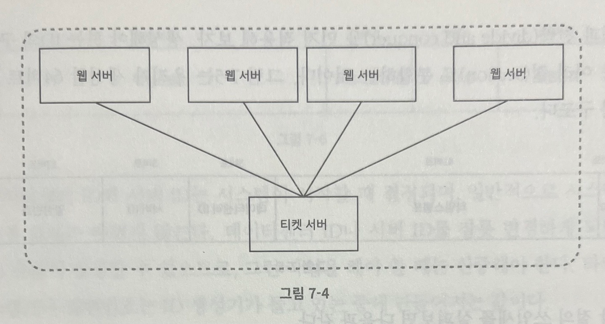
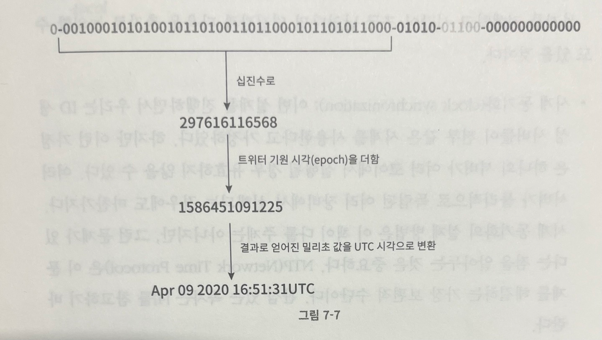

## 분산 시스템을 위한 유일 ID 생성기 설계

- `auto_increment` 속성이 설정된 관계형 데이터베이스의 기본 키는 분산 환경에서 통하지 않는다.
    - 서버 1대로는 요구를 감당할 수 없으며, 여러 데이터베이스 서버를 사용하는 경우에는 지연 시간을 낮추기가 힘들기 때문이다.

### 1단계 : 문제 이해 및 설계 범위 확정

- 지원자 : ID는 어떤 특성을 갖나요 ?
- 면접관 : ID는 유일해야 하고, 정렬 가능해야 합니다.
- 지원자 : 새로운 레코드에 붙일 ID는 항상 1만큼 큰 값이어야 하나요 ?
- 면접관 : ID의 값은 시간이 흐름에 따라 커질 것이지만, 언제나 1씩 증가한다고 할 수는 없습니다. 다만 확실한 것은, 아침에 만든 ID보다는 저녁에 만든 ID가 큰 값을 갖는다는 점입니다.
- 지원자 : ID는 숫자로만 구성되나요 ?
- 면접관 : 그렇습니다.
- 지원자 : 시스템 규모는 어느 정도입니까 ?
- 면접관 : 초당 10,000 ID를 생성할 수 있어야 합니다.

> 요구사항

- ID 는 유일해야 한다.
- ID 는 숫자로만 구성되어야 한다.
- ID 는 64비트로 표현될 수 있는 값이어야 한다.
- ID 는 발급 날짜에 따라 정렬 가능해야 한다.
- 초당 10,000개의 ID를 만들 수 있어야 한다.

### 2단계 : 개략적 설계안 제시 및 동의 구하기

- 분산 시스템에서 유일성이 보장되는 ID 를 만드는 방법은 여러 가지이다.
    1. 다중 마스터 복제 (multi-master replication)
    2. UUID (Universal Unique Identifier)
    3. 티켓 서버 (ticket server)
    4. 트위터 스노플레이크 (twitter snowflake) 접근법

> 다중 마스터 복제

- 
- 다중 마스터 복제 접근법은 데이터베이스의 `auto_increment` 기능을 활용하는 것이다.
- 다음 ID 값을 구할 때, 1만큼 증가시켜 구하는 것이 아니라, K만큼 증가시켜서 ID 값을 구한다.
    - K : 현재 사용 중인 데이터베이스 서버의 수
- 위 예제에서 특정 서버가 생성할 다음 ID 는 이전 ID 값에 `전체 서버의 수인 2를 더한 값`
- 단점
    - 여러 데이터 센터에 걸쳐 규모를 늘리기 어렵다.
    - ID의 유일성은 보장되겠지만, 그 값이 시간 흐름에 맞추어 커지도록 보장할 수는 없다.
    - 서버를 추가하거나 삭제할 때도 잘 동작하도록 만들기 어렵다.

> UUID

- UUID 는 컴퓨터 시스템에 저장되는 정보를 유일하게 식별하기 위한 128비트짜리 수이다.
    - UUID 값은 충돌 가능성이 지극히 낮다.
        - 위키피디아에 따르면, 중복 UUID 가 1개 생길 확률을 50%로 끌어 올리려면, 초당 10억 개의 UUID 를 100년 동안 계속해서 만들어야 한다고 한다.
    - UUID 값은 '09c93e62-050b4-479d-bf8a-c07e1040bfb2' 와 값은 형태를 띤다.
    - UUID 는 `서버 간 조율 없이 독립적으로 생성 가능`하다.
        - 
- 장점
    - UUID 를 만드는 것이 단순하다.
    - 서버 사이의 조율이 필요 없으므로 동기화 이슈도 없다.
    - 각 서버가 자기가 쓸 ID를 알아서 만드는 구조이므로 규모 확장도 쉽다.
- 단점
    - ID 가 128 비트로 길다. (예제 요구사항에서의 길이는 64비트이다.)
    - ID 를 시간순으로 정렬할 수 없다.
    - ID 에 숫자가 아닌 값이 포함될 수 있다.

> 티켓 서버

- 티켓 서버 아이디어의 핵심은 `auto_increment` 기능을 갖춘 데이터베이스 서버, 즉 티켓 서버를 중앙 집중형으로 하나만 사용하는 것이다.
    - 다중 마스터 복제 접근법은 데이터베이스 서버 각각의 'auto_increment' 기능을 사용하며, 증가값을 이전 ID 값 x 운영 중인 데이터베이스 서버로 운영하는 면에서 다르다.
- 
- 장점
    - 유일성이 보장되는 오직 숫자로만 구성된 ID 를 쉽게 만들 수 있다.
    - 구현하기 쉽고, 중소 규모 어플리케이션에 적합하다.
- 단점
    - 티켓 서버가 SPOF (Single-Point-of-Failure) 가 된다.
        - 티켓 서버에 장애 발생 시, 해당 티켓 서버를 이용하는 모든 시스템이 영향을 받는다.
        - 해당 이슈를 해결하기 위해서는 여러 티켓 서버를 운영해야 하는데, 여러 티켓 서버를 운영하기 위해서는 `데이터 동기화`와 같은 새로운 문제를 고민하고 해결해야 한다.

> 트위터 스노플레이크 접근법

- 트위터는 `스노플레이크 (snowflake)` 라고 부르는 독창적인 ID 생성 기법을 사용
- 
    - 사인 (sign) 비트
        - 1비트 할당
        - 현재는 사용하지 않지만, 나중을 위한 여유 비트로 음수와 양수 구분 가능
    - 타임스탬프 (timestamp)
        - 41비트 할당
        - 기원 시각 (epoch) 이후로 몇 밀리초가 경과했는지를 나타내는 값
        - 해당 예제에서는 기원 시각으로 트위터 스노플레이크 구현에서 사용하는 값인 `1288834974657 (Nov 04, 2010, 01:42:54 UTC)` 사용
    - 데이터 센터 ID
        - 5비트 할당
        - 2의 5승 = 32개 데이터 센터 지원 가능
    - 서버 ID
        - 5비트 할당
        - 2의 5승 = 32개 서버 사용 가능
    - 일련번호
        - 12비트 할당
        - 각 서버에서는 ID 생성 시, 일련번호를 1씩 증가
        - 1밀리초 경과 시마다 0으로 초기화

### 3단계 : 상세 설계

- 데이터센터 ID 와 서버 ID 는 시스템이 시작될 때 결정되며, 일반적으로 시스템 운영 중에는 바뀌지 않는다.
- 타임스탬프, 일련번호는 ID 생성기가 운영 중인 상태에서 만들어진다.

> 타임스탬프

- 타임스탬프는 `시간의 흐름에 따라 점점 큰 값`을 갖게 되므로, 결국 ID 는 `시간순으로 정렬 가능`하게 된다.
    - 41비트로 표현 가능한 타임스탬프의 최대값 : 2의 41승 - 1 = 2199023255551 밀리초
    - 약 69년 (2199023255551 밀리초 / 1000 / 365일 / 24시간 / 3600초)
    - 해당 ID 생성기는 69년동안만 정상 동작하며, 69년이 지나면 기원 시각을 변경하거나 ID 체계를 다른 것으로 이전해야 한다.
- ID 구조를 따르는 값의 이진 표현 형태로부터 UTC 시각을 추출하는 예제
- 

> 일련번호

- 일련번호는 12비트이므로, 2의 12승 = 4096개의 값을 가질 수 있다.
- 어떤 서버가 같은 밀리초 동안 하나 이상의 ID를 만들어 낸 경우에만 0보다 큰 값을 갖게 될 수 있다.

### 4단계 : 마무리

- `스노플레이크` 접근법을 통해 모든 요구사항을 만족하며, 분산 환경에서 규모 확장이 가능하도록 설계
- 추가 가능 논의사항
    1. 시계 동기화 (clock synchronization)
        - 예제 설계에서는 ID 생성 서버들이 모두 같은 시계를 사용한다고 가정했다.
            - 하지만, 이런 가정은 하나의 ID 생성 서버가 여러 코어에서 실행될 경우, 유효하지 않을 수 있다.
            - 또한 여러 ID 생성 서버가 물리적으로 독립된 여러 장비에서 실행되는 경우에도 유효하지 않을 수 있다.
                - 물리적으로 독립된 여러 장비의 각 ID 생성 서버 마다 제각각 시간이 다를 수 있다.
        - NTP (Network Time Protocol) 은 시계 동기화 문제를 해결하는 가장 보편적 방법이다.
    2. 각 절 (section) 의 길이 최적화
        - 예를 들어 동시성이 낮고, 수명이 긴 어플리케이션인 경우, 일련번호 절의 길이를 줄이고 타임스탬프 절의 길이를 늘리는 것이 효과적일 수도 있다.
    3. 고가용성 (high availability)
        - ID 생성기는 필수 불가결 컴포넌트이므로 아주 높은 가용성 제공이 필요하다.
