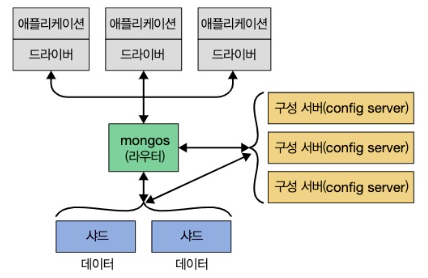

## Mongo DB 소개

> Mongo DB 는 강력하고 유연하며 확장성 높은 범용 데이터베이스

### 1. 손쉬운 사용

> Mongo DB는 관계형 데이터베이스가 아니라 도큐먼트 지향 데이터베이스

- 관계형 모델을 사용하지 않는 주된 이유는 분산 확장(scale-out)을 쉽게 하기 위함이지만 다른 이점도 존재

> 도큐먼트 지향 데이터베이스

- 행 개념 대신 유연한 모델인 도큐먼트 사용
- 내장 도큐먼트와 배열을 허용함으로써 도큐먼트 지향 모델은 복잡한 계층 관계를 하나의 레코드로 표현 가능

> Mongo DB 에서는 도큐먼트의 키와 값을 미리 정의하지 않는다 → 고정된 스키마가 없다

- 필요할 때마다 쉽게 필드를 추가하거나 제거 가능

### 2. 확장 가능한 설계

> 애플리케이션 데이터셋의 크기는 놀라운 속도로 증가하고 있음

> 데이터베이스를 어떻게 확장할 것인가 ?

- 성능 확장

  - 더 편한 길
  - 대형 장비는 대체로 가격이 비싸고, 결국에는 더는 확장할 수 없는 물리적 한계에 부딪히고 만다.
- 분산 확장

  - 저장 공간을 늘리거나 처리량(throughput)을 높이고 서버를 구매해서 클러스터에 추가하는 방법
  - 경제적
  - 확장 용이
  - 장비가 많아짐에 따라 유지 보수는 어려워짐

> Mongo DB는 분산 확장을 염두에 두고 설계

- 도큐먼트 지향 데이터 모델은 데이터를 여러 서버에 더 쉽게 분산하게 해준다
- 도큐먼트를 자동으로 재분배하고 사용자 요청을 올바른 장비에 라우팅
  - 클러스터 내 데이터 양과 부하 조절 가능

- 여러 서버에 걸쳐 샤딩을 한 Mongo DB 확장

### 3. 다양한 기능

> 인덱싱

- 일반적인 보조 인덱스를 지원하며, 고유(unique), 복합(compound), 공간 정보, 전문(full-text) 인덱싱 기능 제공
- 중첩된 도큐먼트 및 배열과 같은 계층 구조의 보조 인덱스 지원

> 집계

- 데이터 처리 파이프라인 개념을 기반으로 한 집계 프레임워크 제공
- 데이터베이스 최적화를 최대한 활용해, 서버 측에서 비교적 간단한 일련의 단계로 데이터를 처리함으로써 복잡한 분석 엔진(analytics engine)을 구축하게 해준다

> 특수한 컬렉션 유형

- 로그와 같은 최신 데이터를 유지하고자 세션이나 고정 크기 컬렉션(capped collection)과 같이 특정 시간에 만료해야 하는 데이터에 대해 유효 시간(ttl) 컬렉션 지원
- 기준 필터와 일치하는 도큐먼트에 한정된 부분 인덱스(partial index)를 지원함으로써 효율성을 높이고 필요한 저장 공간을 줄인다

> 파일 스토리지

- 큰 파일과 파일 메타 데이터를 편리하게 저장하는 프로토콜 지원

> 관계형 데이터베이스에 공통적으로 사용되는 일부 기능, 특히 복잡합 조인(join)은 Mongo DB에 존재하지 않는다

- 3.2에 도입된 `$lookup` 집계 연산자를 사용함으로써 매우 제한된 방식으로 조인하도록 지원
- 3.6 버전에서는 관련 없는 서브쿼리 뿐만 아니라 여러 조인 조건으로 보다 복잡한 조인 가능

### 4. 고성능

> Mongo DB 에서는 `동시성`과 `처리량`을 극대화하기 위해 WiredTiger 스토리지 엔진에 기회적 락(oppotunistic locking)을 사용

- 캐시처럼 제한된 용량의 RAM 으로 쿼리에 알맞은 인덱스를 자동으로 선택 가능

> 관계형 데이터베이스의 많은 기능을 포함하지만, 일부 기능의 경우 데이터베이스 서버는 처리와 로직을 클라이언트 측에 오프로드 (드라이버 또는 사용자의 애플리케이션 코드에 의해 처리)

- 이러한 간소한 설계 덕분에 몽고DB는 뛰어난 성능을 발휘

### 5. Mongo DB의 철학

> 확장성, 유연성, 빠른 속도