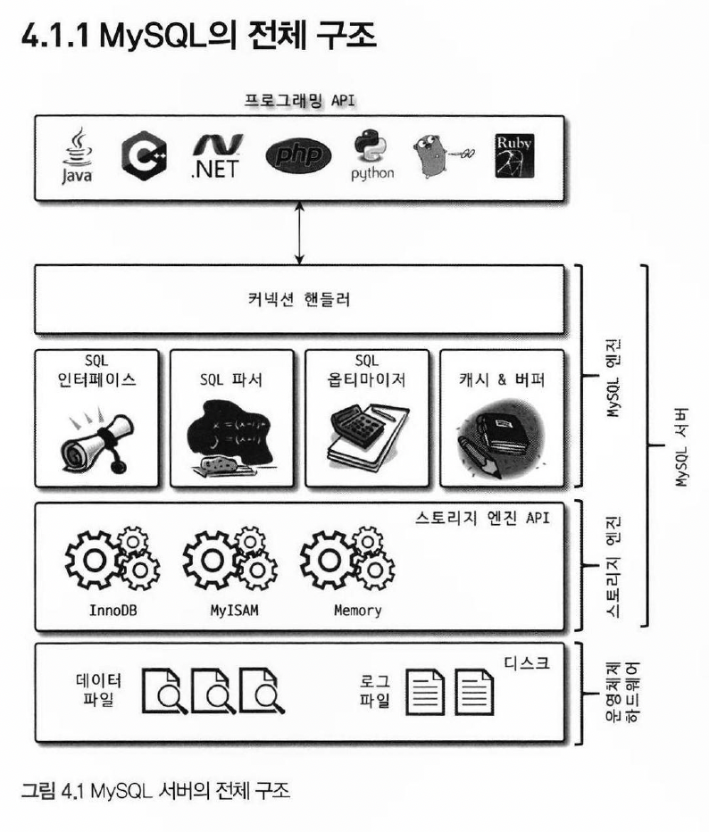
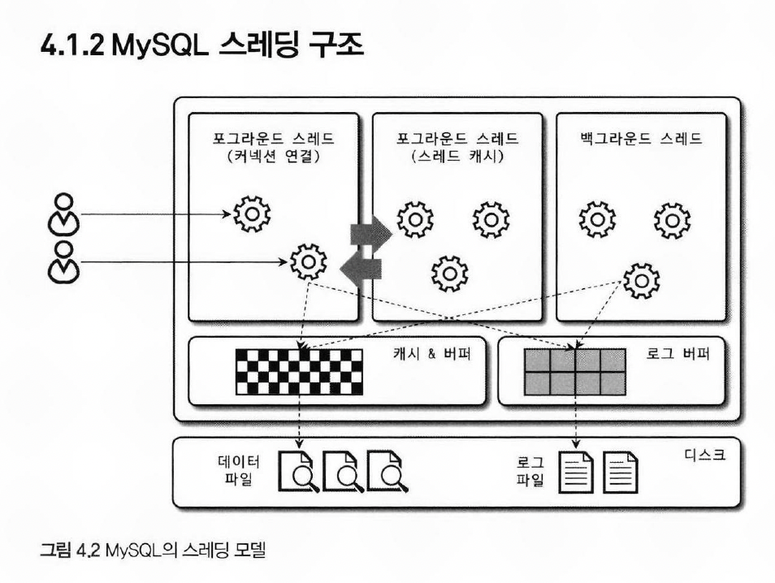
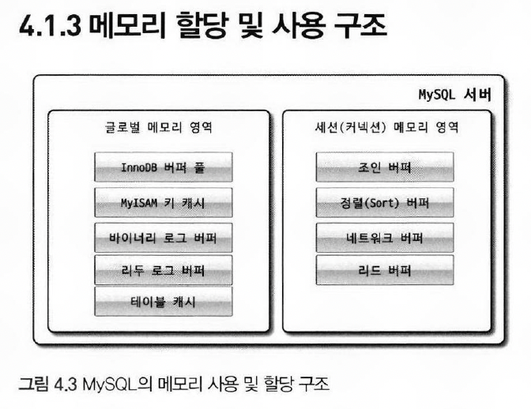
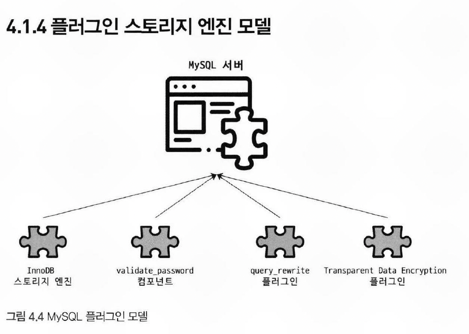
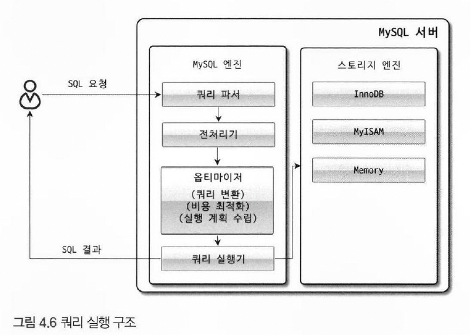
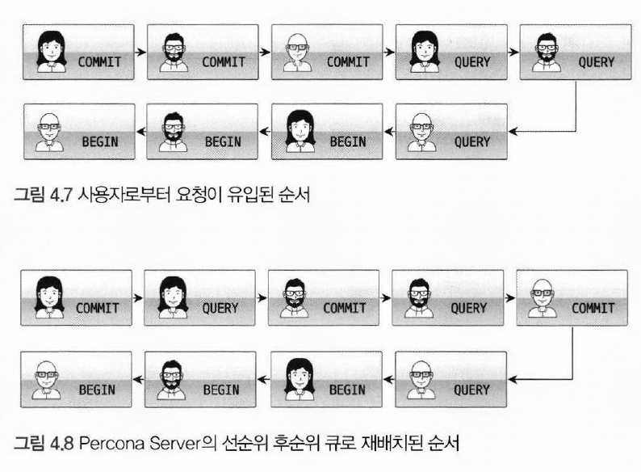

# 4.1 MySQL 엔진 아키텍처

## 4.1.1 MySQL 전체 구조

> MySQL 서버는 크게 MySQL 엔진과 스토리지 엔진으로 구분

- 

### 4.1.1.1 MySQL 엔진

- MySQL 엔진은 클라이언트로부터의 접속 및 쿼리 요청을 처리하는 `커넥션 핸들러`, `SQL 파서`, `전
  처리기`, `옵티마이저`가 중심을 이룬다.
- MySQL 은 `표준 SQL（ANSI SQL) 문법 지원`하기 때문에 표준 문법에 따라 작성된 쿼리는 타 DBMS 와 호환되어 실행 가능

### 4.1.1.2 스토리지 엔진 

- `MySQL 엔진`은 요청된 `SQL 문장을 분석`하거나 `최적화`하는 등 DBMS의 두뇌에 해당하는 처리를 수행
- 실제 데이터를 `디스크 스토리지에 저장`하거나 `디스크 스토리지로부터 데이터를 읽어오는 부분`은 `스토리지 엔진`이 전담
- `INSERT, UPDATE, DELETE, SELECT` 등의 작업이 발생 시, InnoDB `스토리지 엔진`이 그러한 처리를 담당

````sql
-- 테이블이 사용할 스토리지 엔진 지정
CREATE TABLE test_table (fdl INT, fd2 INT) ENGINE=INNODB；
````

### 4.1.1.3 핸들러 API

>  MySQL 엔진의 쿼리 실행기에서 데이터를 쓰거나 읽어야 할 때는 각 `스토리지 엔진에 쓰기 또는 읽기를 요청`하는데, 이러한 요청을 `핸들러(Handler) 요청`이라고 하며, 
여기서 사용되는 API 를 핸들러 API 라고 함 

## 4.1.2 MySQL 쓰레딩 구조

- 

- MySQL 서버는 프로세스 기반이 아니라 `스레드 기반`으로 작동하며, 크게 `포그라운드(Foreground) 스레드`와 `백그라운드(Background) 스레드`로 구분

### 4.1.2.1 포그라운드 스레드（클라이언트 스레드)

- 포그라운드 스레드는 최소한 `MySQL 서버에 접속된 클라이언트의 수만큼 존재`하며, 주로 각 클라이언트 사용자가 요청하는 쿼리 문장을 처리
- 클라이언트 사용자가 작업을 마치고 커넥션을 종료하면 해당 커넥션을 담당하던 스레드는 다시 `스레드 캐시（Thread cache）에 반납`
- 이때 스레드 캐시에 유지할 수 있는 최대 스레드 개수는 `thread_cache_size` 시스템 변수로 설정
- 포그라운드 스레드는 데이터를 MySQL의 `데이터 버퍼`나 `캐시`로부터 가져오며, 버퍼나 캐시에 없는 경우에는 `직접 디스크의 데이터`나 `인덱스 파일로부터 데이터`를 읽어와서 작업 처리
- `InnoDB 테이블`은 `데이터 버퍼나 캐시까지만 포그라운드 스레드가 처리`하고, 나머지 `버퍼로부터 디스크까지 기록하는 작업은 백그라운드 스레드가 처리`

> MySQL에서 `사용자 스레드`와 `포그라운드 스레드`는 똑같은 의미로 사용. 클라이언트가 MySQL 서버에 접속하게 되면 MySQL 서버는 그 클라이언트의 요청을 처리해 줄 스레드를 생성해 그 클라이언트에게 할당

### 4.1.2.2 백그라운드 스레드

>  - 인서트 버퍼(Insert Buffer｝를 병합하는 스레드 <br>
>  - 로그를 디스크로 기록하는 스레드 <br>
>  - InnoDB 버퍼 풀의 데이터를 디스크에 기록하는 스레드 <br>
>  - 데이터를 버퍼로 읽어 오는 스레드 <br>
>  - 잠금이나 데드락을 모니터링하는 스레드 <br>

- 가장 중요한 것은 `로그 스레드(Log thread)`와 버퍼의 데이터를 디스크로 내려쓰는 작업을 처리하는 `쓰기 스레드(Write thread)`
- MySQL 5.5 버전부터 데이터 쓰기 스레드와 데이터 읽기 스레드의 개수를 2개 이상 지정 가능
- `innodb_write_io_threads` 와 `innodb_read_io_threads` 시스템 변수로 스레드의 개수를 설정
- 쓰기 스레드는 많은 작업을 백그라운드로 처리하기 때문에, 일반적인 내장 디스크를 사용할 때는 2~4개 정도로 설정하는 것이 좋다
- InnoDB 는 쓰기 작업을 버퍼링해서 일괄 처리하는 기능 탑재

## 4.1.3 메모리 할당 및 사용 구조

- 

### 4.1.3.1 글로벌 메모리 영역

> - MySQL 서버가 시작될 때 운영체제로부터 할당되는 메모리 영역으로 이 메모리는 정확히 할당된 양을 확인하기 어려우며, 시스템 변수로 설정한 만큼 할당
- 일반적으로 클라이언트 스레드의 수와 무관하게 하나의 메모리 공간만 할당

1. 테이블 캐시 
   - 테이블 캐시는 `자주 사용되는 테이블의 데이터와 인덱스를 메모리에 보관`하여 데이터베이스의 성능 향상
   - 이를 통해 데이터에 대한 빠른 액세스가 가능해지며, 디스크에서 데이터를 읽어오는 횟수를 줄여준다.

2. InnoDB 버퍼 풀
   - InnoDB 버퍼 풀은 InnoDB `테이블의 데이터와 인덱스를 메모리에 캐싱`하여 빠른 읽기 작업을 지원
   - 자주 액세스되는 데이터에 대한 디스크 I/O를 줄여주고, 데이터베이스의 성능을 향상

3. InnoDB 어댑티브 해시 인덱스 
    - `쿼리 실행 중에 자동으로 생성되는 인덱스`로, 자주 액세스되는 쿼리의 성능을 향상
    - 데이터베이스의 성능을 최적화하고, 쿼리 실행 속도를 향상

4. InnoDB 리두 로그 버퍼
   - InnoDB 리두 로그 버퍼는 `트랜잭션의 변경 내역을 기록`하여 데이터베이스의 내구성 보장
   - 데이터베이스의 안정성을 유지하고, 장애 발생 시 데이터의 일관성을 보장

### 4.1.3.2 로컬 메모리 영역

> 로컬 메모리 영역은 세션 메모리 영역이라고도 불리며, `클라이언트 스레드가 쿼리를 처리하는 데 사용하는 메모리 영역`으로 `각 클라이언트 스레드별로 독립적으로 할당`되며, `공유되지 않는다`.

1. 정렬 버퍼
   - `정렬 작업을 수행할 때 사용되는 메모리 공간`으로, ORDER BY 및 GROUP BY와 같은 연산에서 데이터를 일시적으로 저장하고 처리
   - 이를 통해 정렬 작업의 성능 및 데이터 처리 속도 향상

2. 조인 버퍼 
   - `조인 작업을 수행할 때 사용되는 메모리 공간`으로, 여러 테이블 간의 조인 연산에서 중간 결과를 저장하고 처리
   - 이를 통해 조인 작업의 성능을 최적화하고, 데이터베이스의 처리 속도 향상

3. 바이너리 로그 캐시 
   - `바이너리 로그 파일에 대한 쓰기 작업을 버퍼링`하여 디스크에 효율적으로 기록
   - 바이너리 로그의 처리 속도를 향상시키고, 데이터의 내구성 보장

4. 네트워크 버퍼 
   - `클라이언트와 서버 간의 통신에 사용되는 메모리 공간`으로 네트워크 상에서 데이터 전송을 위해 사용
   - 이를 통해 클라이언트와 서버 간의 효율적인 통신을 지원하고, 데이터 전송 속도 향상

## 4.1.4 플러그인 스토리지 엔진 모델

- 

> MySQL의 플러그인 모델은 스토리지 엔진, 검색어 파서 등과 같은 `다양한 기능을 플러그인으로 추가`할 수 있는 독특한 특징을 가짐

- 사용자의 인증을 위한 Native Authentication 과 같은 기능도 플러그인으로 제공하며, 이는 사용자가 직접 스토리지 엔진을 개발하거나 쿼리 실행에 필요한 작업을 스토리지 엔진에서 처리할 수 있게 한다.
- 실제로 MySQL 엔진은 대부분의 작업을 처리하고, 마지막 `읽기/쓰기 작업만 스토리지 엔진에서 처리` 하는데, 이는 스토리지 엔진을 개발할 때 전체 기능을 개발하는 것이 아니라 `일부 기능만을 개발`한다는 의미
- MySQL 엔진이 각 스토리지 엔진에게 데이터를 읽고/쓰기 위해서는 반드시 `핸들러`를 통해야 한다.
- 또한, `GROUP BY` 나 `ORDER BY`와 같은 복잡한 처리는 `MySQL 엔진의 '쿼리 실행기'에서 처리`한다. 이러한 처리를 위해서는 많은 양의 데이터를 처리하기 위한 메모리가 필요

> MySQL에서 지원되는 스토리지 엔진 확인 방법 

````sql
SHOW ENGINES;
````

> 플러그인 확인 방법

````sql
SHOW PLUGINS;
````

- 만약 MySQL 에 포함되지 않은 스토리지 엔진을 사용하려면, 서버를 `다시 빌드(컴파일)`해야 한다.
- 일반적으로는 새로운 플러그인을 추가하기 위해서는 `해당 플러그인에 필요한 라이브러리 및 의존성을 설치`하고, `MySQL 서버의 설정을 업데이트하여 플러그인을 활성화`하는 등의 작업이 필요

## 4.1.5 컴포넌트

> MySQL 8.0부터는 기존의 플러그인 아키텍처를 대체하기 위해 컴포넌트 아키텍처가 지원

- 기존 플러그인 아키텍처의 단점
  1. 플러그인은 `오직 MySQL 서버와만 인터페이스`할 수 있었고, `플러그인끼리는 통신할 수 없었다`. 이로 인해 플러그인 간의 상호 작용이 제한적이었다.
  2. 플러그인은 `MySQL 서버의 변수나 함수를 직접 호출하기 때문에 안전하지 않았다`. 이는 플러그인이 서버의 내부 상태를 변경할 수 있음을 의미하며, 이로 인해 데이터 무결성이 손상될 수 있었다.
  3. 플러그인은 `상호 의존 관계를 설정할 수 없어서` 초기화가 어려웠다. 이는 플러그인이 서로에게 의존하는 경우, 어떤 플러그인이 먼저 초기화되어야 하는지 결정하기 어려웠음을 의미한다.

- 이러한 문제를 해결하기 위해 MySQL 8.0에서는 `컴포넌트 아키텍처를 도입`하여 `플러그인 간의 상호 작용`을 가능하게 하고, `안전한 인터페이스를 제공`하며, `상호 의존성을 관리` 가능

## 4.1.6 쿼리 실행 구조

- 

### 4.1.6.1 쿼리 파서

> 사용자 요청으로 들어온 쿼리 문장을 `토큰（MySQL이 인식할 수 있는 최소 단위의 어휘나 기호）으로 분리`해 `트리 형태의 구조`로 만들어 내는 작업

- 쿼리 문장의 `기본 문법 오류`는 이 과정에서 발견되고 사용자에게 오류 메시지를 전달
  - 예 : 사용자가 `SELECT * FROM users WHERE age > 20;` 라는 쿼리 입력 시, `SELECT`, `*`, `FROM`, `users`, `WHERE`, `age`, `>`, `20` 등의 토큰으로 분리 후 트리 형태로 변환
  - 이후 쿼리 문장의 `기본 문법 오류`를 인식하고, 문법접으로 잘못된 쿼리가 입력되면 쿼리 파서에서 오류 발생

### 4.1.6.2 전처리기

> 파서 과정에서 만들어진 파서 트리를 기반으로 쿼리 문장에 구조적인 문제점이 있는지 확인

- 예 : `SELECT * FORM users;` 와 같이 `FROM`이 `FORM` 으로 잘못 입력된 경우, 전처리기에서 이를 인식하고 오류를 발생
- 전처리기는 토큰을 `테이블 이름`이나, `내장 함수` 등과 같은 객체로 매핑하고, 해당 `객체의 존재 여부`와 `접근 권한`을 파악

### 4.1.6.3 옵티마이저

> `SQL 문의 최적화` 담당하며, DBMS 의 두뇌에 해당하는 부분으로, `어떤 인덱스를 사용`할 것인지, `어떤 순서로 테이블을 조인`할 것인지 등의 결정

- 이 과정에서 옵티마이저는 `통계 정보를 활용`하여 가장 효율적인 쿼리 실행 계획을 세운다.

### 4.1.6.4 실행 엔진

> 실행 엔진은 옵티마이저가 결정한 계획을 실제로 수행하는 역할

- 예 : GROUP BY 쿼리
  1. 실행 엔진이 핸들러에게 `임시 테이블` 생성 요청
  2. 다시 실행 엔진은 `WHERE 절에 일치하는 레코드`를 읽어오라고 핸들러에게 요청
  3. 읽어온 레코드들을 1번 과정에서 생성한 `임시 테이블에 저장`하라고 다시 핸들러에게 요청
  4. 데이터가 준비된 `임시 테이블에서 필요한 방식으로 데이터를 읽어` 오라고 핸들러에게 다시 요청
  5. 최종적으로 실행 엔진은 결과를 사용자나 다른 모듈로 넘김

### 4.1.6.5 핸들러（스토리지 엔진）

> MySQL 서버의 가장 밑단에서 MySQL 실행 엔진의 요청에 따라 데이터를 디스크로 저장하고 디스크로부터 읽어 오는 역할

- 핸들러는 결국, 스토리지 엔진을 의미하며 MyISAM 테이블을 조작하면 핸들러가 MyISAM 스토리지 엔진이 되고, InnoDB 테이블을 조작하면 InnoDB 스토리지 엔진인 됨

## 4.1.7 쿼리 캐시

> `SQL의 실행 결과를 메모리에 캐시`하고, `동일 SQL 쿼리가 실행되면 테이블을 읽지 않고 즉시 결과를 반환`하기 때문에 매우 빠른 성능

- 하지만, `테이블의 데이터가 변경`되면 캐시에 저장된 결과 중에서 `변경된 테이블과 관련된 것들은 모두 삭제` 하여 `동시 처리 성능 저하` 유발
- MySQL 8.0 에서 `쿼리 캐시는 MySQL 서버의 기능에서 완전히 제거` 되고 관련된 시스템 변수도 모두 제거

## 4.1.8 쓰레드 풀
 
- MySQL 엔터프라이즈 에디션은 스레드 풀 기능을 지원하지만 MySQL 커뮤니티 에디션은 스레드 풀 기능 미지원
  - 커뮤니티 에디션에서 스레드 풀 기능 필요 시, 동일 버전의 Percona Server 에서 `스레드 풀 플러그인 라이브러리(thread_pool.so 파일)`를 MySQL 커뮤니티 에디션 서버에 설치해서 사용하면 된다.
- 스레드 풀의 주요 목적은 `사용자의 요청을 처리하는 스레드 개수를 제한`하고, CPU 가 제한된 스레드 처리에만 집중하여 `서버의 자원 소모를 줄이는 것`
  - 이를 통해 `CPU 프로세서 친화도`를 높이고 `불필요한 컨텍스트 스위치`를 줄여 `오버헤드를 감소`시킵니다.

> Percona Server 스레드 풀

- Percona Server 의 스레드 풀은 `CPU 코어 개수만큼 스레드 그룹을 생성`하며, `thread_pool_size` 값을 변경하여 조정 가능
  - `CPU 코어 개수와 쓰레드 개수를 일치`하는 것이 CPU 프로세서 친화도를 증가
  - `thread_pool_oversubscribe` 
    - 스레드 풀이 부족할 경우 추가할 스레드를 지정할 수 있고, `기본 값은 3`
  - `thread_pool_stall_limit`
    - 설정한 시간 동안 현재 처리 중인 작업이 끝나지 않은 경우, 새로운 스레드를 생성 후 스레드 그룹에 추가
  - `thread_pool_max_threads`
    - 전체 스레드 풀에 있는 `스레드 개수 제한`
- 스레드 풀에서는 `선순위 큐`와 `후순위 큐`를 사용하여 `먼저 시작된 트랜잭션 내에 속한 SQL을 빨리 처리`해주는 방식으로 순서를 재배치
    - 

## 4.1.9 트랜잭션 지원 메타 데이터

> 메타 데이터는 데이터에 대한 데이터로, 테이블 구조 정보, 스토어드 프로그램 등의 정보를 포함.

### MySQL 5.7 까지의 메타 데이터 관리
- MySQL 5.7 버전까지는 테이블 구조를 `FRM 파일에 저장`
- 이러한 파일 관리 방식은 트랜잭션을 지원하지 않았기 때문에 해당 파일 수정 도중에 서버가 종료되면 일관되지 않은 파일로 남게 되어 데이터베이스나 테이블이 깨지는 문제 발생

### MySQL 8.0 부터의 메타 데이터 관리
- MySQL 8.0 버전부터는 테이블 구조와 스토어드 프로그램 관련 정보를 모두 `InnoDB 테이블에 저장`
  - `시스템 테이블`과 `데이터 사전 정보`를 모두 모아서 `mysql DB`에 저장하며, mysql DB는 통째로 `mysql.ibd` 라는 테이블 스페이스에 저장
  - 따라서, 데이터 사전에 대한 수정은 `트랜잭션 기반`이 되어 완전 성공 또는 완전한 실패로 정리