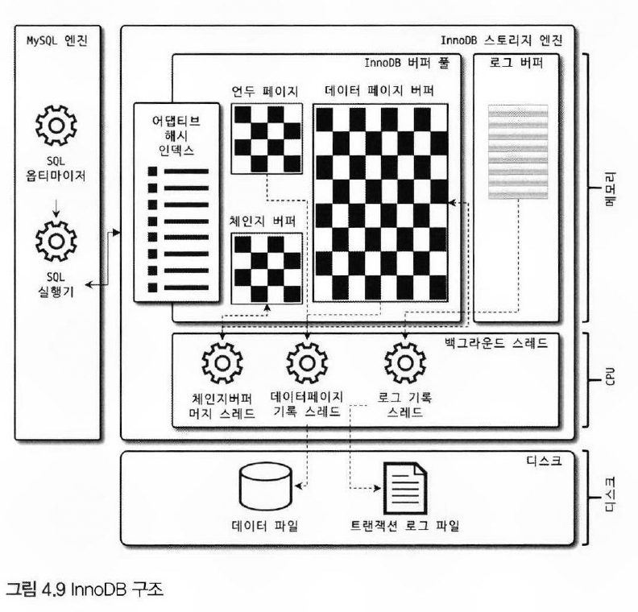
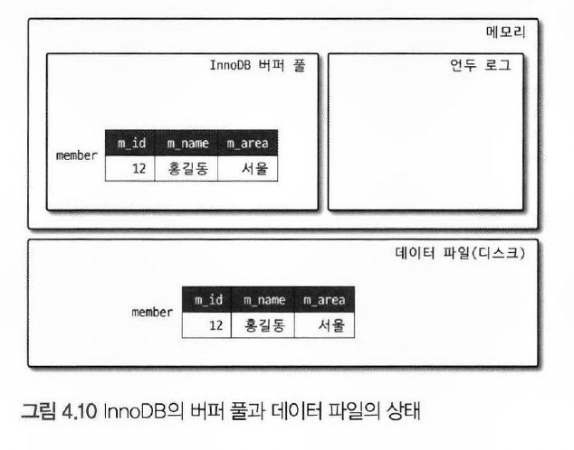
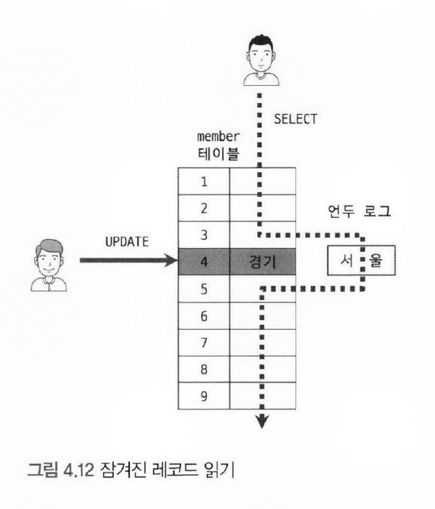
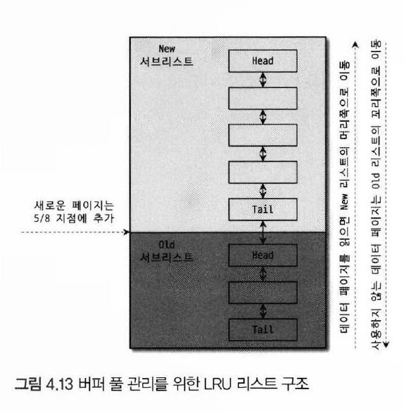
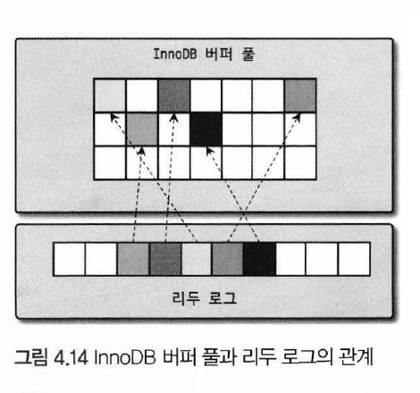
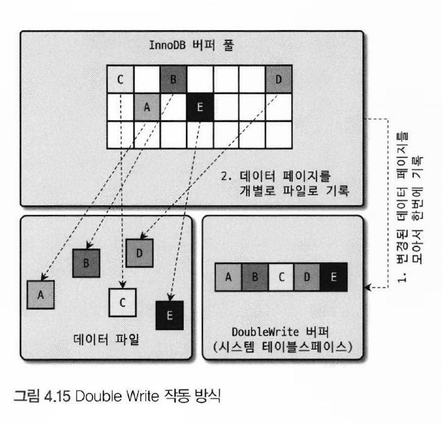

# 4.2 InnoDB 스토리지 엔진 아키텍처

> MySQL 스토리지 엔진 중 거의 유일한 `레코드 기반 잠금` 제공하여 `높은 동시성 처리`가 가능하고 `안정적`이며 성능이 뛰어남

- 

## 4.2.1 프라이머리 키에 의한 클러스터링

- 모든 테이블은 기본적으로 `Primary Key 를 기준으로 클러스터링`되어 저장
  - Primary Key 값을 기준으로 `정렬된 상태로 데이터가 저장`
- Primary Key 값의 `순서대로 디스크에 저장`
- Primary Key 는 `다른 보조 인덱스에 비해 비중이 높게` 설정
- MyISAM 은 클러스터링 키 미지원 (Primary Key 와 Index 가 구조적으로 동일)

## 4.2.2 외래키 지원

- InnoDB 에서는 외래키로 `부모와 자식 테이블 모두 인덱스를 생성`하고, 데이터가 있는지 체크한다. 이로 인하여 `잠금이 전파되며 데드락이 발생 가능`
- 수동으로 데이터 적재 필요 시, 외래키가 있을 경우 테이블의 관계를 파악해서 순서대로 작업해야하기 때문에 데이터 처리가 어려움
  - 이러한 경우, `foregin_key_checks=off` 로 설정 시, 일시적으로 멈추기 가능
    - 반드시 부모 - 자식 테이블 간 `일관성`을 맞춘 후 on 으로 변경
    - `SET SESSION foregin_key_checks=off;` - SESSION 은 생략 가능
  - `on delete cascade`, `on update cascade` 옵션 무시
- MyISAM 미지원

## 4.2.3 MVCC (Multi Version Concurrency Control)

> Multi Version : 하나의 레코드에 대해 여러 개의 버전이 동시에 관리된다는 의미

- `잠금을 사용하지 않는 일관된 읽기를 제공`하며, `언두 로그`를 사용하여 구현하며 레코드에 대한 멀티 버전을 제공
- 예 
  > MEMBER 테이블 INSERT 문 실행
    ````sql
    INSERT INTO member (m_id, m_name, m_area) VALUES (12,'홍길동','서울');
    COMMIT;
    ````
  - 

  > MEMBER 테이블에 UPDATE 문 실행
    ````sql
    UPDATE member SET m_area = '경기' WHERE m_id = 12；
    ````
    - `버퍼 풀`에 해당 데이터가 갱신된 후, 변경 전 값은 `언두 로그`에 저장
      - 이렇게 하나의 레코드에 대해 여러 개의 버전을 동시에 가지는 것을 `MVCC` 라고 표현
    - 버퍼 풀의 변경된 데이터는 `버퍼의 쓰기작업 후 디스크에 저장`
      - COMMIT : 버퍼 풀 및 디스크의 데이터를 영구적인 데이터로 변경
      - ROLLBACK : 언두 영역의 데이터를 버퍼 풀의 데이터로 복구
    `- `

> COMMIT 이 되지 않은 상태에서 해당 레코드를 조회하면 어떤 영역의 데이터를 반환할까 ?

- READ_UNCOMMITTED : `버퍼 풀`의 값을 반환
- 그 이상의 격리 수준 : `언두 영역`의 값을 반환
  - 언두 영역은 그 영역을 사용한 트랜잭션이 종료될 때 삭제

## 4.2.4 잠금 없는 일관된 읽기 (Non—Locking Consistent Read)

> InnoDB 스토리지 엔진은 MVCC 기술을 이용해 `잠금을 걸지 않고 읽기` 작업을 수행

- SERIALIZABLE 를 제외한 격리 수준은 SELECT 을 잠그지 않아 `다른 트랜잭션의 변경 작업과 관계 없이 바로 실행 가능` (언두 로그의 데이터를 읽는다)
  - READ_UNCOMMITTED, READ_COMMITTED, REPEATABLE_READ
- 언두가 오랫동안 유지될 경우, `성능 저하가 발생`하므로 `트랜잭션은 최소한의 시간동안 유지`
  
- 

## 4.2.5 자동 데드락 감지

> 잠금으로 인한 교착 상태를 확인하기 위하여 백그라운드 스레드인 `데드락 감지 스레드`가 잠금 대기 목록을 그래프(Wait-for List)로 관리

- `데드락 감지 스레드`가 주기적으로 잠금 대기 그래프를 검사해 `교착 상태에 빠진 트랜잭션들을 찾아서 그중 하나를 강제 종료`
  - 언두 로그 양을 기준으로 `언두 레코드를 더 적게 가진 트랜잭션이 일반적으로 롤백의 대상`이 됨 (롤백 시, 언두 처리를 해야할 내용이 적어 서버 부하 최소화)
- InnoDB 스토리지 엔진은 상위 레이어인 MySQL 엔진에서 관리되는 테이블 잠금은 확인 불가
  - `innodb_table_locks`시스템 변수 활성화 시, `InnoDB 스토리지 엔진 내부의 레코드 잠금`뿐만 아니라 `테이블 레벨의 잠금`까지 감지 가능
  - 해당 옵션 활성화 권장
- `동시 처리 스레드가 많아지거나 트랜잭션이 가진 잠금 개수가 많아지면` 데드락 감지 스레드가 CPU 자원을 많이 소모하고 느려짐
  - 이러한 경우, `innodb_deadlock_detect=off` 를 통해 데드락 감지 스레드 비활성화 가능
    - 데드락 감지 스레드 비활성 시, 데드락 상황에서 무한 대기 발생
    - 이때, `innodb_lock_wait_timeout=:50` 시스템 변수를 활성화하면, 데드락 상황에서 잠금 설정 시간 이후 자동으로 요청 실패 및 에러 메시지 반환 (기본값:50초)

## 4.2.6 자동화된 장애 복구

> 서버가 시작될 때 `완료되지 못한 트랜잭션이나 디스크의 일부를 자동으로 복구`하는 기능. 손실이나 장애로부터 데이터를 보호하기 위한 메커니즘

- innoDB 는 매우 견고하여 이런 상황이 거의 발생하지 않음. 보통 서버와 무관한 하드웨어 이슈로 인해 발생하며, 이 문제가 발생하면 보통 쉽게 해결하기 어려움
- 자동 복구를 실패 시, 서버는 실행되지 않음
  - 자동 복구에 실패하였으나 서버 실행이 필요한 경우, `innodb_force_recovery` 를 설정하여 강제 실행 가능
  - 기본값인 0을 제외하고 `1부터 6까지 설정 가능`하며, `낮은 숫자에서 재실행이 가능하다는 의미는 문제의 수준이 낮다는 의미`
- 서버가 실행조차 안된다면, `백업 데이터`와 `바이너리 로그`를 사용하여 복구하는 방법 밖에 없음

## 4.2.7 InnoDB 버퍼 풀

> - 디스크의 데이터 파일이나 인덱스 정보를 `메모리에 캐시`
> - 쓰기 작업을 지연시켜 작업을 `일괄 처리하는 버퍼`

- `INSERT`, `UPDATE`, `DELETE` 처럼 데이터를 변경하는 쿼리는 `데이터 파일의 이곳저곳에 위치한 레코드를 변경`하기 때문에 `랜덤한 디스크 작업을 발생`
  - 버퍼 풀이 이러한 `변경된 데이터를 모아서 처리`하면 `랜덤한 디스크 작업 횟수 감소` 

### 4.2.7.1 버퍼 풀의 크기 설정

- 동적 시스템 변수로서, `innodb_buffer_pool_size` 로 변경
  - 운영체제의 전체 메모리 공간이 8GB 미만이라면 50% 정도 설정
  - 운영체제의 전체 메모리 공간이 8GB 이상이라면 50% 정도 설정 후 최적 찾기
- 버퍼 풀은 전통적으로 버퍼 풀 전체를 관리하는 잠금으로 인해 내부 잠금 경합이 있었지만, 현재는 `여러 개의 버퍼 풀로 분리 및 분산 처리` 중
  - 각 버퍼 풀을 `버퍼 풀 인스턴스`라 표현하며 그 갯수는 `innodb_buffer_pool_instances` 로 설정
    - 기본값 : `8`
    - 메모리 크기가 1GB 미만 인 경우, 강제 `1` 셋팅
    - 메모리 크기가 40GB 이하인 경우, `8` 유지 
    - 메모리 크기가 40GB 초과인 경우, 버퍼 풀 인스턴스 1개당 5GB 정도가 되게 인스턴스 개수 설정 권장

### 4.2.7.2 버퍼풀 구조
- 버퍼 풀은 `페이지 크기(innodb_page_size)` 로 나누어 아래 3가지 자료구조를 통해서 관리
  1. LRU(Least Recently Used) 리스트
  2. 플러시(Flush) 리스트
  3. 프리(Free) 리스트

> LRU

- 

- 디스크로부터 한 번 읽어온 페이지는 `가능한 오랫동안 버퍼풀 메모리에 유지하여 디스크 읽기를 최소화`하는 것에 목표
- 오랫동안 보관할 페이지와 그렇지 않은 페이지 구분 필요
- 동작 순서
  1. 필요한 데이터가 `버퍼 풀에 있는지 조회`
     - 어댑티브 해시 -> 테이블의 인덱스를 순서로 버퍼 풀에 해당 데이터가 있는지를 우선적으로 파악
     - 버퍼 풀에 존재할 경우, 해당 페이지는 `MRU(NEW)` 방향으로 승급
  2. 필요한 데이터가 버퍼 풀에 없을 경우 `해당 데이터를 버퍼 풀에 적재`하고, 적재한 페이지의 포인터는 `LRU(OLD) 헤더 부분에 추가`
     - LRU : Least Recently Used, 가장 오래된 페이지 먼저 삭제
     - MRU : Most Recently Used, 가장 최근에 사용된 페이지 먼저 삭제
  3. 각 페이지는 `최근 사용자의 접근에 따라 Age 부여`
     - 오래된 페이지는 버퍼 풀에서 제거
     - 쿼리에 의해 버퍼풀에 존재하던 데이터가 사용되면 Age 초기화
  4. 자주 접근한 페이지의 인덱스 키는 `어댑티브 해시 인덱스에 추가`

> 플러시(Flush) 리스트

- `데이터 변경이 가해진 페이지(터티 페이지)를 관리`
- 데이터가 변경되는 경우, `리두 로그` 에 변경 전 데이터 기록 후 `버퍼 풀의 페이지 데이터에 반영`
- `체크 포인트`는 MySQL이 재실행 할 때 `복구 순서를 결정`할 때 사용


### 4.2.7.3 버퍼 풀과 리두 로그

- 

- 버퍼 풀은 `캐싱 기능`을 담당하며, 버퍼링으로서 `리두 로그를 관리`하고 두 개의 관계 파악 필요
> 버퍼와 캐시의 차이
   - 캐시는 `자주 사용하는 데이터를 보관`. 반복적이고 오래걸리는 작업을 보관하여 빠르게 처리할 때 사용
   - 버퍼는 `데이터를 이동하기 위한 임시 보관소`

> 더티 페이지와 리두 로그

- 더티 페이지는 `언젠가는 디스크로 기록`되어야 하며 `버퍼 풀에 계속 머무를 수는 없음`
  - 더티 페이지 : 메모리(Buffer Pool)에 있는 페이지가 디스크의 페이지와 다른 상태가 된 페이지. 즉, `메모리에 있는 데이터는 변경됐지만, 아직 디스크에 반영되지 않은 상태`
- 리두 로그가 정리되지 않으면 `새로운 로그가 이전 로그를 덮어 쓸 수도 있음`
- 활성 리두 로그 공간이 설정한 최대 값(체크포인트 에이지)를 넘어설 경우, `그 값보다 작은 값은 모두 디스크에 동기화` 함
- 버퍼 풀이 클 경우, `리두 로그의 버퍼를 잘 활용하지 못하고`, 리두 로그가 클 경우 `갑작스러운 쓰기가 발생 가능`
  - 따라서, 리두 로그의 버퍼 공간과 버퍼 풀의 캐시 공간이 중간 지점을 찾아 적절히 설정하는 것이 중요
- 버퍼 풀의 크기가 100GB일 경우, 리두 로그 파일의 전체크기는 5-10GB 정도로 설정
  - 버퍼 풀의 데이터를 모두 리두 로그에 저장하는 것은 아니므로 버퍼 풀의 크기 보다 작음

### 4.2.7.4 버퍼 풀 플러시

- 8.0 버전 이후로 더티 페이지가 디스크로 동기화하는 과정에서 에러가 거의 발생하지 않기 때문에 특별한 성능 문제가 없을 경우 수정 불필요
- 플러시는 2개가 백그라운드로 실행 : 플러시 리스트 플러시, LRU 리스트 플러시

#### 4.2.7.4.1 플러시 리스트 플러시

> 리두 공간을 효과적으로 사용하기 위한 플러시 함수 목록

- `innodb_page_clearners`
  - 버퍼 풀(Buffer Pool)의 더티 페이지(Dirty Page)를 디스크에 플러시(Flush)하는 백그라운드 스레드 수를 설정
  - 기본값 : 4

- `innodb_max_dirty_pages_pct`
  - 더티 페이지(Dirty Page)가 버퍼 풀에서 차지할 수 있는 최대 비율을 설정
    - 해당 비율이 클수록 `디스크 쓰기 최소화 가능`
    - 하지만, 과도한 쓰기로 인한 `디스크 폭발(Disk IO Brust) 발생 가능`
      - `innodb_max_tirty_pages_pct_lwm`
        - 디스크 폭발을 방지하기 위해 일정 수준 이상 터티 페이지가 차지하면 조금씩 플러시 수행
    - 기본값 : 75
        - 버퍼 풀에서 최대 75%까지 더티 페이지를 허용하고, 이를 초과하면 플러시 실행 

- `innodb_io_capacity`
  - 1초 동안 수행할 수 있는 최대 I/O 작업 수
    - 이 값을 너무 낮게 설정하면 더티 페이지가 쌓여서 Checkpoint 가 지연되고, 재시작 시 복구 시간이 길어짐
    - 반대로 너무 높게 설정하면 불필요한 I/O가 발생하여 디스크 부하 발생
  - 기본값 : 200

- `innodb_io_capacity_max`
  - 최대 I/O 처리 용량 (스파이크 대응)
    - 버퍼 풀이 꽉 차기 전에 디스크에 미리 쓰도록 강제해서 OOM(Out of Memory) 같은 위험을 방지 
  - 기본값 : 2000 (일반적으로 innodb_io_capacity 설정값의 2~10배 정도가 적당)

- `innodb_adaptive_flushing`
  - 어댑티브 플러시 알고리즘은 `리두 로그의 증가 속도를 분석`해서 적절한 수준의 더티 페이지가 버퍼 풀에 유지될 수 있도록 디스크 쓰기를 실행
  - 기본값 : ON

- `innodb_adaptive_flushing_lwm`
  - 전체 리두 로그 공간에서 활성 리두 로그의 공간이 10% 미만이면 어댑티브 플러시가 작동하지 않다가 `10%를 넘어서면 그때부터 어댑티브 플러시 알고리즘 작동`
  - 기본값 : 10%

- `innodb_flush_neighbors`
  - 더티 페이지(Dirty Page)를 디스크에 쓸 때 인접 페이지도 함께 플러시(Flush) 할지 여부를 결정하는 설정
  - 기본값 : 1
    - 0 (OFF) : 현재 플러시해야 할 페이지만 디스크에 쓴다.
    - 1 (ON) : 같은 extent(64페이지) 내의 더티 페이지도 함께 플러시한다.
    - 2 (AREA) : 페이지가 물리적으로 인접한 경우에만 플러시한다.

#### 4.2.7.4.2 LSU 리스트 플러시

> 사용 빈도가 낮은 페이지 제거 목적

- LRU 리스트에서 `사용 빈도가 낮은 데이터 페이지들을 제거`해서 새로운 페이지들을 읽어올 공간을 만들어야 하는데, 이를 위해 LRU 리스트 플러시 함수 사용
- LRU 리스트의 끝부분부터 시작해서 `최대 innodb_lru_scan_depth 시스템 변수에 설정된 개수만큼의 페이지들을 스캔`
  - `더티 페이지`는 디스크에 동기화하고 `클린 페이지`는 프리 리스트 페이지로 이동
  - `클린 페이지` : 수정되지 않은, 즉 디스크와 일치하는 페이지

### 4.2.7.5 버퍼 풀 상태 백업 및 복구
- 쿼리 요청이 빈번한 서버를 종료한 후 다시 실행할 경우, 쿼리 처리 성능이 평상시 대비 1/10 수준이다. (고성능)
  - 버퍼 풀에 쿼리들이 사용할 데이터가 이미 준비돼 있으므로 디스크에서 데이터를 읽지 않아도 쿼리가 처리 가능하기 때문
  - 위와 같이 디스크의 데이터가 버퍼 풀에 적재돼 있는 상태를 `워밍업` 이라고 표현
    - 전통적으로는 워밍업을 위해 주요 서비스의 `테이블과 인덱스를 풀 스캔`
- MySQL 5.6 버전부터는 `버퍼풀 덤프 및 적재` 기능 도입
  > 수동 방법
    - `innodb_buffer_pool_dumb_now`
      - 현재 InnoDB 버퍼 풀의 상태 백업
    - `innodb_buffer_pool_load_now`
      - 백업된 버퍼 풀의 상태 복구
    - 백업은 빠르지만 복원은 느림. 백업된 내용의 리스트를 디스크로부터 읽어야 하기 때문

  > 자동 방법
    - `innodb_buffer_pool_dump_at_shutdown`
      - MySQL 서버가 종료될 때, InnoDB 버퍼 풀에 캐시된 페이지들의 메타데이터(파일, 오프셋 정보)를 디스크에 덤프
      - 기본값 : ON (8.0 기준)
    - `innodb_buffer_pool_load_at_startup`
      - MySQL 서버 시작 시, 종료 전에 덤프해둔 버퍼 풀 페이지 목록을 기반으로 다시 메모리에 로드
      - 기본값 : ON 

### 4.2.7.6 버퍼 풀의 적재 내용 확인

- `innodb_cached_indexes`
  - MySQL의 INFORMATION_SCHEMA 에 있는 테이블로, InnoDB 버퍼 풀에 캐시된 각 인덱스의 페이지 수 확인 시 사용

## 4.2.8 Double Write Buffer

> 데이터를 페이지 단위로 디스크에 쓰는 과정에서, 부분적으로 기록되거나 손상되는 걸 방지하는 역할
> - MySQL/InnoDB는 데이터를 페이지 단위로 저정. 하지만 데이터가 16KB인데, 디스크는 일반적으로 512B ~ 4KB 블록 단위로 기록
> - 만약 페이지를 쓰다가 장애가 발생하면, `페이지의 일부만 기록되어 데이터가 손상`

- 

- `innodb_doublewrite`
  - 기본값 : ON
- 첫 번째 쓰기 (Double Write Buffer)
  - 데이터 페이지를 바로 디스크의 실제 데이터 파일에 쓰는 대신, `먼저 Double Write Buffer 에 페이지를 기록`
- 두 번째 쓰기 (실제 데이터 파일)
  - Double Write Buffer 에 기록된 페이지가 성공적으로 기록되었는지 확인한 후, InnoDB는 해당 페이지를 실제 데이터 파일(.ibd)에 다시 씀


