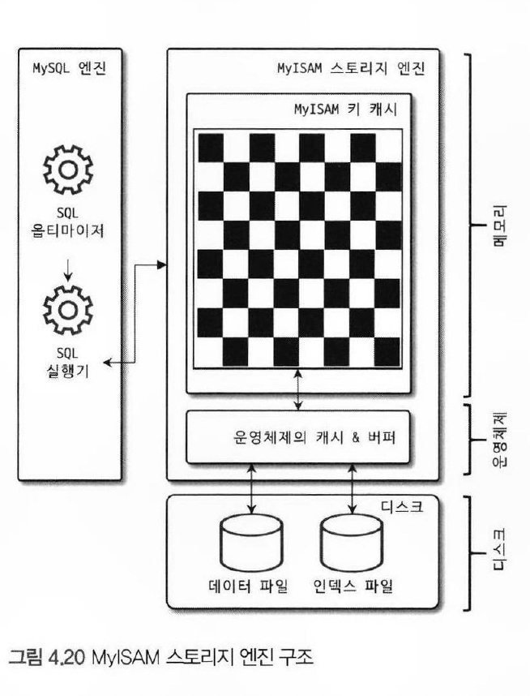

# 4.3. MyISAM 스토리지 엔진 아키텍처

- 

## 4.3.1 키 캐시

> InnoDB 의 버퍼 풀과 비슷한 역할을 하는 것이 MyISAM 의 키 캐시 (Key cache, 키 버퍼)

- `키 캐시는 인덱스만을 대상으로 작동`하고, 인덱스의 `디스크 쓰기 작업`에 대해서만 부분적으로 버퍼링 역할 수행

## 4.3.2 운영체제의 캐시 및 버퍼 

> MylSAM 테이블의 인덱스는 `키 캐시를 이용해 디스크를 검색하지 않고도 충분히 빠르게 검색` 가능, 하지만 테이블의 데이터에 대해서는 디스크로부터의 I/O를 해결해 줄 만한 `캐시나 버퍼링 기능도 미지원`

- 대부분의 운영체제에는 디스크로부터 읽고 쓰는 작업을 위해 매번 디스크의 파일을 읽지는 않음 (운영체제 캐시 기능 사용)
- 전체 메모리를 다른 프로세스에서 사용하고 있다면, 캐시 용도로 사용할 수 있는 메모리 공간이 없어지고, MyISAM 테이블의 `데이터를 캐시하지 못하며`, `쿼리 처리가 느려지게 됨`
  - 운영체제 캐시 공간은 기본적으로 남는 메모리를 사용

> OS 캐시 구조

- OS는 `메모리를 이용해서 디스크 엑세스를 줄일 수 있는데`, 리눅스에서는 `페이지 캐시` 라고 하는 캐시 구조를 가지고 있음

> 페이지 캐시

- 프로세스가 디스크로부터 데이터를 읽어 내는 과정은 OS는 디스크로부터 페이지(4KB | 8KB) 블록을 읽어내서 메모리에 쓰고, 그 메모리 주소를 프로세스에게 알려주면 프로세스가 해당 메모리에 접근하는 것
- 프로세스가 그 데이터를 읽고 난 후에 필요하지 않은 데이터라 하더라도, OS는 `페이지를 해제하지 않고 남겨둠`
- 다른 프로세스가 같은 데이터를 읽게 될 경우, 디스크에 접근할 필요 없이, `캐시된 페이지를 읽음`
- 페이지 캐시 라고 하며 커널이 한 번 할당한 메모리를 해제하지 않고 남겨두는 것이 페이지 캐시의 기본이며, 메모리 여유분이 없는 경우 `LRU` 알고리즘을 통해 관리됨

> 쓰레드

- 포그라운드 스레드(사용자 스레드)
  - 클라이언트와 커넥션을 연결하고, 버퍼나 캐시로부터 데이터를 가져오며, 버퍼나 캐시가 없는 경우, 디스크의 데이터나 인덱스 파일로부터 데이터를 읽어와서 작업을 처리

- InnoDB
  - `버퍼에서 디스크까지 기록하는 작업`은 백그라운드 스레드가 처리

- MYISAM
  - 포그라운드 스레드가 쓰기 작업까지 함께 처리

