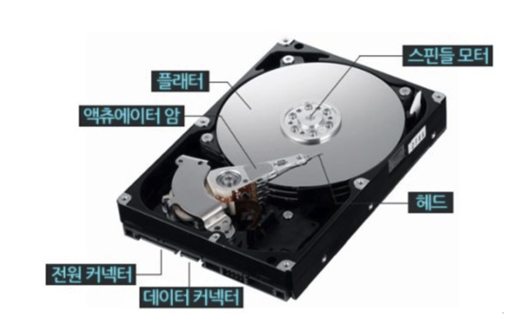
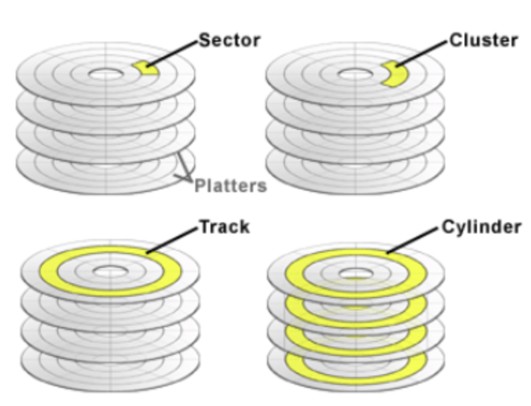
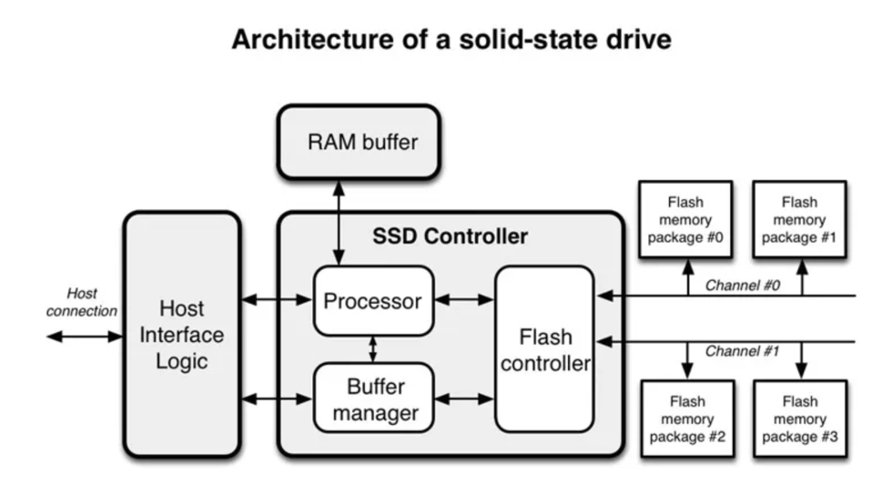
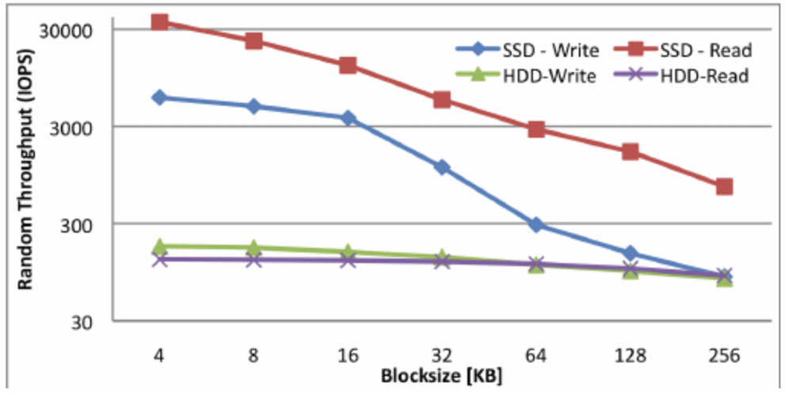

# 8.1. 디스크 읽기 방식 

> 데이터베이스의 성능 튜닝은 어떻게 디스크 I/O를 줄이느냐가 관건일 때가 상당히 많다.

## 8.1.1. 하드 디스크 드라이브(HDD)와 솔리드 스테이트 드라이브(SSD)

- 컴퓨터에서 `CPU` 나 `메모리` 같은 주요 장치는 대부분 `전자식 장치`지만 하드 디스크 드라이브는 `기계식 장치`
- 데이터베이스 서버에서는 항상 `디스크 장치가 병목`

> HDD 

- 헤드
  - `데이터를 읽어주는 역할`
- 플래터
  - 실제로 `데이터가 저장되는 곳`
- 스핀들
  - `플래터를 돌려주는 역할`
- actuator
  - 헤드가 플래터 위 데이터를 read/write 하기 위해서 `헤드를 좌우로 이동` 시킴 
    - 플래터에 데이터가 저장되며 스핀들이 플래터를 돌리며 헤드가 데이터를 읽음

> 플래터 세부 구조 

- 섹터
  - 하드디스크의 `가장 작은 저장 단위`
  - 하나의 섹터에는 한 덩어리의 데이터가 저장되고 이것들이 모여 플래터가 됨
  - 일반적으로 `512바이트`
  - 한 섹터에는 `하나의 파일만 저장 가능`
  - 하나의 파일이 `100 바이트`인 경우, 남은 `412바이트는 낭비`

- 클러스터 
  - `섹터의 묶음` 
  - 데이터를 저장하기에 하나의 섹터가 모자랄 수 있으므로 연속된 섹터에 데이터 저장
  - 데이터를 저장하려면 5개의 섹터가 필요한데 3개의 섹터만 연속되어 있다면 2개는 따로 있는 빈공간에 분산해서 저장해야함. 이런 작업이 쌓이면 분산된 곳에서 데이터를 불러와야 하기 때문에 속도가 느려짐
    - 디스크 조각모음이라는 기능을 추가해서 분산된 섹터를 모아서 이어 붙여줌

- 트랙 
  - `섹터`와 `클러스터`의 모음

- 실린더 
  - `트랙의 묶음`

> SSD 

- SSD는 HDD에서 `플래터를 제거`하고 그 대신 `플래시 메모리를 장착`
    - 디스크 원판을 기계적으로 회전시킬 필요가 없으므로 아주 빨리 데이터를 읽고 쓰기 가능
- 플래시 메모리는 전원이 공급되지 않아도 데이터가 삭제되지 않음
- 컴퓨터의 메모리(D-RAM)보다는 느리지만, HDD 보다는 훨씬 빠름

> SSD 세부 구조 

- SSD는 크게 `컨트롤러`와 `플래시 메모리` 두 부분으로 구성
  - 사용자의 요청은 `호스트 인터페이스`를 통해 SSD 에 전달
  - 컨트롤러의 `프로세서`가 `플래시 컨트롤러`로 정보 전달
  - SSD 는 자체적으로 내장된 메모리를 가지는데, 주소 매핑 정보를 저장하거나 캐시의 용도로 사용

> HDD와 SSD의 성능 차이

- `디스크의 헤더를 움직이지 않고` 한 번에 많은 데이터를 읽는 `순차 I/O` 에서는 SSD 가 HDD 보다 조금 빠르거나 거의 비슷한 성능
    - SSD 의 장점은 HDD 보다 `랜덤 I/O`가 훨씬 빠르다는 것
- 데이터베이스 서버에서 순차 I/O 작업은 그다지 비중이 크지 않고 랜덤 I/O를 통해 작은 데이터를 읽고 쓰는 작업이 대부분
    - 따라서, SSD의 장점은 `DBMS용 스토리지에 최적`

- DBMS는 버퍼풀이라는 캐시가 있기 때문에, `버퍼의 용량이 적으면 압도적으로 SSD가 SELECT 하는데 빠름`
  - 하지만, BUFFER 사이즈가 커지면 커질수록 캐싱이 되기 때문에 무조건 SSD로 바꾼다고 다이나믹하게 성능이 좋아진다고는 할 수 없음

- 일반적으론 HDD에 비해 `SSD 가 RANDOM I/O는 성능이 더 좋음`

## 8.1.2. 랜덤 I/O와 순차 I/O

- `순차 I/O`는 3개의 페이지를 디스크에 기록하기 위해 `1번 시스템 콜을 요청`하지만, `랜덤 I/O`는 3개의 페이지를 디스크에 기록하기 위해 `3번 시스템 콜을 요청`
  - 디스크에 기록해야 할 위치를 찾기 위해 `순차 I/O`는 `디스크의 헤드를 1번 움직`였고, `랜덤 I/O`는 `디스크 헤드를 3번 움직임`

- 디스크에 데이터를 쓰고 읽는 데 걸리는 시간은 `디스크 헤더를 움직여서 읽고 쓸 위치로 옮기는 단계에서 결정`
  - 디스크의 성능은 디스크 헤더의 위치 이동 없이 얼마나 많은 데이터를 한 번에 기록하느냐에 결정

- SSD는 디스크 원판을 가지지 않아서 랜덤I/O와 순차I/O의 차이가 없을 것으로 예측되지만, `SSD에서도 랜덤I/O가 전체 성능이 떨어짐`
  - 쿼리를 튜닝해서 랜덤I/O를 순차I/O로 바꿔서 실행할 방법은 많지 않으며, 일반적으로 쿼리를 튜닝하는 것은 `랜덤I/O 자체를 줄여주는 것이 목적`

- 랜덤 I/O를 줄인다는 것은 쿼리를 처리하는데 `꼭 필요한 데이터만 읽도록 쿼리를 개선하는 것`

> 큰 레코드 대부분을 읽는 작업인 경우, 인덱스를 사용하지 않고 풀테이블 스캔을 유도할 때도 있는 이유

- `인덱스 레인지 스캔`은 데이터를 읽기 위해 주로 `랜덤 I/O`를 사용하며, `풀 테이블 스캔`은 `순차 I/O`를 사용하기 때문

