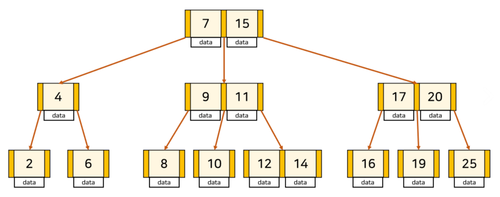
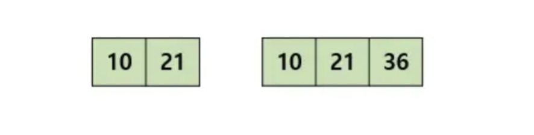
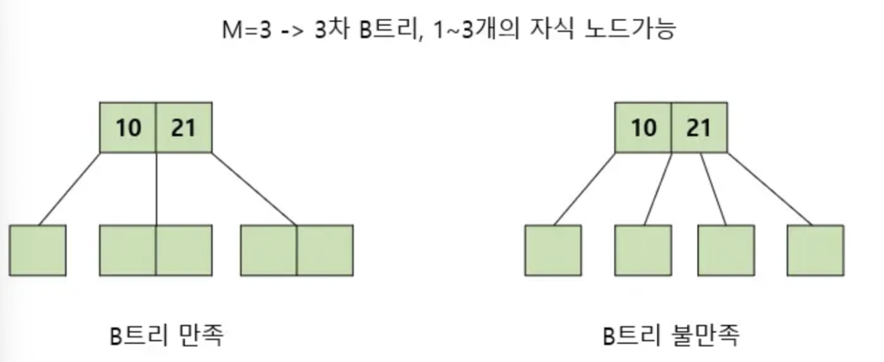
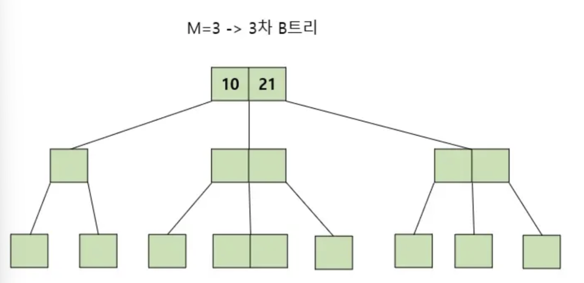
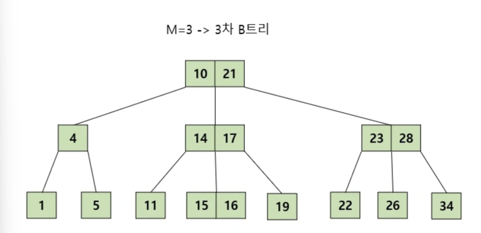
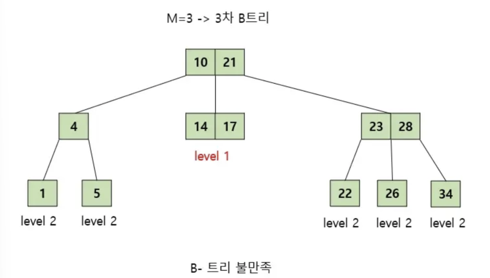
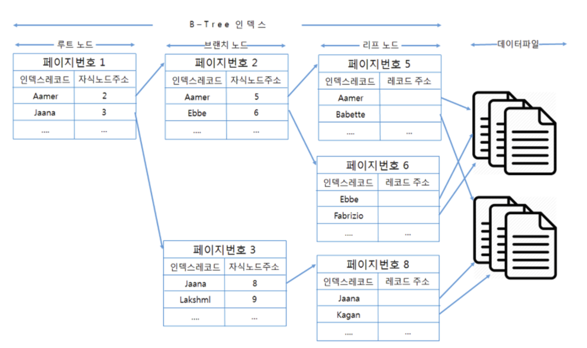
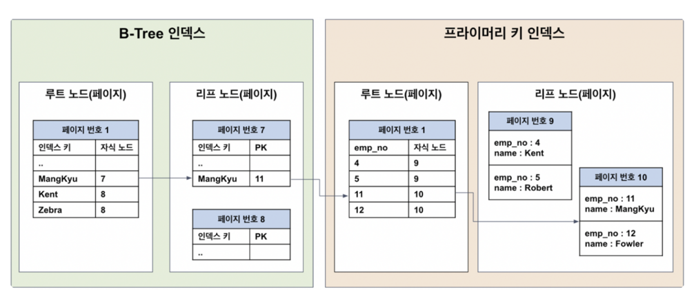

# B-Tree 인덱스

- `B-Tree` 는 데이터베이스의 인덱싱 알고리즘 가운데 `가장 일반적으로 사용되는 알고리즘`
    - B-Tree 에는 여러가지 변형된 형태의 알고리즘이 있는데, B+Tree 또는 B-Tree 가 사용
    - `B` 는 Binary(이진)의 약자가 아니라 `Balanced` 를 의미
    - 모든 `leaf node` 가 같은 `level` 로 유지되도록 자동으로 밸런스를 맞춰준다
    - B-Tree 는 `인덱스를 항상 정렬된 상태로 유지`

## B-Tree 특성 

- B-Tree는 트리 구조의 최상위에 하나의 `루트 노드`가 존재하며, 그 하위에 `자식 노드`로 구성
- 가장 하위에 있는 노드를 `리프 노드` 라고 하며 중간 노드를 `브랜치 노드`라고 함

> 노드에는 2개 이상의 데이터(key)가 들어갈 수 있으며, 항상 정렬된 상태로 저장

> 내부 노드는 M/2 ~ M 개의 자식을 가질 수 있으며, 최대 M개의 자식을 가질 수 있는 B-Tree 를 M차 B트리 라고 부름

> 특정 노드의 데이터(key)가 K개라면, 자식 노드의 개수는 k+1개 여야 함

> 특정 노드의 왼쪽 서브 트리는 key 보다 작은 값들로, 오른쪽 서브 트리는 큰 값들로 구성되어야 함

> 모든 리프 노드 들이 같은 레벨에 존재해야 함

## B-Tree 탐색 과정

- B-Tree는 루트 노드에서 탐색을 시작하여 하향식으로 탐색을 진행
  - 예 : 찾고자하는 값이 K 인 경우
    - 1. 루트 노드에서 탐색 시작
    - 2. K를 찾았다면 탐색 종료
    - 3. K와 노드의 key 값을 비교하여 알맞은 자식 노드로 내려가며 탐색
    - 4. 해당 과정을 리프 노드에 도달할 때까지 반복

## InnoDB의 B-Tree 구조 및 특성

- 인덱스의 `키 값은 모두 정렬`되어 있지만, 데이터 파일의 `레코드는 정렬되지 않고 임의의 순서로 저장`되어 있음
- 데이터 파일의 레코드는 `INSERT 된 순서대로 저장되는 것이 아니며`, 레코드가 삭제되어 빈 공간이 생긴다면, 그 다음의 INSERT는 삭제된 공간을 재활용하도록 DBMS가 설계되어 있기 때문에 `항상 INSERT된 순서로 저장되는 것은 아님`
- 인덱스는 `테이블의 키 컬럼만 가지고 있으므로`, 나머지 컬럼을 읽으려면 데이터 파일에서 해당 레코드를 찾아야 함
  - 인덱스의 `리프 노드는 (인덱스 키, PK) 쌍 구조`로 저장

## 클러스터드 인덱스, 인덱스 차이

- PK가 아닌 `인덱스로 조회하는 경우`, 데이터를 따라 리프 노드에 도달하면, 인덱스 키에 해당하는 레코드의 PK 값이 저장되어 있음
