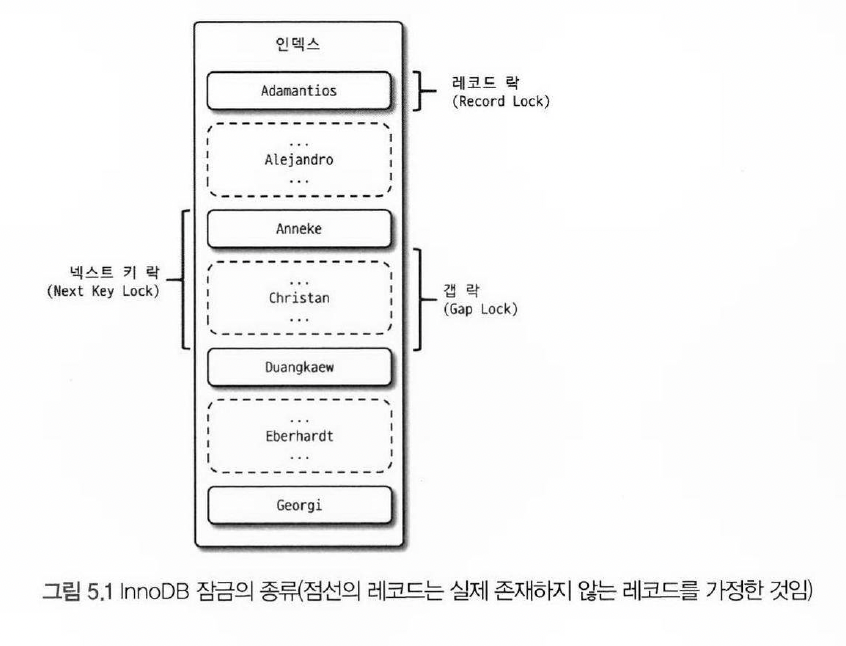

# 5.3. InnoDB 스토리지 엔진 잠금

- InnoDB 스토리지 엔진은 `레코드 기반의 잠금 방식`을 채택으로 MyISAM 대비 뛰어난 동시성 처리 기능 제공
- `information_schema` 를 사용하여 트랜잭션과 잠금, 잠금 대기 중인 트랜잭션의 목록을 조회 및 관리
  - information_schema.INNODB_TRX
  - information_schema.INNODB_LOCKS
  - information_schema.INNODB_LOCK_WAITS

- MySQL 8버전 이후 `performance schema` 를 사용한 방식 권장
  - performance_schema.data_locks
  - performance_schema.data_lock_waits

## 5.3.1 InnoDB 스토리지 엔진의 잠금

- InnoDB 에 존재하는 4가지 락 

- 

| 레코드 락 (Record Lock) 

- 레코드 자체를 잠금
- 다른 DBMS와 다른 점은 레코드 자체가 아닌 `인덱스를 통해 레코드를 잠금`. 인덱스가 없을 경우, 내부적으로 자동 생성된 `클러스터 인덱스를 사용`
- `primary key`, `unique index`의 경우 해당 레코드만 잠그며, 나머지 상황은 넥스트 키 락, 갭락을 사용하여 레코드 사이의 간격을 잠금
- 결과적으로 MySQL의 트랜잭션을 관리할 때, `최대한 인덱스를 활용하여 잠그도록 유도`해야 한다

| 갭 락 (Gap Lock)

- 다른 DBMS에 없는 락
- `레코드 자체가 아닌 레코드와 바로 인접한 레코드 사이의 간격만을 잠가서`, 새로운 레코드가 생성(INSERT) 되는 것을 제어
  - 아래 t004 예제에 따르면 2부터 4까지 락을 걸었으나 레코드가 존재하는 1부터 6까지 락이 걸림
  - 그러므로 6을 초과하는 7부터 다른 트랜잭션이 INSERT 가능

  ````sql
  -- given
  create table t004 (
     id int primary key,
     name varchar(1000)
  );
  insert into t004(id, name) values (1, 'kim'), (6, 'lee');
  
  -- tx1
  select * from t004 where id between 2 and 4 for update;
  
  -- tx2, 실패
  insert into t004 (id, name) values (3, 'choi');
  
  -- tx2, 실패
  insert into t004 (id, name) values (5, 'choi');
  
  -- tx2, 성공
  insert into t004 (id, name) values (7, 'choi');
  ````

| 넥스트 키 락 (Next Key Lock)

- `레코드 락과 갭 락을 합쳐 놓은 형태의 잠금`
- 갭 락과 넥스트 키 락은 바이너리 로그에 기록되는 쿼리가 레플리카 서버에 실행될 때, 소스 서버에 만들어 낸 결과와 동일한 결과를 만들어내도록 보장하는 것이 주 목적

| 자동 증가 락 (Auto-Increment Lock)

- MySQL의 자동 증가하는 숫자 값을 추출하기 위해 `AUTO_INCREMENT` 라는 칼럼 속성을 제공하여, 여러 레코드가 동시에 INSERT 되더라도 중복되지 않는 증가하는 숫자를 보장한다. 이를 위하여 내부적으로 `AUTO_INCREMENT 락`을 사용
- INSERT 와 REPLACE 등 `새로운 레코드를 저장하는 쿼리에서만 사용`
- AUTO_INCREMENT 값을 가져오는 순간만 락이 걸림
  - 자동 증가 락을 제어하는 방법은 없으며 대부분의 경우 자동 증가 락으로 인한 문제가 발생하지 않음
  - 하지만 자동 증가 락의 작동 방식은 변경 가능한데, 각 상황에 따라 자동 증가 락과 그것의 경량 락인 래치(뮤텍스) 중 하나를 선택 가능

- innodb_autoinc_lock_mode=0
  - 모든 INSERT 문장은 자동 증가 락을 사용
- innodb_autoinc_lock_mode=1
  - 연속 모드
    - INSERT 되는 레코드의 건수를 정확하게 예측할 수 있을 경우 자동 증가 락이 아닌 `래치를 사용`하여 성능 효과 누림
    - 다만, INSERT...SELECT 의 경우 건수를 예측할 수 없으므로 자동 증가 락을 사용
    - 자동 증가 락을 걸고 여러 개의 값을 미리 할당 받아 연속된 순서를 보장받으며, 미사용한 값은 폐기
- innodb_autoinc_lock_mode=2
  - 인터리빙 모드 
    - `항상 래치 사용`
    - INSERT...SELECT 등 건수를 예측할 수 없는 레코드의 경우 연속된 레코드 간 값이 하나 씩 증가하는 것을 보장하지 않음 
- MySQL 8.0 => 기본값 : 2

### 5.3.2 인덱스와 잠금

| MySQL 은 레코드를 잠그는 것이 아니라 인덱스를 잠금

- 따라서 변경해야 할 레코드를 찾기 위해 `검색한 인덱스의 레코드 전체에 락`을 걸어야 함

````sql
create table t003(
   id int auto_increment primary key,
   name varchar(100),
   address varchar(100),
   dt datetime,
   index ix_name(name) -- name 컬럼 index 
);
    
insert into t003(name, address) values ('lee', 'seoul'), ('kim', 'pusan'), ('kim', 'seoul'), ('lee', 'pusan');

-- tx1
update t003
set dt = now()
where name='kim' and address = 'pusan';

-- tx2
-- 정상
update t003
set dt = now()
where name = 'pusan';

-- 정상
update t003
set dt = now()
where name = 'seoul';

-- 정상
update t003
set dt = now()
where name = 'lee';

-- 락
update t003
set dt = now()
where name = 'kim';
````

- tx1가 update 를 수행했을 때, where절의 인덱스에 해당하는 레코드(name='kim')가 락이 걸림 확인 가능
- 만약 name 칼럼에도 인덱스가 없었다면 모든 레코드에 락이 걸림. 그러므로 MySQL은 인덱스 설계는 매우 중요

### 5.3.3 레코드 수준의 잠금 확인 및 해제

- InnoDB 기준으로 MySQL 엔진과 스토리지 엔진의 락이 서로 다르며, 각 각을 동시에 관리하는 것은 어려움 
- 아래 예제는 `tx1이 레코드에 대해 잠금 후 대기 중`이며, tx2와 tx3는 tx1이 `해당 레코드의 잠금을 해제할 때까지 대기 중`

````sql
create table t001 (
   id int primary key,
   name varchar(1000)
);

insert into t001(id, name) values (1, 'kim'), (2, 'lee');

-- tx1
update t001 set name = 'changed' where id = 1; -- 잠금
-- tx2
update t001 set name = 'changed' where id = 1; -- 대기 
-- tx3
update t001 set name = 'changed' where id = 1; -- 대기
````