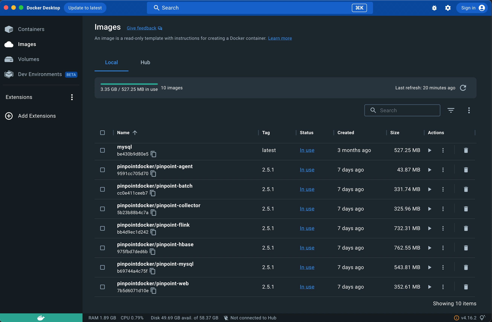
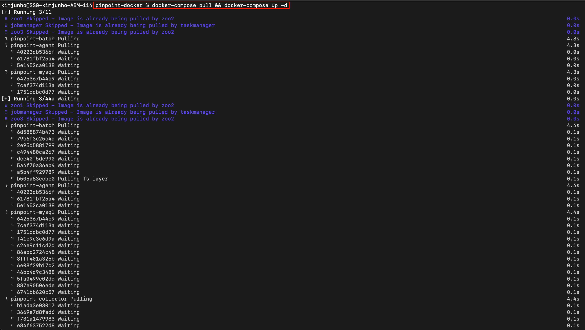
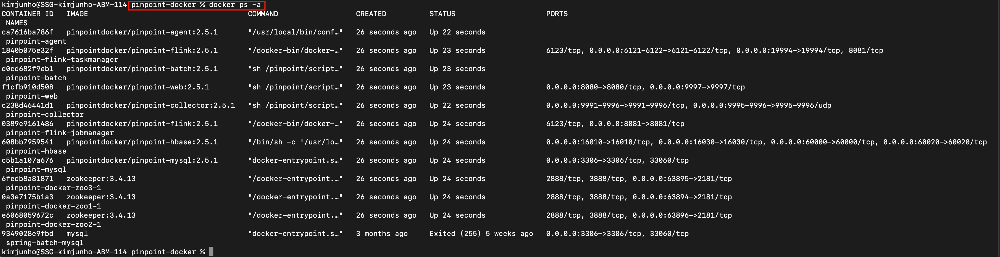
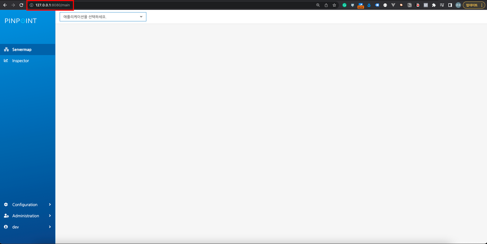
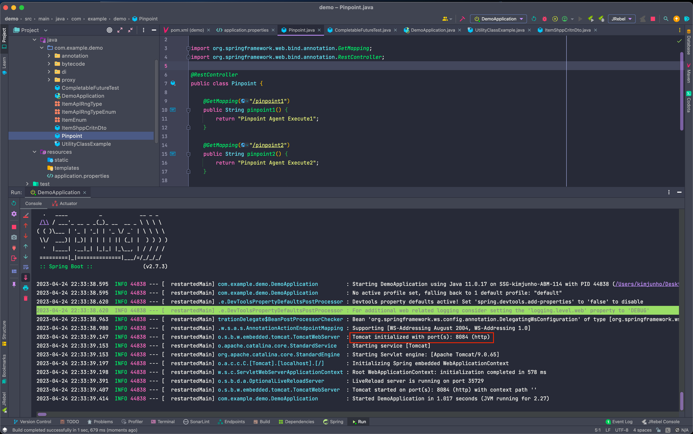
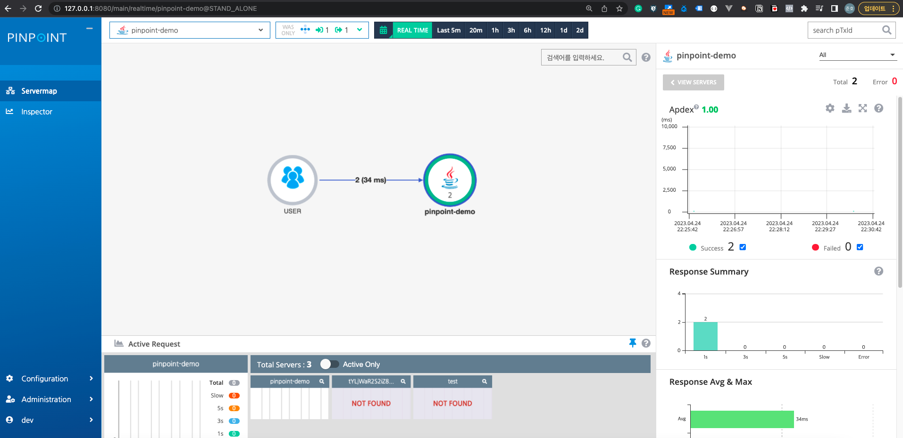
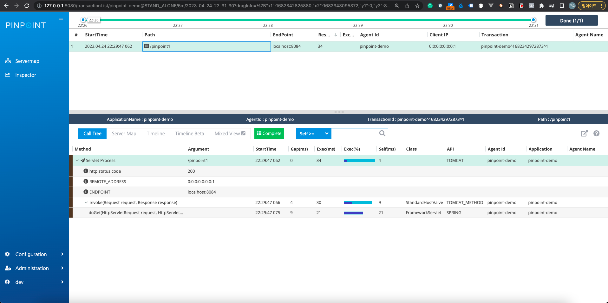

## Pinpoint - Docker 설치

### 1. 핀포인트 설치

> pinpoint-docker - clone

````shell
$ git clone https://github.com/pinpoint-apm/pinpoint-docker.git
$ cd pinpoint-docker
````

> pinpoint-agent, pinpoint-quickstart 설정 제거

````shell
$ sudo vi docker-compose.yml
````

> 실행 권한

````shell
$ sudo chmod +x /usr/local/bin/docker-compose
````

### 2. Docker Desktop 설치

> Docker Desktop 실행



> 아래 이슈 발생 시 해결 방법

- 백그라운드에서 Docker 가 실행되지 않고 있음으로 인한 이슈
  - Docker Desktop 실행 시 해결

````shell
Cannot connect to the Docker daemon at unix:///var/run/docker.sock. Is the docker daemon running?
````

### 3. docker compose 실행

> 이미지 pull 및 실행

````shell
$ docker-compose pull && docker-compose up -d
````



> docker ps -a 명령어를 통한 실행 확인



### 4. Pinpoint Web 확인

> 127.0.0.1:8080



### 5. pinpoint-agent 설치

> 로컬에서 실행 할 Spring Boot 에 agent 를 실행하기 위함

````shell
# 압축 해제
$ wget https://github.com/pinpoint-apm/pinpoint/releases/download/v2.2.0/pinpoint-agent-2.2.0.tar.gz
$ tar -zxvf pinpoint-agent-2.2.0.tar.gz

# config 설정
$ cd pinpoint-agent-2.2.0
$ sudo vi pinpoint-root.config

# AS-IS
# profiler.transport.grpc.agent.collector.ip=${profiler.transport.grpc.collector.ip}

# TO-BE (Docker를 통해 실행한 collector 의 IP)
profiler.transport.grpc.agent.collector.ip=127.0.0.1
````

> Spring Boot - Application port 변경 (docker 의 8080 포트와의 충돌 회피)

````shell
# application.properties
server.port = 8084
````

> Spring Boot - VM Option 설정

````shell
-javaagent:/Users/kimjunho/Desktop/pinpoint-agent-2.2.0/pinpoint-bootstrap-2.2.0.jar  -Dpinpoint.applicationName=pinpoint-demo   -Dpinpoint.agentId=pinpoint-demo
````

> Spring Boot 실행 및 End-Point 호출



### 6. pinpoint-web 확인

- agent 추가 유무 및 request 확인 



