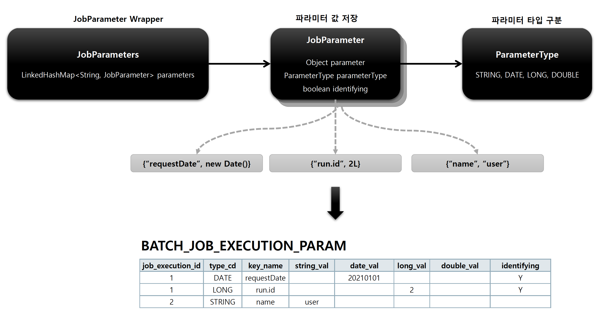

## JobParameter

### 기본 개념

- Job 을 실행할 때 함께 포함되어 사용되는 파라미터를 가진 도메인 객체
- 하나의 Job 에 존재할 수 있는 여러 개의 JobInstance 를 구분하기 위한 용도
- JobParameters 와 JobInstance 는 1:1 관계

### 생성 및 바인딩

> 어플리케이션 실행 시 주입

- Java -jar LogBatch.jar requestDate=20210101

> 코드로 생성

- JobParameterBuilder, DefaultJobParametersConverter

> SpEL 이용

- @Value(“#{ jobParameter[requestDate]}”), @JobScope, @StepScope 선언 필수

### BATCH_JOB_EXECUTION_PARAM 테이블과 매핑

- BATCH_JOB_EXECUTION 과 1:N 의 관계

> JobParameter 클래스 구조



### 1. 코드 생성 방식 예제 코드

````yml
#배치 Job 수동 실행을 위한 설정
spring:
  batch:
    job:
      enabled: false
````

````java
@Slf4j
@Configuration
@RequiredArgsConstructor
public class JobParameterConfiguration {

    private final JobBuilderFactory jobBuilderFactory;
    private final StepBuilderFactory stepBuilderFactory;

    /**
     * Job 정의
     * @return
     */
    @Bean
    public Job job() {
        return jobBuilderFactory.get("job")
                .start(step1())
                .next(step2())
                .build();
    }

    /**
     * Step 정의
     * @return
     */
    @Bean
    public Step step1() {
        return stepBuilderFactory.get("step1")
                .tasklet(new Tasklet() {
                    @Override
                    public RepeatStatus execute(StepContribution stepContribution, ChunkContext chunkContext) throws Exception {
                        log.info("[JobParameterConfiguration] - step1 execute");

                        // 1. StepContribution 를 활용한 파라미터 정보 (리턴 타입 : JobParameters)
                        JobParameters jobParameters = stepContribution.getStepExecution().getJobExecution().getJobParameters();
                        jobParameters.getString("name");
                        jobParameters.getLong("seq");
                        jobParameters.getDate("date");
                        jobParameters.getDouble("age");

                        log.info("[name] : " + jobParameters.getString("name") + " / [seq] : " + jobParameters.getLong("seq") + " / [date] : " + jobParameters.getDate("date") + " / [age] : " + jobParameters.getDouble("age"));

                        // 2. ChunkContext 를 활용한 파라미터 정보 (리턴 타입 : Map<String, Object>)
                        Map<String, Object> jobParameters1 = chunkContext.getStepContext().getJobParameters();

                        return RepeatStatus.FINISHED;
                    }
                })
                .build();
    }

    /**
     * Step 정의
     * @return
     */
    @Bean
    public Step step2() {
        return stepBuilderFactory.get("step2")
                .tasklet(new Tasklet() {
                    @Override
                    public RepeatStatus execute(StepContribution stepContribution, ChunkContext chunkContext) throws Exception {
                        log.info("[JobParameterConfiguration] - step2 execute");
                        return RepeatStatus.FINISHED;
                    }
                })
                .build();
    }
}
````

````java
@Component
@RequiredArgsConstructor
public class JobParameterTest implements ApplicationRunner {

    private final JobLauncher jobLauncher;

    private final Job job;

    @Override
    public void run(ApplicationArguments args) throws Exception {
        // 코드를 통한 파라미터 생성 및 바인딩
        JobParameters jobParameters = new JobParametersBuilder()
                .addString("name", "user1")
                .addLong("seq", 2L)
                .addDate("date", new Date())
                .addDouble("age", 20.5)
                .toJobParameters();

        jobLauncher.run(job, jobParameters);
    }
}

````

> JobParameters 데이터 코드 내부 활용

````sql
2023-01-22 14:40:33.012  INFO 23834 --- [           main] i.s.s.JobParameterConfiguration          : [name] : user1 / [seq] : 2 / [date] : Sun Jan 22 14:40:32 KST 2023 / [age] : 20.5
````

> BATCH_JOB_EXECUTION_PARAM 테이블 내 JobParameters 데이터 적재 확인


### 2. 어플리케이션 실행 시 주입 방식 예제 코드 (터미널에서 명령어를 통한 jar 실행)

````yml
#배치 Job 수동 실행을 위한 설정
spring:
  batch:
    job:
      enabled: true
````

````java
// ApplicationRunner 인터페이스 구현 클래스 컴포넌트 해제 (주석 처리)
public class JobParameterTest implements ApplicationRunner {

}
````

2-1. Maven - clean

2-2. Maven - package

- spring-batch > target > spring-batch-0.0.1-SNAPSHOT.jar 파일 확인


2-3. IDE 터미널을 통한 jar 파일 실행

> java -jar spring-batch-0.0.1-SNAPSHOT.jar 'name=user1' 'seq(long)=2l' 'date(date)=2023/01/22' 'age(double)=19.5'

- \* 싱글쿼테이션 확인

````shell
kimjunho@SSG-kimjunho-ABM-114 spring-batch % cd target

kimjunho@SSG-kimjunho-ABM-114 target % ls
classes                                         maven-archiver                                  spring-batch-0.0.1-SNAPSHOT.jar.original
generated-sources                               maven-status                                    surefire-reports
generated-test-sources                          spring-batch-0.0.1-SNAPSHOT.jar                 test-classes

kimjunho@SSG-kimjunho-ABM-114 target % java -jar spring-batch-0.0.1-SNAPSHOT.jar 'name=user1' 'seq(long)=2l' 'date(date)=2023/01/22' 'age(double)=19.5'

````

### 2. 어플리케이션 실행 시 주입 방식 예제 코드 (IDE - Parameter Arguments 입력을 통한 실행)

- Parameter Arguments 입력 후 어플리케이션 실행


