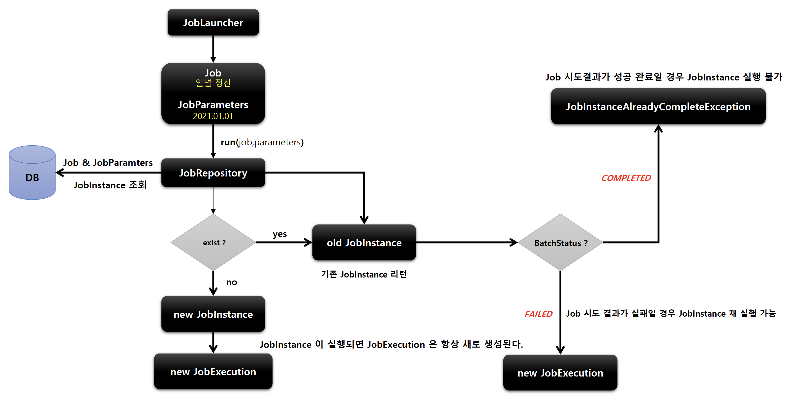

## JobExecution

### 기본 개념

- JobIstance 에 대한 한번의 시도를 의미하는 객체로서 Job 실행 중에 발생한 정보들을 저장하고 있는 객체

  - 시작시간, 종료시간 ,상태(시작됨,완료,실패),종료상태의 속성을 가짐
- JobIstance 과의 관계

  - JobExecution 은 'FAILED' 또는 'COMPLETED‘ 등의 Job 의 실행 결과 상태를 가지고 있음
  - JobExecution 의 실행 상태 결과가 'COMPLETED’ 면 JobInstance 실행이 완료된 것으로 간주해서 '재실행이 불가'함
  - JobExecution 의 실행 상태 결과가 'FAILED’ 면 JobInstance 실행이 완료되지 않은 것으로 간주해서 '재실행이 가능'함
  - JobParameter 가 동일한 값으로 Job 을 실행할지라도 JobInstance 를 계속 실행할 수 있음
  - JobExecution 의 실행 상태 결과가 'COMPLETED’ 될 때까지 하나의 JobInstance 내에서 여러 번의 시도가 생길 수 있음

### BATCH_JOB_EXECUTION 테이블과 매핑

- JobInstance 와 JobExecution 는 1:N 의 관계로, JobInstance 에 대한 성공/실패의 내역을 가지고 있음

### BATCH_JOB_EXECUTION 클래스 구조




- Job 실행 결과가 성공 완료인 경우, JobInstance 실행 불가

````java
@Slf4j
@Configuration
@RequiredArgsConstructor
public class JobExecutionConfiguration {

    private final JobBuilderFactory jobBuilderFactory;
    private final StepBuilderFactory stepBuilderFactory;


    @Bean
    public Job job() {
        return jobBuilderFactory.get("job")
                .start(step1())
                .next(step2())
                .build();
    }

    @Bean
    public Step step1() {
        return stepBuilderFactory.get("step1")
                .tasklet(new Tasklet() {
                    @Override
                    public RepeatStatus execute(StepContribution stepContribution, ChunkContext chunkContext) throws Exception {
                        log.info("[JobExecutionConfiguration] - step1 execute");
                        return RepeatStatus.FINISHED;
                    }
                })
                .build();
    }

    @Bean
    public Step step2() {
        return stepBuilderFactory.get("step2")
                .tasklet((stepContribution, chunkContext) -> {
                    log.info("[JobExecutionConfiguration] - step2 execute");
                    // 예외 발생으로 인하여 'BATCH_JOB_EXECUTION' 테이블의 'STATUS' 컬럼이 'FAILED' 로 INSERT 됨
                    throw new RuntimeException("[JobExecutionConfiguration] - step2 execute fail"); // java.lang.RuntimeException: [JobExecutionConfiguration] - step2 execute fail
                    // return RepeatStatus.FINISHED;
                })
                .build();
    }
}
````

> CONSOLE LOG

````sql
Caused by: org.springframework.batch.core.repository.JobInstanceAlreadyCompleteException: A job instance already exists and is complete for parameters={name=testuser}.  If you want to run this job again, change the parameters.
````

- Job 실행 결과가 실패인 경우, JobInstance 재실행 가능

> BATCH_JOB_INSTANCE


> BATCH_JOB_EXECUTION - STATUS : FAILED, EXIT_CODE : FAILED


> 예외 재발생으로 인하여 Job 실행 재실패 시 BATCH_JOB_EXECUTION - 재실패 데이터 INSERT


> 예외 코드 제거 후 Job 정상 실행 시 BATCH_JOB_EXECUTION - 성공 데이터 INSERT


> Job 정상 실행 후 재실행 시 'JobInstanceAlreadyCompleteException' 발생으로 인하여 재실행 불가

````sql
Caused by: org.springframework.batch.core.repository.JobInstanceAlreadyCompleteException: A job instance already exists and is complete for parameters={name=testuser}.  If you want to run this job again, change the parameters.
````

### JobExecution 성공/실패 흐름


