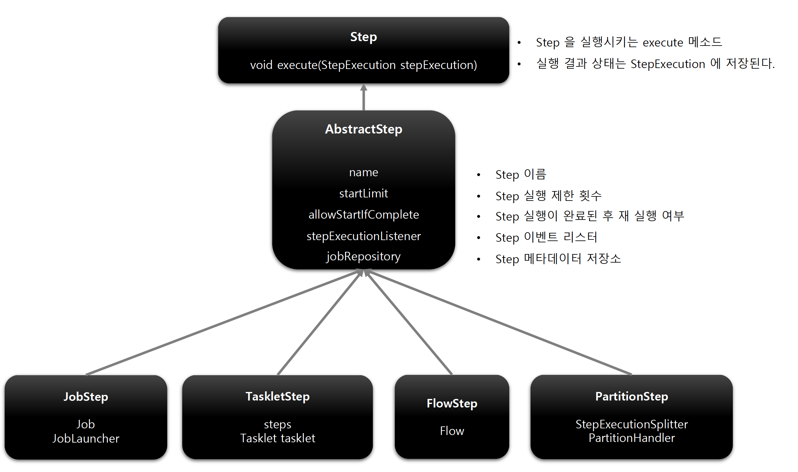
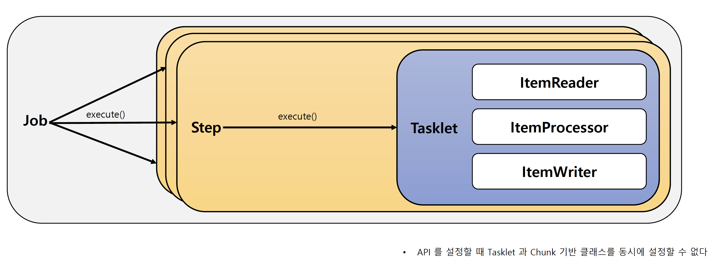
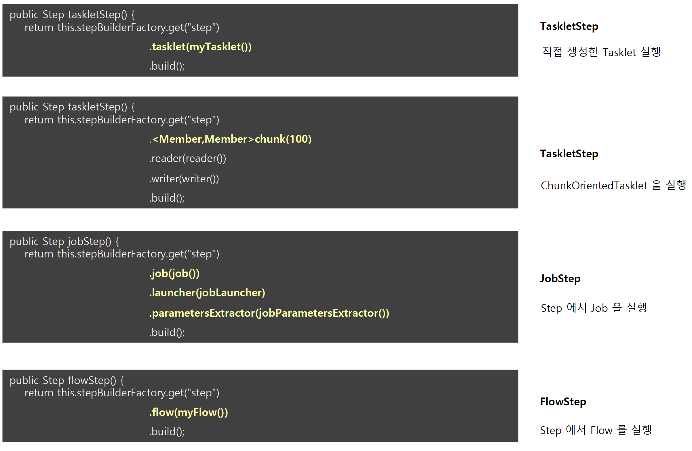

## Step

### 기본 개념

- Batch Job 을 구성하는 '독립적인 하나의 단계'로서 실제 배치 처리를 정의하고 컨트롤하는 데 필요한 모든 정보를 가지고 있는 도메인 객체
- 단순한 단일 Task 뿐 아니라 '입력'과 '처리' 그리고 '출력과 관련된 복잡한 비즈니스 로직'을 포함하는 모든 설정들 포함
- 배치 작업을 어떻게 구성하고 실행할 것인지 'Job 의 세부 작업을 Task 기반으로 설정하고 명세'해 놓은 객체
- 모든 Job 은 하나 이상의 step 으로 구성

### 기본 구현체

> TaskletStep

- 가장 기본이 되는 클래스로서 Tasklet 타입의 구현체들을 제어

> PartitionStep

- 멀티 스레드 방식으로 Step 을 여러 개로 분리해서 실행

> JobStep

- Step 내에서 Job 실행

> FlowStep

- Step 내에서 Flow 실행

### Step 클래스 구조 및 인터페이스

### API 설정에 따른 각 Step 생성 방법

