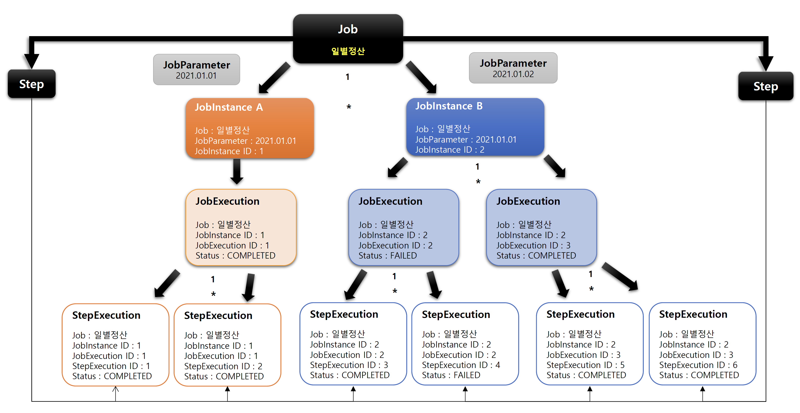

## StepExecution

### 기본 개념

- Step 에 대한 한번의 시도를 의미하는 객체로서 Step 실행 중에 발생한 정보들을 저장하고 있는 객체
  - 시작시간, 종료시간 ,상태 (시작됨, 완료, 실패), commit count, rollback count 등의 속성을 가짐
- Step 이 매번 시도될 때마다 생성되며 각 Step 별로 생성
- \* Job 이 재시작 하더라도 이미 성공적으로 완료된 Step 은 재실행되지 않고, 실패한 Step 만 실행
  - 옵션을 통해 이미 성공한 Step 도 재실행 가능하도록 설정 가능
- 이전 단계 Step 이 실패해서 현재 Step 을 실행하지 않았다면 StepExecution 을 생성하지 않는다. Step 이 실제로 시작됐을 때만 StepExecution 을 생성
- JobExecution 과의 관계
  - Step 의 StepExecution 이 모두 정상적으로 완료 되어야 JobExecution 이 정상적으로 완료
  - Step 의 StepExecution 중 하나라도 실패하면 JobExecution 은 실패

### BATCH_STEP_EXECUTION 테이블과 매핑

- JobExecution 와 StepExecution 는 1:N 의 관계
- 하나의 Job 에 여러 개의 Step 으로 구성했을 경우, 각 StepExecution 은 하나의 JobExecution 을 부모로 가짐


### StepExecution 클래스 구조


### 시나리오 기반 StepExecution 실행 예제



### 정상 실행 예제 코드

````java
@Slf4j
@Configuration
@RequiredArgsConstructor
public class StepExecutionConfiguration {

    private final JobBuilderFactory jobBuilderFactory;
    private final StepBuilderFactory stepBuilderFactory;

    @Bean
    public Job job() {
        return jobBuilderFactory.get("job")
                .start(step1())
                .next(step2())
                .next(step3())
                .build();
    }

    @Bean
    public Step step1() {
        return stepBuilderFactory.get("step1")
                .tasklet((stepContribution, chunkContext) -> {
                    log.info("[StepConfiguration] - step1 execute");
                    return RepeatStatus.FINISHED;
                })
                .build();
    }

    @Bean
    public Step step2() {
        return stepBuilderFactory.get("step2")
                .tasklet((stepContribution, chunkContext) -> {
                    log.info("[StepConfiguration] - step2 execute");
                    return RepeatStatus.FINISHED;
                })
                .build();
    }

    @Bean
    public Step step3() {
        return stepBuilderFactory.get("step3")
                .tasklet((stepContribution, chunkContext) -> {
                    log.info("[StepConfiguration] - step3 execute");
                    return RepeatStatus.FINISHED;
                })
                .build();
    }
}
````

> BATCH_STEP_EXECUTION - step1, step2, step3 모두 성공 (STATUS : COMPLETED)


### Step2 실패 예제 코드

````java
// Step2 - RuntimeException 추가
@Bean
public Step step2() {
    return stepBuilderFactory.get("step2")
            .tasklet((stepContribution, chunkContext) -> {
                log.info("[StepConfiguration] - step2 execute");
                throw new RuntimeException("[StepConfiguration] - step2 fail");
                // return RepeatStatus.FINISHED;
            })
            .build();
}
````

> BATCH_JOB_EXECUTION - FAILED (Step2 가 실패했기 때문에 Job 의 STATUS : FAILED)


> BATCH_STEP_EXECUTION - Step2 에서 예외 발생으로 인하여 해당 Step 이 실패했기 때문에 STATUS : FAILED (step3 는 step2 가 실패하였기 때문에 미수행)


### Step2 실패 케이스 재실행 예제 코드

````java
// Step2 - RuntimeException 제거
@Bean
public Step step2() {
    return stepBuilderFactory.get("step2")
            .tasklet((stepContribution, chunkContext) -> {
                log.info("[StepConfiguration] - step2 execute");
                // throw new RuntimeException("[StepConfiguration] - step2 fail");
                return RepeatStatus.FINISHED;
            })
            .build();
}
````

> BATCH_JOB_EXECUTION - 기존 Job 이 Step2 실패로 인하여 FAILED 상태였기 때문에 재실행 가능하여 재실행으로 인한 JOB_EXECUTION 데이터 신규 추가


> BATCH_STEP_EXECUTION - 예외 발생 Step2 부터 재실행 (기존 성공했던 Step1 은 미실행)


