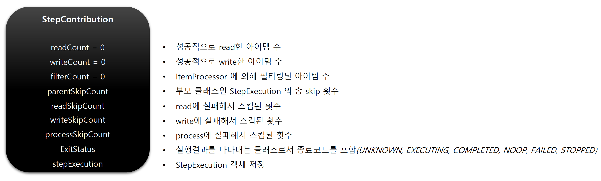
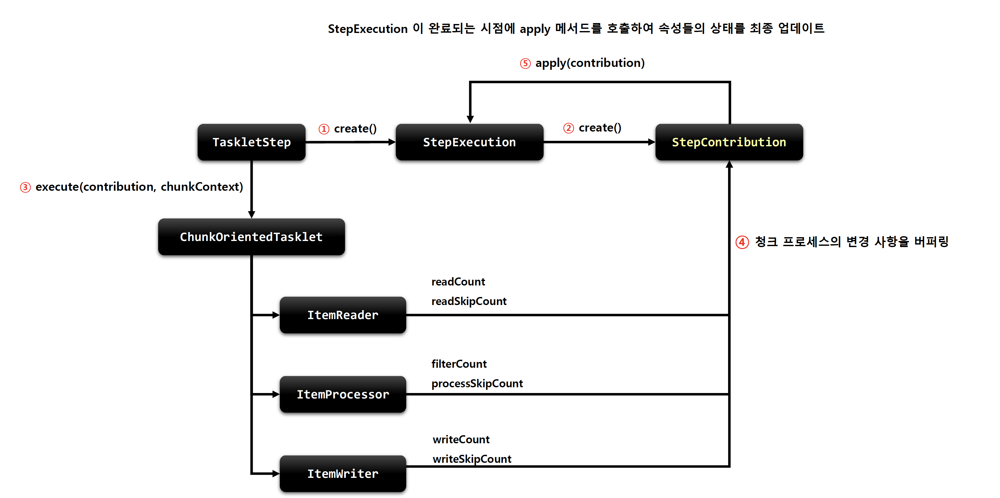

## StepContribution

### 기본 개념

- 청크 프로세스의 변경 사항을 버퍼링 한 후 'StepExecution 상태를 업데이트'하는 도메인 객체
- 청크 커밋 직전에 StepExecution 의 apply 메서드를 호출하여 '상태를 업데이트'
- ExitStatus 의 기본 종료 코드 외 사용자 정의 종료 코드를 생성해서 적용 가능

### 구조

### StepContribution 프로세스

