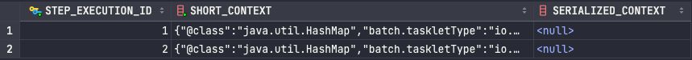
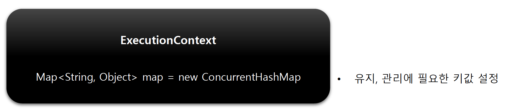
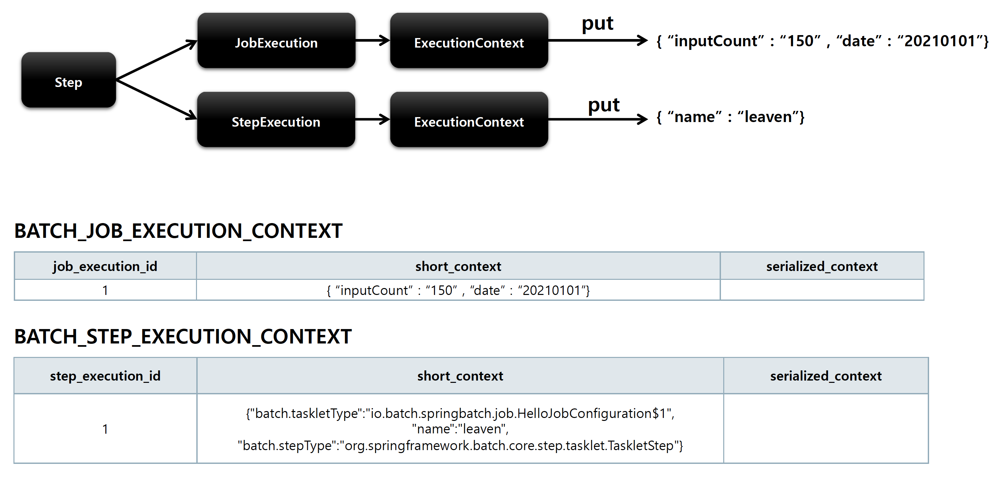

## ExecutionContext

### 기본 개념

- 프레임워크에서 유지 및 관리하는 키/값으로 된 컬렉션으로 StepExecution 또는 JobExecution 객체의 '상태(state)를 저장하는 공유 객체'
- DB 에 직렬화 한 값으로 저장됨 - { “key” : “value”}
- 공유 범위
  - Step 범위 – 각 Step 의 StepExecution 에 저장되며, Step 간 서로 공유 안 됨

    > BATCH_STEP_EXECUTION
    >

    
  - Job 범위 – 각 Job 의 JobExecution 에 저장되며, Job 간 서로 공유되지 않고, 해당 Job 의 Step 간 서로 공유됨

    > BATCH_JOB_EXECUTION
    >

    
- Job 재시작 시 이미 처리한 Row 데이터는 건너뛰고 이후로 수행하도록 할 때, 상태 정보를 활용한다

### 구조

### EXECUTION_CONTEXT 저장 흐름

