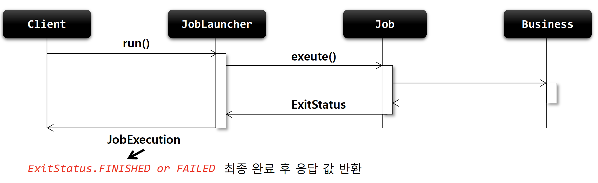
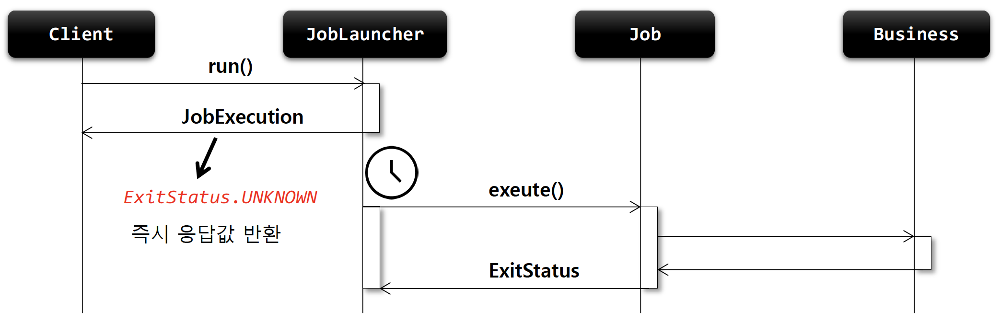

## JobLauncher

### 기본 개념

- 배치 Job 을 실행시키는 역할
- Job 과 Job Parameters 를 인자로 받으며 요청된 배치 작업을 수행한 후 최종 클라이언트에게 JobExecution 반환
- 스프링 부트 배치가 구동이 되면, JobLauncher 빈 자동 생성
- Job 실행

  > JobLauncher.run(Job, JobParameters)
  >

  - 스프링 부트 배치에서는 JobLauncherApplicationRunner 가 자동적으로 JobLauncher 실행
  - 동기 실행
    - taskExecutor 를 'SyncTaskExecutor' 로 설정할 경우 (기본값은 SyncTaskExecutor)
    - JobExecution 을 획득하고 배치 처리를 최종 완료한 이후 클라이언트에게 JobExecution 반환
    - 스케줄러에 의한 배치 처리에 적합 – 배치 처리 시간이 길어도 상관 없는 경우
  - 비동기 실행
    - taskExecutor 가 'SimpleAsyncTaskExecutor' 로 설정할 경우
    - JobExecution 을 획득한 후 클라이언트에게 바로 JobExecution 을 반환하고 내부적으로 배치 처리 진행 및 완료
    - HTTP 요청에 의한 배치 처리에 적합 – 배치 처리 시간이 길 경우 응답이 늦어지지 않도록 함

### 구조

> JobExecution run(Job, JobParameters)

### 동기 실행



````java
@Slf4j
@Configuration
@RequiredArgsConstructor
public class JobLauncherConfiguration {

    private final JobBuilderFactory jobBuilderFactory;
    private final StepBuilderFactory stepBuilderFactory;

    @Bean
    public Job job() {
        return jobBuilderFactory.get("job")
                .start(step1())
                .next(step2())
                .build();
    }

    @Bean
    public Step step1() {
        return stepBuilderFactory.get("step1")
                .tasklet(new Tasklet() {
                    @Override
                    public RepeatStatus execute(StepContribution stepContribution, ChunkContext chunkContext) throws Exception {
                        Thread.sleep(3000);
                        log.info("[JobLauncher] - step1 execute");
                        return RepeatStatus.FINISHED;
                    }
                })
                .build();
    }

    @Bean
    public Step step2() {
        return stepBuilderFactory.get("step2")
                .tasklet(new Tasklet() {
                    @Override
                    public RepeatStatus execute(StepContribution stepContribution, ChunkContext chunkContext) throws Exception {
                        log.info("[JobLauncher] - step2 execute");
                        return RepeatStatus.FINISHED;
                    }
                })
                .build();
    }

}
````

````java
@RestController
@RequiredArgsConstructor
public class JobLauncherController {

    private final Job job;
    private final JobLauncher jobLauncher;

    @PostMapping("/batch")
    public String launch(@RequestBody Member member) throws JobInstanceAlreadyCompleteException, JobExecutionAlreadyRunningException, JobParametersInvalidException, JobRestartException {

        JobParameters jobParameters = new JobParametersBuilder()
                .addString("id", member.getId())
                .addDate("date", new Date())
                .toJobParameters();

        // 1. 수동 배치 실행을 위한 설정값 변경 (application.yml > batch.enabled: false)
        // 2. web 의존성 추가 (spring-boot-starter-web)
        // 3. http 파일 작성 및 IDE 를 통한 http 호출
        jobLauncher.run(job, jobParameters);

        return "batch completed";
    }

}
````

````java
@Data
public class Member {

    private String id;

}
````

````yml
#배치 Job 수동 실행을 위한 설정
spring:
  batch:
    job:
      enabled: false
````

````http
### Send POST request with json body
POST http://localhost:8080/batch
Content-Type: application/json

{
  "id": "rest-batch-test"
}
````

````sql
-- 결과 (Job 실행 및 POST 방식으로 HTTP 호출을 통하여 전달한 파라미터 'rest-batch-test' 출력 확인)
2023-01-26 20:25:12.139  INFO 15810 --- [nio-8080-exec-1] o.s.b.c.l.support.SimpleJobLauncher      : Job: [SimpleJob: [name=job]] launched with the following parameters: [{id=rest-batch-test, date=1674732312056}]
2023-01-26 20:25:12.171  INFO 15810 --- [nio-8080-exec-1] o.s.batch.core.job.SimpleStepHandler     : Executing step: [step1]
2023-01-26 20:25:12.181  INFO 15810 --- [nio-8080-exec-1] i.s.s.j.JobLauncherConfiguration         : [JobLauncher] - step1 execute
2023-01-26 20:25:12.190  INFO 15810 --- [nio-8080-exec-1] o.s.batch.core.step.AbstractStep         : Step: [step1] executed in 19ms
2023-01-26 20:25:12.212  INFO 15810 --- [nio-8080-exec-1] o.s.batch.core.job.SimpleStepHandler     : Executing step: [step2]
2023-01-26 20:25:12.220  INFO 15810 --- [nio-8080-exec-1] i.s.s.j.JobLauncherConfiguration         : [JobLauncher] - step2 execute
2023-01-26 20:25:12.229  INFO 15810 --- [nio-8080-exec-1] o.s.batch.core.step.AbstractStep         : Step: [step2] executed in 17ms
2023-01-26 20:25:12.243  INFO 15810 --- [nio-8080-exec-1] o.s.b.c.l.support.SimpleJobLauncher      : Job: [SimpleJob: [name=job]] completed with the following parameters: [{id=rest-batch-test, date=1674732312056}] and the following status: [COMPLETED] in 91ms
````

````http
// 동기 방식이기 때문에 Thread.sleep 으로 설정한 3초 후 Response 확인
http://localhost:8080/batch

HTTP/1.1 200
Content-Type: text/plain;charset=UTF-8
Content-Length: 15
Date: Thu, 26 Jan 2023 11:25:12 GMT
Keep-Alive: timeout=60
Connection: keep-alive

batch completed

Response code: 200; Time: 258ms; Content length: 15 bytes
````

### 비동기 실행



````java
/**
 * 동기/비동기 실행
 */
@RestController
@RequiredArgsConstructor
public class JobLauncherController {

    private final Job job;
    // private final JobLauncher jobLauncher; // 동기 실행
    private final BasicBatchConfigurer basicBatchConfigurer; // 비동기 실행

    @PostMapping("/batch")
    public String launch(@RequestBody Member member) throws JobInstanceAlreadyCompleteException, JobExecutionAlreadyRunningException, JobParametersInvalidException, JobRestartException {

        JobParameters jobParameters = new JobParametersBuilder()
                .addString("id", member.getId())
                .addDate("date", new Date())
                .toJobParameters();

        // - 비동기 실행
        SimpleJobLauncher jobLauncher = (SimpleJobLauncher)basicBatchConfigurer.getJobLauncher();
        jobLauncher.setTaskExecutor(new SimpleAsyncTaskExecutor());
        jobLauncher.run(job, jobParameters);

        // - 동기 실행
        // 1. 수동 배치 실행을 위한 설정값 변경 (application.yml > batch.enabled: false)
        // 2. web 의존성 추가 (spring-boot-starter-web)
        // 3. http 파일 작성 및 IDE 를 통한 http 호출
        // this.jobLauncher.run(job, jobParameters);

        return "batch completed";
    }

}

````

````http
// 비동기 방식이기 때문에 Thread.sleep 으로 설정한 3초와 무관하게 Response 즉시 확인 (11:38:51)
http://localhost:8080/batch

HTTP/1.1 200
Content-Type: text/plain;charset=UTF-8
Content-Length: 15
Date: Thu, 26 Jan 2023 11:38:51 GMT
Keep-Alive: timeout=60
Connection: keep-alive

batch completed

Response code: 200; Time: 141ms; Content length: 15 bytes
````

````sql
-- 20:38:51.999 -> 20:38:55.043 약 3초 후 실행
2023-01-26 20:38:51.987  INFO 18465 --- [cTaskExecutor-1] o.s.batch.core.job.SimpleStepHandler     : Executing step: [step1]
2023-01-26 20:38:51.999  INFO 18465 --- [cTaskExecutor-1] i.s.s.j.JobLauncherConfiguration         : [JobLauncher] - step1 execute
2023-01-26 20:38:55.043  INFO 18465 --- [cTaskExecutor-1] o.s.batch.core.step.AbstractStep         : Step: [step1] executed in 3s56ms
2023-01-26 20:38:55.084  INFO 18465 --- [cTaskExecutor-1] o.s.batch.core.job.SimpleStepHandler     : Executing step: [step2]
2023-01-26 20:38:55.092  INFO 18465 --- [cTaskExecutor-1] i.s.s.j.JobLauncherConfiguration         : [JobLauncher] - step2 execute
2023-01-26 20:38:55.100  INFO 18465 --- [cTaskExecutor-1] o.s.batch.core.step.AbstractStep         : Step: [step2] executed in 16ms
````
