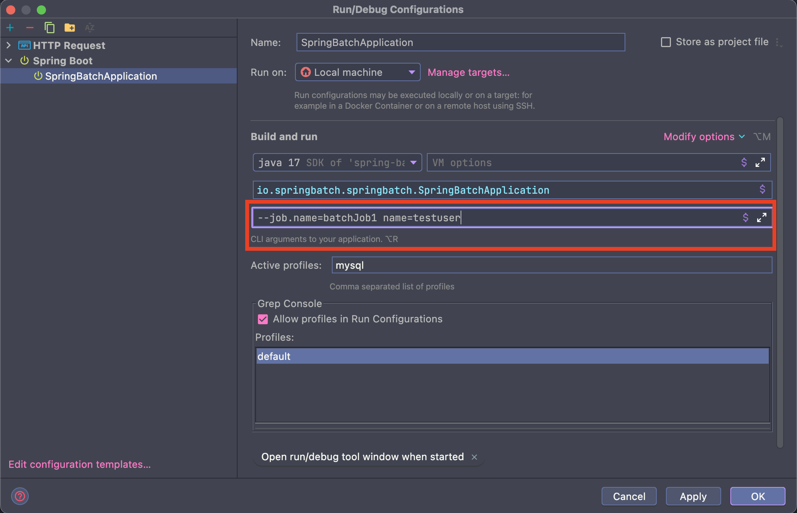

## 배치 초기화 설정

### JobLauncherApplicationRunner

- Spring Batch 작업을 시작하는 ApplicationRunner 로서 BatchAutoConfiguration 에서 생성됨
- Spring Boot 에서 제공하는 ApplicationRunner 의 구현체 (어플리케이션이 정상적으로 구동되자 마자 실행됨)
- 기본적으로 빈으로 등록된 모든 Job 실행


### BatchProperties

- Spring Batch 의 환경 설정 클래스
- Job 이름, 스키마 초기화 설정, 테이블 Prefix 등의 값 설정 가능
- application.properties 또는 application.yml 파일에 설정

````yml
spring:
  batch:
    job:
      # 바인딩 된 값이 없는 경우, 기본값 : NONE 으로 수행
      names: ${job.name:NONE}
      # 자동 실행 여부 (기본값 :true)
      enabled: false
    jdbc:
      # 테이블 스키마 생성
      initialize-schema: NEVER
      # 테이블 prefix (기본값 : BATCH_) - 해당 설정값 변경 시 테이블명도 변경 필요
      tablePrefix: SYSTEM_
````

### Job 실행 옵션

- 특정 Batch Job 만 실행 가능

> 방법 1. yml/properties 설정을 통한 특정 Batch Job 실행

````yml
spring:
  batch:
    job:
      # 1. 아래 설정 후 실행 시 없는 Job 이기 때문에 미실행 (스프링 부트는 실행되지만, Job 은 수행되지 않음 - 없는 Job 이기 때문)
      # names: batchJob2
      # 2. 아래 설정 후 실행 시 실행
      names: batchJob1
````

````java
@Slf4j
@Configuration
@RequiredArgsConstructor
public class DomainJobConfiguration {
    private final JobBuilderFactory jobBuilderFactory;
    private final StepBuilderFactory stepBuilderFactory;

    @Bean
    public Job batchJob1() {
        return jobBuilderFactory.get("batchJob1")
                .incrementer(new RunIdIncrementer())
                .start(step1())
                .next(step2())
                .build();
    }

    @Bean
    public Step step1() {
        return stepBuilderFactory.get("step1")
                .tasklet(new Tasklet() {
                    @Override
                    public RepeatStatus execute(StepContribution stepContribution, ChunkContext chunkContext) throws Exception {
                        log.info("[Job] - step1 execute");
                        return RepeatStatus.FINISHED;
                    }
                })
                .build();
    }

    @Bean
    public Step step2() {
        return stepBuilderFactory.get("step2")
                .tasklet(new Tasklet() {
                    @Override
                    public RepeatStatus execute(StepContribution stepContribution, ChunkContext chunkContext) throws Exception {
                        log.info("[Job] - step2 execute");
                        return RepeatStatus.FINISHED;
                    }
                })
                .build();
    }
}
````

> 방법 2. Application 실행 시 'Program arguments' 로 Job 이름 입력

- --job.name=helloJob
- --job.name=helloJob, simpleJob (하나 이상의 Job 실행 시 콤마로 구분)

> 2-1. yml/properties 설정

````yml
# batch.job 바인딩 설정
spring:
  batch:
    job:
      names: ${job.name:NONE}
````

> 2-2. IDE > Edit Configurations > Program arguments

- --job.name=batchJob1




### Job 동시 실행

````java
@Slf4j
@Configuration
@RequiredArgsConstructor
public class DomainJobConfiguration {
    private final JobBuilderFactory jobBuilderFactory;
    private final StepBuilderFactory stepBuilderFactory;

    @Bean
    public Job batchJob1() {
        return jobBuilderFactory.get("batchJob1")
                .incrementer(new RunIdIncrementer())
                .start(step1())
                .next(step2())
                .build();
    }

    @Bean
    public Step step1() {
        return stepBuilderFactory.get("step1")
                .tasklet(new Tasklet() {
                    @Override
                    public RepeatStatus execute(StepContribution stepContribution, ChunkContext chunkContext) throws Exception {
                        log.info("[DomainJobConfiguration] - step1 execute");
                        return RepeatStatus.FINISHED;
                    }
                })
                .build();
    }

    @Bean
    public Step step2() {
        return stepBuilderFactory.get("step2")
                .tasklet(new Tasklet() {
                    @Override
                    public RepeatStatus execute(StepContribution stepContribution, ChunkContext chunkContext) throws Exception {
                        log.info("[DomainJobConfiguration] - step2 execute");
                        return RepeatStatus.FINISHED;
                    }
                })
                .build();
    }
}
````
````java
@Slf4j
@Configuration
@RequiredArgsConstructor
public class DomainJobConfiguration2 {
    private final JobBuilderFactory jobBuilderFactory;
    private final StepBuilderFactory stepBuilderFactory;

    @Bean
    public Job batchJob2() {
        return jobBuilderFactory.get("batchJob2")
                .incrementer(new RunIdIncrementer())
                .start(step3())
                .next(step4())
                .build();
    }

    @Bean
    public Step step3() {
        return stepBuilderFactory.get("step3")
                .tasklet(new Tasklet() {
                    @Override
                    public RepeatStatus execute(StepContribution stepContribution, ChunkContext chunkContext) throws Exception {
                        log.info("[DomainJobConfiguration2] - step3 execute");
                        return RepeatStatus.FINISHED;
                    }
                })
                .build();
    }

    @Bean
    public Step step4() {
        return stepBuilderFactory.get("step4")
                .tasklet(new Tasklet() {
                    @Override
                    public RepeatStatus execute(StepContribution stepContribution, ChunkContext chunkContext) throws Exception {
                        log.info("[DomainJobConfiguration2] - step4 execute");
                        return RepeatStatus.FINISHED;
                    }
                })
                .build();
    }
}
````

````shell
# Program arguments
--job.name=batchJob1,batchJob2 name=testuser
````

````sql
-- 동시 실행 결과
2023-01-26 23:53:19.923  INFO 50731 --- [           main] o.s.b.a.b.JobLauncherApplicationRunner   : Running default command line with: [name=testuser]
2023-01-26 23:53:20.017  INFO 50731 --- [           main] o.s.b.c.l.support.SimpleJobLauncher      : Job: [SimpleJob: [name=batchJob1]] launched with the following parameters: [{name=testuser, run.id=5}]
2023-01-26 23:53:20.045  INFO 50731 --- [           main] o.s.batch.core.job.SimpleStepHandler     : Executing step: [step1]
2023-01-26 23:53:20.060  INFO 50731 --- [           main] i.s.s.job.DomainJobConfiguration         : [DomainJobConfiguration] - step1 execute
2023-01-26 23:53:20.069  INFO 50731 --- [           main] o.s.batch.core.step.AbstractStep         : Step: [step1] executed in 24ms
2023-01-26 23:53:20.088  INFO 50731 --- [           main] o.s.batch.core.job.SimpleStepHandler     : Executing step: [step2]
2023-01-26 23:53:20.104  INFO 50731 --- [           main] i.s.s.job.DomainJobConfiguration         : [DomainJobConfiguration] - step2 execute
2023-01-26 23:53:20.111  INFO 50731 --- [           main] o.s.batch.core.step.AbstractStep         : Step: [step2] executed in 23ms
2023-01-26 23:53:20.122  INFO 50731 --- [           main] o.s.b.c.l.support.SimpleJobLauncher      : Job: [SimpleJob: [name=batchJob1]] completed with the following parameters: [{name=testuser, run.id=5}] and the following status: [COMPLETED] in 94ms
2023-01-26 23:53:20.146  INFO 50731 --- [           main] o.s.b.c.l.support.SimpleJobLauncher      : Job: [SimpleJob: [name=batchJob2]] launched with the following parameters: [{name=testuser, run.id=1}]
2023-01-26 23:53:20.162  INFO 50731 --- [           main] o.s.batch.core.job.SimpleStepHandler     : Executing step: [step3]
2023-01-26 23:53:20.171  INFO 50731 --- [           main] i.s.s.job.DomainJobConfiguration2        : [DomainJobConfiguration2] - step3 execute
2023-01-26 23:53:20.178  INFO 50731 --- [           main] o.s.batch.core.step.AbstractStep         : Step: [step3] executed in 16ms
2023-01-26 23:53:20.197  INFO 50731 --- [           main] o.s.batch.core.job.SimpleStepHandler     : Executing step: [step4]
2023-01-26 23:53:20.205  INFO 50731 --- [           main] i.s.s.job.DomainJobConfiguration2        : [DomainJobConfiguration2] - step4 execute
2023-01-26 23:53:20.211  INFO 50731 --- [           main] o.s.batch.core.step.AbstractStep         : Step: [step4] executed in 14ms
2023-01-26 23:53:20.221  INFO 50731 --- [           main] o.s.b.c.l.support.SimpleJobLauncher      : Job: [SimpleJob: [name=batchJob2]] completed with the following parameters: [{name=testuser, run.id=1}] and the following status: [COMPLETED] in 71ms
````
