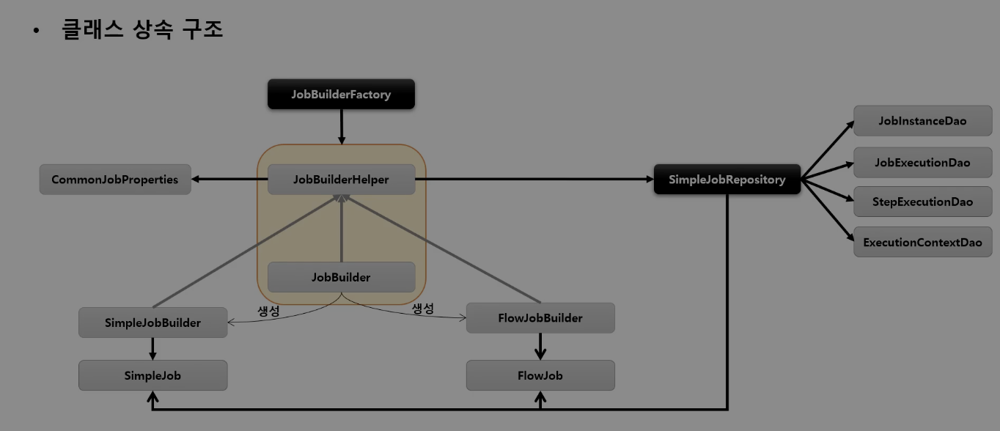

## JobBuilderFactory

1. 스프링 배치는 Job 과 Step 을 쉽게 생성 및 설정할 수 있도록 util 성격의 빌더 클래스들을 제공

2. JobBuilderFactory

- JobBuilder 를 생성하는 팩토리 클래스로서 `get(String name)` 메소드 제공
- JobBuilderFactory.get("jobName")
    - jobName 은 스프링 배치가 Job 을 실행시킬 때, 참조하는 Job 의 이름

3. JobBuilder

- Job 을 구성하는 설정 조건에 따라 2개의 하위 빌더 클래스를 생성하고, 실제 Job 생성을 위임

> SimpleJobBuilder

- SimpleJob 을 생성하는 Builder 클래스
- Job 실행과 관련된 여러 설정 API 제공

> FlowJobBuilder

- FlowJob 을 생성하는 Builder 클래스
- 내부적으로 FlowBuilder 를 반환함으로써 Flow 실행과 관련된 여러 설정 API 제공

### 클래스 상속 구조



- JobBuilder 가 생성되는 클래스간의 계층 및 구조를 명확하게 이해하면, Job Configuration 을 구성할 때 도움
- JobRepository 는 빌더 클래스를 통해 Job 객체 (SimpleJob, FlowJob)에 전달되어 메타데이터를 기록하는데 사용


### SimpleJobBuilder, FlowJobBuilder 실습

````java
@RequiredArgsConstructor
@Configuration
public class JobConfiguration {

    private final JobBuilderFactory jobBuilderFactory;
    private final StepBuilderFactory stepBuilderFactory;


    // SimpleJobBuilder
    @Bean
    public Job batchJob1() {
        return this.jobBuilderFactory.get("batchJob1")
                .start(step1())
                .next(step2())
                .build();
    }

    @Bean
    public Step step1() {
        return stepBuilderFactory.get("step1")
                .tasklet(new Tasklet() {
                    @Override
                    public RepeatStatus execute(StepContribution stepContribution, ChunkContext chunkContext) throws Exception {
                        System.out.println("step1 has executed");
                        return RepeatStatus.FINISHED;
                    }
                })
                .build();
    }

    @Bean
    public Step step2() {
        return stepBuilderFactory.get("step2")
                .tasklet(new Tasklet() {
                    @Override
                    public RepeatStatus execute(StepContribution stepContribution, ChunkContext chunkContext) throws Exception {
                        System.out.println("step2 has executed");
                        return RepeatStatus.FINISHED;
                    }
                })
                .build();
    }


    // FlowBuilder
    @Bean
    public Job batchJob2() {
        return this.jobBuilderFactory.get("batchJob2")
                .start(flow())
                .next(step5())
                .end()
                .build();
    }

    @Bean
    public Flow flow() {
        FlowBuilder<Flow> flowBuilder = new FlowBuilder<>("flow");
        flowBuilder.start(step3())
                .next(step4())
                .end();

        return flowBuilder.build();
    }

    @Bean
    public Step step3() {
        return stepBuilderFactory.get("step3")
                .tasklet(new Tasklet() {
                    @Override
                    public RepeatStatus execute(StepContribution stepContribution, ChunkContext chunkContext) throws Exception {
                        System.out.println("step3 has executed");
                        return RepeatStatus.FINISHED;
                    }
                })
                .build();
    }

    @Bean
    public Step step4() {
        return stepBuilderFactory.get("step4")
                .tasklet(new Tasklet() {
                    @Override
                    public RepeatStatus execute(StepContribution stepContribution, ChunkContext chunkContext) throws Exception {
                        System.out.println("step4 has executed");
                        return RepeatStatus.FINISHED;
                    }
                })
                .build();
    }

    @Bean
    public Step step5() {
        return stepBuilderFactory.get("step5")
                .tasklet(new Tasklet() {
                    @Override
                    public RepeatStatus execute(StepContribution stepContribution, ChunkContext chunkContext) throws Exception {
                        System.out.println("step5 has executed");
                        return RepeatStatus.FINISHED;
                    }
                })
                .build();
    }
}

````
