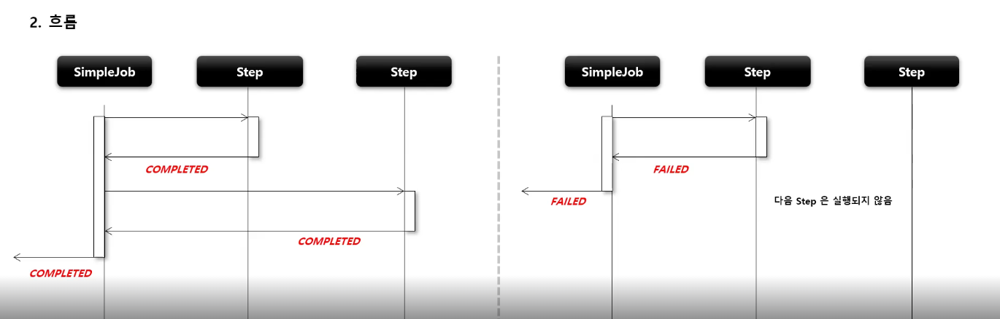
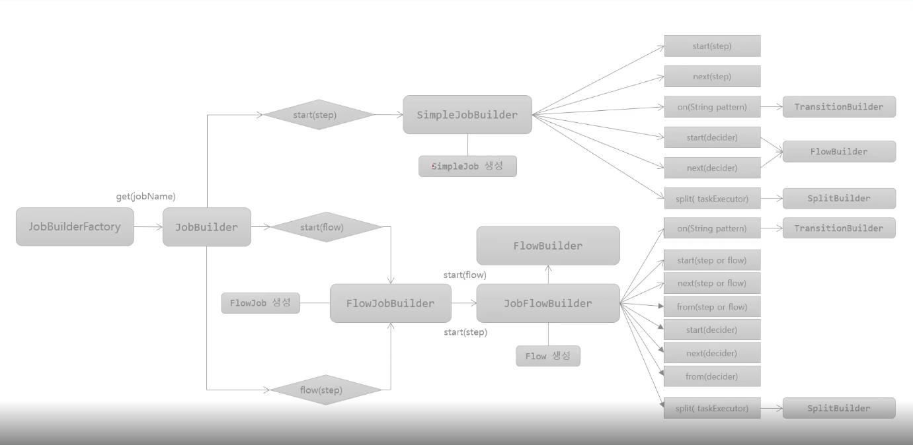

## SimpleJob

1. 기본 개념

- SimpleJob 은 Step 을 실행시키는 Job 의 구현체로서 SimpleJobBuilder 에 의해 생성
- 여러 단계의 Step 으로 구성할 수 있으며, Step 을 순차적으로 실행
- 모든 Step 의 실행이 성공적으로 완료되어야 Job 이 성공적으로 완료
- 제일 마지막에 실행한 Step 의 BatchStatus 가 해당 Job 의 최종 BatchStatus

2. 흐름



- 좌측은 성공, 우측은 실패 케이스

3. 개념 및 API

> JobBuilderFactory > JobBuilder > SimpleJobBuilder > SimpleJob

````java
public Job batchJob() {
    return JobBuilderFactory.get("batchJob") // JobBuilder 를 생성하는 팩토리, Job 의 이름을 매개변수로 받음
            .start(Step) // 처음으로 실행 할 Step 설정 (최초 한번 설정, 해당 메소드 실행 시, SimpleJobBuilder 반환)
            .next(Step) // 다음에 실행 할 Step 설정 (횟수는 제한이 없으며, 모든 next() 의 Step 이 종료가 되면 Job 이 종료)
            .incrementer(JobParametersIncrementer) // JobParameter 의 값을 자동으로 증가시켜주는 JobParametersIncrementer 설정
            .preventRestart(true) // Job 의 재시작 가능 여부 설정 (기본값 true)
            .validator(JobParameterValidator) // JobParameter 를 실행하기 전에 올바른 구성이 되었는지 검증하는 JobParameterValidator 설정
            .listener(JobExecutionListener) // Job 라이프 사이클의 특정 시점에 콜백을 제공 받도록 JobExecutionListener 설정
            .build(); // SimpleJob 생성
}
````

4. JobBuilderFactory 흐름



