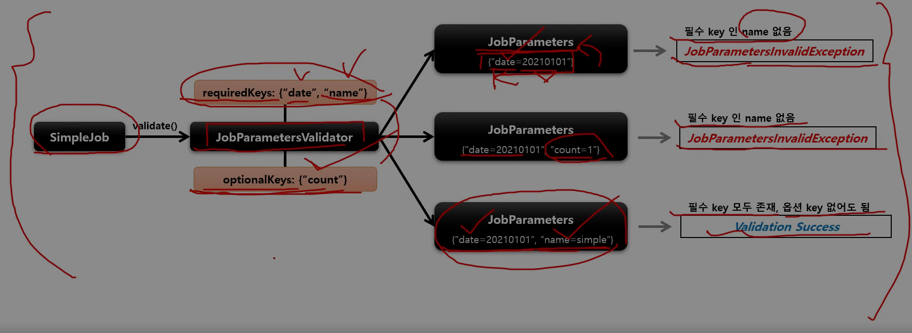

## SimpleJob - validator

1. 기본 개념

- Job 실행에 꼭 필요한 파라미터를 검증하는 용도
- DefaultJobParametersValidator 구현체를 지원하며, 좀 더 복잡한 제약 조건이 있다면 인터페이스를 직접 구현할 수도 있음

2. 구조

> void validate(@Nullable Jobparameters parameters) // JobParameters 값을 매개변수로 받아 검증


````java
// validator
public Job batchJob() {
    return JobBuilderFactory.get("batchJob")
            .start(Step)
            .next(Step)
            .incrementer(JobParametersIncrementer)
            .preventRestart(true)
            .validator(JobParameterValidator) // JobParameter 를 실행하기 전에 올바른 구성이 되었는지 검증하는 JobParameterValidator 설정
            .listener(JobExecutionListener)
            .build();
}
````

3. DefaultJobParametersValidator 흐름도



4. 커스텀 validator 실습

````java
public class CustomJobParametersValidator implements JobParametersValidator {

    @Override
    public void validate(JobParameters jobParameters) throws JobParametersInvalidException {

        // Program Argument 로 name 값이 입력되지 않은 경우, JobParametersInvalidException 발생
        if (jobParameters.getString("name") == null) {
            throw new JobParametersInvalidException("name parameters is not found");
        }
    }

}
````

````java
@Slf4j
@Configuration
@RequiredArgsConstructor
public class ValidatorConfiguration {

    private final JobBuilderFactory jobBuilderFactory;
    private final StepBuilderFactory stepBuilderFactory;

    @Bean
    public Job batchJob() {
        return jobBuilderFactory.get("batchJob")
                .start(step1())
                .next(step2())
                .next(step3())
                .validator(new CustomJobParametersValidator())
                .build();
    }

    @Bean
    public Step step1() {
        return stepBuilderFactory.get("step1")
                .tasklet(new Tasklet() {
                    @Override
                    public RepeatStatus execute(StepContribution stepContribution, ChunkContext chunkContext) throws Exception {
                        log.info("[ValidatorConfiguration] - step1 execute");
                        return RepeatStatus.FINISHED;
                    }
                })
                .build();
    }

    @Bean
    public Step step2() {
        return stepBuilderFactory.get("step2")
                .tasklet(new Tasklet() {
                    @Override
                    public RepeatStatus execute(StepContribution stepContribution, ChunkContext chunkContext) throws Exception {
                        log.info("[ValidatorConfiguration] - step2 execute");
                        return RepeatStatus.FINISHED;
                    }
                })
                .build();
    }

    @Bean
    public Step step3() {
        return stepBuilderFactory.get("step3")
                .tasklet(new Tasklet() {
                    @Override
                    public RepeatStatus execute(StepContribution stepContribution, ChunkContext chunkContext) throws Exception {
                        log.info("[ValidatorConfiguration] - step3 execute");
                        return RepeatStatus.FINISHED;
                    }
                })
                .build();
    }

}
````

5. DefaultJobParametersValidator 실습


````java
// name, date 가 필수 파라미터이기 때문에 2개 모두 입력 받아야 validator - pass, 1개라도 필수 파라미터가 입력되지 않은 경우, JobParametersInvalidException 발생
@Slf4j
@Configuration
@RequiredArgsConstructor
public class ValidatorConfiguration {

    private final JobBuilderFactory jobBuilderFactory;
    private final StepBuilderFactory stepBuilderFactory;

    @Bean
    public Job batchJob() {
        return jobBuilderFactory.get("batchJob")
                .start(step1())
                .next(step2())
                .next(step3())
                .validator(new DefaultJobParametersValidator(new String[]{"name", "date"}, new String[]{"count"})) // 1번째 파라미터 : required, 2번째 파라미터 : optional
                .build();
    }

    @Bean
    public Step step1() {
        return stepBuilderFactory.get("step1")
                .tasklet(new Tasklet() {
                    @Override
                    public RepeatStatus execute(StepContribution stepContribution, ChunkContext chunkContext) throws Exception {
                        log.info("[ValidatorConfiguration] - step1 execute");
                        return RepeatStatus.FINISHED;
                    }
                })
                .build();
    }

    @Bean
    public Step step2() {
        return stepBuilderFactory.get("step2")
                .tasklet(new Tasklet() {
                    @Override
                    public RepeatStatus execute(StepContribution stepContribution, ChunkContext chunkContext) throws Exception {
                        log.info("[ValidatorConfiguration] - step2 execute");
                        return RepeatStatus.FINISHED;
                    }
                })
                .build();
    }

    @Bean
    public Step step3() {
        return stepBuilderFactory.get("step3")
                .tasklet(new Tasklet() {
                    @Override
                    public RepeatStatus execute(StepContribution stepContribution, ChunkContext chunkContext) throws Exception {
                        log.info("[ValidatorConfiguration] - step3 execute");
                        return RepeatStatus.FINISHED;
                    }
                })
                .build();
    }

}
````
