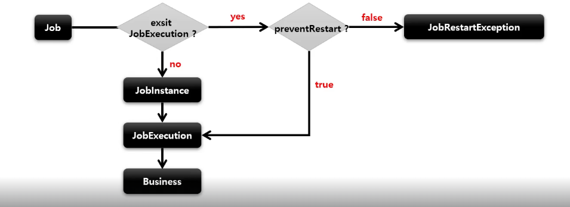

## SimpleJob - preventRestart

1. 기본 개념

- Job 의 재시작 여부 설정
- 기본값은 true 이며, false 로 설정 시, 해당 Job 에 대해 재시작을 지원하지 않음
- Job 이 실패하더라도 재시작이 안 되며, Job 을 재시작하고자 하는 경우, `JobRestartException` 발생
- 재시작과 관련 있는 기능으로 Job 을 처음 실행하는 것과는 관련 없음

2. 흐름도



- Job 의 실행이 처음이 아닌 경우 (재시작), Job 의 성공/실패와 상관없이 오직 preventRestart 설정 값에 따라 실행 여부 판단


````java
// validator
public Job batchJob() {
    return JobBuilderFactory.get("batchJob")
            .start(Step)
            .next(Step)
            .incrementer(JobParametersIncrementer)
            .preventRestart() // 재시작을 하지 않음 (restartable = false)
            .validator(JobParameterValidator)
            .listener(JobExecutionListener)
            .build();
}
````

3. 실습

````java
@Slf4j
@Configuration
@RequiredArgsConstructor
public class PreventRestartConfiguration {

    private final JobBuilderFactory jobBuilderFactory;
    private final StepBuilderFactory stepBuilderFactory;

    @Bean
    public Job batchJob() {
        return jobBuilderFactory.get("batchJob")
                .start(step1())
                .next(step2())
                .preventRestart()
                .build();
    }

    @Bean
    public Step step1() {
        return stepBuilderFactory.get("step1")
                .tasklet(new Tasklet() {
                    @Override
                    public RepeatStatus execute(StepContribution stepContribution, ChunkContext chunkContext) throws Exception {
                        log.info("[ValidatorConfiguration] - step1 execute");
                        return RepeatStatus.FINISHED;
                    }
                })
                .build();
    }

    @Bean
    public Step step2() {
        return stepBuilderFactory.get("step2")
                .tasklet(new Tasklet() {
                    @Override
                    public RepeatStatus execute(StepContribution stepContribution, ChunkContext chunkContext) throws Exception {
                        log.info("[ValidatorConfiguration] - step2 execute");
                        return RepeatStatus.FINISHED;
                    }
                })
                .build();
    }

}
````
