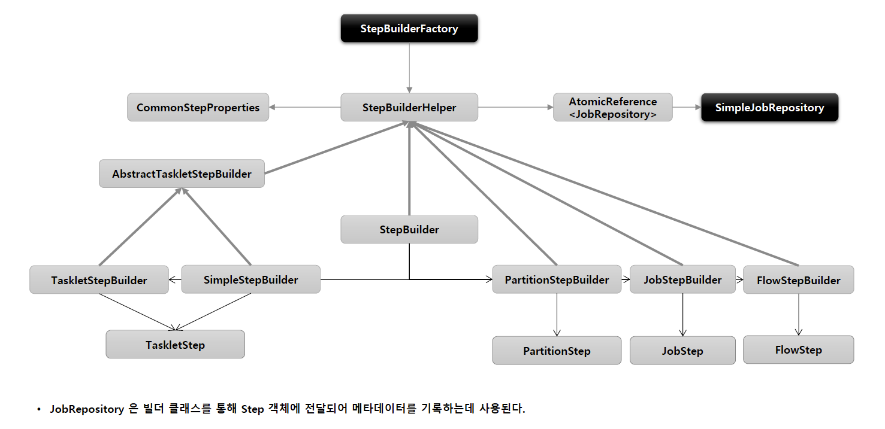

## StepBuilderFactory / StepBuilder

### 1. StepBuilderFactory

- StepBuilder 를 생성하는 팩토리 클래스로서 `get(String name)` 메소드 제공
- StepBuilderFactory.get("stepName")
    - "stepName" 으로 Step 을 구성

- 

### 2. StepBuilder

- Step 을 구성하는 설정 조건에 따라 5개의 하위 빌더 클래스를 생성하고 실제 Step 생성을 위임한다.

> TaskletStepBuilder

- TaskletStep 을 생성하는 기본 빌더 클래스

> SimpleStepBuilder

- TaskletStep 을 생성하며 내부적으로 청크 기반의 작업을 처리하는 `ChunkOrientedTasklet` 클래스를 생성한다.

> PartitionStepBuilder

- PartitionStep 을 생성하며 멀티 쓰레드 방식으로 Job 을 실행한다.

> JobStepBuilder

- JobStep 을 생성하여 Step 안에서 Job 을 실행한다.
- Step 에서 Job 을 실행

> FlowStepBuilder

- FlowStep 을 생성하여 Step 안에서 Flow 를 실행한다.

### 3. StepBuilderFactory 상속 구조

- 

### 4. 실습

// 설정한 API 따라 하위 빌더 클래스 및 Step 생성
````java
@Slf4j
@Configuration
@RequiredArgsConstructor
public class StepBuilderConfiguration {

    private final JobBuilderFactory jobBuilderFactory;
    private final StepBuilderFactory stepBuilderFactory;

    @Bean
    public Job batchJob() {
        return jobBuilderFactory.get("batchJob")
                .incrementer(new RunIdIncrementer())
                .start(step1())
                .next(step2())
                .next(step3())
                .build();
    }

    // TaskletStepBuilder
    @Bean
    public Step step1() {
        return stepBuilderFactory.get("step1")
                .tasklet((contribution, chunkContext) -> { // *
                    System.out.println("step1 has executed");
                    return RepeatStatus.FINISHED;
                })
                .build();
    }

    // SimpleStepBuilder
    @Bean
    public Step step2() {
        return stepBuilderFactory.get("step2")
                .<String, String>chunk(3) // *
                .reader(new ItemReader<String>() {
                    @Override
                    public String read() throws Exception, UnexpectedInputException, ParseException, NonTransientResourceException {
                        return null;
                    }
                })
                .processor(new ItemProcessor<String, String>() {
                    @Override
                    public String process(String item) throws Exception {
                        return null;
                    }
                })
                .writer(new ItemWriter<String>() {
                    @Override
                    public void write(List<? extends String> items) throws Exception {

                    }
                })
                .build();
    }

    // PartitionStepBuilder
    @Bean
    public Step step3() {
        return stepBuilderFactory.get("step3")
                .partitioner(step1()) // *
                .gridSize(2)
                .build();
    }

    // JobStepBuilder
    @Bean
    public Step step4() {
        return stepBuilderFactory.get("step4")
                .job(job()) // *
                .build();
    }

    // FlowStepBuilder
    @Bean
    public Step step5() {
        return stepBuilderFactory.get("step5")
                .flow(flow()) // *
                .build();
    }

    // Flow
    @Bean
    public Flow flow() {
        FlowBuilder<Flow> flowBuilder = new FlowBuilder<>("flow");
        flowBuilder.start(step2()).end();

        return flowBuilder.build();
    }

}
````
