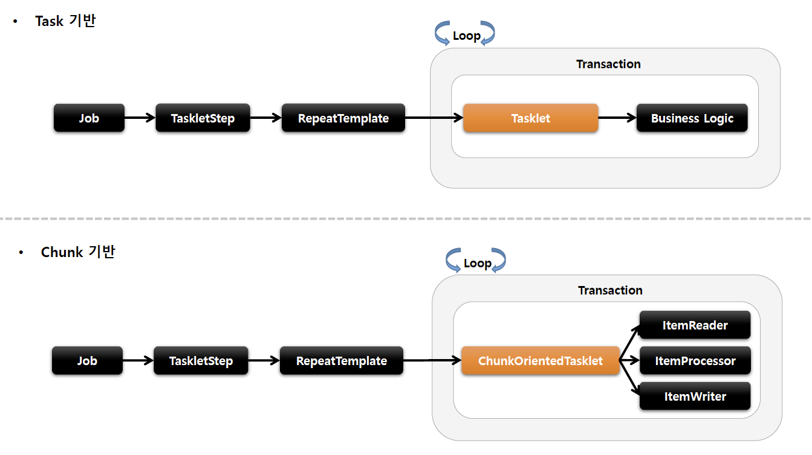

## TaskletStep - 개념 및 API 소개

### 1. 개념 및 API 소개

1. 기본 개념

- 스프링 배치에서 제공하는 Step 의 구현체로서 Tasklet 을 실행시키는 도메인 객체
- RepeatTemplate 를 사용해서 Tasklet 의 구문을 트랜잭션 경계 내에서 반복해서 실행함
- Task 기반과 Chunk 기반으로 나누어서 Tasklet 을 실행함

2. Task vs Chunk 기반 비교

> 스프링 배치에서 Step 의 실행 단위는 크게 2가지로 나누어짐

- 1. Chunk 기반
    - 하나의 큰 덩어리를 n개씩 나눠서 실행한다는 의미로 대량 처리를 하는 경우 효과적으로 설계 됨
    - ItemReader, ItemProcessor, ItemWriter 를 사용하며, Chunk 기반 전용 Tasklet 인 ChunkOrientedTasklet 구현체가 제공된다.

- 2. Task 기반
    - ItemReader 와 ItemWriter 와 같은 Chunk 기반의 작업 보다 단일 작업 기반으로 처리되는 것이 더 효율적인 경우
    - 주로 Tasklet 구현체를 만들어서 사용
    - 대량 처리를 하는 경우, Chunk 기반에 비해 더 복잡한 구현 필요

- 3. Task 기반 vs Chunk 기반 차이

    - 

### 2. API 설정

````java
public Step batchStep() {
    return stepBuilderFactory.get("batchStep") // StepBuilder 를 생성하는 팩토리, Step 의 이름을 매개변수로 받는다.
        .tasklet(Tasklet)                      // Tasklet 클래스 설정, 해당 메소드를 실행하면 TaskletStepBuilder 반환
        .startLimit(10)                        // Step 의 실행 횟수를 설정, 설정한 만큼 실행되고 초과 시 오류 발생, 기본값은 INTEGER.MAX_VALUE
        .allowStartIfComplete(true)            // Step 의 성공, 실패와 상관없이 항상 Step 을 실행하기 위한 설정
        .listener(StepExecutionListener)       // Step 라이프 사이클의 특정 시점에 콜백을 제공 받도록 StepExecutionListener 설정
        .build();                              // TaskletStep 생성
}
````

> Task 기반으로 TaskletStep 생성

````java
public Step step() {
    return this.stepBuilderFactory.get("step")
        .tasklet(myTasklet()) // *
        .build();
}
````

> Chunk 기반으로 TaskletStep 생성

````java
public Step step() {
    return this.stepBuilderFactory.get("step")
        .<String, String>chunk(100) // *
        .reader()
        .writer()
        .build();
}
````

### 3. 실습

````java
@Slf4j
@Configuration
@RequiredArgsConstructor
public class TaskletStepConfiguration {

    private final JobBuilderFactory jobBuilderFactory;
    private final StepBuilderFactory stepBuilderFactory;

    @Bean
    public Job job() {
        return jobBuilderFactory.get("job")
                .incrementer(new RunIdIncrementer())
                // .start(taskStep()) // 단일 Tasklet 실행
                .start(chunkStep()) // ChunkOrientedTasklet 실행
                .build();
    }

    @Bean
    public Step taskStep() {
        return stepBuilderFactory.get("taskStep")
                .tasklet(new Tasklet() {
                    @Override
                    public RepeatStatus execute(StepContribution stepContribution, ChunkContext chunkContext) throws Exception {
                        log.info("taskStep execute");
                        return RepeatStatus.FINISHED;
                    }
                })
                .build();
    }

    @Bean
    public Step chunkStep() {
        return stepBuilderFactory.get("chunkStep")
                .<String, String>chunk(10)
                .reader(new ListItemReader<>(Arrays.asList("item1", "item2", "item3", "item4", "item5")))
                .processor(new ItemProcessor<String, String>() {
                    @Override
                    public String process(String item) throws Exception {
                        return item.toUpperCase();
                    }
                })
                .writer(new ItemWriter<String>() {
                    @Override
                    public void write(List<? extends String> items) throws Exception {
                        item.forEach(item -> System.out.println(item));
                    }
                })
                .build();
    }
}
````
