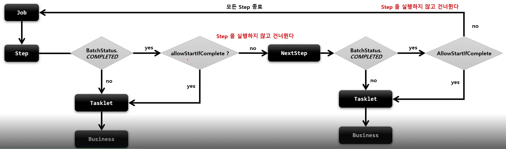

## TaskletStep - startLimit, allowStartIfComplete

> startLimit()

### 1. 기본 개념

- Step 의 실행 횟수 조정 가능
- Step 마다 설정 가능
- startLimit 설정값을 초과해서 재실행 시, `StartLimitExceededException` 발생
- 디폴트값 : `Integer.MAX_VALUE`

### 2. API

````java
public Step batchStep() {
    return stepBuilderFactory.get("batchStep")
            .tasklet(Tasklet)
            .startLimit(10)
            .allowStartIfComplete(true)
            .listener(StepExecutionListener)
            .build();
}
````

> allowStartIfComplete()

### 1. 기본 개념

- 재시작 가능한 Job 에서 `Step 의 이전 성공 여부와 상관없이 어떠한 경우라도 항상 Step 을 실행하기 위한 설정`
- 실행 마다 `유효성을 검증`하는 Step 이나 사전 작업이 꼭 필요한 Step 등
- 기본적으로 `COMPLETED` 상태를 가진 Step 은 Job 재시작 시, 실행하지 않고 Skip
- allowStartIfComplete(true) 로 설정된 Step 은 `BatchStatus.COMPLETED` 이더라도 항상 실행

### 2. 흐름도

- 

### 3. API

````java
public Step batchStep() {
    return stepBuilderFactory.get("batchStep")
            .tasklet(Tasklet)
            .startLimit(10)
            .allowStartIfComplete(true)
            .listener(StepExecutionListener)
            .build();
}
````

### 4. 실습

````java
public class LimitAllowConfiguration {

    private final JobBuilderFactory jobBuilderFactory;
    private final StepBuilderFactory stepBuilderFactory;

    @Bean
    public Job batchJob() {
        return this.jobBuilderFactory.get("batchJob")
                .incrementer(new RunIdIncrementer())
                .start(step1())
                .next(step2())
                .build();
    }

    @Bean
    public Step step1() {
        return stepBuilderFactory.get("step1")
                .tasklet(new Tasklet() {
                    @Override
                    public RepeatStatus execute(StepContribution contribution, ChunkContext chunkContext) throws Exception {
                        System.out.println("stepContribution = " + stepContribution + ", chunkContext = " + chunkContext);
                        return RepeatStatus.FINISHED;
                    }
                })
                .allowStartIfComplete(true) // step2 실패에 의한 Job 실패 이후 Job 재실행 시, 해당 옵션이 false 인 경우에는 재실행 되지 않지만, true 인 경우에는 항상 재실행되어 step1 재실행
                .build();
    }

    @Bean
    public Step step2() {
        return stepBuilderFactory.get("step2")
                .tasklet(new Tasklet() {
                    @Override
                    public RepeatStatus execute(StepContribution contribution, ChunkContext chunkContext) throws Exception {
                        System.out.println("stepContribution = " + stepContribution + ", chunkContext = " + chunkContext);

                        // Meta DB 상태 1. - Job:Fail / Step1:complete, Step2:Fail
                        // Meta DB 상태 2. - JOB:Fail / Step2:Fail (* 1번에서 이미 Step1 은 complete 되었기 때문에 재실행 되지 않음)
                        // Meta DB 상태 3. - JOB:Fail / Step2:Fail (* 1번에서 이미 Step1 은 complete 되었기 때문에 재실행 되지 않음)
                        // Meta DB 상태 4. - BATCH_JOB_EXECUTION 테이블 > EXIT_MESSAGE : org.springframework.batch.core.StartLimitExceededException ...
                        throw new RuntimeException("step2 was failed"); // startLimit 확인을 위한 Exception 강제 발생
                    }
                })
                .startLimit(3) // 3번째까지만 재실행 가능
                .build();
    }

}
````
