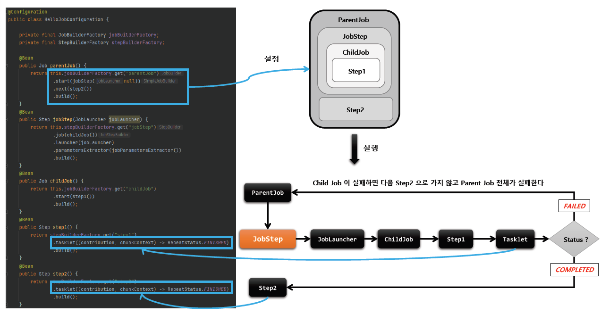

## JobStep

### 1. 기본 개념

- Job 에 속하는 Step 중 외부의 Job 을 포함하고 있는 Step
- 외부의 Job 이 실패하면 해당 Step 이 실패하므로 결국 최종 기본 Job 도 실패
- 모든 메타데이터는 `기본 Job` 과 `외부 Job` 별로 각각 저장
- 커다란 시스템을 작은 모듈로 쪼개고, Job 의 흐름을 관리하고자 할 때 사용 가능

### 2. API 소개

````java
StepBuilderFactory > StepBuilder > JobStepBuilder > JobStep
````

````java
public Step JobStep() {
    return StepBuilderFactory.get("jobStep") // StepBuilder 를 생성하는 팩토리로 Step 의 이름을 매개변수로 받음
        .job(Job) // JobStep 내에서 실행 될 Job 설정 (JobStepBuilder 반환)
        .launcher(JobLauncher) // Job 을 실행할 JobLauncher 설정
        .parametersExtractor(JobParametersExtractor) // Step 의 ExecutionContext 를 Job 이 실행되는데 필요한 JobParameters 로 변환
        .build(); // JobStep 생성
}
````

### 3. 실습

````java
@RequiredArgsConstructor
@Configuration
public class JobStepConfiguration {

    private final JobBuilderFactory jobBuilderFactory;
    private final StepBuilderFactory stepBuilderFactory;

    // 1. parentJob
    // 2. childJob
    // 3. step1
    // 4. step2

    @Bean
    public Job parentJob() {
        return this.jobBuilderFactory.get("parentJob")
                .start(jobStep(null))
                .next(step2())
                .build();
    }

    @Bean
    public Step jobStep(JobLauncher jobLauncher) {
        return this.stepBuilderFactory.get("jobStep")
                .job(childJob())
                .launcher(jobLauncher)
                .parametersExtractor(jobParametersExtractor())
                .listener(new StepExecutionListener(){
                    @Override
                    public void beforeStep(StepExecution stepExecution) {
                        stepExecution.getExecutionContext().putString("name", "user1");
                    }

                    @Override
                    public ExitStatus afterStep(StepExecution stepExecution) {
                        return null;
                    }
                })
                .build();
    }

    private DefaultJobParametersExtractor jobParametersExtractor() {
        DefaultJobParametersExtractor extractor = new DefaultJobParametersExtractor();
        extractor.setKeys(new String[]{ "name" }); // executeContext 의 name 에 해당하는 값을 추출

        return extractor;
    }

    @Bean
    public Job childJob() {
        return this.jobBuilderFactory.get("childJob")
                .start(step1())
                .build();
    }

    @Bean
    public Step step1() {
        return stepBuilderFactory.get("step1")
                .tasklet((contribution, chunkContext) -> RepeatStatus.FINISHED)
                .build();
    }

    @Bean
    public Step step2() {
        return stepBuilderFactory.get("step2")
                .tasklet((contribution, chunkContext) -> RepeatStatus.FINISHED)
                .build();
    }
}
````

### 4. 실습 JobStep 구조



