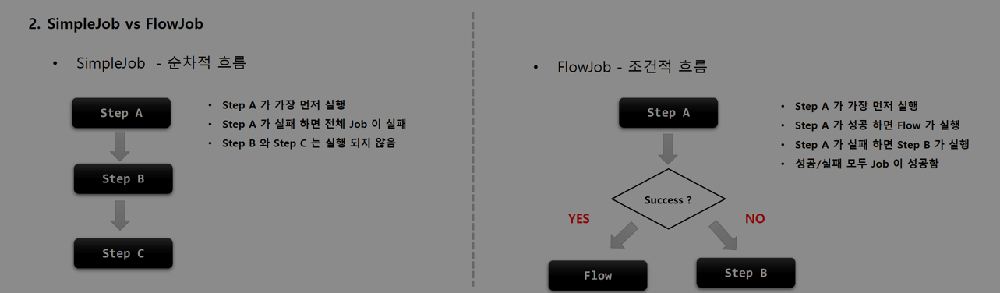

## FlowJob

### 1. 개념 및 API 소개

> 기본 개념

- Step 을 순차적으로만 구성하는 것이 아닌 특정한 상태에 따라 흐름을 전환하도록 구성할 수 있으며 `FlowJobBuilder` 에 의해 생성
  - Step 이 실패하더라도 Job 은 실패로 끝나지 않도록 해야 하는 경우
  - Step 이 성공 했을 때, 다음에 실행 해야 할 Step 을 구분해서 실행 해야 하는 경우
  - 특정 Step 은 전혀 실행되지 않게 구성 해야 하는 경우
- Flow 와 Job 의 흐름을 구성하는데만 관여하고, 실제 비즈니스 로직은 Step 에서 이루어짐
- 내부적으로 `SimpleFlow` 객체를 포함하고 있으며 Job 실행 시 호출

> SimpleJob vs FlowJob

- SimpleJob
    - 순차적 흐름

- FlowJob
    - 조건적 흐름



> API

- Flow : 흐름을 정의하는 역할
    - start()
    - from()
    - next()

- Transition : 조건에 따라 흐름을 전환시키는 역할
    - on()
    - to()
    - stop(), fail(), end(), stopAndRestart()

````java
// JobBuilderFactory > JobBuilder > JobFlowBuilder > FlowBuilder > FlowJob
public Job batchJob() {
    return jobBuilderFactory.get("batchJob")
        .start(Step) // Flow 시작하는 Step 설정
        .on(String pattern) // Step 의 실행 결과로 돌려받는 종료상태 (ExitStatus) 를 캐치하여 매칭하는 패턴, TransitionBuilder 반환
        .to(Step) // 다음으로 이동할 Step 지정
        .stop() / fail() / end() / stopAndRestart() // Flow 를 중지, 실패, 종료하도록 Flow 종료 처리
        .from(Step) // 이전 단계에서 정의한 Step 의 Flow 를 추가적으로 정의
        .next(Step) // 다음으로 이동할 Step 지정
        .end() // build() 앞에 위치하면 FlowBuilder 를 종료하고 SimpleFlow 객체 생성
        .build() // FlowJob 을 생성하고, flow 필드에 SimpleFlow 저장
}
````

### 2. 실습

````java
@RequiredArgsConstructor
@Configuration
public class FlowJobConfiguration {

    private final JobBuilderFactory jobBuilderFactory;
    private final StepBuilderFactory stepBuilderFactory;

    @Bean
    public Job batchJob() {
        return jobBuilderFactory.get("batchJob")
                .start(step1())
                .on("COMPLETED").to(step3()) // step1 성공 시, step3 실행
                .from(step1())
                .on("FAILED").to(step2()) // step1 실패 시, step2 실행
                .end() // 종료
                .build();
    }

    @Bean
    public Step step1() {
        return stepBuilderFactory.get("step1")
                .tasklet(new Tasklet() {
                    @Override
                    public RepeatStatus execute(StepContribution contribution, ChunkContext chunkContext) throws Exception {
                        System.out.println("step1 has executed");
                        return RepeatStatus.FINISHED;
                    }
                }
                .build();
    }

    @Bean
    public Step step2() {
        return stepBuilderFactory.get("step2")
                .tasklet(new Tasklet() {
                    @Override
                    public RepeatStatus execute(StepContribution contribution, ChunkContext chunkContext) throws Exception {
                        System.out.println("step2 has executed");
                        return RepeatStatus.FINISHED;
                    }
                }
                .build();
    }

    @Bean
    public Step step3() {
        return stepBuilderFactory.get("step3")
                .tasklet(new Tasklet() {
                    @Override
                    public RepeatStatus execute(StepContribution contribution, ChunkContext chunkContext) throws Exception {
                        System.out.println("step3 has executed");
                        return RepeatStatus.FINISHED;
                    }
                }
                .build();
    }
}
````
