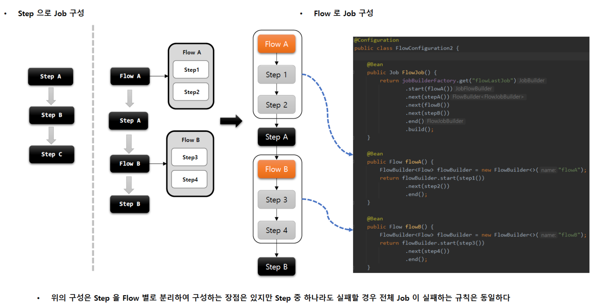

## FlowJob - start(), next()


````java
public Job batchJob() {
    return jobBuilderFactory.get("batchJob")
        .start(Flow or Step) // Flow 이 인자로 오게 되는 경우, JobFlowBuilder 반환 (Step 이 인자로 오게 되는 경우, SimpleJobBuilder 반환)
        .next(Step or Flow or JobExecutionDecider)
        .on(String pattern)
        .to(Step)
        .stop() / fail() / end() / stopAndRestart()
        .from(Step)
        .end()
        .build()
}
````




### 실습

````java
// Flow 를 단순히 start/next 만 사용하여 Step 처럼 사용하는 예시 (flow 내 Step 이 하나라도 실패 할 경우, Job 은 실패 처리 - BATCH_JOB_EXECUTION)

// 실행 결과
// 1. step1 has executed
// 2. step2 has executed
// 3. step3 has executed
// 4. step4 has executed
// 5. step5 has executed
// 6. step6 has executed

@RequiredArgsConstructor
@Configuration
public class StartNextConfiguration {

    private final JobBuilderFactory jobBuilderFactory;
    private final StepBuilderFactory stepBuilderFactory;

    @Bean
    public Job batchJob() {
        return jobBuilderFactory.get("batchJob")
                .start(flowA())
                .next(step3())
                .next(flowB())
                .next(step6())
                .end()
                .build();
    }

    @Bean
    public Flow flowA() {
        FlowBuilder<Flow> flowBuilder = new FlowBuilder<>("flowA");
        flowBuilder.start(step1())
                .next(step2())
                .end();

        return flowBuilder.build();
    }

    @Bean
    public Flow flowB() {
        FlowBuilder<Flow> flowBuilder = new FlowBuilder<>("flowB");
        flowBuilder.start(step4())
                .next(step5())
                .end();

        return flowBuilder.build();
    }

    @Bean
    public Step step1() {
        return stepBuilderFactory.get("step1")
                .tasklet(new Tasklet() {
                    @Override
                    public RepeatStatus execute(StepContribution contribution, ChunkContext chunkContext) throws Exception {
                        System.out.println("step1 has executed");
                        return RepeatStatus.FINISHED;
                    }
                }
                .build();
    }

    @Bean
    public Step step2() {
        return stepBuilderFactory.get("step2")
                .tasklet(new Tasklet() {
                    @Override
                    public RepeatStatus execute(StepContribution contribution, ChunkContext chunkContext) throws Exception {
                        System.out.println("step2 has executed");
                        return RepeatStatus.FINISHED;
                    }
                }
                .build();
    }

    @Bean
    public Step step3() {
        return stepBuilderFactory.get("step3")
                .tasklet(new Tasklet() {
                    @Override
                    public RepeatStatus execute(StepContribution contribution, ChunkContext chunkContext) throws Exception {
                        System.out.println("step3 has executed");
                        return RepeatStatus.FINISHED;
                    }
                }
                .build();
    }

    @Bean
    public Step step4() {
        return stepBuilderFactory.get("step4")
                .tasklet(new Tasklet() {
                    @Override
                    public RepeatStatus execute(StepContribution contribution, ChunkContext chunkContext) throws Exception {
                        System.out.println("step4 has executed");
                        return RepeatStatus.FINISHED;
                    }
                }
                .build();
    }

    @Bean
    public Step step5() {
        return stepBuilderFactory.get("step5")
                .tasklet(new Tasklet() {
                    @Override
                    public RepeatStatus execute(StepContribution contribution, ChunkContext chunkContext) throws Exception {
                        System.out.println("step5 has executed");
                        return RepeatStatus.FINISHED;
                    }
                }
                .build();
    }

    @Bean
    public Step step6() {
        return stepBuilderFactory.get("step6")
                .tasklet(new Tasklet() {
                    @Override
                    public RepeatStatus execute(StepContribution contribution, ChunkContext chunkContext) throws Exception {
                        System.out.println("step6 has executed");
                        return RepeatStatus.FINISHED;
                    }
                }
                .build();
    }
}
````
