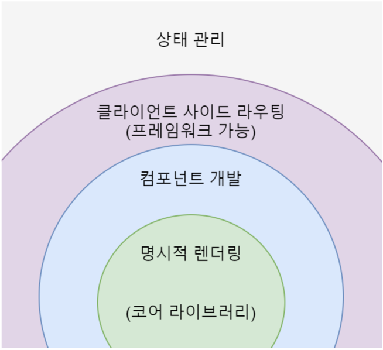
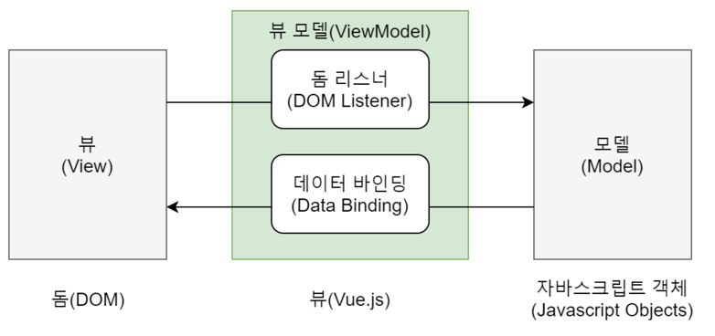
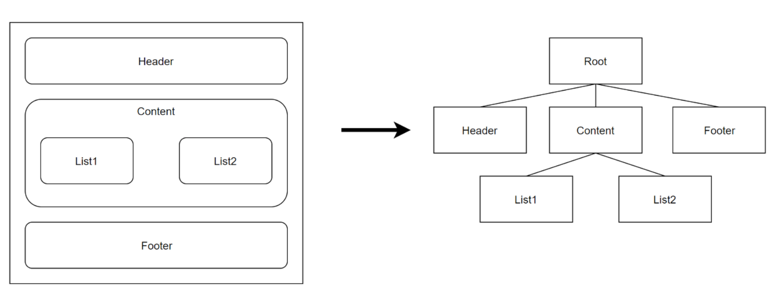

## Vue.js 란 무엇인가 ?

> Vue.js 란 ?

- Vue.js 는 웹 페이지 화면을 개발하기 위한 프론트엔드 프레임워크

- Vue 코어 라이브러리는 화면단 데이터 표현에 관한 기능들을 중점적으로 지원하지만, 프레임워크의 기능인 '라우터', '상태 관리', '테스팅' 등을 쉽게 결합할 수 있는 형태로도 제공
  - 즉, 라이브러리 역할뿐만 아니라 프레임워크 역할도 가능
  - 공식 사이트에서도 Vue 를 점진적인 프레임워크 (Progressive Framework) 라고 지칭

> Vue 의 장점

- 첫째, 배우기 쉽다
- 둘째, 리액트, 앵귤러에 비해 성능이 우수하고 빠르다
- 셋째, 리액트, 앵귤러의 장점을 갖고 있다
  - 앵귤러의 '데이터 바인딩' 특성과 리액트의 '가상 돔 기반 렌더링' 특징을 모두 갖음

## Vue.js 의 특징

> UI 화면단 라이브러리

- Vue 는 MVVM 패턴의 뷰 모델에 해당하는 화면단 라이브러리
    - 모델(Model) - 뷰(View) - 뷰 모델(View Model) 로 구조화하여 개발하는 방식
    - '화면의 요소들을 제어하는 코드'와 '데이터 제어 로직' 분리를 통해 코드를 더 직관적으로 이해 가능하며, 유지 보수 용이

- 뷰 (View)
    - 사용자에게 보이는 화면

- 돔 (Dom)
    - HTML 문서에 들어가는 요소 (태그, 클래스, 속성 등)의 정보를 담고 있는 데이터 트리

- 돔 리스너 (Dom Listener)
    - 돔의 변경 내역에 대해 즉각적으로 반응하여 특정 로직을 수행하는 장치

- 모델 (Model)
    - 데이터 저장하는 구조 (일반적으로 서버에서 받은 데이터를 자바스크립트 객체 형태로 저장)

- 데이터 바인딩 (Data Binding)
    - 뷰(View)에 표시되는 내용과 모델의 데이터를 동기화

- 뷰 모델 (View Model)
    - 뷰와 모델의 중간 영역
    - 돔 리스너와 데이터 바인딩을 제공하는 영역

> 컴포넌트 기반 프레임워크

- 좌측 : 각 영역을 컴포넌트로 지정하여 구분
- 우측 : 좌측 화면의 각 컴포넌트 간의 관계

- 최신 프론트엔드 프레임워크인 리액트, 앵귤러 모두 컴포넌트 기반의 개발 방식 추구
    - 코드 재사용 편리

> 리액트와 앵귤러의 장점을 가진 프레임워크

- 뷰는 앵귤러의 '양방향 데이터 바인딩'과 리액트의 '단방향 데이터 흐름' 장점을 모두 결합한 프레임워크
    - 양방향 데이터 바인딩이란, 화면에 표시되는 값과 프레임워크의 모델 데이터 값이 동기화되어 한쪽이 변경되면 다른 한쪽도 자동으로 변경되는 것을 의미
    - 단방향 데이터 흐름이란, 컴포넌트의 단방향 통신을 의미
        - 컴포넌트 간에 데이터를 전달할 때, 항상 상위 컴포넌트에서 하위 컴포넌트 한 방향으로만 전달

- 빠른 화면 렌더링을 위해 리액트의 '가상 돔 렌더링 방식' 적용
    - 가상 돔을 활용하면, 특정 돔 요소를 추가하거나 삭제하는 변경이 일어날 때 화면 전체를 다시 그리지 않고, 프레임워크에서 정의한 방식에 따라 화면 갱신
    - 따라서, 브라우저 관점에서는 성능 부하가 줄어 일반 렌더링 방식보다 더 빠르게 화면 렌더링 가능

