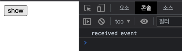
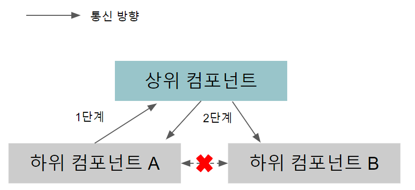

## 인스턴스 및 컴포넌트

> Vue 인스턴스의 정의와 속성

- Vue 인스턴스는 Vue 로 화면을 개발하기 위해 필수적으로 생성해야 하는 기본 단위

### Vue 인스턴스 생성

1. new Vue() - Vue 인스턴스 생성
2. 인스턴스 안에 'el' 속성으로 Vue 인스턴스 적용 지점 지정
3. 'data' 속성에 message 값 정의 및 화면의 {{ message }} 에 바인딩

````html
<html>
  <head>
    <title>Vue Sample</title>
  </head>
  <body>
    <div id="app">
      {{ message }}
    </div>
    <!-- Vue 라이브러리 -->
    <script src="https://cdn.jsdelivr.net/npm/vue@2.5.2/dist/vue.js"></script>
    <script>
      new Vue({ // 인스턴스
        // el 속성
        el: '#app',
        // data 속성
        data: {
          message: 'Hello Vue.js !'
        }
      });
    </script>
  </body>
</html>
````

### Vue 인스턴스 생성자

- Vue 생성자는 Vue 라이브러리 로딩 후 접근 가능

> Vue 인스턴스 옵션 속성

- Vue 인스턴스 옵션 속성은 인스턴스 생성 시 재정의할 el, data, template 등의 속성을 의미
  - el
    - Vue 로 만든 화면이 렌더링 되는 시작점 의미
  - data
    - data 값 셋팅 및 바인딩
  - template
    - 화면에 표시할 HTML, CSS 등 마크업 요소를 정의하는 속성
  - methods
    - 화면 로직 제어와 관계된 메소드를 정의하는 속성
    - 마우스 클릭 이벤트 처리와 같은 화면의 전반적 이벤트와 화면 동작과 관련된 로직 추가 가능
  - created
    - Vue 인스턴스가 생성되자마자 실행할 로직 정의 속성

> Vue 인스턴스의 유효 범위

- Vue 인스턴스 생성 시 HTML 의 특정 범위 안에서만 옵션 속성 적용


1. 뷰 라이브러리 파일 로딩

   - '\<script src="https://cdn.jsdelivr.net/npm/vue@2.5.2/dist/vue.js"></script>\'
2. 인스턴스 객체 생성

   - new Vue({ el: '#app', data: { message: 'Hello Vue.js!'} });
3. 특정 화면 요소에 인스턴스를 붙임

   - new Vue() -> #app
4. 인스턴스 내용이 화면 요소로 변환

   - data: { message: 'Hello Vue.js!'} -> {{ message }}

### 인스턴스의 유효 범위 확인

- 아래와 같은 경우, {{ message }} 텍스트 그대로 브라우저에 출력
- 현재 코드에서 인스턴스의 유효 범위는 'el' 속성으로 지정한 '\<div id="app">\' 태그 아래 요소들로 제한
  - 따라서, app - div 태그 바깥에 있는 {{ message }} 는 Vue 인스턴스 유효 범위가 아님

````html
<div id="app">

</div>
{{ message }}
````

> Vue 인스턴스 라이프 사이클


- 인스턴스의 상태에 따라 호출할 수 있는 속성들

### beforeCreate

- 인스턴스가 생성되고 나서 가장 처음으로 실행되는 라이프 사이클 단계
- 이 단계에서는 data 속성과 methods 속성이 아직 인스턴스에 정의되어 있지 않고, Dom 과 같은 화면 요소에도 접근 불가

### created

- beforeCreate 라이프 사이클 단계 이후 실행되는 단계
- data 속성과 methods 속성이 정의되었기 때문에 this.data 또는 this.fetchData() 와 같은 로직들을 이용하여 data 속성과 methods 속성에 정의된 값에 접근하여 로직 실행 가능
  - data 속성과 methods 속성에 접근할 수 있는 가장 첫 라이프 사이클 단계이자 컴포넌트가 생성되고 나서 실행되는 단계
  - 따라서, 서버에 데이터를 요청하여 받아오는 로직 수행 처리에 적합
- 하지만, 인스턴스가 화면 요소에 바인딩 되지 않은 상태이기 때문에 template 속성에 정의된 Dom 요소 접근 불가

### beforeMount

- created 단계 이후 template 속성에 지정한 마크업 속성을 render() 함수로 변환한 후 el 속성에 지정한 화면 요소(Dom)에 인스턴스를 부착하기 전에 호출되는 단계
- render() 함수 호출 직전 로직 추가에 적합

### mounted

- el 속성에서 지정한 화면 요소에 인스턴스가 부착되고 나면 호출되는 단계
- template 속성에 정의한 화면 요소(Dom)에 접근 가능하여 화면 요소를 제어하는 로직을 수행하기에 적합
- Dom 에 인스턴스가 부착되자마자 바로 호출되기 때문에 하위 컴포넌트나 외부 라이브러리에 의해 추가된 화면 요소들이 최종 HTML 코드로 변환되는 시점과는 다를 수 있음

### beforeUpdate

- el 속성에서 지정한 화면 요소에 인스턴스가 부착되고 나면 인스턴스에 정의한 속성들이 화면에 치환
- 치환된 값은 뷰의 반응성을 제공하기 위해 $watch 속성으로 감시
  - 데이터 관찰

### updated

- 데이터가 변경되고 나서 가상 Dom 으로 다시 화면을 그리고 나면 실행되는 단계
- 데이터 변경으로 인한 화면 요소 변경까지 완료된 시점이므로, 데이터 변경 후 화면 요소 제어와 관련된 로직 추가에 적합
  - 이 단계에서 데이터 값을 변경하면, 무한 루프에 빠질 가능성 발생
  - 값을 변경하기 위해서는 computed, watch 와 같은 속성 사용 필요
- 데이터 값을 갱신하는 로직은 가급적 beforeUpdate 에 작성하고, updated 에서는 변경 데이터의 화면 요소 (Dom) 와 관련된 로직 추가에 적합

### beforeDestroy

- Vue 인스턴스가 파괴되기 직전에 호출되는 단계
- 해당 단계에서는 아직 인스턴스에 접근 가능
  - Vue 인스턴스의 데이터를 삭제하기에 적합

### destroy

- Vue 인스턴스가 파괴되고 나서 호출되는 단계
- Vue 인스턴스에 정의한 모든 속성이 제거되고, 하위에 선언한 인스턴스들 또한 모두 파괴

````html
<html>
  <head>
    <title>Vue Sample</title>
  </head>
  <body>
    <div id="app">
      {{ message }}
    </div>
    <script src="https://cdn.jsdelivr.net/npm/vue@2.5.2/dist/vue.js"></script>
    <script>
      new Vue({
        el: '#app',
        data: {
          message: 'Hello Vue.js !'
        },
        // beforeCreate 출력
        beforeCreate: function() {
          console.log("beforeCreate");
        },
        // created 출력
        created: function() {
          console.log("created");
        },
        // mounted 출력
        mounted: function() {
          console.log("mounted");
        },
        // updated 미출력
        // * Vue 인스턴스에서 데이터 변경이 일어나 화면이 다시 그려졌을 때 호출
        updated: function() {
          console.log("updated");
        }
      });
    </script>
  </body>
</html>
````

> mounted 단계에서 기존에 정의된 data 속성의 message 값 변경

- updated 단계에서만 로그를 출력하는 코드를 추가했기 때문에 beforeUpdate 단계에서는 아무런 동작을 하지 않음

````html
<html>
  <head>
    <title>Vue Sample</title>
  </head>
  <body>
    <div id="app">
      {{ message }}
    </div>
    <script src="https://cdn.jsdelivr.net/npm/vue@2.5.2/dist/vue.js"></script>
    <script>
      new Vue({
        el: '#app',
        data: {
          message: 'Hello Vue.js !'
        },
        // beforeCreate 출력
        beforeCreate: function() {
          console.log("beforeCreate");
        },
        // created 출력
        created: function() {
          console.log("created");
        },
        // mounted 출력
        mounted: function() {
          console.log("mounted");
          this.message = "[mounted] Hello Vue.js !"; // message 값 변경
        },
        // updated 출력
        updated: function() {
          console.log("updated");
        }
      });
    </script>
  </body>
</html>
````

## Vue 컴포넌트

> 컴포넌트란 ?

- 조합하여 화면을 구성할 수 있는 화면의 특정 영역
- Vue 에서는 웹 화면을 구성할 때 흔히 사용하는 navigation bar, table, list, input box 등과 같은 화면 구성 요소들을 잘게 쪼개 컴포넌트로 관리


- 위의 왼쪽 그림은 화면 전체를 Header, Content, Footer 로 분할하고, Content 영역을 List1, List2 로 분할
  - 이는 화면 전체를 3개의 컴포넌트로 분할한 후 분할된 1개의 컴포넌트에서 다시 2개의 하위 컴포넌트로 분할한 것
- 오른쪽 그림은 각 컴포넌트 간의 관계

> 컴포넌트 등록하기

- 컴포넌트를 등록하는 방법은 '전역'과 '지역' 2가지 존재
- 지역(Local) 컴포넌트는 특정 인스턴스에서만 유효한 범위를 갖음
- 전역(Global) 컴포넌트는 여러 인스턴스에서 공통으로 사용 가능

### 전역 컴포넌트 등록

- 전역 컴포넌트는 Vue 라이브러리 로딩 후 접근 가능한 Vue 변수를 이용하여 등록
- 전역 컴포넌트를 모든 인스턴스에 등록하려면 Vue 생성자에서 '.component()' 를 호출하여 수행

````javascript
// 전역 컴포넌트 등록
Vue.component('컴포넌트 이름', {
    // 컴포넌트 내용
});
````

- 전역 컴포넌트 등록 형식에는 '컴포넌트 이름'과 '컴포넌트 내용' 존재
- 컴포넌트 이름은 template 속성에서 사용할 HTML 사용자 정의 태그 이름 의미
  - 태그 네이밍 룰은 '모두 소문자'와 '케밥 기법' 을 따르지 않아도 됨
- 컴포넌트 내용에는 template, data, methods 등 인스턴스 옵션 속성 정의 가능

> 전역 컴포넌트 등록 예제

````html
<html>
  <head>
    <title>Vue Component Registration</title>
  </head>
  <body>
    <div id="app">
      <button>컴포넌트 등록</button>
      <my-component></my-component> <!-- 전역 컴포넌트 표시 -->
    </div>
    <script src="https://cdn.jsdelivr.net/npm/vue@2.5.2/dist/vue.js"></script>
    <script>
      // 전역 컴포넌트 등록
      Vue.component('my-component', {
        template: '<div>전역 컴포넌트가 등록되었습니다.</div>'
      });

      new Vue({
        el: '#app'
      });
    </script>
  </body>
</html>
````


> 전역 컴포넌트가 화면에 나타나기까지의 처리 과정

1. 뷰 라이브러리 파일 로딩
2. 뷰 생성자로 컴포넌트 등록 - Vue.component()
3. 인스턴스 객체 생성 (옵션 속성 포함)
4. 특정 화면 요소에 인스턴스 부착
5. 인스턴스 내용 변환 (등록된 컴포넌트 내용도 변환)
   - <my-component> 가 <div> 로 변환되는 시점
6. 변환된 화면 요소를 사용자가 최종 확인

> 최종 변환 HTML 코드

````html
<div id="app">
    <button>컴포넌트 등록</button>
    <div>전역 컴포넌트가 등록되었습니다.</div>
</div>
````

> 지역 컴포넌트 등록

- 지역 컴포넌트 등록은 전역 컴포넌트 등록과는 다르게 인스턴스에 'components' 속성을 추가하고 등록할 컴포넌트 이름과 내용 정의

````javascript
new Vue({
    components: {
        '컴포넌트 이름' : 컴포넌트 내용
    }
})
````

> 지역 컴포넌트 등록 예제

````html
<html>
  <head>
    <title>Vue Local Component Registration</title>
  </head>
  <body>
    <div id="app">
      <button>지역 컴포넌트 등록</button>
      <my-local-component></my-local-component> <!-- 지역 컴포넌트 표시 -->
    </div>
    <script src="https://cdn.jsdelivr.net/npm/vue@2.5.2/dist/vue.js"></script>
    <script>
      // 지역 컴포넌트 등록
      var localComponent = {
        // 컴포넌트 내용
        template: '<div>지역 컴포넌트가 등록되었습니다.</div>'
      }

      new Vue({
        el: '#app',
        components: {
          'my-local-component': localComponent
        }
      });
    </script>
  </body>
</html>
````


> 지역 컴포넌트와 전역 컴포넌트의 차이

````html
<html>
  <head>
    <title>Vue Local and Global Component Registration</title>
  </head>
  <body>
    <div id="app">
      <button>지역/전역 컴포넌트 등록</button>
      <my-global-component></my-global-component> <!-- 전역 컴포넌트 표시 -->
      <my-local-component></my-local-component> <!-- 지역 컴포넌트 표시 -->
    </div>
    <script src="https://cdn.jsdelivr.net/npm/vue@2.5.2/dist/vue.js"></script>
    <script>
      // 전역 컴포넌트 등록
      Vue.component('my-global-component', {
        template: '<div>전역 컴포넌트가 등록되었습니다.</div>'
      });

      // 지역 컴포넌트 등록
      var localComponent = {
        // 컴포넌트 내용
        template: '<div>지역 컴포넌트가 등록되었습니다.</div>'
      }

      new Vue({
        el: '#app',
        components: {
          'my-local-component': localComponent
        }
      });
    </script>
  </body>
</html>

````


> 인스턴스 유효 범위와 지역 컴포넌트, 전역 컴포넌트 간의 관계 확인

````html
<html>
  <head>
    <title>Vue Local and Global Different Component Registration</title>
  </head>
  <body>
    <div id="app">
      <h2>첫번째 인스턴스 영역</h2>
      <my-global-component></my-global-component> <!-- 전역 컴포넌트 표시 -->
      <my-local-component></my-local-component> <!-- 지역 컴포넌트 표시 -->
    </div>

    <hr>

    <div id="app2">
      <h2>두번째 인스턴스 영역</h2>
      <my-global-component></my-global-component> <!-- 전역 컴포넌트 표시 -->
      <my-local-component></my-local-component> <!-- 지역 컴포넌트 표시 -->
    </div>

    <script src="https://cdn.jsdelivr.net/npm/vue@2.5.2/dist/vue.js"></script>
    <script>
      // 전역 컴포넌트 등록
      Vue.component('my-global-component', {
        template: '<div>전역 컴포넌트가 등록되었습니다.</div>'
      });

      // 지역 컴포넌트 등록
      var localComponent = {
        // 컴포넌트 내용
        template: '<div>지역 컴포넌트가 등록되었습니다.</div>'
      }

      // 첫번째 인스턴스
      new Vue({
        el: '#app',
        components: {
          'my-local-component': localComponent
        }
      });

      // 두번째 인스턴스
      new Vue({
        el: '#app2'
      });

    </script>
  </body>
</html>

````


- 전역 컴포넌트는 인스턴스를 새로 생성할 때마다 인스턴스에 components 속성으로 등록할 필요 없이 1번 등록 시 모든 인스턴스에서 사용 가능
- 지역 컴포넌트는 새로운 인스턴스를 생성할 때마다 등록 필요
  - 또한, 첫번째 인스턴스의 유효 범위는 첫번째 인스턴스 영역으로 제한
  - 따라서, `<div id="app">` 에 지역 컴포넌트를 등록했어도 두번째 인스턴스 영역인  `<div id="app2">` 의 범위 안에서는 지역 컴포넌트 인식 불가
  - 브라우저에서는 HTML 사용자 정의 태그로 인식하여 `<my-local-component>` 로 인식

## 뷰 컴포넌트 통신

> 컴포넌트 간 통신과 유효 범위

- Vue 의 경우, 컴포넌트로 화면을 구성하므로 같은 웹 페이지라도 데이터 공유 불가능
  - 컴포넌트마다 자체적으로 고유한 유효 범위(scope) 를 갖기 때문
  - 각 컴포넌트의 유효 범위가 독립적이기 때문에 다른 컴포넌트의 값을 직접적으로 참조 불가능

````javascript
<html>
  <head>
    <title>Vue</title>
  </head>
  <body>
    <div id="app">
      <my-component1></my-component1>
      <my-component2></my-component2>
    </div>

    <script src="https://cdn.jsdelivr.net/npm/vue@2.5.2/dist/vue.js"></script>
    <script>
      // 첫 번재 컴포넌트 내용
      var component1 = {
        template: '<div>첫 번째 지역 컴포넌트 : {{ component1Data }}</div>',
        data: function() {
          return {
            component1Data : 100
          }
        }
      };

      // 두 번재 컴포넌트 내용
      var component2 = {
        template: '<div>두 번째 지역 컴포넌트 : {{ component2Data }}</div>',
        data: function() {
          return {
            component2Data : component1.data.component1Data
          }
        }
      };

      new Vue({
        el: '#app',
        // 지역 컴포넌트 등록
        components: {
          'my-component1': component1,
          'my-component2': component2,
        }
      });

    </script>
  </body>
</html>
````


- {{ component2Data }} 에 아무 값도 출력되지 않는 이유는 my-component2 에서 my-component1 의 값을 직접 참조할 수 없기 때문
  - 따라서, Vue 에서 미리 정의해 놓은 데이터 전달 방식에 따라 일관된 구조로 어플리케이션을 작성하게 됨
  - 그렇기 때문에, 개발자 개개인의 스타일대로 구성 되지 않고, 어플리케이션이 모두 동일한 흐름을 갖게 되는 특징

> 상-하위 컴포넌트 관계

- 컴포넌트는 각각 고유한 유효 범위를 갖고 있기 때문에 직접 다른 컴포넌트의 값 참조 불가

  - 따라서, Vue 프레임워크에서 정의한 컴포넌트 데이터 전달 방법을 따름
  - 가장 기본적인 방법은 상위(부모)-하위(자식) 컴포넌트 간의 데이터 전달 방법
- 지역 또는 전역 컴포넌트 등록 시 등록된 컴포넌트는 하위 컴포넌트(자식 컴포넌트) 가 됨
- 하위 컴포넌트를 등록한 인스턴스는 상위 컴포넌트가 됨

> 상-하위 컴포넌트 간 통신 방식


- 상위에서 하위로는 'props' 라는 특별한 속성 전달
- 하위에서 상위로는 기본적으로는 '이벤트'만 전달 가능
  - 이벤트와 데이터를 함께 전달하고 싶은 경우, '이벤트의 두 번째 인자값으로 전달'하거나 '이벤트 버스'를 활용하는 방법 가능

> 상위에서 하위 컴포넌트로 데이터 전달하기

### props 속성

- props 는 상위 컴포넌트에서 하위 컴포넌트로 데이터를 전달할 때 사용하는 속성
- props 속성 사용을 위해서는 아래와 같이 하위 컴포넌트의 속성에 정의 필요

````javascript
Veu.component('child-component', {
   props: ['props 속성 이름'],
});
````

- 그런 다음 상위 컴포넌트의 HTML 코드에 등록된 'child-component' 컴포넌트 태그에 'v-bind' 속성 추가

````html
<child-component v-bind:props 속성 이름="상위 컴포넌트의 data 속성"></child-component>
````

- v-bind 속성의 왼쪽값으로 하위 컴포넌트에서 정의한 props 속성을 넣고, 오른쪽값으로 하위 컴포넌트에 전달할 상위 컴포넌트의 data 속성 설정

> props 속성을 사용한 데이터 전달 예제

````html
<!-- 상위 컴포넌트의 message 속성을 하위 컴포넌트에 props 로 전달하여 메시지를 출력하는 예제 -->
<html>
  <head>
    <title>Vue</title>
  </head>
  <body>
    <div id="app">
      <!-- props 속성 이름 : propsdata, 상위 컴포넌트의 데이터 속성 : message -->
      <!-- 4. 상위 컴포넌트의 message 속성값을 하위 컴포넌트의 propsdata 로 전달 -->
      <child-component v-bind:propsdata="message"></child-component>
    </div>

    <script src="https://cdn.jsdelivr.net/npm/vue@2.5.2/dist/vue.js"></script>
    <script>
      // 하위 컴포넌트
      // 2. Vue.component() 를 이용하여 하위 컴포넌트인 child-component 등록
      Vue.component('child-component', {
        // 3. 하위 컴포넌트 props 속성에 propsdata 정의
        props: ['propsdata'],
        // 5. 하위 컴포넌트인 child-component 의 template 속성에 propsdata 매핑
        template: '<p>{{ propsdata }}</p>',
      });

      // 컴포넌트를 등록한 인스턴스 == 상위 컴포넌트
      // 1. new Vue() 로 인스턴스 생성
      new Vue({
        el: '#app',
        data: {
          message: 'Hello Vue! passed from Parent Component'
        }
      });
    </script>
  </body>
</html>
````

- 컴포넌트를 등록함과 동시에 Vue 인스턴스 자체가 상위 컴포넌트가 됨
- 인스턴스에 새로운 컴포넌트를 등록하면, 기존에 있는 컴포넌트는 상위(부모) 컴포넌트가 되고 새로 등록한 컴포넌트는 하위(자식) 컴포넌트가 됨

> 하위에서 상위 컴포넌트로 이벤트 전달하기

### 이벤트 발생과 수신

- 하위에서 상위 컴포넌트로 데이터를 전달하기 위해서는 이벤트(event emit)를 발생시켜 상위 컴포넌트에 신호를 보냄
- 상위 컴포넌트에서 하위 컴포넌트의 특정 이벤트의 발생을 대기하다가 하위 컴포넌트에서 특정 이벤트가 발생하면 상위 컴포넌트에서 해당 이벤트를 수신하여 상위 컴포넌트의 메소드 호출

### 이벤트 발생과 수신 형식

- 이벤트 발생과 수신은 '$emit()' 과 'v-on' 속성을 사용하여 구현
- $emit() 호출 시 괄호 안에 정의된 이벤트 발생

  - 일반적으로 $emit() 을 호출하는 위치는 하위 컴포넌트의 특정 메소드 내부
  - 따라서 $emit() 을 호출할 때 사용하는 'this' 는 하위 컴포넌트를 가리킴
- 호출한 이벤트는 하위 컴포넌트를 등록하는 태그에서 'v-on' 으로 수신

  - 하위 컴포넌트에서 발생한 이벤트명을 'v-on:속성'에 지정하고, 속성의 값에 이벤트가 발생했을 때 호출될 상위 컴포넌트의 메소드 지정

````javascript
// 이벤트 발생
this.$emit('이벤트명');
````

````javascript
// 이벤트 수신
<child-component v-on:이벤트명="상위 컴포넌트의 메소드명"></child-component>
````

> 이벤트를 발생시키고 수신하기

````html
<!-- 이벤트를 발생시키고 수신하기 -->
<html>
  <head>
    <title>Vue</title>
  </head>
  <body>
    <div id="app">
      <!-- 하위 컴포넌트의 이벤트명 : show-log, 상위 컴포넌트의 메소드명 : printText -->
      <!-- 3. show-log 이벤트는 하위 컴포넌트에서 정의한 v-on:show-log 에 전달되고, 대상 메소드인 상위 컴포넌트의 printText 메소드 호출 -->
      <child-component v-on:show-log="printText"></child-component>
    </div>

    <script src="https://cdn.jsdelivr.net/npm/vue@2.5.2/dist/vue.js"></script>
    <script>
      Vue.component('child-component', {
        // 1. show 버튼 클릭 시, 클릭 이벤트 v-on:click="showLog" 에 따라 해당 하위 컴포넌트의 메소드인 showLog() 호출
        template: '<button v-on:click="showLog">show</button>', // 버튼 요소 추가
        // 메소드 추가
        // 2. showLog() 메소드 안의 this.$emit('show-log') 실행을 통해 HTML 태그의 printText 호출 (상위 컴포넌트 메소드 호출)
        methods: {
          showLog: function() {
            this.$emit('show-log'); // 이벤트 발생
          }
        }
      });

      var app = new Vue({
        el: '#app',
        data: {
          message: 'Hello Vue! passed from Parent Component'
        },
        methods: {
          // 4. 하위 컴포넌트의 이벤트 수신
          printText: function() {
            console.log("received event");
          }
        }
      });
    </script>
  </body>
</html>

````



> 같은 레벨의 컴포넌트 간 통신



- 같은 상위 컴포넌트를 가지는 2개의 하위 컴포넌트
- Vue 는 상위에서 하위로만 데이터를 전달해야 하는 기본적인 통신 규칙을 가짐
- 따라서, 같은 레벨의 컴포넌트에 값을 값을 전달하기 위해서는 하위에서 공통 상위 컴포넌트로 이벤트를 전달한 후 공통 상위 컴포넌트에서 2개의 하위 컴포넌트에 'props' 를 내려보내야 함
  - 이런 방식으로 통신하는 이유는, '컴포넌트 고유의 유효 범위' 때문
  - 다른 컴포넌트의 값을 직접 참조하지 못하므로 기본적인 데이터 전달 방식을 활용하여 같은 레벨 간에 통신이 가능한 구조 필요
- 하지만, 이러한 통신 구조를 유지하다 보면 상위 컴포넌트가 필요 없음에도 불구하고 같은 레벨 간 통신을 위해 강제로 불필요한 상위 컴포넌트 생성 필요
  - 이를 해결하기 위한 방법인 '이벤트 버스'

> 관계 없는 컴포넌트 간 통신 - 이벤트 버스

- 이벤트 버스(Event Bus) 는 2개의 컴포넌트 간에 데이터를 주고 받을 수 있는 방법
- 이벤트 버스 사용 시, 상위-하위 관계가 아니더라도 데이터를 특정 컴포넌트에서 다른 컴포넌트로 전달 가능


- 이벤트 버스를 사용하지 않는 경우, 하위 컴포넌트 B에서 상위 컴포넌트 A로 전달하기 위해서는 아래와 같이 전달해야 함

  - 하위 컴포넌트 B -> 상위 컴포넌트 A -> 최상위 컴포넌트 -> 상위 컴포넌트 A
- 이벤트 버스 사용 시 중간 컴포넌트들을 거치지 않고 하위 컴포넌트 B에서 상위 컴포넌트 A로 바로 데이터 전달 가능

### 이벤트 버스 형식

- 이벤트 버스를 구현하려면 어플리케이션 로직을 담는 인스턴스와는 별개로 새로운 인스턴스 1개를 더 생성하고, 새로운 인스턴스를 이용하여 이벤트 송수신
- 데이터 송신 컴포넌트에서는 '.$emit()' 구현
- 데이터 수신 컴포넌트에서는 '.$on()' 구현

````javascript
// 이벤트 버스를 위한 추가 인스턴스 1개 생성
var eventBus = new Vue();

// 이벤트 송신 컴포넌트
methods: {
    메소드명 : function() {
        eventBus.$emit('이벤트명', 데이터);
    }
}

// 이벤트 수신 컴포넌트
methods: {
    created: function() {
        eventBus.$on('이벤트명', function(데이터) {
            ...
        });
    }
}
````

> 이벤트 버스 구현하기

````html
<html>
  <head>
    <title>Vue</title>
  </head>
  <body>
    <div id="app">
      <child-component></child-component>
    </div>

    <script src="https://cdn.jsdelivr.net/npm/vue@2.5.2/dist/vue.js"></script>
    <script>
      // 1. 이벤트 버스로 활용할 새 인스턴스 생성
      var eventBus = new Vue();

      Vue.component('child-component', {
        // 2. 하위 컴포넌트에서 버튼 클릭 시, showLog 메소드를 호출하여 'triggerEventBus' 라는 이름의 이벤트 발생 (송신) 시켜 데이터 전달
        template: '<div>하위 컴포넌트 영역<button v-on:click="showLog">show</button></div>',
        methods: {
          showLog: function() {
            eventBus.$emit('triggerEventBus', 100);
          }
        }
      });

      var app = new Vue({
        el: '#app',
        created: function() {
          // 3. 상위 컴포넌트의 'created' 라이프 사이클 훅에 'eventBus.$on()' 으로 이벤트 수신 로직 작성
          eventBus.$on('triggerEventBus', function(value) {
            console.log("이벤트 수신 (수신 값) : ", value);
          });
        }
      });
    </script>
  </body>
</html>
````

- 이벤트 버스 활용 시, 'props' 속성을 이용하지 않고도 원하는 컴포넌트 간에 직접적으로 데이터 전달 가능
  - 하지만, 컴포넌트가 많아질수록 이벤트를 어디서 어디로 보냈는지 관리가 어려워지는 문제 발생
  - 이러한 문제 해결을 위해 'Vuex' 라는 상태 관리 도구 필요
