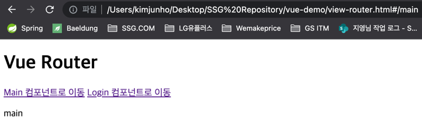
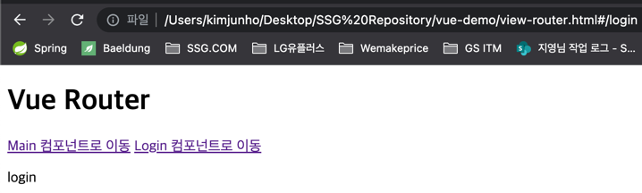
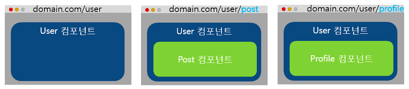
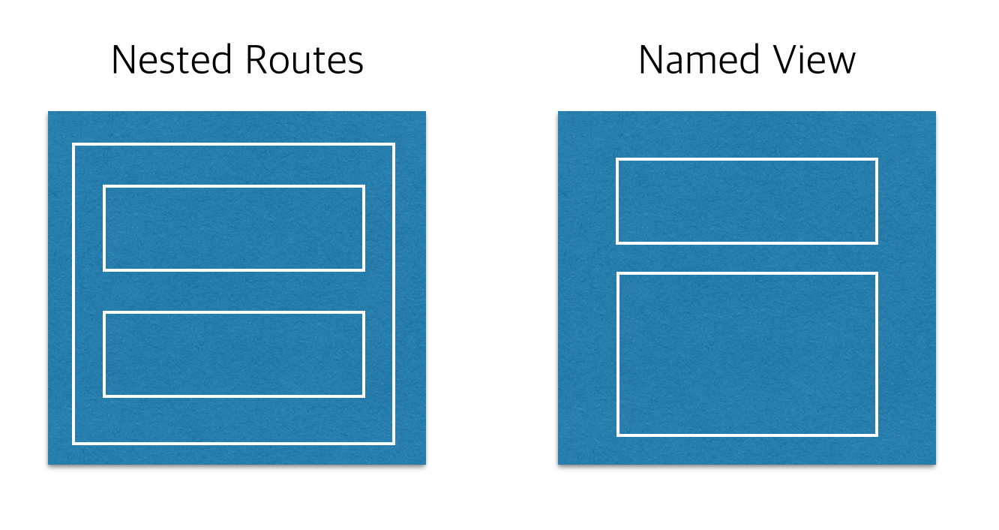

## 뷰 라우터

> 라우팅이란 ?

- 라우터를 이해하기 위해서는 먼저 라우팅 이해 필요
- 라우팅이란 '웹 페이지 간의 이동 방법'

  - 라우팅은 현대 웹 앱 형태 중 하나인 싱글 페이지 어플리케이션 (SPA) 에서 주로 사용
  - SPA
    - 페이지를 이동할 때마다 서버에 웹 페이지를 요청하여 새로 갱신하는 것이 아니라 미리 해당 페이지들을 받아 놓고 페이지 이동 시 클라이언트의 라우팅을 이용하여 화면을 갱신하는 패턴을 적용한 어플리케이션
- 일반적으로는 브라우저에서 웹 페이지를 요청하면 서버에서 응답을 받아 웹 페이지를 다시 사용자에게 돌려주는 시간 동안 화면 상에 깜빡거림 현상 발생

  - 이러한 부분들을 라우팅으로 처리 시 깜빡거림 없이 화면을 매끄럽게 전환 가능하며, 더욱 빠르게 화면 조작이 가능하여 사용자 경험 향상 가능
- Vue 뿐만 아니라 리액트와 앵귤러 모두 라우팅을 이용하여 화면 전환

  - 프론트엔드 프레임워크를 사용하지 않는 경우, router.js, navigo.js 를 통해 라우팅 방식의 페이지 이동 구현 가능

> 뷰 라우터

- 뷰 라우터는 뷰에서 라우팅 기능을 구현할 수 있도록 지원하는 공식 라이브러리
- 뷰 라우터를 이용해 뷰로 만든 페이지 간에 자유롭게 이동 가능
- 뷰 라우터 구현 시 필요한 특수 태그 및 기능
  - <router-link to="URL 값">
    - 페이지 이동 태그
    - 화면에서는 <a> 로 표시되며 클릭하면 to 에 지정한 URL 로 이동
  - <router-view>
      - 페이지 표시 태그
      - 변경되는 URL에 따라 해당 컴포넌트를 출력하는 영역

> 뷰 라우터 실습

````html
<!DOCTYPE html>
<html>
  <head>
    <meta charset="utf-8">
    <meta name="viewport" content="width=device-width, initial-scale=1.0">
    <title>Vue Router Sample</title>
  </head>
  <body>
    <div id="app">
      <h1>Vue Router</h1>
      <p>
        <!-- 1. <router-link> 는 화면상에서 <a> 버튼 태그로 변환되어 표시 -->
        <!-- 각 버튼 클릭 시 to 에 정의된 텍스트 갑싱 브로우저 URL 끝에 추가 -->
        <router-link to="/main">Main 컴포넌트로 이동</router-link>
        <router-link to="/login">Login 컴포넌트로 이동</router-link>
      </p>
      <!-- 2. 갱신된 URL에 해당하는 화면을 보여주는 영역 <router-view> 에 나타낼 화면은 <script>에서 정의 -->
      <router-view></router-view>
    </div>

    <script src="https://cdn.jsdelivr.net/npm/vue@2.5.2/dist/vue.js"></script>
    <script src="https://unpkg.com/vue-router@3.0.1/dist/vue-router.js"></script>
    <script>
      // 3. Main 과 Login 컴포넌트에는 template 속성으로 각 컴포넌트를 구분할 수 있는 정도의 간단한 HTML 코드 정의
      var Main = { template: '<div>main</div>' };
      var Login = { template: '<div>login</div>' };

      // 4. routes 변수에는 URL 값이 /main 인 경우 Main 컴포넌트를, /login 인 경우 Login 컴포넌트를 표시하도록 정의
      var routes = [
        { path: '/main', component: Main },
        { path: '/login', component: Login }
      ];

      // 5. router 변수에는 VueRouter 인스턴스 생성 및 routes 를 삽입하여 URL에 따라 화면이 전환될 수 있도록 정의
      var router = new VueRouter({
        routes
      });

      // 6. 새 인스턴스 생성 후 라우터의 정보가 담긴 router 를 추가 ($mount() 는 el 속성과 같이 인스턴스를 화면에 붙여주는 역할)
      // * 인스턴스 생성 시 el 속성을 추가하지 않았더라도 인스턴스 생성 후 $mount() 를 이용하면 강제로 인스턴스를 화면에 바인딩 가능
      var app = new Vue({
        router
      }).$mount('#app');
    </script>
  </body>
</html>
````




> 라우터 URL 의 해시 값(#) 없애는 방법

- 히스토리 모드 활용

````javascript
var router = new VueRouter({
    mode: 'history',
    routes
});
````

> Nested Router

- Nested Router 는 라우터로 페이지를 이동할 때 최소 2개 이상의 컴포넌트를 화면에 나타낼 수 있음
    - 상위 컴포넌트 1개에 하위 컴포넌트 1개를 포함하는 구조로 구성 가능

> Nested Router 구현



````html
<!-- User 컴포넌트를 상위 컴포넌트로 놓고, URL에 따라 UserPost 컴포넌트와 UserProfile 컴포넌트를 표시하는 코드 -->
<!DOCTYPE html>
<html>
  <head>
    <meta charset="utf-8">
    <meta name="viewport" content="width=device-width, initial-scale=1.0">
    <title>Vue Router Sample</title>
  </head>
  <body>
    <div id="app">
      <!-- 1. User 컴포넌트가 렌더링 될 영역 -->
      <router-view></router-view>
    </div>

    <script src="https://cdn.jsdelivr.net/npm/vue@2.5.2/dist/vue.js"></script>
    <script src="https://unpkg.com/vue-router@3.0.1/dist/vue-router.js"></script>
    <script>
      // 2. User, UserProfile, UserPost 컴포넌트 내용 정의 (User 컴포넌트 template 에 하위 컴포넌트를 표시할 <router-view> 하나 더 존재)
      var User = {
        template: `
            <div>
              User Component
              <router-view></router-view>
            </div>
          `
      };
      var UserProfile = { template: '<p>User Profile Component</p>' };
      var UserPost = { template: '<p>User Post Component</p>' };

      // 3. 라우터 정보 정의
      // 최상위 속성에 path 를 /, 컴포넌트를 User 로 정의
      // 하위 속성에 UserPost, UserProfile 의 path 및 컴포넌트 정의
      var routes = [
        {
          path: '/',
          component: User,
          children: [
            {
              path: 'posts',
              component: UserPost
            },
            {
              path: 'profile',
              component: UserProfile
            },
          ]
        }
      ];

      // 4. VueRouter 생성 및 라우터 정보 추가
      var router = new VueRouter({
        routes
      });

      // 5. 라우터 추가
      var app = new Vue({
        router
      }).$mount('#app');
    </script>
  </body>
</html>
````

> Named View

- Named View 는 특정 페이지로 이동했을 때, 여러 개의 컴포넌트를 동시에 표시하는 라우팅 방식
- Named View 는 같은 레벨에서 여러 개의 컴포넌트를 한 번에 표시



> Named View 구현

````html
<!DOCTYPE html>
<html>
  <head>
    <meta charset="utf-8">
    <meta name="viewport" content="width=device-width, initial-scale=1.0">
    <title>Vue Router Sample</title>
  </head>
  <body>
    <!-- 1. name 속성은 아래 components 속성에 정의하는 컴포넌트와 매칭하기 위한 속성 -->
    <!-- Header 컴포넌트는 header, Footer 컴포넌트는 footer 를 각 name 속성의 값으로 지정 -->
    <!-- name 속성이 없는 2번째 <router-view> 는 default 로 표시될 컴포넌트 의미 -->
    <div id="app">
      <router-view name="header"></router-view>
      <router-view></router-view>
      <router-view name="footer"></router-view>
    </div>

    <script src="https://cdn.jsdelivr.net/npm/vue@2.5.2/dist/vue.js"></script>
    <script src="https://unpkg.com/vue-router@3.0.1/dist/vue-router.js"></script>
    <script>
      // 2. 각컴포넌트의 내용을 설정할 객체 선언
      var Body = { template: '<div>This is Body</div>' };
      var Header = { template: '<div>This is Header</div>' };
      var Footer = { template: '<div>This is Footer</div>' };

      // 3. Nested Router 와 다르게 라우팅 정보를 하나에 모두 정의
      var router = new VueRouter({
        routes: [
          {
            // 4. Named View 가 실행될 URL 정의
            path: '/',
            // 5. name 속성에 따라 표시될 컴포넌트 정의
            components: {
              default: Body,
              header: Header,
              footer: Footer
            }
          }
        ]
      });

      // 6. Named View 정보를 갖는 라우터를 포함한 Vue 인스턴스 생성
      var app = new Vue({
        router
      }).$mount('#app');
    </script>
  </body>
</html>
````

> Named View 라우팅 URL 과 컴포넌트 추가하기

````html

<!DOCTYPE html>
<html>
  <head>
    <meta charset="utf-8">
    <meta name="viewport" content="width=device-width, initial-scale=1.0">
    <title>Vue Router Sample</title>
  </head>
  <body>
    <!-- 1. name 속성은 아래 components 속성에 정의하는 컴포넌트와 매칭하기 위한 속성 -->
    <!-- Header 컴포넌트는 header, Footer 컴포넌트는 footer 를 각 name 속성의 값으로 지정 -->
    <!-- name 속성이 없는 2번째 <router-view> 는 default 로 표시될 컴포넌트 의미 -->
    <div id="app">
      <router-view name="header"></router-view>
      <router-view></router-view>
      <router-view name="footer"></router-view>
    </div>

    <div id="login">
      <router-view name="loginheader"></router-view>
      <router-view></router-view>
      <router-view name="loginfooter"></router-view>
    </div>

    <script src="https://cdn.jsdelivr.net/npm/vue@2.5.2/dist/vue.js"></script>
    <script src="https://unpkg.com/vue-router@3.0.1/dist/vue-router.js"></script>
    <script>
      // 2. 각컴포넌트의 내용을 설정할 객체 선언
      var Body = { template: '<div>This is Body</div>' };
      var Header = { template: '<div>This is Header</div>' };
      var Footer = { template: '<div>This is Footer</div>' };

      var LoginBody = { template: '<div>This is LoginBody</div>' };
      var LoginHeader = { template: '<div>This is LoginHeader</div>' };
      var LoginFooter = { template: '<div>This is LoginFooter</div>' };

      // 3. Nested Router 와 다르게 라우팅 정보를 하나에 모두 정의
      var router = new VueRouter({
        routes: [
          {
            // 4. Named View 가 실행될 URL 정의
            path: '/',
            // 5. name 속성에 따라 표시될 컴포넌트 정의
            components: {
              default: Body,
              header: Header,
              footer: Footer
            }
          },
          {
            // 4. Named View 가 실행될 URL 정의
            path: '/login',
            // 5. name 속성에 따라 표시될 컴포넌트 정의
            components: {
              default: LoginBody,
              header: LoginHeader,
              footer: LoginFooter
            }
          }
        ]
      });

      // 6. Named View 정보를 갖는 라우터를 포함한 Vue 인스턴스 생성
      var app = new Vue({
        router
      }).$mount('#app', '#login');
    </script>
  </body>
</html>
````

## Vue - HTTP 통신

> 웹 앱의 HTTP 통신 방법

- 최근 웹 앱에서 서버에서 데이터를 요청하는 HTTP 통신은 필수로 구현해야 하는 기능
    - 사용자와의 상호 작용에 따라 데이터를 동적으로 화면에 표시해 줘야 하기 때문
- HTTP 는 브라우저와 서버 간에 데이터를 주고 받는 '통신 프로토콜'
    - 브라우저에서 특정 데이터를 요청하면, 서버에서 응답으로 해당 데이터를 보내주는 방식으로 동작
- 웹 앱 HTTP 통신의 대표적인 사례는 jQuery 의 ajax
    - ajax 는 서버에서 받아온 데이터를 표시할 때, 화면 전체를 갱신하지 않고도 화면의 일부분문 변경할 수 있게 하는 자바스크립트 기법
    - ajax 가 대중화 되며, 많은 웹 앱에서 ajax 를 사용하고 있으며, 리액트, 앵귤러 등에서도 활발히 사용 중
- Vue 에서도 ajax 를 지원하기 위한 라이브러리 제공
    - 뷰 리소스, axios

> 뷰 리소스

- 뷰 리소스는 초기에 공식적으로 권장하는 라이브러리였으나, 2016년 말 공식적인 지원을 중단하기로 결정
    - HTTP 통신 관련 라이브러리는 뷰 라우팅, 상태 관리와 같은 라이브러리와는 다르게 프레임워크에 필수적인 기능이 아니라고 판단했기 때문
    - 하지만, 뷰 리소스는 계속해서 사용 가능
- 뷰 리소스 사용법은 2가지 방법으로 가능
    - CDN 을 사용한 라이브러리 로딩 방식
    - NPM 으로 라이브러리를 설치하는 방법 (ES6 기준)

> vue resource - CDN 설치 방법

````

<!DOCTYPE html>
<html>
  <head>
    <meta charset="utf-8">
    <meta name="viewport" content="width=device-width, initial-scale=1.0">
    <title>Vue Resource</title>
  </head>
  <body>
    <div id="app">
      <!-- 1. 버튼 이벤트 추가 : getData() 호출 -->
      <button v-on:click="getData">프레임워크 목록 가져오기</button>
    </div>
    <script src="https://cdn.jsdelivr.net/npm/vue@2.5.2/dist/vue.js"></script>
    <script src="https://cdn.jsdelivr.net/npm/vue-resource@1.3.4"></script><!-- vue resource -->
    <script>
      new Vue({
        el: '#app',
        methods: {
          // 2. this.$http.get() 을 사용하여 해당 URL 이 제공하는 데이터 수신 (HTTP GET 요청)
          getData: function() {
            this.$http.get('https://raw.githubusercontent.com/joshua1988/doit-vuejs/master/data/demo.json')
              // 3. then() 에서 응답 받은 reponse 데이터를 콘솔 출력
              .then(function(response) {
                console.log(response);
                console.log(JSON.parse(response.data));
              });
          }
        }
      });
    </script>
  </body>
</html>
````

> Axios

- Axios 는 현재 뷰 커뮤니티에서 가장 많이 사용되는 HTTP 통신 라이브러리
- Axios 는 Promise 기반의 API 형식이 다양하게 제공되어 별도의 로직을 구현할 필요 없이 주어진 API 만으로도 간편하게 원하는 로직 구현 가능
    - Promise 는 서버에 데이터를 요청하여 받아오는 동작과 같은 비동기 로직 처리에 유용한 자바스크립트 객체
    - 자바스크립트는 '단일 쓰레드'로 코드를 처리하기 때문에 특정 로직의 처리가 끝날 때까지 기다리지 않음
    - 따라서, 데이터를 요청하고 받아올 때까지 기다렸다가 화면에 나타내는 로직을 실행해야 할 때 주로 Promise 활용
    - 그리고, 데이터를 받아왔을 때 Promise 로 데이터를 화면에 표시하거나 연산을 수행하는 등 특정 로직 수행

### axios 설치 및 사용

- CDN 을 이용하여 설치하거나 NPM 을 이용하여 설치 가능
- 아래와 같이 CDN 설치 방법을 사용하여 HTML 파일에 추가 시 라이브러리 로딩 후 사용 가능

````javascript
// CDN 설치 방법
<script src="https://unpkg.com/axios/dist/axios.min.js"></script>
````

### axios - API 형식

````javascript
// HTTP GET 요청
// 서버에서 보낸 데이터를 정상적으로 수신 시 then() 정의 로직 수행
// 서버에서 보낸 데이터를 정상적으로 수신 실패 시 catch() 정의 로직 수행
axios.get('URL 주소').then().catch();
````

````javascript
// HTTP POST 요청
// 서버에서 보낸 데이터를 정상적으로 수신 시 then() 정의 로직 수행
// 서버에서 보낸 데이터를 정상적으로 수신 실패 시 catch() 정의 로직 수행
axios.post('URL 주소').then().catch();
````

````javascript
// HTTP 요청에 대한 옵션 속성 정의
axios({
    method: 'get',
    url: 'URL 주소',
    ...
});
````

> axios 를 사용한 데이터 수신

````html
<!DOCTYPE html>
<html>
  <head>
    <meta charset="utf-8">
    <meta name="viewport" content="width=device-width, initial-scale=1.0">
    <title>Vue axios</title>
  </head>
  <body>
    <div id="app">
      <!-- 1. 버튼 이벤트 추가 : getData() 호출 -->
      <button v-on:click="getData">프레임워크 목록 가져오기</button>
    </div>
    <script src="https://cdn.jsdelivr.net/npm/vue@2.5.2/dist/vue.js"></script>
    <script src="https://unpkg.com/axios/dist/axios.min.js"></script> <!-- axios 라이브러리 -->
    <script>
      new Vue({
        el: '#app',
        methods: {
          getData: function() {
            // 2. axios.get() 을 사용하여 해당 URL 이 제공하는 데이터 수신 (HTTP GET 요청)
            axios.get('https://raw.githubusercontent.com/joshua1988/doit-vuejs/master/data/demo.json')
              .then(function(response) {
                // 3. then() 에서 응답 받은 reponse 데이터를 콘솔 출력
                // response 객체의 data 속성이 일반 문자열 형식이 아니라 객체 형태이기 때문에 JSON.parse() 사용 불필요
                console.log(response);
              });
          }
        }
      });
    </script>
  </body>
</html>
````

